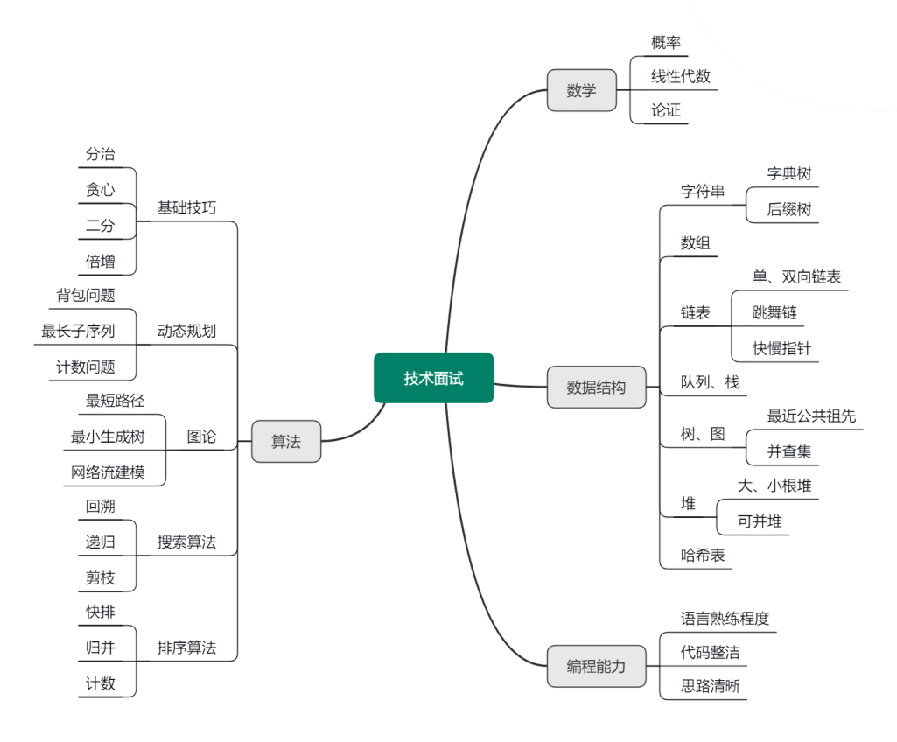

## 导学

**为什么面试官都喜欢问算法和数据结构**

- 算法能力能够准确辨别一个程序员的技术功底是否扎实；
- 算法能力是发掘程序员的学习能力与成长潜力的关键手段；
- 算法能力能够协助判断程序员在面对新问题时，分析并解决问题的能力；
- 算法能力是设计一个高性能系统的必备基础。

## 常用数据结构

- 数组、字符串
- 链表
- 栈
- 队列
- 双端队列
- 树

### 数组、字符串（Array & String）

**数组的优缺点**

数组的优点在于：

- 构建非常简单
- 能在 O(1) 的时间里根据数组的下标（index）查询某个元素

而数组的缺点在于：

- 构建时必须分配一段连续的空间
- 查询某个元素是否存在时需要遍历整个数组，耗费 O(n) 的时间（其中，n 是元素的个数）
- 删除和添加某个元素时，同样需要耗费 O(n) 的时间
- 所以，当你在考虑是否应当采用数组去辅助你的算法时，请务必考虑它的优缺点，看看它的缺点是否会
- 阻碍你的算法复杂度以及空间复杂度

### 链表（LinkedList）

单链表：链表中的每个元素实际上是一个单独的对象，而所有对象都通过每个元素中的引用字段链接在一起。

双链表：与单链表不同的是，双链表的每个结点中都含有两个引用字段。

**链表的优缺点**

链表的优点如下：

- 链表能灵活地分配内存空间；
- 能在 O(1) 时间内删除或者添加元素，前提是该元素的前一个元素已知，当然也取决于是单链表还是双链表，在双链表中，如果已知该元素的后一个元素，同样可以在 O(1) 时间内删除或者添加该元素。

链表的缺点是：

- 不像数组能通过下标迅速读取元素，每次都要从链表头开始一个一个读取；
- 查询第 k 个元素需要 O(k) 时间。

**应用场景**

如果要解决的问题里面需要很多快速查询，链表可能并不适合；如果遇到的问题中，数据的

元素个数不确定，而且需要经常进行数据的添加和删除，那么链表会比较合适。而如果数据元素大小确

定，删除插入的操作并不多，那么数组可能更适合。

**经典解法**

链表是实现很多复杂数据结构的基础，经典解法如下。

**1.** **利用快慢指针（有时候需要用到三个指针）**

例如：链表的翻转，寻找倒数第 k 个元素，寻找链表中间位置的元素，判断链表是否有环等等

### 栈（Stack）

特点：栈的最大特点就是后进先出（LIFO）。对于栈中的数据来说，所有操作都是在栈的顶部完成的，

只可以查看栈顶部的元素，只能够向栈的顶部压⼊数据，也只能从栈的顶部弹出数据。

**应用场景**

在解决某个问题的时候，只要求关心最近一次的操作，并且在操作完成了之后，需要向前查找到更前一次的操作。

**注意**：栈是许多 LeetCode 中等难度偏上的题目里面经常需要用到的数据结构，掌握好它是十分必要

### 队列（Queue）

**特点**

和栈不同，队列的最大特点是先进先出（FIFO），就好像按顺序排队一样。对于队列的数据来说，我们只允许在队尾查看和添加数据，在队头查看和删除数据。

**实现**

可以借助双链表来实现队列。双链表的头指针允许在队头查看和删除数据，而双链表的尾指针允许我们在队尾查看和添加数据。

**应用场景**

直观来看，当我们需要按照一定的顺序来处理数据，而该数据的数据量在不断地变化的时候，则需要队列来帮助解题。在算法面试题当中，广度优先搜索（Breadth-First Search）是运用队列最多的地方，我们将在第 06 课时中详细介绍。

#### **双端队列（Deque）**

**特点**

双端队列和普通队列最大的不同在于，它允许我们在队列的头尾两端都能在 O(1) 的时间内进行数据的查看、添加和删除。

**实现**

与队列相似，我们可以利用一个双链表实现双端队列。

**应用场景**

双端队列最常用的地方就是实现一个长度动态变化的窗口或者连续区间，而动态窗口这种数

据结构在很多题目里都有运用

### 树（Tree）

树的结构十分直观，而树的很多概念定义都有一个相同的特点：递归，也就是说，一棵树要满足某种性质，往往要求每个节点都必须满足。例如，在定义一棵二叉搜索树时，每个节点也都必须是一棵二叉搜索树。

**树的形状**

在面试中常考的树的形状有：普通二叉树、平衡二叉树、完全二叉树、二叉搜索树、四叉树（Quadtree）、多叉树（N-ary Tree）。

对于一些特殊的树，例如红黑树（Red-Black Tree）、自平衡二叉搜索树（AVL Tree），一般在面试中不会被问到，除非你所涉及的研究领域跟它们相关或者你十分感兴趣，否则不需要特别着重准备。

关于树的考题，无非就是要考查树的遍历以及序列化（serialization)。

**树的遍历**

**1.前序遍历（Preorder Traversal）**

方法：先访问根节点，然后访问左子树，最后访问右子树。在访问左、右子树的时候，同样，先访问子

树的根节点，再访问子树根节点的左子树和右子树，这是一个不断递归的过程。

应用场景：运用最多的场合包括在树里进行搜索以及创建一棵新的树。

**2.** **中序遍历（Inorder Traversal）**

**方法**：先访问左子树，然后访问根节点，最后访问右子树，在访问左、右子树的时候，同样，先访问子

树的左边，再访问子树的根节点，最后再访问子树的右边。   

应用场景：最常见的是二叉搜索树，由于二叉搜索树的性质就是左孩子小于根节点，根节点小于右孩

子，对二叉搜索树进行中序遍历的时候，被访问到的节点大小是按顺序进行的。

**3.** **后序遍历（Postorder Traversal）**

**方法**：先访问左子树，然后访问右子树，最后访问根节点。

应用场景：在对某个节点进行分析的时候，需要来自左子树和右子树的信息。收集信息的操作是从树的底部不断地往上进行，好比你在修剪一棵树的叶子，修剪的方法是从外面不断地往根部将叶子一片片地修剪掉。

## 高级数据结构

- 优先队列
- 图
- 前缀树
- 线段树
- 树状数组

### **优先队列（Priority Queue**）

**特点**

能保证每次取出的元素都是队列中优先级别最高的。优先级别可以是自定义的，例如，数据的数值越

大，优先级越高；或者数据的数值越小，优先级越高。优先级别甚至可以通过各种复杂的计算得到。

**应用场景**

从一堆杂乱无章的数据当中按照一定的顺序（或者优先级）逐步地筛选出部分乃至全部的数据。

### **图（Graph）**

**基本知识点**

图可以说是所有数据结构里面知识点最丰富的一个，最基本的知识点如下。

- 阶（Order）、度：出度（Out-Degree）、入度（In-Degree）
- 树（Tree）、森林（Forest）、环（Loop）
- 有向图（Directed Graph）、无向图（Undirected Graph）、完全有向图、完全无向图
- 连通图（Connected Graph）、连通分量（Connected Component）
- 存储和表达方式：邻接矩阵（Adjacency Matrix）、邻接链表（Adjacency List）

围绕图的算法也是五花八门。

- 图的遍历：深度优先、广度优先
- 环的检测：有向图、无向图
- 拓扑排序
- 最短路径算法：Dijkstra、Bellman-Ford、Floyd Warshall
- 连通性相关算法：Kosaraju、Tarjan、求解孤岛的数量、判断是否为树
- 图的着色、旅行商问题等

以上的知识点只是图论里的冰山一角，对于算法面试而言，完全不需要对每个知识点都一一掌握，而应该有的放矢地进行准备

**必会知识点**

根据长期的经验总结，以下的知识点是必须充分掌握并反复练习的。

- 图的存储和表达方式：邻接矩阵（Adjacency Matrix）、邻接链表（Adjacency List）
- 图的遍历：深度优先、广度优先
- 二部图的检测（Bipartite）、树的检测、环的检测：有向图、无向图
- 拓扑排序
- 联合 - 查找算法（Union-Find）
- 最短路径：Dijkstra、Bellman-Ford

其中，环的检测、二部图的检测、树的检测以及拓扑排序都是基于图的遍历，尤其是深度优先方式的遍历。而遍历可以在邻接矩阵或者邻接链表上进行，所以掌握好图的遍历是重中之重！因为它是所有其他图论算法的基础。

至于最短路径算法，能区分它们的不同特点，知道在什么情况下用哪种算法就很好了。对于有充足时间准备的面试者，能熟练掌握它们的写法当然是最好的。

**建议**：LeetCode 里边有许多关于图论的算法题，而且都是非常经典的题目，可以通过练习解题来熟练

掌握必备知识。

### **前缀树（Trie）**

**应用场景**

前缀树被广泛地运用在字典查找当中，也被称为字典树。

**举例**：给定一系列字符串，这些字符串构成了一种字典，要求你在这个字典当中找出所有以 “ABC” 开头的字符串

**解法** **1**：暴力搜索

直接遍历一遍字典，然后逐个判断每个字符串是否由 “ABC” 开头。假设字典很大，有 N 个单词，要对

比的不是“ABC”，而是任意的，那不妨假设所要对比的开头平均长度为 M，那么时间复杂度是 O(M×N)。

**解法** **2**：前缀树 

一手资源尽在：666java.com如果用前缀树头帮助对字典的存储进行优化，那么可以把搜索的时间复杂度下降为 O(M)，其中 M 表示字典里最长的那个单词的字符个数，在很多情况下，字典里的单词个数 N 是远远大于 M 的。因此，前缀树在这种场合中是非常高效的。

### **线段树（Segment Tree）**

**举例**：假设有一个数组 array[0 … n-1]， 里面有 n 个元素，现在要经常对这个数组做两件事。

1. 更新数组元素的数值

2. 求数组任意一段区间里元素的总和（或者平均值）

**解法** **1**：遍历一遍数组。

- 时间复杂度 O(n)。

**解法** **2**：线段树。

- 线段树，就是一种按照二叉树的形式存储数据的结构，每个节点保存的都是数组里某一段的总和。
- 适用于数据很多，而且需要频繁更新并求和的操作。
- 时间复杂度 O(logn)。

### **树状数组（Fenwick Tree / Binary Indexed Tree）**

**举例**：假设有一个数组 array[0 … n-1]， 里面有 n 个元素，现在要经常对这个数组做两件事。

1. 更新数组元素的数值

2. 求数组前 k 个元素的总和（或者平均值）

**解法** **1**：线段树。

- 线段树能在 O(logn) 的时间里更新和求解前 k 个元素的总和。

**解法** **2**：树状数组。

- 该问题只要求求解前 k 个元素的总和，并不要求任意一个区间。
- 树状数组可以在 O(logn) 的时间里完成上述的操作。
- 相对于线段树的实现，树状数组显得更简单。

### **总结**

这节课讲解了一些高级的数据结构。

1. 优先队列

经常出现在考题里的，它的实现过程比较繁琐，但是很多编程语言里都有它的实现，所以在解决面试中的问题时，实行 “拿来主义” 即可。

鼓励你自己练习实现一个优先队列，在实现它的过程中更好地去了解它的结构和特点。

2. 图

被广泛运用的数据结构，很多涉及大数据的问题都得运用到图论的知识。

比如在社交网络里，每个人可以用图的顶点表示，人与人直接的关系可以用图的边表示；再比如，在地图上，要求解从起始点到目的地，如何行驶会更快捷，需要运用图论里的最短路径算法。

3. 前缀树

出现在许多面试的难题当中。

因为很多时候你得自己实现一棵前缀树，所以你要能熟练地书写它的实现以及运用它。

4. 线段树和树状数组

应用场合比较明确。

例如，问题变为在一幅图片当中修改像素的颜色，然后求解任意矩形区间的灰度平均值，那么可以考虑

采用二维的线段树了