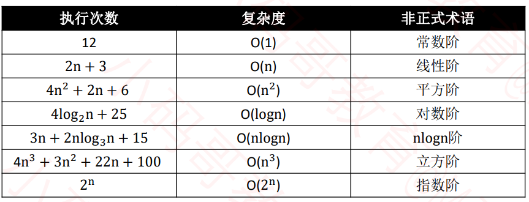
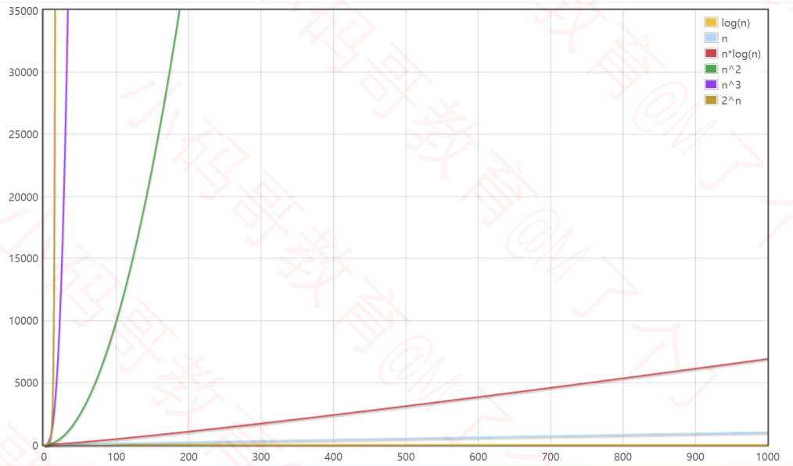
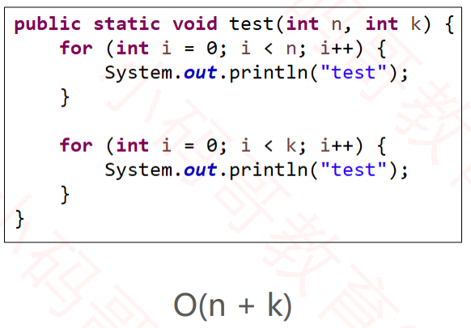
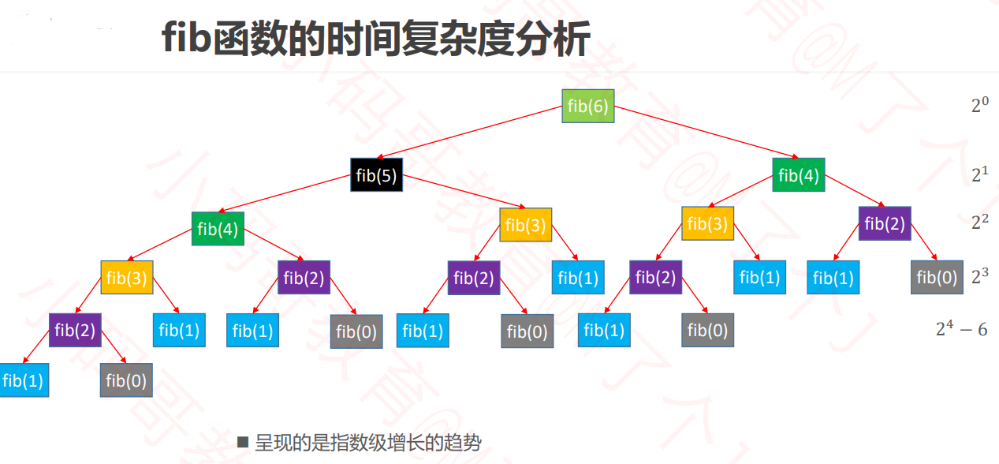
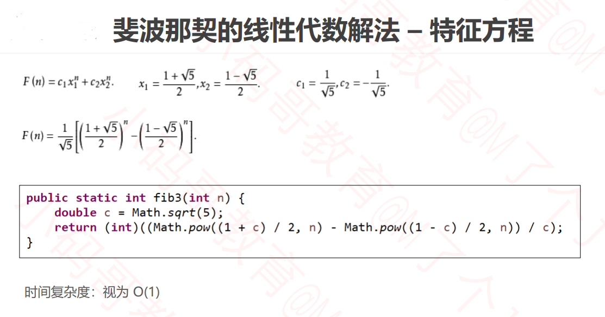

## 如何评判一个算法的好坏？

一般从以下维度来评估算法的优劣 

- 正确性、可读性、健壮性（对不合理输入的反应能力和处理能力） 
- 时间复杂度（time complexity）：估算程序指令的执行次数（执行时间） 
- 空间复杂度（space complexity）：估算所需占用的存储空间

## 大O表示法（Big O）

一般用大O表示法来描述复杂度，它表示的是数据规模 n 对应的复杂度

大O表示法仅仅是一种粗略的分析模型，是一种估算，能帮助我们短时间内了解一个算法的执行效率

**忽略常数、系数、低阶**

- 9 >> O(1) 
- 2n + 3 >> O(n) 
- n 2 + 2n + 6 >> O(n^2 )
- 4n^3 + 3n^2 + 22n + 100 >> O(n^3 ) 
-  log2n 或者log9n  >> logn（对数阶一般省略底数）

根据代码评估复杂度：

```java
	public static void test1(int n) {
		// 1
		if (n > 10) { 
			System.out.println("n > 10");
		} else if (n > 5) { // 2
			System.out.println("n > 5");
		} else {
			System.out.println("n <= 5"); 
		}
		
		// 1 + 4 + 4 + 4
		for (int i = 0; i < 4; i++) {
			System.out.println("test");
		}
		
		// 140000
		// O(1)
		// O(1)
	}

	public static void test2(int n) {
		// O(n)
		// 1 + 3n
		for (int i = 0; i < n; i++) {
			System.out.println("test");
		}
	}

	public static void test3(int n) {
		// 1 + 2n + n * (1 + 3n)
		// 1 + 2n + n + 3n^2
		// 3n^2 + 3n + 1
		// O(n^2)
		
		// O(n)
		for (int i = 0; i < n; i++) {
			for (int j = 0; j < n; j++) {
				System.out.println("test");
			}
		}
	}

	public static void test4(int n) {
		// 1 + 2n + n * (1 + 45)
		// 1 + 2n + 46n
		// 48n + 1
		// O(n)
		for (int i = 0; i < n; i++) {
			for (int j = 0; j < 15; j++) {
				System.out.println("test");
			}
		}
	}

	public static void test5(int n) {
		// 8 = 2^3
		// 16 = 2^4
		
		// 3 = log2(8)
		// 4 = log2(16)
		
		// 执行次数 = log2(n)
		// O(logn)
		while ((n = n / 2) > 0) {
			System.out.println("test");
		}
	}

	public static void test6(int n) {
		// log5(n)
		// O(logn)
		while ((n = n / 5) > 0) {
			System.out.println("test");
		}
	}

	public static void test7(int n) {
		// 1 + 2*log2(n) + log2(n) * (1 + 3n)
		
		// 1 + 3*log2(n) + 2 * nlog2(n)
		// O(nlogn)
		for (int i = 1; i < n; i = i * 2) {
			// 1 + 3n
			for (int j = 0; j < n; j++) {
				System.out.println("test");
			}
		}
	}

	public static void test10(int n) {
		// O(n)
		int a = 10;
		int b = 20;
		int c = a + b;
		int[] array = new int[n];
		for (int i = 0; i < array.length; i++) {
			System.out.println(array[i] + c);
		}
	}
```


## 常见的复杂度的性能比较

常见复杂度：



性能比较：

**O(1) < O(logn) < O(n) < O(nlogn) < O(n^2 ) < O(n^3 ) < O(2^n ) < O(n!) < O(n^n )**

数据规模较小时：


数据规模较大时：



## 多个数据规模的情况



## 算法的优化方向

- 用尽量少的存储空间 

- 用尽量少的执行步骤（执行时间） 

- 根据情况，可以 

  - 空间换时间 

  - 时间换空间

## 斐波那契数列算法的复杂度优化

求第 n 个斐波那契数（fibonacci number），也就第n位数值是前一位和前两位数值相加。

**使用递归，时间复杂度为O(2^n)**

```java
//第一种算法：使用递归
	// O(2^n)
public static int fib1(int n) {
	if (n <= 1) return n;
	return fib1(n - 1) + fib1(n - 2);
}
```



**使用循环，时间复杂度为O(n)**

```java
// O(n)
	public static int fib2(int n) {
		if (n <= 1) return n;
		
		int first = 0;
		int second = 1;
		for (int i = 0; i < n - 1; i++) {
			int sum = first + second;
			first = second;
			second = sum;
		}
		return second;
	}
```

**使用公式，时间复杂度为O(1)**



**它们的差别：**

他们的差别有多大？ 

- 如果有一台1GHz的普通计算机，运算速度 109 次每秒（ n 为 64 ） 
- O(n) 大约耗时 6.4 ∗ 10−8 秒 
- O(2 n ) 大约耗时 584.94 年 
- 有时候算法之间的差距，往往比硬件方面的差距还要大
