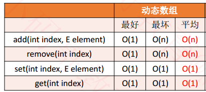
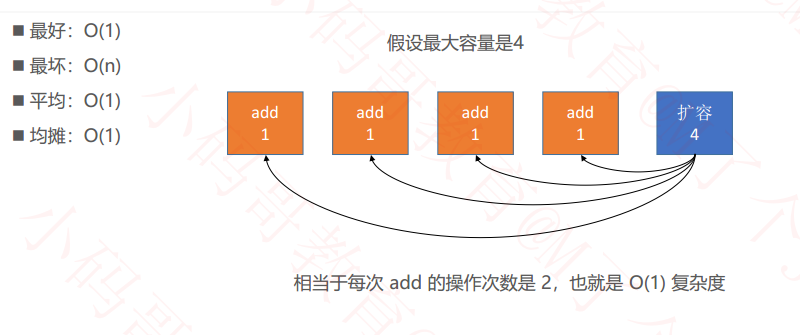

## 什么是数据结构？


## 线性表


## 数组（Array）


## 动态数组（Dynamic Array）接口设计

- `int size(); `// 元素的数量
- `boolean isEmpty(); `// 是否为空
- `boolean contains(E element); `// 是否包含某个元素
- `void add(E element); `// 添加元素到最后面
- `E get(int index); `// 返回index位置对应的元素
- `E set(int index, E element); `// 设置index位置的元素
- `void add(int index, E element); `// 往index位置添加元素
- `E remove(int index); `// 删除index位置对应的元素
- `int indexOf(E element); `// 查看元素的位置
- `void clear(); `// 清除所有元素

## 动态数组复杂度分析  



## 动态数组均摊复杂度  

什么情况下适合使用均摊复杂度：

- 经过连续的多次复杂度比较低的情况后，出现个别复杂度比较高的情况  
- 比如add函数，add(E element)  平均都是添加一个，但是如果遇到扩容的时候，就会变成O(n)，复杂度陡然上升。但是把O(n)的复杂度平均给前面的每一个，均摊复杂度 就是O(1)



## 动态数组代码实现

```java

@SuppressWarnings("unchecked")
public class ArrayList<E> extends AbstractList<E> {
	/**
	 * 所有的元素
	 */
	private E[] elements;
	private static final int DEFAULT_CAPACITY = 10;
	
	public ArrayList(int capaticy) {
		capaticy = (capaticy < DEFAULT_CAPACITY) ? DEFAULT_CAPACITY : capaticy;
		elements = (E[]) new Object[capaticy];
	}
	
	public ArrayList() {
		this(DEFAULT_CAPACITY);
	}
	
	/**
	 * 清除所有元素
	 */
	public void clear() {
		for (int i = 0; i < size; i++) {
			elements[i] = null;
		}
		size = 0;
	}

	/**
	 * 获取index位置的元素
	 * @param index
	 * @return
	 */
	public E get(int index) { // O(1)
		rangeCheck(index);
		
		return elements[index]; 
	}

	/**
	 * 设置index位置的元素
	 * @param index
	 * @param element
	 * @return 原来的元素ֵ
	 */
	public E set(int index, E element) { // O(1)
		rangeCheck(index);
		
		E old = elements[index];
		elements[index] = element;
		return old;
	}

	/**
	 * 在index位置插入一个元素
	 * @param index
	 * @param element
	 */
	public void add(int index, E element) { 
		/*
		 * 最好：O(1)
		 * 最坏：O(n)
		 * 平均：O(n)
		 */
		rangeCheckForAdd(index);
		
		ensureCapacity(size + 1);
		
		for (int i = size; i > index; i--) {
			elements[i] = elements[i - 1];
		}
		elements[index] = element;
		size++;
	} // size是数据规模

	/**
	 * 删除index位置的元素
	 * @param index
	 * @return
	 */
	public E remove(int index) {
		/*
		 * 最好：O(1)
		 * 最坏：O(n)
		 * 平均：O(n)
		 */
		rangeCheck(index);
		
		E old = elements[index];
		for (int i = index + 1; i < size; i++) {
			elements[i - 1] = elements[i];
		}
		elements[--size] = null;
		return old;
	}

	/**
	 * 查看元素的索引
	 * @param element
	 * @return
	 */
	public int indexOf(E element) {
		if (element == null) {
			for (int i = 0; i < size; i++) {
				if (elements[i] == null) return i;
			}
		} else {
			for (int i = 0; i < size; i++) {
				if (element.equals(elements[i])) return i;
			}
		}
		return ELEMENT_NOT_FOUND;
	}
	
	/**
	 * 保证要有capacity的容量
	 * @param capacity
	 */
	private void ensureCapacity(int capacity) {
		int oldCapacity = elements.length;
		if (oldCapacity >= capacity) return;
		
		// 新容量为旧容量的1.5倍
		int newCapacity = oldCapacity + (oldCapacity >> 1);
		E[] newElements = (E[]) new Object[newCapacity];
		for (int i = 0; i < size; i++) {
			newElements[i] = elements[i];
		}
		elements = newElements;
		
		System.out.println(oldCapacity + "扩容为" + newCapacity);
	}
	
	@Override
	public String toString() {
		// size=3, [99, 88, 77]
		StringBuilder string = new StringBuilder();
		string.append("size=").append(size).append(", [");
		for (int i = 0; i < size; i++) {
			if (i != 0) {
				string.append(", ");
			}
			
			string.append(elements[i]);
			
//			if (i != size - 1) {
//				string.append(", ");
//			}
		}
		string.append("]");
		return string.toString();
	}
}

```

## 动态数组的优化

### 动态数组的缩容 

如果内存使用比较紧张，动态数组有比较多的剩余空间，可以考虑进行缩容操作

- 比如剩余空间占总容量的一半时，就进行缩容
- 如果扩容倍数、缩容时机设计不得当，有可能会导致复杂度震荡  。比如扩容与缩容都是一倍，那么频繁添加或删除最后一个时间，会一时扩容，一时缩容。

```java
@Override
public E remove(int index) {
      //....
        trim();
      //....
 }
   private void trim() {
		// 30
		int oldCapacity = elements.length;
		// 1/3
		int newCapacity = oldCapacity /3;
		if (size > (newCapacity) || oldCapacity <= DEFAULT_CAPACITY) return;
		
		// 剩余空间还很多
		E[] newElements = (E[]) new Object[newCapacity];
		for (int i = 0; i < size; i++) {
			newElements[i] = elements[i];
		}
		elements = newElements;
		
		System.out.println(oldCapacity + "缩容为" + newCapacity);
	}
```

