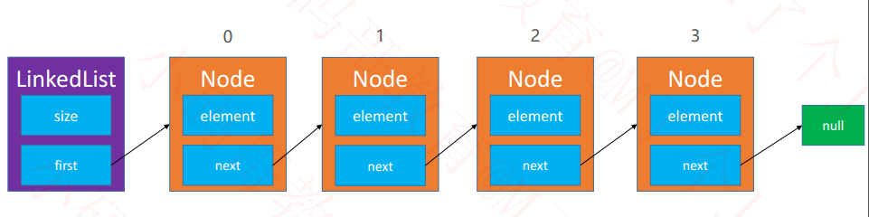
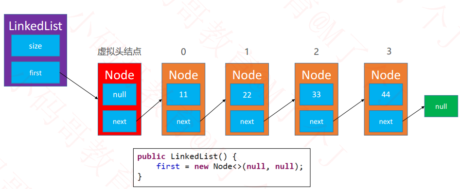
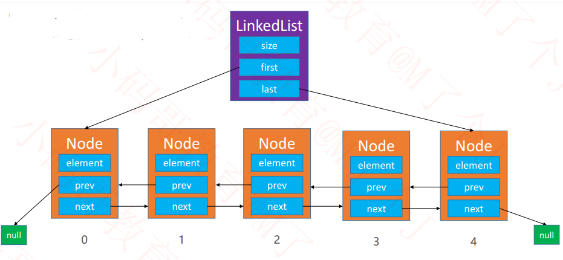
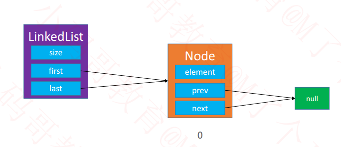
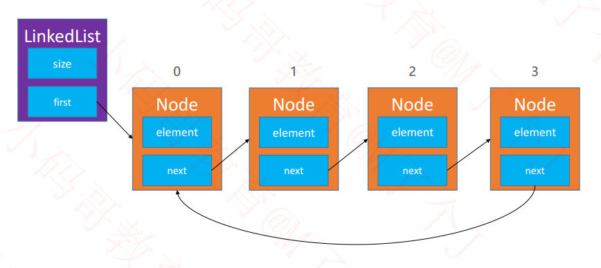
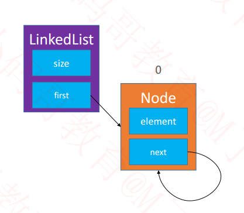
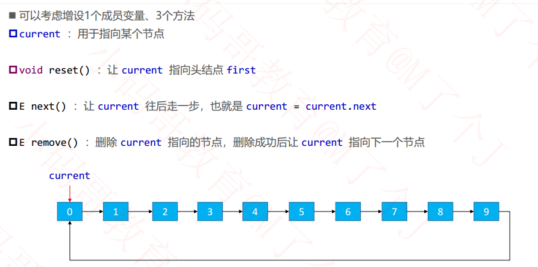
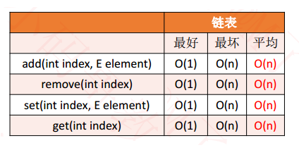
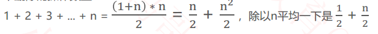
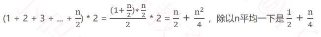

## 链表（Linked List）  

- 动态数组有个明显的缺点
  - 可能会造成内存空间的大量浪费

- 能否用到多少就申请多少内存？
  - 链表可以办到这一点
- 链表是一种链式存储的线性表，所有元素的内存地址不一定是连续的  



## 接口设计  

```java
public interface List<E> {

	/**
	 * 清除所有元素
	 */
	void clear();

	/**
	 * 元素的数量
	 * @return
	 */
	int size();

	/**
	 * 是否为空
	 * @return
	 */
	boolean isEmpty();

	/**
	 * 是否包含某个元素
	 * @param element
	 * @return
	 */
	boolean contains(E element);

	/**
	 * 添加元素到尾部
	 * @param element
	 */
	void add(E element);

	/**
	 * 获取index位置的元素
	 * @param index
	 * @return
	 */
	E get(int index);

	/**
	 * 设置index位置的元素
	 * @param index
	 * @param element
	 * @return 原来的元素ֵ
	 */
	E set(int index, E element);

	/**
	 * 在index位置插入一个元素
	 * @param index
	 * @param element
	 */
	void add(int index, E element);

	/**
	 * 删除index位置的元素
	 * @param index
	 * @return
	 */
	E remove(int index);

	/**
	 * 查看元素的索引
	 * @param element
	 * @return
	 */
	int indexOf(E element);
}

```

## 虚拟头结点  

- 有时候为了让代码更加精简，统一所有节点的处理逻辑，可以在最前面增加一个虚拟的头结点（不存储数据）  
- 不过这种方法也没有很精简，简单了解一下就行。




## 双向链表  

- 此前所学的链表，也叫做单向链表  
- 使用双向链表可以提升链表的综合性能  



- 只有一个元素  



## 单向循环链表  



只有1个节点  



如何发挥循环链表的最大威力？  



## 单向链表复杂度分析  

- size 是数组规模 n  



## 双向链表 vs 单向链表  

粗略对比一下删除的操作数量  ，**操作数量缩减了近一半**  

- 单向链表：  
  - 

- 双向链表：  
  - 

java的观法 JDK 中的 `java.util.LinkedList`， 使用的是双向链表  

## 双向链表 vs 动态数组  

优缺点对比：

- 动态数组：开辟、销毁内存空间的次数相对较少，但可能造成内存空间浪费（可以通过缩容解决）
- 双向链表：开辟、销毁内存空间的次数相对较多，但不会造成内存空间的浪费

如何应用：

- 如果频繁在**尾部**进行**添加、 删除**操作， **动态数组、 双向链表**均可选择
- 如果频繁在头部进行**添加、 删除**操作，建议选择使用**双向链表**
- 如果有频繁的（**在任意位置**） **添加、 删除**操作，建议选择使用**双向链表**
- 如果有**频繁的查询**操作（随机访问操作），建议选择使用**动态数组**  

