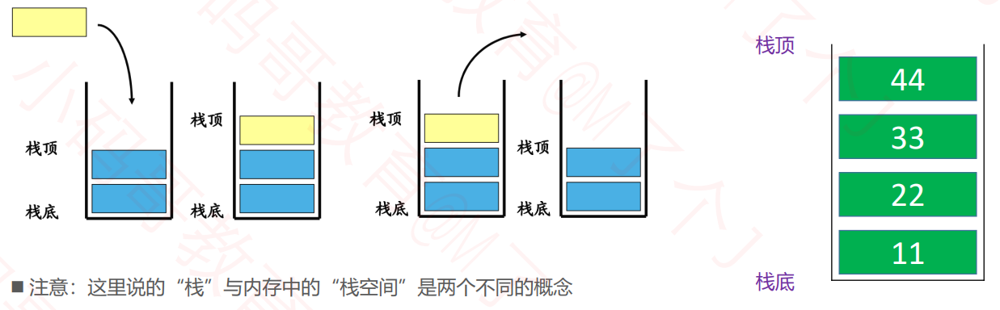
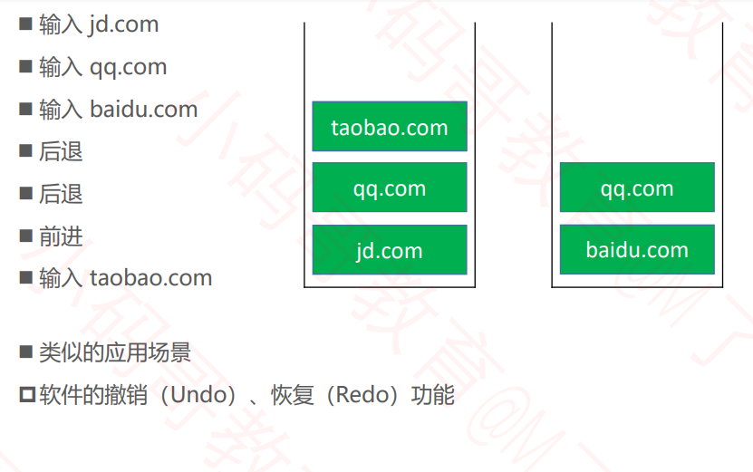
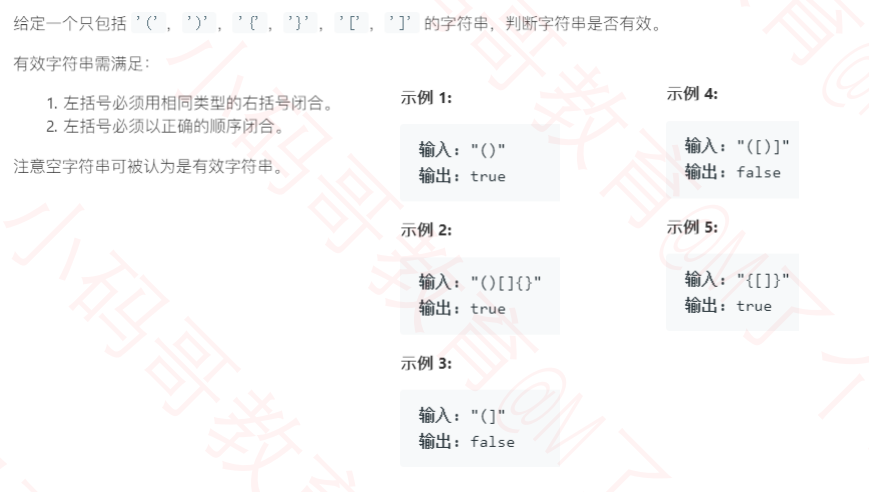
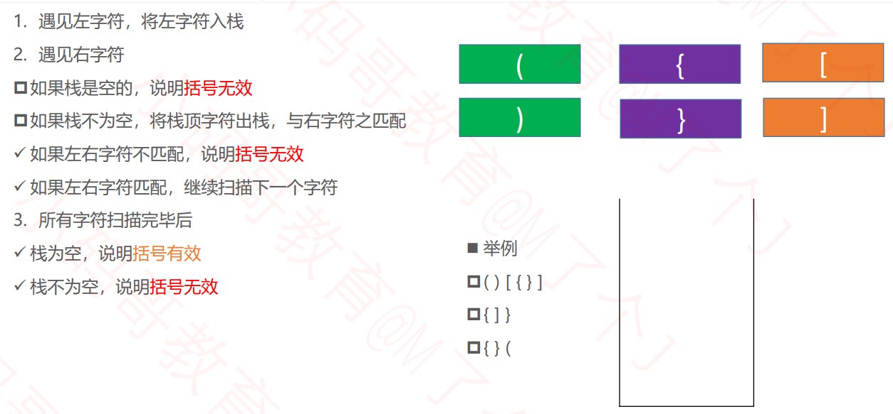

## 栈（Stack）

- 栈是一种特殊的线性表，只能在一端进行操作 

- 往栈中添加元素的操作，一般叫做 push，入栈 

- 从栈中移除元素的操作，一般叫做 pop，出栈（只能移除栈顶元素，也叫做：弹出栈顶元素） 

- 后进先出的原则，Last In First Out，LIFO



## 接口设计

```java
public interface Stack<E> {

	/**
	 * 清除所有元素
	 */
	void clear();

	/**
	 * 元素的数量
	 * @return
	 */
	int size();

	/**
	 * 是否为空
	 * @return
	 */
	boolean isEmpty();
    
    /**
	 * 入栈
	 * @return
	 */
	void push(E element); 
    
     /**
	 * 出栈
	 * @return
	 */
	 E pop();

    /**
	 * 获取栈顶元素
	 * @return
	 */
	 E top();
}

```

栈的内部实现是可以直接利用以前学过的数据结构动态数组或链表

## 栈的应用 – 浏览器的前进和后退



## 作业与练习

**练习 - 有效的括号**

https://leetcode-cn.com/problems/valid-parentheses/solution/  





**作业**

- 括号的分数：https://leetcode-cn.com/problems/score-of-parentheses
- 逆波兰表达式求值：https://leetcode-cn.com/problems/evaluate-reverse-polish-notation/

- 基本计算器：https://leetcode-cn.com/problems/basic-calculator/comments/  
