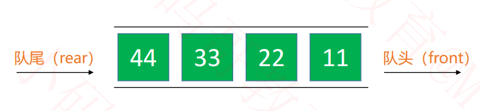
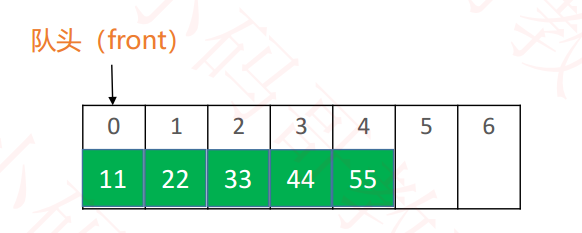
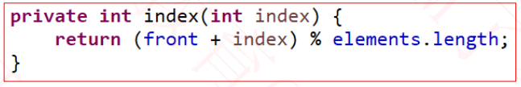
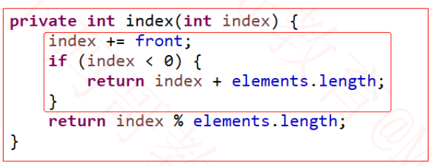
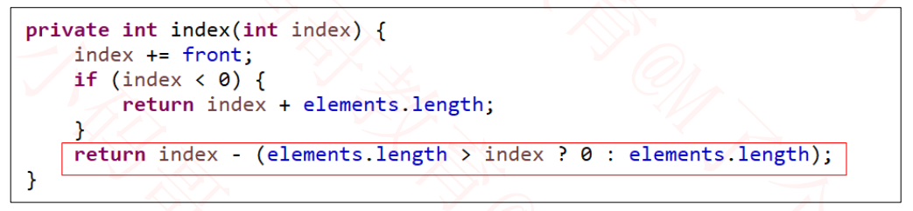
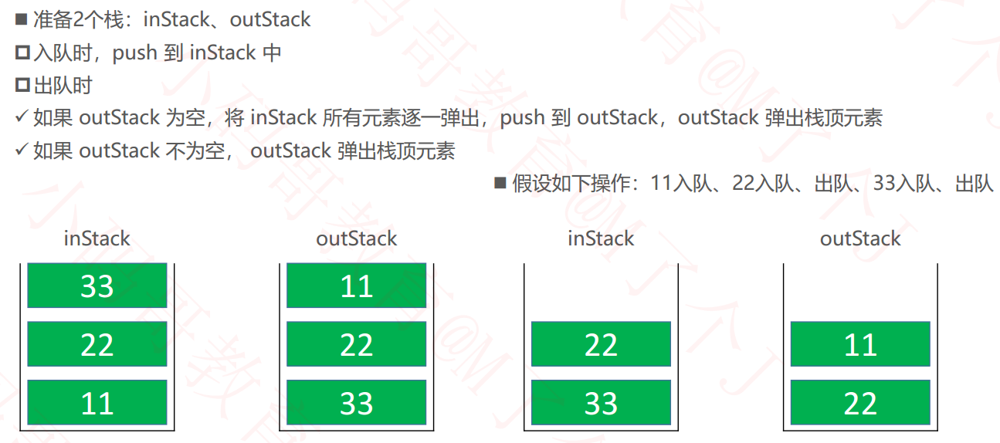

## 队列（Queue）  

- 队列是一种特殊的线性表，只能在头尾两端进行操作

- 队尾（rear）：只能从队尾添加元素，一般叫做 enQueue， 入队
- 队头（front）：只能从队头移除元素，一般叫做 deQueue， 出队
- 先进先出的原则， First In First Out， FIFO  



## 队列的接口设计  

```java
public interface Queue<E> {

	/**
	 * 清除所有元素
	 */
	void clear();

	/**
	 * 元素的数量
	 * @return
	 */
	int size();

	/**
	 * 是否为空
	 * @return
	 */
	boolean isEmpty();
    
    /**
	 * 入队
	 * @return
	 */
	void enQueue(E element); 
    
     /**
	 * 出队
	 * @return
	 */
	 E deQueue();

    /**
	 * 获取队列的头元素
	 * @return
	 */
	 E front();
}
```

- 队列的内部实现是可以直接使用动态数组、链表  
- 优先使用**双向链表**，因为队列主要是往头尾操作元素  

## 双端队列（Deque）  

- 双端队列是能在头尾两端添加、 删除的队列
- 英文 deque 是 double ended queue 的简称  

## 双端队列的接口设计  

```java
public interface Deque<E> {

	/**
	 * 清除所有元素
	 */
	void clear();

	/**
	 * 元素的数量
	 * @return
	 */
	int size();

	/**
	 * 是否为空
	 * @return
	 */
	boolean isEmpty();
    
    /**
	 * 从队头入队
	 * @return
	 */
	void enQueueFront(E element); 
    
     /**
	 * 从队头出队
	 * @return
	 */
	 E deQueueFront();
    
    /**
	 * 从队尾入队
	 * @return
	 */
	void enQueueRear(E element); 
    
     /**
	 * 从队尾出队
	 * @return
	 */
	 E deQueueRear();

    /**
	 * 获取队列的头元素
	 * @return
	 */
	 E front();
    /**
	 * 获取队列的尾元素
	 * @return
	 */
	 E rear();
}
```

## 循环队列（Circle Queue）  

- 其实队列底层也可以使用**动态数组**实现，并且各项接口也可以优化到 O(1) 的时间复杂度

- 这个用**动态数组**实现并且优化之后的队列也叫做： **循环队列**  （如果直接使用**链表**，则不需要使用**循环队列**）

- **循环双端队列**：可以进行两端添加、删除操作的循环队列  



- **循环队列**需要访问下标转化为实际下标

  

- **循环双端队列**在队头添元素时，可能会出现下标为负数的情况，这里要做一个判断



- 尽量避免使用乘*、 除/、 模%、 浮点数运算，效率低下  ，可以使用%运算符优化  
  - 已知n>=0， m>0  
  - n%m 等价于 n – (m > n ? 0 : m) 的前提条件： n < 2m  



## 作业与练习

**练习 – 用栈实现队列  **

https://leetcode-cn.com/problems/implement-queue-using-stacks/




**作业**

https://leetcode-cn.com/problems/implement-stack-using-queues/  