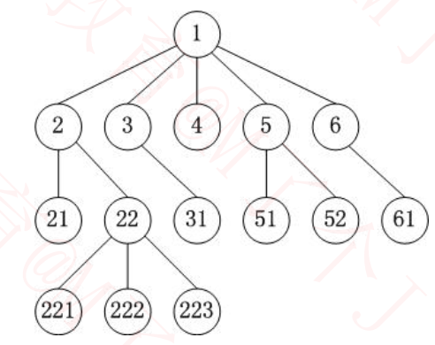
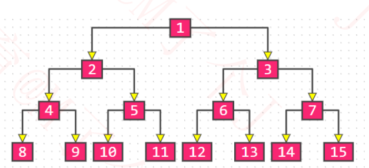
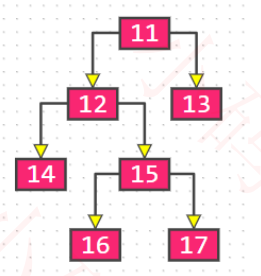
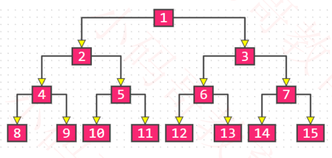
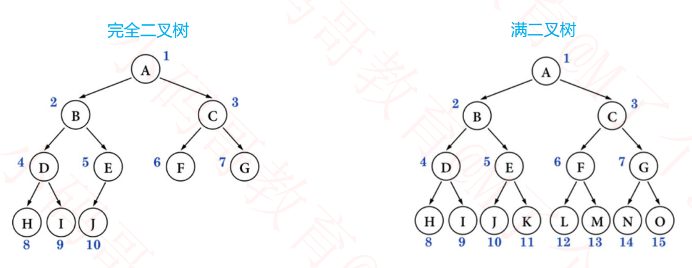
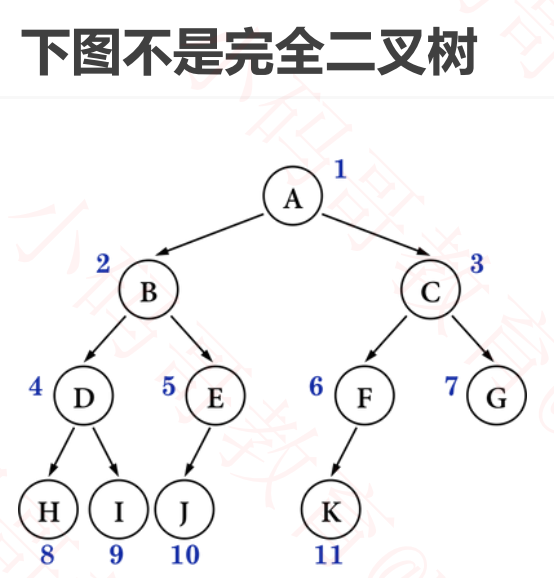
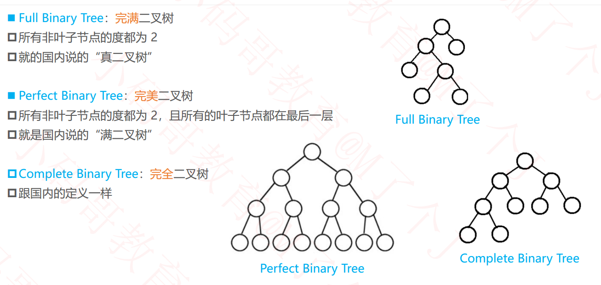

## 树（Tree）的基本概念  

- 节点、根节点、父节点、子节点、兄弟节点

- 一棵树可以没有任何节点，称为空树。一棵树可以只有 1 个节点，也就是只有根节点
- 子树、左子树、右子树  

- 节点的度（degree）：子树的个数
- 树的度：所有节点度中的最大值
- 叶子节点（leaf）：度为 0 的节点
- 非叶子节点：度不为 0 的节点  

- 层数（level）：根节点在第 1 层，根节点的子节点在第 2 层，以此类推（有些教程也从第 0 层开始计算）
- 节点的深度（depth）：从**根节点**到**当前节点**的唯一路径上的节点总数
- 节点的高度（height）：从**当前节点**到**最远叶子节点**的路径上的节点总数
- 树的深度：所有节点深度中的最大值
- 树的高度：所有节点高度中的最大值
- 树的深度 等于 树的高度  

- 有序树：树中任意节点的子节点之间有顺序关系
- 无序树：树中任意节点的子节点之间没有顺序关系，也称为“自由树”
- 森林：由 m（m ≥ 0）棵互不相交的树组成的集合  

## 二叉树（Binary Tree）  

**特点**：

- **每个节点的度最大为 2（最多拥有 2 棵子树）**
- 左子树和右子树是有顺序的
- 即使某节点只有一棵子树，也要区分左右子树  

**性质**：

- 非空二叉树的第 **i** 层，**最多**有 **2^(i - 1)** 个节点（i ≥ 1 ）  

- 在**高度为 h** 的二叉树，**最多**有 **(2^h) - 1** 个结点（h ≥ 1 ）  
  - 根据每一层的节点数相加公式（ 2^0+2^1+...+2^(h-1) = (2^h) -1  ）推算。
- 对于任何一棵非空二叉树，如果**叶子节点个数为 n0**，**度为 2 的节点个数为 n2**，则有: **n0 = n2 + 1**  
  - 假设 度为 1 的节点个数为 n1，那么二叉树的节点总数 n = n0 + n1 + n2  
  - 二叉树的边数 T =0+ n1 + 2 * n2  =  n-1
  - 0+ n1 + 2 * n2  =  n0 + n1 + n2  -1，得出 **n0 = n2 + 1**

## 真二叉树（Proper Binary Tree）  

**特点：**

- **所有节点的度都要么为 0，要么为 2**  

## 满二叉树（Full Binary Tree）  

**特点：**

- **最后一层节点的度都为 0，其他节点的度都为 2**  
- 在同样高度的二叉树中，满二叉树的叶子节点数量最多、总节点数量最多  
- 满二叉树一定是真二叉树，真二叉树不一定是满二叉树  

**性质**：

- 假设满二叉树的高度为 h（h ≥ 1 ），
  - 那么 第 i 层的节点数量： **2^(i - 1)** ， 
  - 叶子节点数量： **2^(h - 1 )**，
  - 总节点数量 n  ：**(2^h) -1** = 2^0+2^1+...+2^(h-1) 
  - 树高h：h = **log2(n + 1)**  

## 完全二叉树（Complete Binary Tree）  

**特点：**

- 叶子节点只会出现最后 2 层，**最后 1 层的叶子结点都靠左对齐**  
- 完全二叉树从**根结点至倒数第 2 层是一棵满二叉树**  
- 对节点从上至下、左至右开始编号，其所有编号都能与相同高度的满二叉树中的编号对应  
- 满二叉树一定是完全二叉树，完全二叉树不一定是满二叉树  

**性质**：

- 度为 **1** 的节点只有**左子树**  
- 度为 **1** 的节点要么是 **1** 个，要么是 **0** 个  
- 同样节点数量的二叉树，完全二叉树的高度**最小**  
- 假设完全二叉树的高度为 h（h ≥ 1 ），那么  
  - 至少有 **2^(h - 1)** 个节点 （2^0 + 2^1 + 2^2 + ⋯ + 2^(h-2) + 1 ）  
  - 最多有 **2^h - 1** 个节点（2^0 + 2^1 + 2^2 + ⋯ + 2^(h-1)，满二叉树 ）  
  - 总节点数量为 n
    - 2^(h - 1) ≤ n < 2^h
    -  h - 1 ≤ log2n < h
    -  h = **floor( log2n ) + 1**  (floor 是向下取整  )
- 一棵有 n 个节点的完全二叉树（n > 0），从上到下、从左到右对节点从 1 开始进行编号，对任意第 i 个节点  
  - 如果 i = 1 ，它是根节点
  - 如果 i > 1 ，它的**父节点**编号为 **floor( i / 2 )**
  - 如果 2i ≤ n ，它的**左子节**点编号为 **2i**
  - 如果 2i > n ，它**无左子节**点
  - 如果 2i + 1 ≤ n ，它的右子节点编号为 **2i + 1**
  - 如果 2i + 1 > n ，它**无右子节点**  

## 国外教材的说法  

## 面试题  

- 如果一棵完全二叉树有 768 个节点，求叶子节点的个数
  - 假设叶子节点个数为 n0，度为 1 的节点个数为 n1，度为 2 的节点个数为 n2   
  - 总结点个数 n = n0 + n1 + n2，而且 n0 = n2 + 1  ，得出**n = 2n0 + n1 – 1**  
  - 完全二叉树的 n1 要么为 0，要么为 1  
    - n1为1时， n = 2n0， n 必然是偶数  ，叶子节点个数 n0 = n / 2，非叶子节点个数 n1 + n2 = n / 2  
    - n1为0时， n = 2n0 – 1， n 必然是奇数   ，叶子节点个数 n0 = (n + 1) / 2，非叶子节点个数 n1 + n2 = (n – 1) / 2  
  - 叶子节点个数 n0 = floor( (n + 1) / 2 ) = ceiling( n / 2 )  
  - 非叶子节点个数 n1 + n2 = floor( n / 2 ) = ceiling( (n – 1) / 2 )  
  - 因此叶子节点个数为 384  

