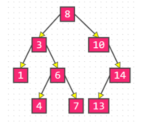
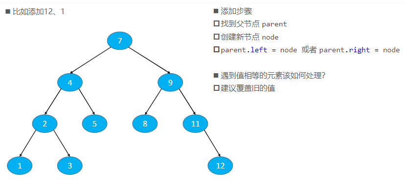
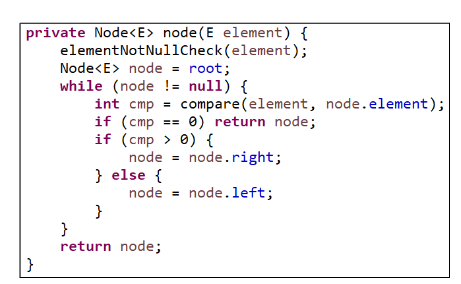
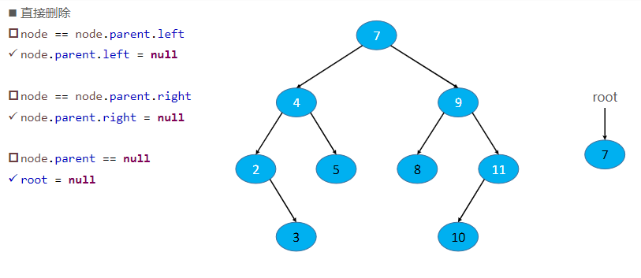
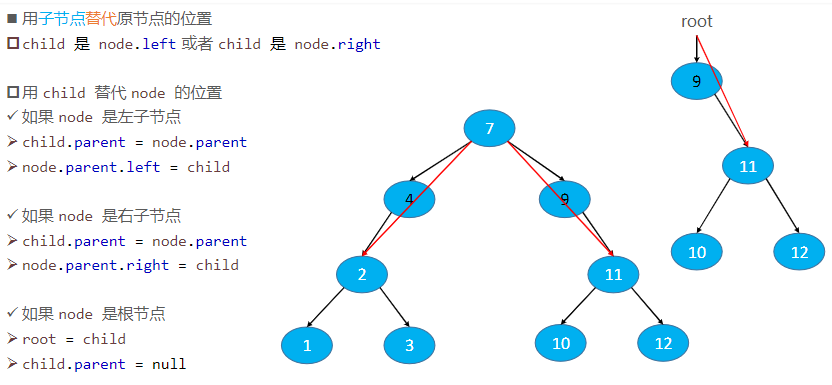
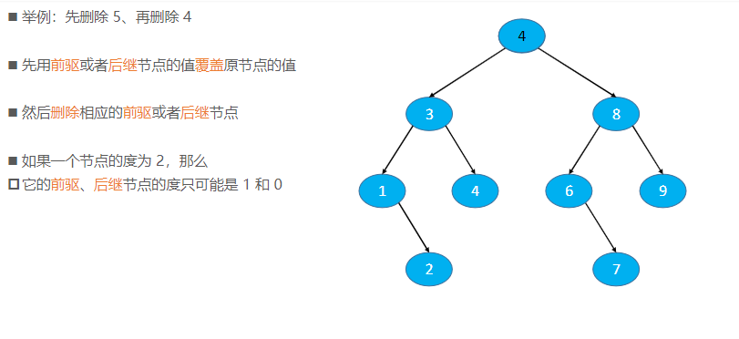

## 二叉搜索树（Binary Search Tree）

二叉搜索树是二叉树的一种，是应用非常广泛的一种二叉树，英文简称为 BST

- 又被称为：二叉查找树、二叉排序树
- 任意一个节点的值都大于其左子树所有节点的值
- 任意一个节点的值都小于其右子树所有节点的值
- 它的左右子树也是一棵二叉搜索树

二叉搜索树可以大大提高搜索数据的效率

二叉搜索树存储的元素必须具备可比较性

- 比如 int、double 等
- 如果是自定义类型，需要指定比较方式
- 不允许为 null



## 二叉搜索树的接口设计

```java
int size() // 元素的数量
boolean isEmpty() // 是否为空
void clear() // 清空所有元素
void add(E element) // 添加元素
void remove(E element) // 删除元素
boolean contains(E element) // 是否包含某元素
```


## 添加节点



## 根据元素内容获取节点



## 删除节点

### 删除节点 – 叶子节点



### 删除节点 – 度为1的节点



### 删除节点 – 度为2的节点



## 作业

- 删除二叉搜索树中的节点：https://leetcode-cn.com/problems/delete-node-in-a-bst/
- 二叉搜索树中的搜索：https://leetcode-cn.com/problems/search-in-a-binary-search-tree/
- 二叉搜索树中的插入操作：https://leetcode-cn.com/problems/insert-into-a-binary-search-tree/
- 验证二叉搜索树：https://leetcode-cn.com/problems/validate-binary-search-tree/comments/
- 二叉搜索树的最小绝对差：https://leetcode-cn.com/problems/minimum-absolute-difference-in-bst/comments/
- 二叉搜索树结点最小距离：https://leetcode-cn.com/problems/minimum-distance-between-bst-nodes/comments/
- 将有序数组转换为二叉搜索树：https://leetcode-cn.com/problems/convert-sorted-array-to-binary-search-tree/
- 二叉搜索树的范围和：https://leetcode-cn.com/problems/range-sum-of-bst/
- 二叉搜索树的最近公共祖先：https://leetcode-cn.com/problems/lowest-common-ancestor-of-a-binary-search-tree/
- 二叉搜索树中第K小的元素：https://leetcode-cn.com/problems/kth-smallest-element-in-a-bst/
- 二叉搜索树迭代器：https://leetcode-cn.com/problems/binary-search-tree-iterator/
- 恢复二叉搜索树：https://leetcode-cn.com/problems/recover-binary-search-tree/