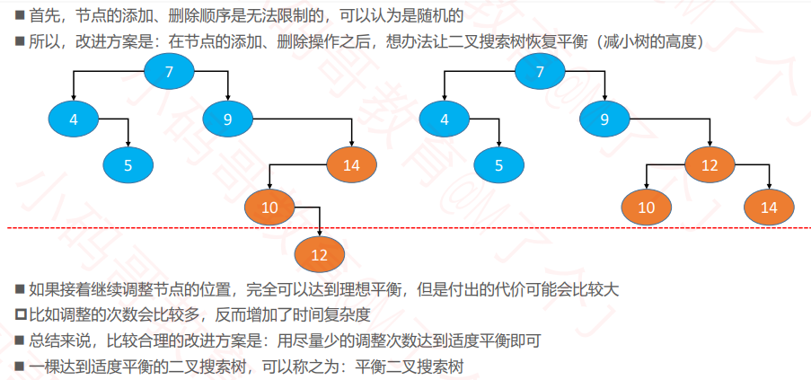

## 二叉搜索树的复杂度分析

- 复杂度其实就是等于树高h。
- 当 n 比较大时，两者的性能差异比较大

- 比如 n = 1000000 时，二叉搜索树的最低高度是 20
- 添加、删除节点时，都可能会导致二叉搜索树退化成链表

## 平衡（Balance）

### 理想平衡

## 如何改进二叉搜索树？

## 平衡二叉搜索树（Balanced Binary Search Tree）

