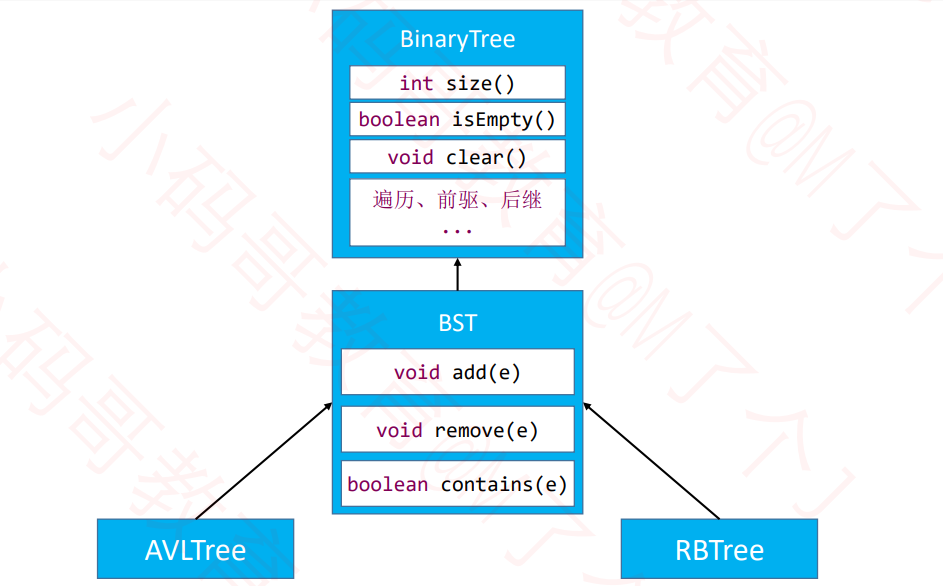

## AVL树

AVL树是最早发明的自平衡二叉搜索树之一 

AVL 取名于两位发明者的名字 G. M. **A**delson-**V**elsky 和 E. M. **L**andis（来自苏联的科学家）

**特点**

- 平衡因子（Balance Factor）：某结点的左右子树的高度差
- 每个节点的平衡因子只可能是 1、0、-1（绝对值 ≤ 1，如果超过 1，称之为“失衡”）
- 每个节点的左右子树高度差不超过 1
- 搜索、添加、删除的时间复杂度是 O(logn)


## AVL树的接口设计

```java
int afterAdd() // 添加元素之后的平衡处理
boolean afterRemove() // 删除元素之后的平衡处理
Node<E> createNode(E element, Node<E> parent) //AVL节点与普通的二叉树节点有些区别，这里通过工厂函数返回
```

```java
//AVL节点
private static class AVLNode<E> extends Node<E> {
    int height = 1;

    public AVLNode(E element, Node<E> parent) {
        super(element, parent);
    }

    public int balanceFactor() {
        int leftHeight = left == null ? 0 : ((AVLNode<E>)left).height;
        int rightHeight = right == null ? 0 : ((AVLNode<E>)right).height;
        return leftHeight - rightHeight;
    }

    public void updateHeight() {
        int leftHeight = left == null ? 0 : ((AVLNode<E>)left).height;
        int rightHeight = right == null ? 0 : ((AVLNode<E>)right).height;
        height = 1 + Math.max(leftHeight, rightHeight);
    }
    //返回左右子树中，高度最高的那个子树。如果两个子树高度相同，则返回和当前节点相同方向的子树
    //（相同方向：当前节点是在父节点的哪个左右方向）
    public Node<E> tallerChild() {
        int leftHeight = left == null ? 0 : ((AVLNode<E>)left).height;
        int rightHeight = right == null ? 0 : ((AVLNode<E>)right).height;
        if (leftHeight > rightHeight) return left;
        if (leftHeight < rightHeight) return right;
        return isLeftChild() ? left : right;
    }

   
}
```

**代码的继承结构**




## 添加后的平衡操作

### 添加导致的失衡


### LL – 右旋转（单旋）

**特点**

- 失衡节点是祖父节点，也就是g。
- 被添加的节点是在g的左边的左边。

**操作-右旋转**

- `g.left = p.right`
-  `p.right = g`
- 让p成为这棵子树的根节点
- 维护T2、p、g 的 parent 属性
- 先后更新 g、p 的高度


### RR – 左旋转（单旋）

**特点**

- 失衡节点是祖父节点，也就是g。
- 被添加的节点是在g的右边的右边。

**操作-左旋转**

- `g.right = p.left`
-  `p.left = g`
- 让p成为这棵子树的根节点
- 维护T1、p、g 的 parent 属性
- 先后更新 g、p 的高度


### LR – RR左旋转，LL右旋转（双旋）

**特点**

- 失衡节点是祖父节点，也就是g。
- 被添加的节点是在g的左边的右边。

**操作-先对p左旋转，再对g右旋转**

- 对p左旋转

  - `p.right = n.left`

  -  `n.left = p`

  - 让n成为这棵子树的根节点

  - 维护T1、n、p的 parent 属性

  - 先后更新 n、p 的高度

- 对g进行右旋转

  - `g.left = n.right`
  -  `n.right = g`
  - 让n成为这棵子树的根节点
  - 维护T2、n、g 的 parent 属性
  - 先后更新 g、n 的高度


### RL – LL右旋转，RR左旋转（双旋）

**特点**

- 失衡节点是祖父节点，也就是g。
- 被添加的节点是在g的右边的左边。

**操作-先对p右旋转，再对g左旋转**

- 对p右旋转

  - `p.left= n.right`

  -  `n.right= p`

  - 让n成为这棵子树的根节点

  - 维护T2、n、p的 parent 属性

  - 先后更新 n、p 的高度

- 对g进行左旋转

  - `g.right= n.left`
  -  `n.left= g`
  - 让n成为这棵子树的根节点
  - 维护T1、n、g 的 parent 属性
  - 先后更新 g、n 的高度

### 统一所有旋转操作

- 将所有的结点以a,b……从小到大命名
- 我们可以发现，无论是LL,RR,LR,RL哪一种旋律，最终都会得到一样的结果。
- 那我们就可以在输入的时候，确定a,b,c……是哪一个节点，就可以不用旋律，直接操作。


## 删除后的平衡操作

### 删除导致的失衡


### LL – 右旋转（单旋）

- 如果绿色节点不存在，更高层的祖先节点可能也会失衡，需要再次恢复平衡，然后又可能导致更高层的祖先节点失衡... 
- 极端情况下，所有祖先节点都需要进行恢复平衡的操作，共 O(logn) 次调整


### RR – 左旋转（单旋）


### LR – RR左旋转，LL右旋转（双旋）


### RL – LL右旋转，RR左旋转（双旋）


## zig、zag

有些教程里面

把右旋转叫做zig，旋转之后的状态叫做zigged 

把左旋转叫做zag，旋转之后的状态叫做zagged

## 总结

- 添加
	- 可能会导致所有祖先节点都失衡
	- 只要让高度最低的失衡节点恢复平衡，整棵树就恢复平衡【仅需 O(1) 次调整】
- 删除
	- 可能会导致父节点或祖先节点失衡（只有1个节点会失衡）
	- 恢复平衡后，可能会导致更高层的祖先节点失衡【最多需要 O(logn) 次调整】
- 平均时间复杂度
	- 搜索：O(logn)
	- 添加：O(logn)，仅需 O(1) 次的旋转操作
	- 删除：O(logn)，最多需要 O(logn) 次的旋转操作

## 作业

平衡二叉树：https://leetcode-cn.com/problems/balanced-binary-tree/
