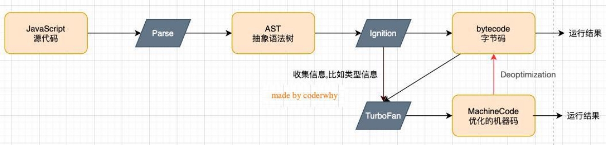
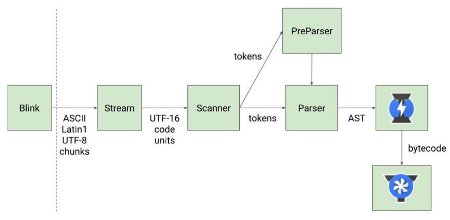
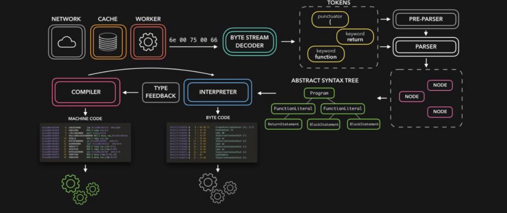
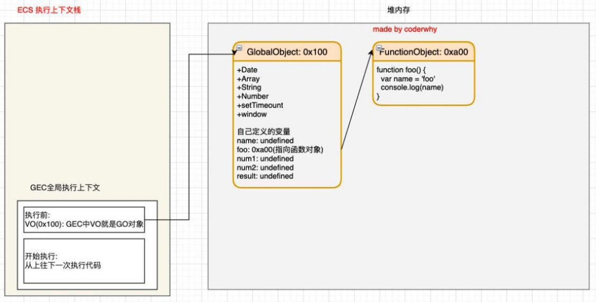
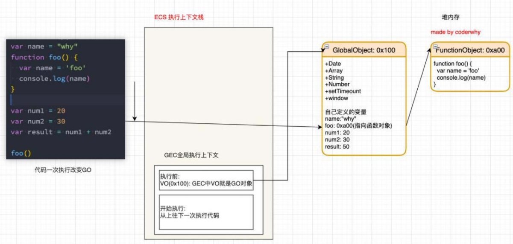
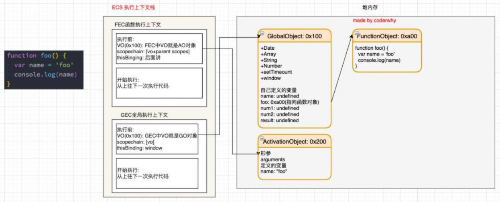
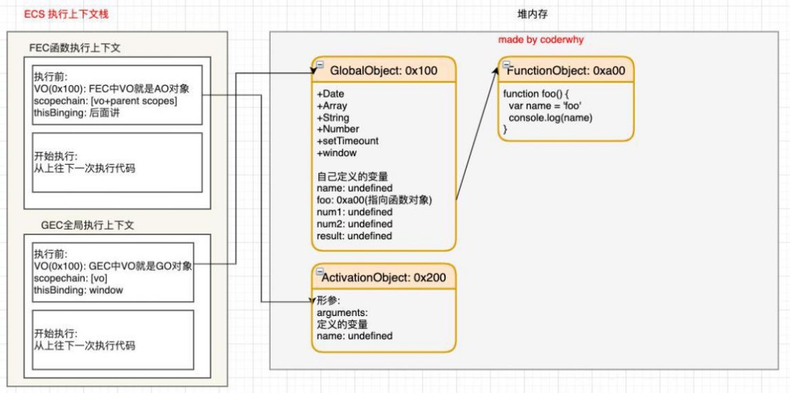

**深入JavaScript的运行原理 **

王红元 coderwhy

 

|
**目录 content**

|
1	 **深入V8引擎原理**

2	 **JS执行上下文**

3	 **全局代码执行过程**

4	 **函数代码执行过程**

5	 **作用域和作用域链**
|
| :- | - |

**JavaScript代码的执行**

- **JavaScript代码下载好之后，是如何一步步被执行的呢？**
- **我们知道，浏览器内核是由两部分组成的，以webkit为例：**
- WebCore**：**负责HTML解析、布局、渲染等等相关的工作；
- JavaScriptCore**：**解析、执行JavaScript代码；

- **另外一个强大的JavaScript引擎就是V8引擎。**

**V8引擎的执行原理**

- **我们来看一下官方对V8引擎的定义：**
- V8是用C ++编写的Google开源高性能JavaScript和WebAssembly引擎，它用于Chrome和Node.js等。
- 它实现[ECMAScript和W](https://tc39.es/ecma262/)[ebAssembly，并在](https://webassembly.github.io/spec/core/)Windows 7或更高版本，macOS 10.12+和使用x64，IA-32，ARM或MIPS处理 器的Linux系统上运行。
- V8可以独立运行，也可以嵌入到任何C ++应用程序中。

**V8引擎的架构**

- V8引擎本身的源码**非常复杂**，大概有超过**100w行C++代码**，通过了解它的架构，我们可以知道它是如何对JavaScript执行的：
- Parse模块会将JavaScript代码转换成AST（抽象语法树），这是因为解释器并不直接认识JavaScript代码；
- 如果函数没有被调用，那么是不会被转换成AST的；
- Parse的V8官方文档：http[s://v8.dev/blog/scanner](https://v8.dev/blog/scanner)
- Ignition是一个解释器，会将AST转换成ByteCode（字节码）
  - 同时会收集TurboFan优化所需要的信息（比如函数参数的类型信息，有了类型才能进行真实的运算）；
  - 如果函数只调用一次，Ignition会解释执行ByteCode；
  - Ignition的V8官方文档：https[://v8.dev/blog/ignition-interpreter](https://v8.dev/blog/ignition-interpreter)
- TurboFan是一个编译器，可以将字节码编译为CPU可以直接执行的机器码；
- 如果一个函数被多次调用，那么就会被标记为热点函数，那么就会经过TurboFan转换成优化的机器码，提高代码的执行性能；
- 但是，机器码实际上也会被还原为ByteCode，这是因为如果后续执行函数的过程中，类型发生了变化（比如sum函数原来执 行的是number类型，后来执行变成了string类型），之前优化的机器码并不能正确的处理运算，就会逆向的转换成字节码；
- TurboFan的V8官方文档：https[://v8.dev/blog/turbofan-jit](https://v8.dev/blog/turbofan-jit)

**V8引擎的解析图（官方）**

- **词法分析（英文lexical analysis）**
- 将字符序列转换成token序列 的过程。
- token是**记号化**

（tokenization）的缩写

- **词法分析器**（lexical analyzer，简称lexer），也 叫**扫描器**（scanner）
- **语法分析（英语：syntactic analysis，也叫 parsing）**
- **语法分析器也可以称之为** parser。

**V8引擎的解析图**

**JavaScript代码执行原理 - 版本说明**

- **在ECMA早期的版本中（ECMAScript3），代码的执行流程的术语和**
- 目前网上大多数流行的说法都是基于ECMAScript3版本的解析
- 但是ECMAScript3终将过去， ECMAScript5必然会成为主流 好版本的内容；

**ECMAScript5以及之后的术语会有所区别：**                   ，并且在面试时问到的大多数都是ECMAScript3的版本内容。 ，所以最好也理解ECMAScript5甚至包括ECMAScript6以及更

- 事实上在TC39（ ECMAScript5 ）的最新描述中，和ECMAScript5之后的版本又出现了一定的差异；
- **那么我们课程按照如下顺序学习：**
- 通过ECMAScript3中的概念学习JavaScript执行原理、作用域、作用域链、闭包等概念；
- 通过ECMAScript5中的概念学习块级作用域、let、const等概念；
- **事实上，它们只是在对某些概念上的描述不太一样，在整体思路上都是一致的。**

**JavaScript的执行过程**

- 假如我们有下面一段代码，它在JavaScript中是如何被执行的呢？

**初始化全局对象**

- js引擎会在执行代码之前，会在堆内存中创建一个全局对象：Global Object（GO）
- 该对象 所有的作用域（scope）都可以访问；
- 里面会包含Date、Array、String、Number、setTimeout、setInterval等等；
- 其中还有一个window属性指向自己；

` `

**执行上下文（ Execution Contexts ）**

- js引擎内部有一个**执行上下文栈（**
- 那么现在它要执行谁呢？执行的是
- 全局的代码块为了执行会构建一个
- GEC会 被放入到ECS中 执行；

**Execution Context Stack，简称ECS）**，它是用于执行

**全局的代码块**：

**Global Execution Context（GEC）**；

**代码的调用栈**。

- **GEC被放入到ECS中里面包含两部分内容：**
- **第一部分：**在代码执行前，在parser转成AST的过程中，会将全局定义的变量、函数等加入到GlobalObject中，但是并不会 赋值；

✓ 这个过程也称之为变量的作用域提升（hoisting）

- **第二部分：**在代码执行中，对变量赋值，或者执行其他的函数；

**认识VO对象（Variable Object）**

- **每一个执行上下文会关联一个VO（Variable Object，变量对象），变量和函数声明会被添加到这个VO对象中。**

- **当全局代码被执行的时候，VO就是GO对象了**

**全局代码执行过程（执行前）**

**全局代码执行过程（执行后）**

**函数如何被执行呢？**

- 在执行的过程中**执行到一个函数时**，就会根据 并且压入到**EC Stack**中。

**函数体**创建一个**函数执行上下文（Functional Execution Context，简称FEC）**，

- **因为每个执行上下文都会关联一个VO，那么函数执行上下文关联的VO是什么呢？**
- 当进入一个函数执行上下文时，会创建一个AO对象（Activation Object）；
- 这个AO对象会使用arguments作为初始化，并且初始值是传入的参数；
- 这个AO对象会作为执行上下文的VO来存放变量的初始化；

**函数的执行过程（执行前）**

**函数的执行过程（执行后）**

**作用域和作用域链（Scope Chain）**

- **当进入到一个执行上下文时，执行上下文也会关联一个作用域链（Scope Chain）**
- 作用域链是一个对象列表，用于变量标识符的求值；
- 当进入一个执行上下文时，这个作用域链被创建，并且根据代码类型，添加一系列的对象；

 

**作用域提升面试题**

  
