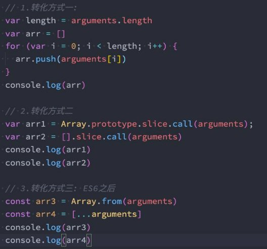
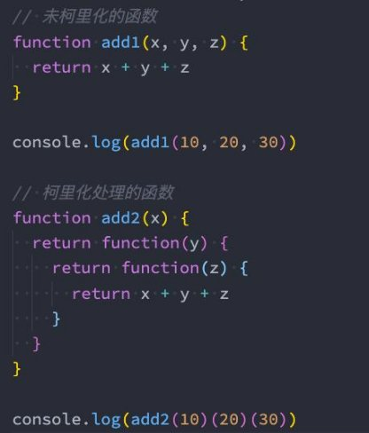
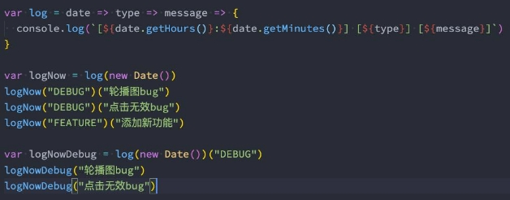
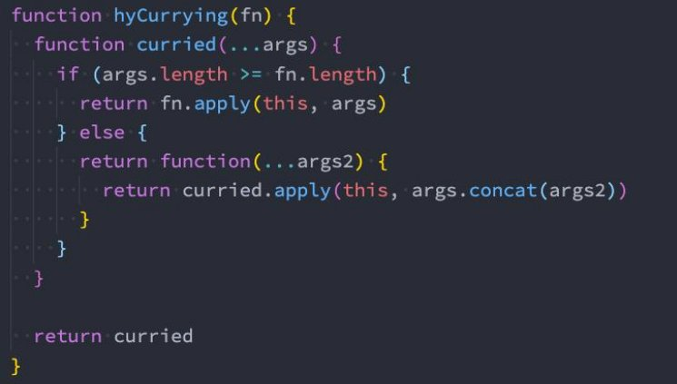
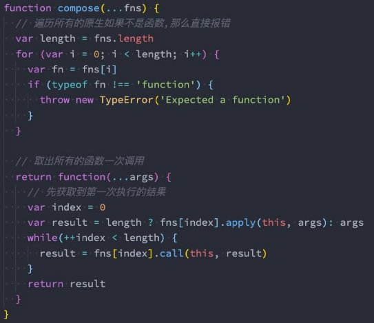
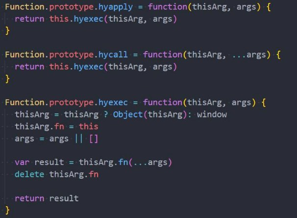

**JavaScript函数的增强知识 **

王红元 coderwhy

 

|**目录 content**|**1**|**函数属性和arguments**|
| :- | - | - |
||**2**|**纯函数的理解和应用**|
||**3**|**柯里化的理解和应用**|
||**4**|**组合函数理解和应用**|
||**5**|**with、eval的使用**|
||**6**|**严格模式的使用**|

**函数对象的属性**

- **我们知道JavaScript中函数也是一个对象，那么对象中就可以有属性和方法。**
- 属性name：一个函数的名词我们可以通过name来访问；

- 属性length：属性length用于返回函数参数的个数；
- 注意：rest参数是不参与参数的个数的；

**认识arguments**

- **arguments** 是一个 对应于 **传递给函数的参数** 的 **类数组(array-like)对象**。

- array-like意味着它不是一个数组类型，而是一个对象类型：
- 但是它却拥有数组的一些特性，比如说length，比如可以通过index索引来访问；
- 但是它却没有数组的一些方法，比如filter、map等；

**arguments转Array**

- **在开发中，我们经常需要将arguments转成Array，以便使用数组的一些特性。**
- 常见的转化方式如下 
- **转化方式一：** 
- 遍历arguments，添加到一个新数组中； 
- **转化方式二：较难理解（有点绕），了解即可** 
- 调用数组slice函数的call方法； 
- **转化方式三：ES6中的两个方法** 
- Array.from 
- […arguments] 

**箭头函数不绑定arguments**

- **箭头函数是不绑定arguments的，所以我们在箭头函数中使用arguments会去上层作用域查找：**

**函数的剩余（rest）参数**

- **ES6中引用了rest parameter，可以将不定数量的参数放入到一个数组中：**
- 如果最后一个参数是 ... 为前缀的，那么它会将剩余的参数放到该参数中，并且作为一个数组；

- **那么剩余参数和arguments有什么区别呢？**
- 剩余参数只包含那些没有对应形参的实参，而 arguments 对象包含了传给函数的所有实参；
- arguments对象不是一个真正的数组，而rest参数是一个真正的数组，可以进行数组的所有操作；
- arguments是早期的ECMAScript中为了方便去获取所有的参数提供的一个数据结构，而rest参数是ES6中提供并且希望以此 来替代arguments的；
- **剩余参数必须放到最后一个位置，否则会报错。**

**理解JavaScript纯函数**

- **函数式编程**中有一个非常重要的概念叫**纯函数**，JavaScript符合**函数式编程的范式**，所以也**有纯函数的概念**；
- 在**react开发中纯函数是被多次提及**的；
- 比如**react中组件就被要求像是一个纯函数**（为什么是像，因为还有class组件），**redux中有一个reducer的概念**，也是要求 必须是一个纯函数；
- 所以**掌握纯函数对于理解很多框架的设计**是非常有帮助的；
- **纯函数的维基百科定义：**
- 在程序设计中，若一个函数符合以下条件，那么这个函数被称为纯函数：
- 此函数在相同的输入值时，需产生相同的输出。
- 函数的输出和输入值以外的其他隐藏信息或状态无关，也和由I/O设备产生的外部输出无关。
- 该函数不能有语义上可观察的函数副作用，诸如“触发事件”，使输出设备输出，或更改输出值以外物件的内容等。
- **当然上面的定义会过于的晦涩，所以我简单总结一下：**
- 确定的输入，一定会产生确定的输出；
- 函数在执行过程中，不能产生副作用；

**副作用概念的理解**

- **那么这里又有一个概念，叫做副作用**，什么又是**副作用**呢？
- **副作用（side effect）**其实本身是医学的一个概念，比如我们经常说吃什么药本来是为了治病，可能会产生一些其他的副作 用；

- 在计算机科学中，也引用了副作用的概念，表示 比如修改了全局变量，修改参数或者改变外部的存储

在执行一个函数时，除了返回函数值

；

之外，还对调用函数产生了附加的影响，

- **纯函数在执行的过程中就是不能产生这样的副作用：**
- 副作用往往是产生bug的 “温床”。

**纯函数的案例**

- **我们来看一个对数组操作的两个函数：**
- slice：slice截取数组时不会对原数组进行任何操作,而是生成一个新的数组；
- splice：splice截取数组, 会返回一个新的数组, 也会对原数组进行修改；
- **slice就是一个纯函数，不会修改数组本身，而splice函数不是一个纯函数；**

**判断下面函数是否是纯函数？**

` ` 

**纯函数的作用和优势**

- **为什么纯函数在函数式编程中非常重要呢？**
- 因为你可以安心的编写和安心的使用；
- 你在**写的时候**保证了函数的纯度，只是单纯实现自己的业务逻辑即可，不需要关心传入的内容是如何获得的或者依赖其他的 外部变量是否已经发生了修改；
- 你在**用的时候**，你确定你的输入内容不会被任意篡改，并且自己确定的输入，一定会有确定的输出；
- React中就要求我们无论是**函数还是class声明一个组件**，这个组件都必须**像纯函数一样**，**保护它们的props不被修改：**

**柯里化概念的理解**

- **柯里化**也是属于**函数式编程**里面一个非常重要的概念。
  - 是一种关于函数的高阶技术；
  - 它不仅被用于 JavaScript，还被用于其他编程语言；
- **我们先来看一下维基百科的解释：**
- 在计算机科学中，**柯里化**（英语：Currying），又译为**卡瑞化**或**加里化**；
- 是把接收多个参数的函数，变成接受一个单一参数（最初函数的第一个参数）的函数，并且返回接受余下的参数，而且返回 结果的新函数的技术；

- 柯里化声称 “如果你固定某些参数，你将得到接受余下参数的一个函数”
- **维基百科的结束非常的抽象，我们这里做一个总结：**
- 只传递给函数一部分参数来调用它，让它返回一个函数去处理剩余的参数
- 这个过程就称之为柯里化；
- 柯里化是一种函数的转换，将一个函数从可调用的 f(a, b, c) 转换为可调用的
- 柯里化不会调用函数。它只是对函数进行转换。

；

；

f(a)(b)(c)。

**柯里化的代码转换**

- **那么柯里化到底是怎么样的表现呢？**

 

**柯里化优势一 - 函数的职责单一**

- **那么为什么需要有柯里化呢？**
- 在函数式编程中，我们其实往往希望一个函数处理的问题尽可能的单一，而不是将一大堆的处理过程交给一个函数来处理；
- 那么我们是否就可以将每次传入的参数在单一的函数中进行处理，处理完后在下一个函数中再使用处理后的结果；

- 比如上面的案例我们进行一个修改：
- 第一个参数 + 2
- 第二个参数 \* 2
- 第三个参数 \*\* 2

**传入的函数需要分别被进行如下处理**

**柯里化优势二 - 函数的参数服用**

- 另外一个使用柯里化的场景是可以帮助我们可以**复用参数逻辑**：
- makeAdder函数要求我们传入一个num（并且如果我们需要的话，可以在这里对num进行一些修改）；
- 在之后使用返回的函数时，我们不需要再继续传入num了；

**柯里化案例练习**

- **这里我们在演示一个案例，需求是打印一些日志：**
- 日志包括时间、类型、信息；
- 普通函数的实现方案如下：

**柯里化高级 - 自动柯里化函数**

- 目前我们有将多个普通的函数，转成柯里化函数：

**组合函数概念的理解**

- **组合（Compose）函数**是在JavaScript开发过程中一种对**函数的使用技巧、模式**：
- 比如我们现在需要对某一个数据进行函数的调用，执行两个函数fn1和fn2，这两个函数是依次执行的；
- 那么如果每次我们都需要进行两个函数的调用，操作上就会显得重复；
- 那么是否可以将这两个函数组合起来，自动依次调用呢？
- 这个过程就是对函数的组合，我们称之为 组合函数（Compose Function）；

` `

**实现组合函数**

- **刚才我们实现的compose函数比较简单**
- **我们需要考虑更加复杂的情况：比如传入了更多的函数，在调用compose函数时，传入了更多的参数：**

**with语句的使用**

- **with语句** 扩展一个语句的作用域链。

- 不建议使用with语句，因为它可能是混淆错误和兼容性问题的根源。

**eval函数**

- **内建函数 eval 允许执行一个代码字符串。**
- eval是一个特殊的函数，它可以将传入的字符串当做JavaScript代码来运行；
- eval会将最后一句执行语句的结果，作为返回值；

- **不建议在开发中使用eval：**
- eval代码的可读性非常的差（代码的可读性是高质量代码的重要原则）；
- eval是一个字符串，那么有可能在执行的过程中被刻意篡改，那么可能会造成被攻击的风险；
- eval的执行必须经过JavaScript解释器，不能被JavaScript引擎优化；

**认识严格模式**

- **JavaScript历史的局限性：**
- 长久以来，JavaScript 不断向前发展且并未带来任何兼容性问题；
- 新的特性被加入，旧的功能也没有改变，这么做有利于兼容旧代码；
- 但缺点是 JavaScript 创造者的任何错误或不完善的决定也将永远被保留在 JavaScript 语言中；
- 在ECMAScript5标准中，JavaScript提出了**严格模式的概念（Strict Mode）**：
  - 严格模式很好理解，是一种具有限制性的JavaScript模式，从而使代码隐式的脱离了 ”懒散（sloppy）模式“；
  - 支持严格模式的浏览器在检测到代码中有严格模式时，会以更加严格的方式对代码进行检测和执行；
- 严格模式对正常的JavaScript语义进行了一些限制：
- 严格模式通过 抛出错误 来消除一些原有的 静默（silent）错误；
- 严格模式让JS引擎在执行代码时可以进行更多的优化（不需要对一些特殊的语法进行处理）；
- 严格模式禁用了在ECMAScript未来版本中可能会定义的一些语法；

**开启严格模式**

- **那么如何开启严格模式呢？严格模式支持粒度话的迁移：**
- 可以支持在js文件中开启严格模式；
- 也支持对某一个函数开启严格模式；
- **严格模式通过在文件或者函数开头使用 use strict 来开启。**

 

- **没有类似于 "no use strict" 这样的指令可以使程序返回默认模式。**
- 现代 JavaScript 支持 “class” 和 “module” ，它们会自动启用 use strict；

**严格模式限制**

- **这里我们来说几个严格模式下的严格语法限制：**
- JavaScript被设计为新手开发者更容易上手，所以有时候本来错误语法，被认为也是可以正常被解析的；
- 但是这种方式可能给带来留下来安全隐患；
- 在严格模式下，这种失误就会被当做错误，以便可以快速的发现和修正；
- **1. 无法意外的创建全局变量**
- **2. 严格模式会使引起静默失败(silently fail,注:不报错也没有任何效果)的赋值操作抛出异常**
- **3. 严格模式下试图删除不可删除的属性**
- **4.严格模式不允许函数参数有相同的名称**
- **5. 不允许0的八进制语法**
- **6. 在严格模式下，不允许使用with**
- **7. 在严格模式下，eval不再为上层引用变量**
- **8. 严格模式下，this绑定不会默认转成对象**

**手写apply、call、bind函数实现（原型后）**

- **接下来我们来实现一下apply、call、bind函数：**
- 注意：我们的实现是练习函数、this、调用关系，不会过度考虑一些边界情况

 
