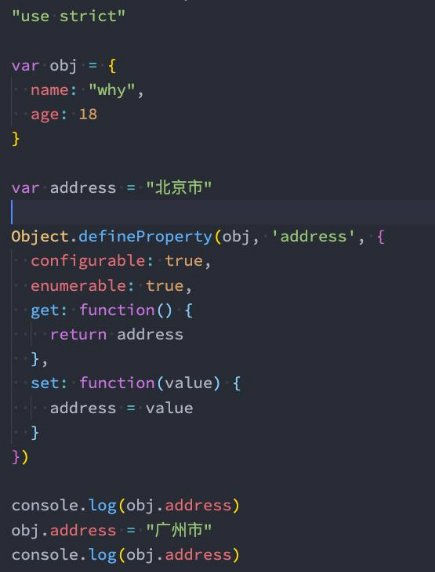

**JavaScript对象的增强知识 **

王红元 coderwhy

 

|
**目录 content**

|
1	 **Object.defineProperty**

2	 **数据属性描述符**

3	 **存取属性描述符**

4	 **Object.defineProperties**

5	 **对象的其他方法补充**
|
| :- | - |

**对属性操作的控制**

- 在前面我们的属性都是直接定义在对象内部，或者直接添加到对象内部的：
- 但是这样来做的时候我们就不能对这个属性进行一些限制：比如这个属性是否是可以通过delete删除的？这个属性是否在for- in遍历的时候被遍历出来呢？

- 如果我们想要对一个属性进行比较精准的操作控制
- 通过属性描述符可以精准的添加或修改对象的属性
- 属性描述符需要使用 Object.defineProperty

，那么我们就可以使用属性描述符。 ；

来对属性进行添加或者修改；

**Object.defineProperty**

- **Object.defineProperty()** 方法会直接在一个对象上定义一个新属性，或者修改一个对象的现有属性，并返回此对象。

- 可接收三个参数：
  - obj要定义属性的对象；
  - prop要定义或修改的属性的名称或 Symbol；
  - descriptor要定义或修改的属性描述符；
- 返回值：
- 被传递给函数的对象。

**数据属性描述符测试代码**

- 属性描述符的类型有两种：
- 数据属性（Data Properties）描述符（Descriptor）；
- 存取属性（Accessor访问器 Properties）描述符（Descriptor）；

- **数据数据描述符有如下四个特性：**
- [[Configurable]]：表示属性是否可以通过delete删除属性，是否可以修改它的特性，或者是否可以将它修改为存取属性描述符；
- 当我们直接在一个对象上定义某个属性时，这个属性的[[Configurable]]为true；
- 当我们通过属性描述符定义一个属性时，这个属性的[[Configurable]]默认为false；
- [[Enumerable]]：表示属性是否可以通过for-in或者Object.keys()返回该属性；
  - 当我们直接在一个对象上定义某个属性时，这个属性的[[Enumerable]]为true；
  - 当我们通过属性描述符定义一个属性时，这个属性的[[Enumerable]]默认为false；
- [[Writable]]：表示是否可以修改属性的值；
  - 当我们直接在一个对象上定义某个属性时，这个属性的[[Writable]]为true；
  - 当我们通过属性描述符定义一个属性时，这个属性的[[Writable]]默认为false；
- [[value]]：属性的value值，读取属性时会返回该值，修改属性时，会对其进行修改；
- 默认情况下这个值是undefined；

`  `

**存取属性描述符**

- **数据数据描述符有如下四个特性：**
- [[Configurable]]：表示属性是否可以通过delete删除属性，是否可以修改它的特性，或者是否可以将它修改为存取属性描述符；
- 和数据属性描述符是一致的；
- 当我们直接在一个对象上定义某个属性时，这个属性的[[Configurable]]为true；
- 当我们通过属性描述符定义一个属性时，这个属性的[[Configurable]]默认为false；
- [[Enumerable]]：表示属性是否可以通过for-in或者Object.keys()返回该属性；
  - 和数据属性描述符是一致的；
  - 当我们直接在一个对象上定义某个属性时，这个属性的[[Enumerable]]为true；
  - 当我们通过属性描述符定义一个属性时，这个属性的[[Enumerable]]默认为false；
- [[get]]：获取属性时会执行的函数。默认为undefined
- [[set]]：设置属性时会执行的函数。默认为undefined

**存储属性描述符测试代码**

**同时定义多个属性**

- **Object.defineProperties()** 方法直接在一个对象上定义 **多个** 新的属性或修改现有属性，并且返回该对象。

**对象方法补充**

- **获取对象的属性描述符：**
- getOwnPropertyDescriptor
- getOwnPropertyDescriptors
- **禁止对象扩展新属性：preventExtensions**
- 给一个对象添加新的属性会失败（在严格模式下会报错）；
- **密封对象，不允许配置和删除属性：seal**
- 实际是调用preventExtensions
- 并且将现有属性的configurable:false
- **冻结对象，不允许修改现有属性： freeze**
- 实际上是调用seal
- 并且将现有属性的writable: false
