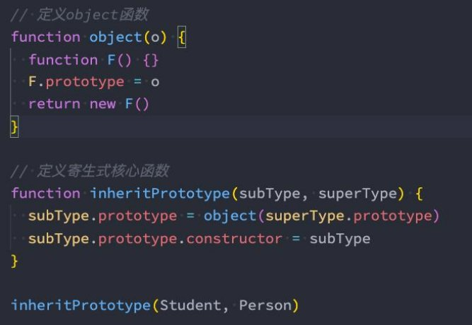

**JavaScript ES5中实现继承 **

王红元 coderwhy

 

|**目录 content**|**1**|**对象和函数的原型**|
| :- | - | - |
||**2**|**new、constructor**|
||**3**|**原型链的查找顺序**|
||**4**|**原型链实现的继承**|
||**5**|**借用构造函数继承**|
||**6**|**寄生组合实现继承**|

**认识对象的原型**

- **JavaScript当中每个对象都有一个特殊的内置属性**
- **那么这个对象有什么用呢？**
- 当我们通过引用对象的属性key来获取一个
- 这个操作会首先检查该对象是否有对应的属性
- 如果对象中没有改属性，那么会访问对象

**[[prototype]]，这个特殊的对象可以指向另外一个对象。**

value时，它会触发 [[Get]]的操作； ，如果有的话就使用它；

[[prototype]]内置属性指向的对象上的属性；

- 那么如果通过字面量直接创建一个对象，这个对象也会有这样的属性吗？如果有，应该如何获取这个属性呢？
  - 答案是有的，只要是对象都会有这样的一个内置属性；
- **获取的方式有两种：**
- 方式一：通过对象的 \_\_proto\_\_ 属性可以获取到（但是这个是早期浏览器自己添加的，存在一定的兼容性问题）；
- 方式二：通过 Object.getPrototypeOf 方法可以获取到；

**函数的原型 prototype**

- **那么我们知道上面的东西对于我们的构造函数创建对象来说有什么用呢？**
- 它的意义是非常重大的，接下来我们继续来探讨；
- **这里我们又要引入一个新的概念：所有的函数都有一个prototype的属性（注意：不是\_\_proto\_\_）**

- 你可能会问题，老师是不是因为函数是一个对象，所以它有prototype的属性呢？
- 不是的，因为它是一个函数，才有了这个特殊的属性；
- 而不是它是一个对象，所以有这个特殊的属性；

**再看new操作符**

- **我们前面讲过new关键字的步骤如下：**
- 1.在内存中创建一个新的对象（空对象）；
- 2.这个对象内部的[[prototype]]属性会被赋值为该构造函数的prototype属性；
- 那么也就意味着我们通过Person构造函数创建出来的所有对象的[[prototype]]属性都指向Person.prototype：

` `

**创建对象的内存表现**

|**function Person() {}**||
| - | :- |
|prototype||

|**Person函数的原型对象**||
| - | :- |
|constructor||
var p1 = new Person() var p2 = new Person()

|**p1对象**||
| - | :- |
|\_\_proto\_\_||

|**p2对象**||
| - | :- |
|\_\_proto\_\_||
**prototype添加属性**

|**function Person() {}**||
| - | :- |
|prototype||

|**Person函数的原型对象**||
| - | :- |
|constructor||
|name|why|
|age|18|

var p1 = new Person() var p2 = new Person()

|**p1对象**||
| - | :- |
|\_\_proto\_\_||
p1.name p1.age

|**p2对象**||
| - | :- |
|\_\_proto\_\_||

|
**function Person() {}**

**0x100**
||
| - | :- |
|name|“Person”|
|length|2|
|prototype|0xa00|

|
**Person显式原型对象**

**0xa00**
||
| - | :- |
|constructor|0x100|
|running|0xm00|

|**P1对象 0x200**||
| - | :- |
|[[Prototype]]|0xa00|
|name|“why”|
|age|18|

|**running函数 0xm00**||
| - | :- |
|name|“”|
|length|0|

|**P2对象 0x300**||
| - | :- |
|[[Prototype]]|0xa00|
|name|“kobe”|
|age|30|

**上课画图(新增属性)**

|
**function Person() {}**

**0x100**
||
| - | :- |
|name|“Person”|
|length|2|
|prototype|0xa00|

|
**Person显式原型对象**

**0xa00**
||
| - | :- |
|constructor|0x100|
|running|0xm00|
|address|中国|
|info|中国很美丽|

|**P1对象 0x200**||
| - | :- |
|[[Prototype]]|0xa00|
|name|“why”|
|age|18|
|height|1\.88|
|address|“广州市”|
|**P2对象 0x300**||
|[[Prototype]]|0xa00|
|name|“kobe”|
|age|30|
|isAdmin|true|

|**running函数 0xm00**||
| - | :- |
|name|“”|
|length|0|

p1 = new Person p2 = new Person

|
**function Person() {}**

**0x100**
||
| - | :- |
|name|“Person”|
|length|2|
|prototype|0xa00|

|
**Person显式原型对象**

**0xa00**
||
| - | :- |
|constructor|0x100|
|running|0xm00|

|**P1对象 0x200**||
| - | :- |
|[[Prototype]]|0xa00|
|name|“why”|
|age|18|

|**running函数 0xm00**||
| - | :- |
|name|“”|
|length|0|

|**P2对象 0x300**||
| - | :- |
|[[Prototype]]|0xa00|
|name|“kobe”|
|age|30|

**constructor属性**

- 事实上原型对象上面是有一个属性的：
- 默认情况下原型上都会添加一个属性叫做

constructor

constructor，这个constructor指向当前的函数对象；

**重写原型对象**

- 如果我们需要在原型上添加过多的属性，通常我们会重写整个原型对象：

- 前面我们说过, 每创建一个函数, 就会同时创建它的prototype对象, 这个对象也会自动获取constructor属性；
- 而我们这里相当于给prototype重新赋值了一个对象, 那么这个新对象的constructor属性, 会指向Object构造函数, 而不是 Person构造函数了

**原型对象的constructor**

- 如果希望constructor指向Person，那么可以手动添加：
- 上面的方式虽然可以, 但是也会造成constructor的[[Enumerable]]特性被设置了true.
- 默认情况下, 原生的constructor属性是不可枚举的.
- 如果希望解决这个问题, 就可以使用我们前面介绍的Object.defineProperty()函数了.

 

**创建对象 – 构造函数和原型组合**

- 我们在上一个构造函数的方式创建对象时，有一个弊端：会创建出重复的函数，比如running、eating这些函数
- 那么有没有办法让所有的对象去共享这些函数呢?
- 可以，将这些函数放到Person.prototype的对象上即可；

**面向对象的特性 – 继承**

- 面向对象有三大特性：封装、继承、多态
  - 封装：我们前面将属性和方法封装到一个类中，可以称之为封装的过程；
  - 继承：继承是面向对象中非常重要的，不仅仅可以减少重复代码的数量，也是多态前提（纯面向对象中）；
  - 多态：不同的对象在执行时表现出不同的形态；
- **那么这里我们核心讲继承。**
- **那么继承是做什么呢？**
- 继承可以帮助我们将重复的代码和逻辑抽取到父类中，子类只需要直接继承过来使用即可；
- 在很多编程语言中，继承也是多态的前提；
- **那么JavaScript当中如何实现继承呢？**
- 不着急，我们先来看一下JavaScript原型链的机制；
- 再利用原型链的机制实现一下继承；

**JavaScript原型链**

- **在真正实现继承之前，我们先来理解一个非常重要的概念：原型链。**
- 我们知道，从一个对象上获取属性，如果在当前对象中没有获取到就会去它的原型上面获取：

 

**Object的原型**

- 那么什么地方是原型链的尽头呢？比如第三个对象是否也是有原型\_\_proto\_\_属性呢？

- **我们会发现它打印的是 [Object: null prototype] {}**
- 事实上这个原型就是我们最顶层的原型了
- 从Object直接创建出来的对象的原型都是 [Object: null prototype] {}。
- **那么我们可能会问题： [Object: null prototype] {} 原型有什么特殊吗？**
- 特殊一：该对象有原型属性，但是它的原型属性已经指向的是null，也就是已经是顶层原型了；
- 特殊二：该对象上有很多默认的属性和方法；

**创建Object对象的内存图**

**原型链关系的内存图**

**Object是所有类的父类**

- **从我们上面的Object原型我们可以得出一个结论：原型链最顶层的原型对象就是Object的原型对象**

 

**通过原型链实现继承**

- **如果我们现在需要实现继承，那么就可以利用原型链来实现了：**
- 目前stu的原型是p对象，而p对象的原型是Person默认的原型，里面包含running等函数；
- 注意：步骤4和步骤5不可以调整顺序，否则会有问题

` `

**继承创建对象的内存图**

**原型链继承的弊端**

- **但是目前有一个很大的弊端：某些属性其实是保存在p对象上的；**
- 第一，我们通过直接打印对象是看不到这个属性的；
- 第二，这个属性会被多个对象共享，如果这个对象是一个引用类型，那么就会造成问题；
- 第三，不能给Person传递参数（让每个stu有自己的属性），因为这个对象是一次性创建的（没办法定制化）；

**借用构造函数继承**

- **为了解决原型链继承中存在的问题，开发人员提供了一种新的技术 为经典继承或者称之为伪造对象)：**
- steal是偷窃、剽窃的意思，但是这里可以翻译成借用；
- **借用继承的做法非常简单：在子类型构造函数的内部调用父类型构造函数**
- 因为函数可以在任意的时刻被调用；
- 因此通过apply()和call()方法也可以在新创建的对象上执行构造函数；

**: constructor stealing( .**

**有很多名称: 借用构造函数或者称之**

**组合借用继承的问题**

- **组合继承是JavaScript最常用的继承模式之一：**
- 如果你理解到这里, 点到为止, 那么组合来实现继承只能说问题不大；
- 但是它依然不是很完美，但是基本已经没有问题了；
- **组合继承存在什么问题呢?**
- 组合继承最大的问题就是无论在什么情况下，都会调用两次父类构造函数。
  - 一次在创建子类原型的时候；
  - 另一次在子类构造函数内部(也就是每次创建子类实例的时候)；
- 另外，如果你仔细按照我的流程走了上面的每一个步骤，你会发现：所有的子类实例事实上会拥有两份父类的属性
- 一份在当前的实例自己里面(也就是person本身的)，另一份在子类对应的原型对象中(也就是person.\_\_proto\_\_里面)；
- 当然，这两份属性我们无需担心访问出现问题，因为默认一定是访问实例本身这一部分的；

**原型式继承函数**

- **原型式继承的渊源**
- 这种模式要从道格拉斯·克罗克福德（Douglas Crockford，著名的前端大师，JSON的创立者）在2006年写的一篇文章说起: Prototypal Inheritance in JavaScript(在JavaScript中使用原型式继承)
- 在这篇文章中，它介绍了一种继承方法，而且这种继承方法不是通过构造函数来实现的.
- 为了理解这种方式，我们先再次回顾一下JavaScript想实现继承的目的：重复利用另外一个对象的属性和方法.
- **最终的目的：student对象的原型指向了person对象；**

  

**寄生式继承函数**

- **寄生式(Parasitic)继承**
- 寄生式(Parasitic)继承是与原型式继承紧密相关的一种思想, 并且同样由道格拉斯·克罗克福德(Douglas Crockford)提出和推 广的；
- 寄生式继承的思路是结合原型类继承和工厂模式的一种方式；
- 即创建一个封装继承过程的函数, 该函数在内部以某种方式来增强对象，最后再将这个对象返回；

` `

**寄生组合式继承**

- **现在我们来回顾一下之前提出的比较理想的组合继承**
- 组合继承是比较理想的继承方式, 但是存在两个问题:
- 问题一: 构造函数会被调用两次: 一次在创建子类型原型对象的时候, 一次在创建子类型实例的时候.
- 问题二: 父类型中的属性会有两份: 一份在原型对象中, 一份在子类型实例中.
- **事实上, 我们现在可以利用寄生式继承将这两个问题给解决掉.**
- 你需要先明确一点: 当我们在子类型的构造函数中调用父类型.call(this, 参数)这个函数的时候, 就会将父类型中的属性和方法复 制一份到了子类型中. 所以父类型本身里面的内容, 我们不再需要.
- 这个时候, 我们还需要获取到一份父类型的原型对象中的属性和方法.
- 能不能直接让子类型的原型对象 = 父类型的原型对象呢?
- 不要这么做, 因为这么做意味着以后修改了子类型原型对象的某个引用类型的时候, 父类型原生对象的引用类型也会被修改.
- 我们使用前面的寄生式思想就可以了.

**寄生组合继承的代码**

**对象的方法补充**

- **hasOwnProperty**
- 对象是否有某一个属于自己的属性（不是在原型上的属性）
- **in/for in 操作符**
- 判断某个属性是否在某个对象或者对象的原型上
- **instanceof**
- 用于检测构造函数（Person、Student类）的pototype，是否出现在某个实例对象的原型链上
- **isPrototypeOf**
- 用于检测某个对象，是否出现在某个实例对象的原型链上

**原型继承关系**

 

**认识class定义类**

- 我们会发现，按照前面的构造函数形式创建 **类**，不仅仅和编写普通的函数过于相似，而且代码并不容易理解。
  - 在ES6（ECMAScript2015）新的标准中使用了class关键字来直接定义类；
  - 但是类本质上依然是前面所讲的构造函数、原型链的语法糖而已；
  - 所以学好了前面的构造函数、原型链更有利于我们理解类的概念和继承关系；
- 那么，如何使用class来定义一个类呢？
- 可以使用两种方式来声明类：类声明和类表达式；

**类和构造函数的异同**

- 我们来研究一下类的一些特性：
- 你会发现它和我们的构造函数的特性其实是一致的；

**类的构造函数**

- 如果我们希望在创建对象的时候给类传递一些参数，这个时候应该如何做呢？
  - 每个类都可以有一个自己的构造函数（方法），这个方法的名称是固定的constructor；
  - 当我们通过new操作符，操作一个类的时候会调用这个类的构造函数constructor；
  - 每个类只能有一个构造函数，如果包含多个构造函数，那么会抛出异常；
- 当我们通过new关键字操作类的时候，会调用这个constructor函数，并且执行如下操作：
- 1.在内存中创建一个新的对象（空对象）；
- 2.这个对象内部的[[prototype]]属性会被赋值为该类的prototype属性；
- 3.构造函数内部的this，会指向创建出来的新对象；
- 4.执行构造函数的内部代码（函数体代码）；
- 5.如果构造函数没有返回非空对象，则返回创建出来的新对象；

**类的实例方法**

- 在上面我们定义的属性都是直接放到了this上，也就意味着它是放到了创建出来的新对象中：
- 在前面我们说过对于实例的方法，我们是希望放到原型上的，这样可以被多个实例来共享；
- 这个时候我们可以直接在类中定义；

**类的访问器方法**

- 我们之前讲对象的属性描述符时有讲过对象可以添加setter和getter函数的，那么类也是可以的：

**类的静态方法**

- 静态方法通常用于定义直接使用类来执行的方法，不需要有类的实例，使用static关键字来定义：

**ES6类的继承 - extends**

- 前面我们花了很大的篇幅讨论了在ES5中实现继承的方案，虽然最终实现了相对满意的继承机制，但是过程却依然是非常繁琐的。
- 在ES6中新增了使用extends关键字，可以方便的帮助我们实现继承：

**super关键字**

- 我们会发现在上面的代码中我使用了一个super关键字，这个super关键字有不同的使用方式：
- 注意：在子（派生）类的构造函数中使用this或者返回默认对象之前，必须先通过super调用父类的构造函数！
- super的使用位置有三个：子类的构造函数、实例方法、静态方法；

**继承内置类**

- 我们也可以让我们的类继承自内置类，比如Array：

**类的混入mixin**

- JavaScript的类只支持单继承：也就是只能有一个父类
- 那么在开发中我们我们需要在一个类中添加更多相似的功能时，应该如何来做呢？
- 这个时候我们可以使用混入（mixin）；

 
