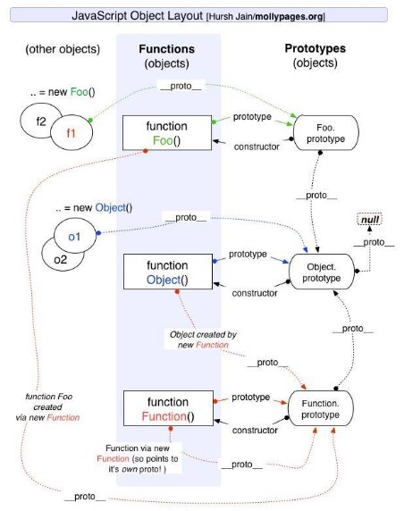
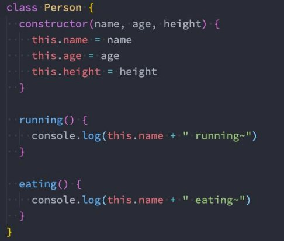
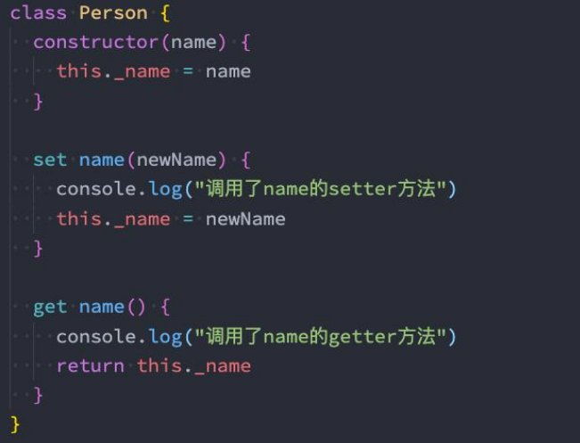

**JavaScript ES6实现继承 **

王红元 coderwhy

 

|**目录 content**|**1**|**对象的方法补充**|
| :- | - | - |
||**2**|**原型继承关系图**|
||**3**|**class方式定义类**|
||**4**|**extends实现继承**|
||**5**|**extends实现继承**|
||**6**|**多态概念的理解**|

**对象的方法补充**

- **hasOwnProperty**
- 对象是否有某一个属于自己的属性（不是在原型上的属性）
- **in/for in 操作符**
- 判断某个属性是否在某个对象或者对象的原型上
- **instanceof**
- 用于检测构造函数（Person、Student类）的pototype，是否出现在某个实例对象的原型链上
- **isPrototypeOf**
- 用于检测某个对象，是否出现在某个实例对象的原型链上

**原型继承关系**

 

**认识class定义类**

- 我们会发现，按照前面的构造函数形式创建 **类**，不仅仅和编写普通的函数过于相似，而且代码并不容易理解。
  - 在ES6（ECMAScript2015）新的标准中使用了class关键字来直接定义类；
  - 但是类本质上依然是前面所讲的构造函数、原型链的语法糖而已；
  - 所以学好了前面的构造函数、原型链更有利于我们理解类的概念和继承关系；
- 那么，如何使用class来定义一个类呢？
- 可以使用两种方式来声明类：类声明和类表达式；

**类和构造函数的异同**

- 我们来研究一下类的一些特性：
- 你会发现它和我们的构造函数的特性其实是一致的；

**类的构造函数**

- 如果我们希望在创建对象的时候给类传递一些参数，这个时候应该如何做呢？
  - 每个类都可以有一个自己的构造函数（方法），这个方法的名称是固定的constructor；
  - 当我们通过new操作符，操作一个类的时候会调用这个类的构造函数constructor；
  - 每个类只能有一个构造函数，如果包含多个构造函数，那么会抛出异常；
- 当我们通过new关键字操作类的时候，会调用这个constructor函数，并且执行如下操作：
- 1.在内存中创建一个新的对象（空对象）；
- 2.这个对象内部的[[prototype]]属性会被赋值为该类的prototype属性；
- 3.构造函数内部的this，会指向创建出来的新对象；
- 4.执行构造函数的内部代码（函数体代码）；
- 5.如果构造函数没有返回非空对象，则返回创建出来的新对象；

**类的实例方法**

- 在上面我们定义的属性都是直接放到了this上，也就意味着它是放到了创建出来的新对象中：
- 在前面我们说过对于实例的方法，我们是希望放到原型上的，这样可以被多个实例来共享；
- 这个时候我们可以直接在类中定义；

**类的访问器方法**

- 我们之前讲对象的属性描述符时有讲过对象可以添加setter和getter函数的，那么类也是可以的：

**类的静态方法**

- 静态方法通常用于定义直接使用类来执行的方法，不需要有类的实例，使用static关键字来定义：

**ES6类的继承 - extends**

- 前面我们花了很大的篇幅讨论了在ES5中实现继承的方案，虽然最终实现了相对满意的继承机制，但是过程却依然是非常繁琐的。
- 在ES6中新增了使用extends关键字，可以方便的帮助我们实现继承：

**super关键字**

- 我们会发现在上面的代码中我使用了一个super关键字，这个super关键字有不同的使用方式：
- 注意：在子（派生）类的构造函数中使用this或者返回默认对象之前，必须先通过super调用父类的构造函数！
- super的使用位置有三个：子类的构造函数、实例方法、静态方法；

**继承内置类**

- 我们也可以让我们的类继承自内置类，比如Array：

**JavaScript中的多态**

- 面向对象的三大特性：封装、继承、多态。
  - 前面两个我们都已经详细解析过了，接下来我们讨论一下JavaScript的多态。
- JavaScript有多态吗？
- 维基百科对多态的定义：**多态**（英语：polymorphism）指为不同数据类型的实体提供统一的接口，或使用一个单一的符号 来表示多个不同的类型。
- 非常的抽象，个人的总结：不同的数据类型进行同一个操作，表现出不同的行为，就是多态的体现。
- 那么从上面的定义来看，JavaScript是一定存在多态的。

