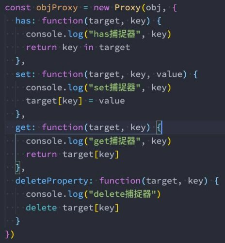
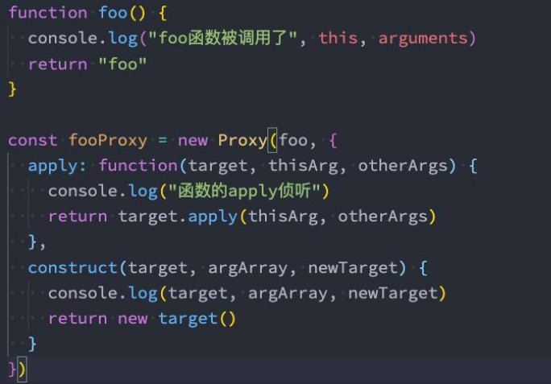
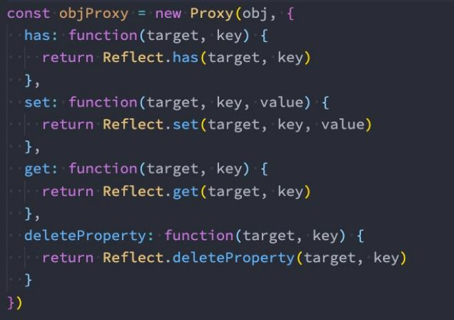
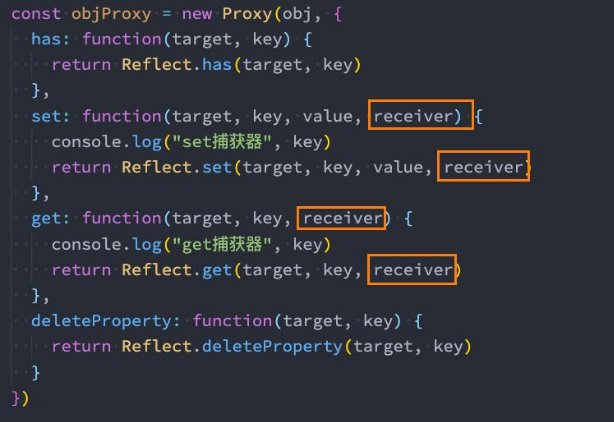
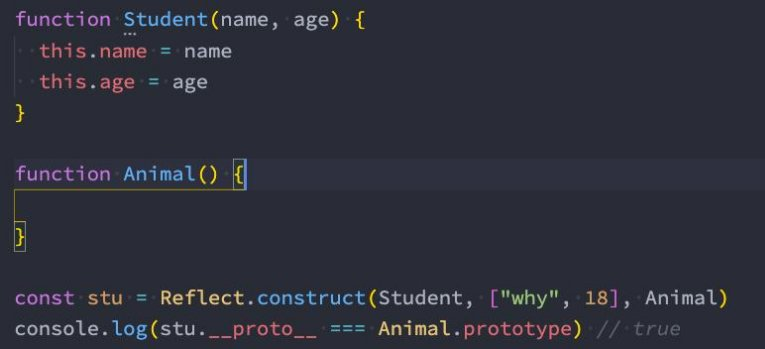

**Proxy-Reflect使用详解 **

王红元 coderwhy

 

|**目录 content**|**1**|**监听对象的操作**|
| :- | - | - |
||**2**|**Proxy类基本使用**|
||**3**|**Proxy常见捕获器**|
||**4**|**Reflect介绍和作用**|
||**5**|**Reflect的基本使用**|
||**6**|**Reflect的receiver**|

**监听对象的操作**

- **我们先来看一个需求：有一个对象，我们希望监听这个对象中的属性被设置或获取的过程**
- 通过我们前面所学的知识，能不能做到这一点呢？
- 其实是可以的，我们可以通过之前的属性描述符中的存储属性描述符来做到；
- **左边这段代码就利用了前面讲过的 Object.defineProperty 的存储属性描述符来 对属性的操作进行监听。 **
- **但是这样做有什么缺点呢？** 
- 首先，Object.defineProperty设计的初衷，不是为了去监听截止一个对象中 所有的属性的。 
- 我们在定义某些属性的时候，初衷其实是定义普通的属性，但是后面我们强 行将它变成了数据属性描述符。 
- 其次，如果我们想监听更加丰富的操作，比如新增属性、删除属性，那么 Object.defineProperty是无能为力的。 
- 所以我们要知道，存储数据描述符设计的初衷并不是为了去监听一个完整的对象。 

**Proxy基本使用**

- **在ES6中，新增了一个Proxy类，这个类从名字就可以看出来，是用于帮助我们创建一个代理的：**
- 也就是说，如果我们希望监听一个对象的相关操作，那么我们可以先创建一个代理对象（Proxy对象）；
- 之后对该对象的所有操作，都通过代理对象来完成，代理对象可以监听我们想要对原对象进行哪些操作；
- **我们可以将上面的案例用Proxy来实现一次：**
- 首先，我们需要new Proxy对象，并且传入需要侦听的对象以及一个处理对象，可以称之为handler；
  - const p = new Proxy(target, handler)
- 其次，我们之后的操作都是直接对Proxy的操作，而不是原有的对象，因为我们需要在handler里面进行侦听；

**Proxy的set和get捕获器**

- **如果我们想要侦听某些具体的操作，那么就可以在**
- **set和get分别对应的是函数类型；**
- set函数有四个参数：
  - target：目标对象（侦听的对象）；
  - property：将被设置的属性key；
  - value：新属性值；
  - receiver：调用的代理对象；
- get函数有三个参数：
- target：目标对象（侦听的对象）；
- property：被获取的属性key；
- receiver：调用的代理对象；

**handler中添加对应的捕捉器（Trap）：**

**Proxy所有捕获器**

- **13个活捉器分别是做什么的呢？**
- handler.getPrototypeOf()
  - Object.getPrototypeOf 方法的捕捉器。
- handler.setPrototypeOf()
  - Object.setPrototypeOf 方法的捕捉器。
- handler.isExtensible()
  - Object.isExtensible 方法的捕捉器(判断是否可以新增属性
- handler.preventExtensions()
  - Object.preventExtensions 方法的捕捉器。
- handler.getOwnPropertyDescriptor()
  - Object.getOwnPropertyDescriptor 方法的捕捉器。
- handler.ownKeys()
- Object.getOwnPropertyNames 方法和 Object.getOwnPropertySymbols 方法的捕捉器。
- **handler.has()**
- in 操作符的捕捉器。
- **handler.get()**
- 属性读取操作的捕捉器。
- **handler.set()**

)。

- 属性设置操作的捕捉器。
- **handler.deleteProperty()**
  - delete 操作符的捕捉器。
- handler.apply()
  - 函数调用操作的捕捉器。

- handler.defineProperty()
- Object.defineProperty
- handler.construct()
- new 操作符的捕捉器。

方法的捕捉器。

**Proxy的construct和apply**

- **当然，我们还会看到捕捉器中还有construct和apply，它们是应用于函数对象的：**

**Reflect的作用**

- **Reflect也是ES6新增的一个API，它是一个对象，字面的意思是反射。**
- **那么这个Reflect有什么用呢？**
- 它主要提供了很多操作JavaScript对象的方法，有点像Object中操作对象的方法；
- 比如Reflect.getPrototypeOf(target)类似于 Object.getPrototypeOf()；
- 比如Reflect.defineProperty(target, propertyKey, attributes)类似于Object.defineProperty() ；
- **如果我们有Object可以做这些操作，那么为什么还需要有Reflect这样的新增对象呢？**
- 这是因为在早期的ECMA规范中没有考虑到这种对 **对象本身** 的操作如何设计会更加规范，所以将这些API放到了Object上面；
- 但是Object作为一个构造函数，这些操作实际上放到它身上并不合适；
- 另外还包含一些类似于 in、delete操作符，让JS看起来是会有一些奇怪的；
- 所以在ES6中新增了Reflect，让我们这些操作都集中到了Reflect对象上；
- 另外在使用Proxy时，可以做到不操作原对象；
- **那么Object和Reflect对象之间的API关系，可以参考MDN文档：**
- [https://developer.mozilla.org/zh - CN/docs/Web/JavaScript/Reference/Global_Objects/Reflect/Comparing_Reflect_and_Object_methods](https://developer.mozilla.org/zh-CN/docs/Web/JavaScript/Reference/Global_Objects/Reflect/Comparing_Reflect_and_Object_methods)

**Reflect的常见方法**

- **Reflect中有哪些常见的方法呢？它和Proxy是一一对应的，也是13个：**◼ Reflect.ownKeys(target)
  - 返回一个包含所有自身属性（不包含继承属性）的数组。(类似于
- Reflect.getPrototypeOf(target)

Object.keys(), 但不会受enumerable影响).

- 类似于 Object.getPrototypeOf()。
  - Reflect.has(target, propertyKey)
- Reflect.setPrototypeOf(target, prototype)
  - 判断一个对象是否存在某个属性，和 in 运算符 的功能完全相同。
- 设置对象原型的函数. 返回一个 Boolean， 如果更新成功，则返回
- Reflect.get(target, propertyKey[, receiver])

true。

- 获取对象身上某个属性的值，类似于 target[name]。
- Reflect.isExtensible(target)
  - Reflect.set(target, propertyKey, value[, receiver])
- 类似于 Object.isExtensible()
  - 将值分配给属性的函数。返回一个Boolean，如果更新成功，则返回true。
- Reflect.preventExtensions(target)
  - Reflect.deleteProperty(target, propertyKey)
- 类似于 Object.preventExtensions()。返回一个Boolean。
  - 作为函数的delete操作符，相当于执行 delete target[name]。
- Reflect.getOwnPropertyDescriptor(target, propertyKey)
  - Reflect.apply(target, thisArgument, argumentsList)
- 类似于 Object.getOwnPropertyDescriptor()。如果对象中存在 p 对一个函数进行调用操作，同时可以传入一个数组作为调用参数。和 该属性，则返回对应的属性描述符, 否则返回 undefined. Function.prototype.apply() 功能类似。
- Reflect.defineProperty(target, propertyKey, attributes) ◼ Reflect.construct(target, argumentsList[, newTarget])
- 和 Object.defineProperty() 类似。如果设置成功就会返回 true p 对构造函数进行 new 操作，相当于执行 new target(...args)。
- **那么我们可以将之前Proxy案例中对原对象的操作，都修改为Reflect来操作：**

**Receiver的作用**

- **我们发现在使用getter、setter的时候有一个receiver的参数，它的作用是什么呢？**
- 如果我们的源对象（obj）有setter、getter的访问器属性，那么可以通过receiver来改变里面的this；
- **我们来看这样的一个对象：**

**Reflect的construct**

