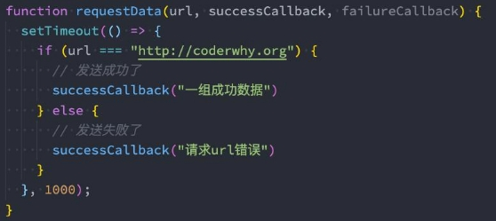
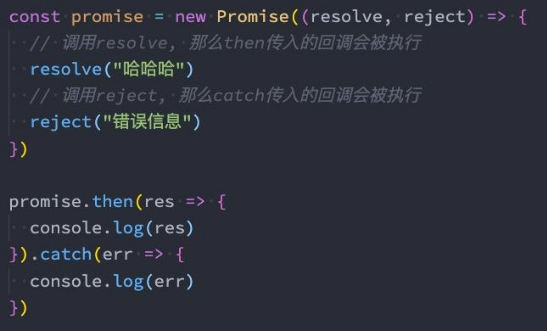
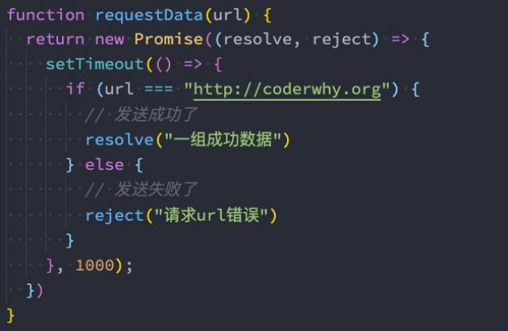
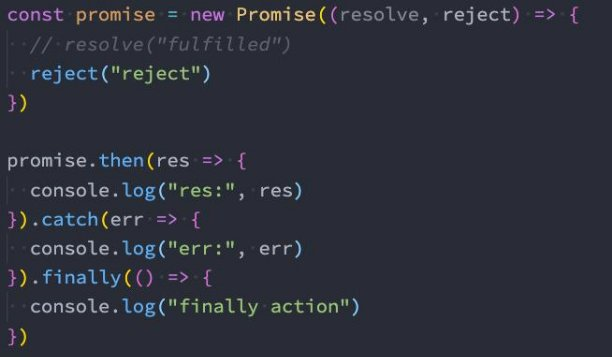

**Promise使用详解 **

王红元 coderwhy

|**目录 content**|**1**|**异步代码的困境**|
| :- | - | - |
||**2**|**认识Promise作用**|
||**3**|**Promise基本使用**|
||**4**|**Promise状态变化**|
||**5**|**Promise实例方法**|
||**6**|**Promise的类方法**|

**异步任务的处理**

- **在ES6出来之后，有很多关于Promise的讲解、文章，也有很多经典的书籍讲解Promise**
- 虽然等你学会Promise之后，会觉得Promise不过如此；
- 但是在初次接触的时候都会觉得这个东西不好理解；
- **那么这里我从一个实际的例子来作为切入点：**
- 我们调用一个函数，这个函数中发送网络请求（我们可以用定时器来模拟）；
- 如果发送网络请求成功了，那么告知调用者发送成功，并且将相关数据返回过去；
- 如果发送网络请求失败了，那么告知调用者发送失败，并且告知错误信息；

` `

**什么是Promise呢？**

- **在上面的解决方案中，我们确确实实可以解决请求函数得到结果之后，获取到对应的回调，但是它存在两个主要的问题：**
- 第一，我们需要自己来设计回调函数、回调函数的名称、回调函数的使用等；
- 第二，对于不同的人、不同的框架设计出来的方案是不同的，那么我们必须耐心去看别人的源码或者文档，以便可以理解它 这个函数到底怎么用；
- **我们来看一下Promise的API是怎么样的：**
- Promise是一个类，可以翻译成 承诺、许诺 、期约；
- 当我们需要的时候，给予调用者一个承诺：待会儿我会给你回调数据时，就可以创建一个Promise的对象；
- 在通过new创建Promise对象时，我们需要传入一个回调函数，我们称之为executor
- 这个回调函数会被立即执行，并且给传入另外两个回调函数resolve、reject；
- 当我们调用resolve回调函数时，会执行Promise对象的then方法传入的回调函数；
- 当我们调用reject回调函数时，会执行Promise对象的catch方法传入的回调函数；

**Promise的代码结构**

- **我们来看一下Promise代码结构：**
- **上面Promise使用过程，我们可以将它划分成三个状态： **
- 待定（pending）: 初始状态，既没有被兑现，也没有被拒绝； 
  - 当执行executor中的代码时，处于该状态； 
- 已兑现（fulfilled）: 意味着操作成功完成； 
  - 执行了resolve时，处于该状态，Promise已经被兑现； 
- 已拒绝（rejected）: 意味着操作失败； 
- 执行了reject时，处于该状态，Promise已经被拒绝； 

**Promise重构请求**

- **那么有了Promise，我们就可以将之前的代码进行重构了：**

**Executor**

- **Executor是在创建Promise时需要传入的一个回调函数，这个回调函数会被立即执行，并且传入两个参数：**

- **通常我们会在Executor中确定我们的Promise状态：**
- 通过resolve，可以兑现（fulfilled）Promise的状态，我们也可以称之为已决议（resolved）；
- 通过reject，可以拒绝（reject）Promise的状态；
- **这里需要注意：一旦状态被确定下来，Promise的状态会被 锁死，该Promise的状态是不可更改的**
- 在我们调用resolve的时候，如果resolve传入的值本身不是一个Promise，那么会将该Promise的状态变成 兑现（fulfilled）；
- 在之后我们去调用reject时，已经不会有任何的响应了（并不是这行代码不会执行，而是无法改变Promise状态）；

**resolve不同值的区别**

- **情况一：如果resolve传入一个普通的值或者对象，那么这个值会作为then回调的参数；**
- **情况二：如果resolve中传入的是另外一个Promise，那么这个新Promise会决定原Promise的状态：**
- **情况三：如果resolve中传入的是一个对象，并且这个对象有实现then方法，那么会执行该then方法，并且根据then方法的结 果来决定Promise的状态：**

` ` 

**then方法 – 接受两个参数**

- **then方法是Promise对象上的一个方法（实例方法）：**
- 它其实是放在Promise的原型上的 Promise.prototype.then
- **then方法接受两个参数：**
- fulfilled的回调函数：当状态变成fulfilled时会回调的函数；
- reject的回调函数：当状态变成reject时会回调的函数；

**then方法 – 多次调用**

- **一个Promise的then方法是可以被多次调用的：**
- 每次调用我们都可以传入对应的fulfilled回调；
- 当Promise的状态变成fulfilled的时候，这些回调函数都会被执行；

**then方法 – 返回值**

- **then方法本身是有返回值的，它的返回值是一个Promise，所以我们可以进行如下的链式调用：**
- 但是then方法返回的Promise到底处于什么样的状态呢？
- **Promise有三种状态，那么这个Promise处于什么状态呢？**
- 当then方法中的回调函数本身在执行的时候，那么它处于pending状态；
- 当then方法中的回调函数返回一个结果时，那么它处于fulfilled状态，并且会将结果作为resolve的参数；
  - 情况一：返回一个普通的值；
  - 情况二：返回一个Promise；
  - 情况三：返回一个thenable值；
- 当then方法抛出一个异常时，那么它处于reject状态；

**catch方法 – 多次调用**

- **catch方法也是Promise对象上的一个方法（实例方法）：**
- 它也是放在Promise的原型上的 Promise.prototype.catch
- **一个Promise的catch方法是可以被多次调用的：**
- 每次调用我们都可以传入对应的reject回调；
- 当Promise的状态变成reject的时候，这些回调函数都会被执行；

**catch方法 – 返回值**

- **事实上catch方法也是会返回一个Promise对象的，所以catch方法后面我们**
- 下面的代码，后续是catch中的err2打印，还是then中的res打印呢？
- 答案是res打印，这是因为catch传入的回调在执行完后，默认状态依然会是

- **那么如果我们希望后续继续执行catch，那么需要抛出一个异常：**

**可以继续调用then方法或者catch方法：**

fulfilled的；

**finally方法**

- **finally是在ES9（ES2018）中新增的一个特性：表示无论Promise对象无论变成fulfilled还是rejected状态，最终都会被执行 的代码。**
- **finally方法是不接收参数的，因为无论前面是fulfilled状态，还是rejected状态，它都会执行。**

**resolve方法**

- **前面我们学习的then、catch、finally方法都属于Promise的实例方法，都是存放在Promise的prototype上的。**
- 下面我们再来学习一下Promise的类方法。
- **有时候我们已经有一个现成的内容了，希望将其转成Promise来使用，这个时候我们可以使用 Promise.resolve 方法来完成。**
- Promise.resolve的用法相当于new Promise，并且执行resolve操作：

- **resolve参数的形态：**
- 情况一：参数是一个普通的值或者对象
- 情况二：参数本身是Promise
- 情况三：参数是一个thenable

**reject方法**

- **reject方法类似于**
- **Promise.reject**

**resolve方法，只是会将Promise对象的状态设置为 的用法相当于new Promise，只是会调用reject：**

**reject状态。**

- **Promise.reject传入的参数无论是什么形态，都会直接作为reject状态的参数传递到catch的。**

**all方法**

- **另外一个类方法是Promise.all：**
- 它的作用是将多个Promise包裹在一起形成一个新的Promise；
- 新的Promise状态由包裹的所有Promise共同决定：
- 当所有的Promise状态变成fulfilled状态时，新的Promise状态为fulfilled，并且会将所有Promise的返回值组成一个数组；
- 当有一个Promise状态为reject时，新的Promise状态为reject，并且会将第一个reject的返回值作为参数；

 

**allSettled方法**

- **all方法有一个缺陷：当有其中一个Promise变成reject状态时，新Promise就会立即变成对应的reject状态。**
- 那么对于resolved的，以及依然处于pending状态的Promise，我们是获取不到对应的结果的；

- **在ES11（ES2020）中，添加了新的API Promise.allSettled**
- 该方法会在所有的Promise都有结果（settled），无论是
- 并且这个Promise的结果一定是fulfilled的；

**：**

fulfilled，还是rejected时，才会有最终的状态；

- **我们来看一下打印的结果：**
- allSettled的结果是一个数组，数组中存放着每一个Promise的结果，并且是对应一个对象的；
- 这个对象中包含status状态，以及对应的value值；

**race方法**

- **如果有一个Promise有了结果，我们就希望决定最终新Promise的状态，那么可以使用race方法：**
- race是竞技、竞赛的意思，表示多个Promise相互竞争，谁先有结果，那么就使用谁的结果；

**any方法**

- **any方法是ES12中新增的方法，和race方法是类似的：**
- any方法会等到一个fulfilled状态，才会决定新Promise的状态；
- 如果所有的Promise都是reject的，那么也会等到所有的Promise都变成rejected状态；

- **如果所有的Promise都是reject的，那么会报一个AggregateError的错误。**
