**Iterator-Generator详解 **

王红元 coderwhy

 

|**目录 content**|**1**|**迭代器可迭代对象**|
| :- | - | - |
||**2**|**原生的迭代器对象**|
||**3**|**自定义类的迭代器**|
||**4**|**生成器理解和作用**|
||**5**|**自定义生成器方案**|
||**6**|**异步处理方案解析**|

**什么是迭代器？**

- **迭代器**（iterator），使用户
- 其行为像数据库中的光标
- 在各种编程语言的实现中，

**在容器对象（container，例如链表或数组）上遍访的对象** ，迭代器最早出现在1974年设计的CLU编程语言中；

迭代器的实现方式各不相同，但是基本都有迭代器，比如

，使用该接口无需关心对象的内部实现细节。

Java、Python等；

- **从迭代器的定义我们可以看出来，迭代器是帮助我们对某个数据结构进行遍历的对象。**
- **在JavaScript中，迭代器也是一个具体的对象，这个对象需要符合迭代器协议（iterator protocol）：**
- 迭代器协议定义了产生一系列值（无论是有限还是无限个）的标准方式；
- 在JavaScript中这个标准就是一个特定的next方法；
- **next方法有如下的要求：**
- 一个无参数或者一个参数的函数，返回一个应当拥有以下两个属性的对象：
- done（boolean）
  - 如果迭代器可以产生序列中的下一个值，则为 false。（这等价于没有指定 done 这个属性。）
  - 如果迭代器已将序列迭代完毕，则为 true。这种情况下，value 是可选的，如果它依然存在，即为迭代结束之后的默认返回值。
- value
- 迭代器返回的任何 JavaScript 值。done 为 true 时可省略。

**迭代器的代码练习**

` `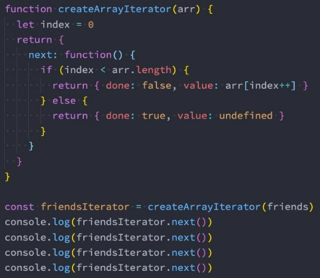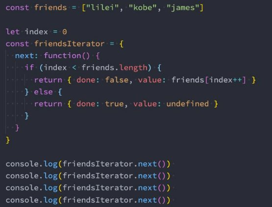

**可迭代对象**

- **但是上面的代码整体来说看起来是有点奇怪的：**
- 我们获取一个数组的时候，需要自己创建一个index变量，再创建一个所谓的迭代器对象；
- 事实上我们可以对上面的代码进行进一步的封装，让其变成一个可迭代对象；
- **什么又是可迭代对象呢？**
- 它和迭代器是不同的概念；
- 当一个对象实现了iterable protocol协议时，它就是一个可迭代对象；
- 这个对象的要求是必须实现 @@iterator 方法，在代码中我们使用 Symbol.iterator 访问该属性；
- **当然我们要问一个问题，我们转成这样的一个东西有什么好处呢？**
- 当一个对象变成一个可迭代对象的时候，就可以进行某些迭代操作；
- 比如 for...of 操作时，其实就会调用它的 @@iterator 方法；

**可迭代对象的代码**

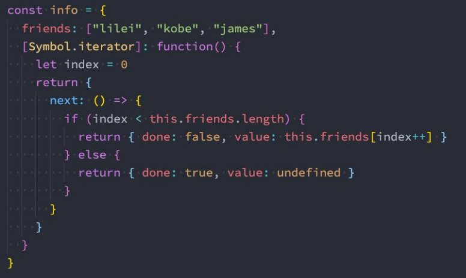

**原生迭代器对象**

- **事实上我们平时创建的很多原生对象已经实现了可迭代协议，会生成一个迭代器对象的：**
- String、Array、Map、Set、arguments对象、NodeList集合；

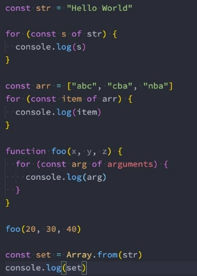 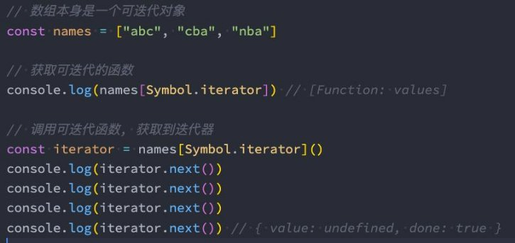

- **那么这些东西可以被用在哪里呢？**
- **JavaScript中语法**：for ...of、展开语法（spread syntax）、yield\*（后面讲）、解构赋值（Destructuring\_assignment）；
- **创建一些对象时**：new Map([Iterable])、new WeakMap([iterable])、new Set([iterable])、new WeakSet([iterable]);
- **一些方法的调用**：Promise.all(iterable)、Promise.race(iterable)、Array.from(iterable);

 

**自定义类的迭代**

- **在前面我们看到Array、Set、String、Map等类创建出来的对象都是可迭代对象：**
- 在面向对象开发中，我们可以通过class定义一个自己的类，这个类可以创建很多的对象：
- 如果我们也希望自己的类创建出来的对象默认是可迭代的，那么在设计类的时候我们就可以添加上 @@iterator 方法；
- **案例：创建一个classroom的类**
- 教室中有自己的位置、名称、当前教室的学生；
- 这个教室可以进来新学生（push）；
- 创建的教室对象是可迭代对象；

**自定义类的迭代实现**

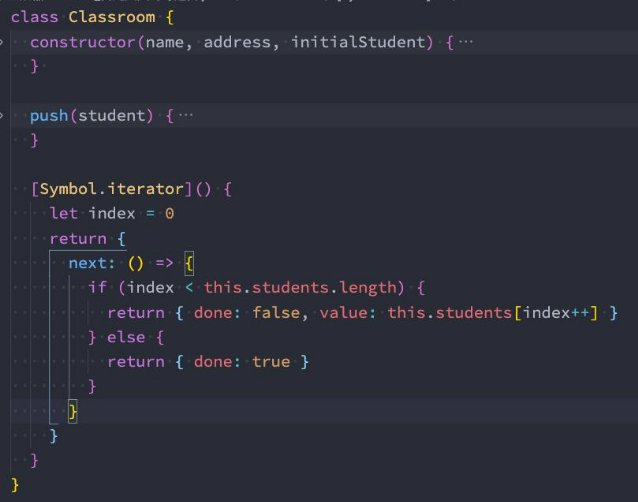 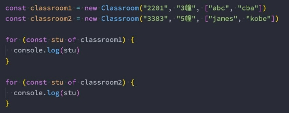

**迭代器的中断**

- **迭代器在某些情况下会在没有完全迭代的情况下中断：**
- 比如遍历的过程中通过break、return、throw中断了循环操作；
- 比如在解构的时候，没有解构所有的值；
- **那么这个时候我们想要监听中断的话，可以添加return方法：**

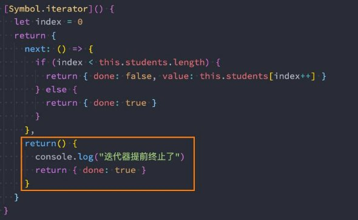 

**什么是生成器？**

- **生成器是ES6中新增的一种函数控制、使用的方案，它可以让我们更加灵活的控制函数什么时候继续执行、暂停执行等。**
- 平时我们会编写很多的函数，这些函数终止的条件通常是返回值或者发生了异常。
- **生成器函数也是一个函数，但是和普通的函数有一些区别：**
- 首先，生成器函数需要在function的后面加一个符号：\*
- 其次，生成器函数可以通过yield关键字来控制函数的执行流程：
- 最后，生成器函数的返回值是一个Generator（生成器）：
- 生成器事实上是一种特殊的迭代器；
- MDN：Instead, they return a special type of iterator, called a **Generator**.

**生成器函数执行**

- **我们发现下面的生成器函数foo的执行体压根没有执行，它只是返回了一个生成器对象。**
- 那么我们如何可以让它执行函数中的东西呢？调用next即可；
- 我们之前学习迭代器时，知道迭代器的next是会有返回值的；
- 但是我们很多时候不希望next返回的是一个undefined，这个时候我们可以通过yield来返回结果；

 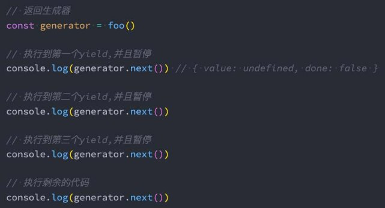

**生成器传递参数 – next函数**

- **函数既然可以暂停来分段执行，那么函数应该是可以传递参数的，我们是否可以给每个分段来传递参数呢？**
- 答案是可以的；
- 我们在调用next函数的时候，可以给它传递参数，那么这个参数会作为上一个yield语句的返回值；
- 注意：也就是说我们是为本次的函数代码块执行提供了一个值；

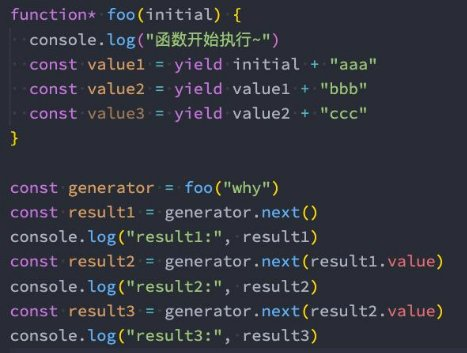

**生成器提前结束 – return函数**

- **还有一个可以给生成器函数传递参数的方法是通过return函数：**
- return传值后这个生成器函数就会结束，之后调用next不会继续生成值了；

**生成器抛出异常 – throw函数**

- **除了给生成器函数内部传递参数之外，也可以给生成器函数内部抛出异常：**
- 抛出异常后我们可以在生成器函数中捕获异常；
- 但是在catch语句中不能继续yield新的值了，但是可以在catch语句外使用yield继续中断函数的执行；

 

**生成器替代迭代器**

- **我们发现生成器是一种特殊的迭代器，那么在某些情况下我们可以使用生成器来替代迭代器：**

 

- **事实上我们还可以使用**
- 这个时候相当于是

**yield\*来生产一个可迭代对象：**

一种yield的语法糖，只不过会依次迭代这个可迭代对象，每次迭代其中的一个值；

**自定义类迭代 – 生成器实现**

- **在之前的自定义类迭代中，我们也可以换成生成器：**

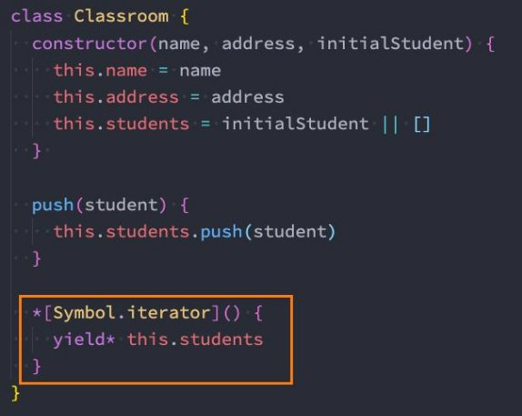

**对生成器的操作**

- **既然生成器是一个迭代器，那么我们可以对其进行如下的操作：**

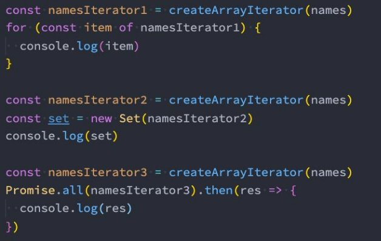

**异步处理方案**

- **学完了我们前面的Promise、生成器等，我们目前来看一下异步代码的最终处理方案。**
- **案例需求：**
- 我们需要向服务器发送网络请求获取数据，一共需要发送三次请求；
- 第二次的请求url依赖于第一次的结果；
- 第三次的请求url依赖于第二次的结果；
- 依次类推；

`  `

**Generator方案**

- 但是上面的代码其实看起来也是阅读性比较差的，有没有办法可以继续来对上面的代码进行优化呢？

` `

**自动执行generator函数**

- **目前我们的写法有两个问题：**
- 第一，我们不能确定到底需要调用几层的Promise关系；
- 第二，如果还有其他需要这样执行的函数，我们应该如何操作呢？
- **所以，我们可以封装一个工具函数execGenerator自动执行生成器函数：**

