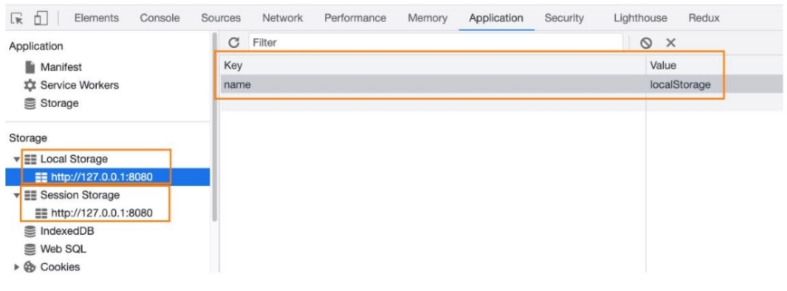
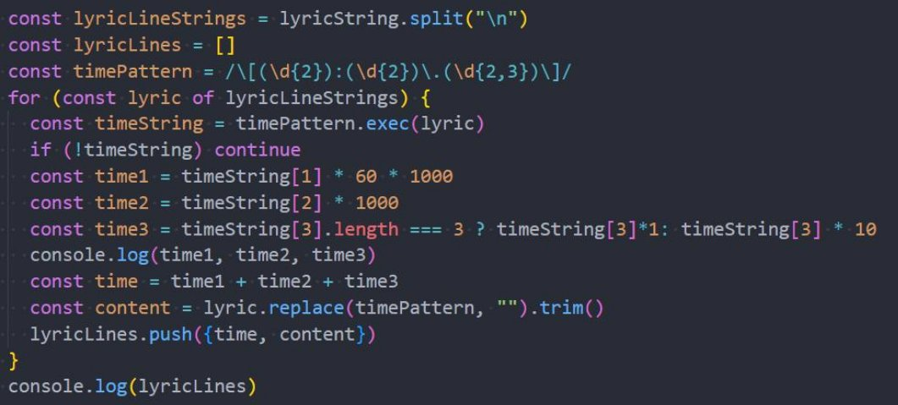
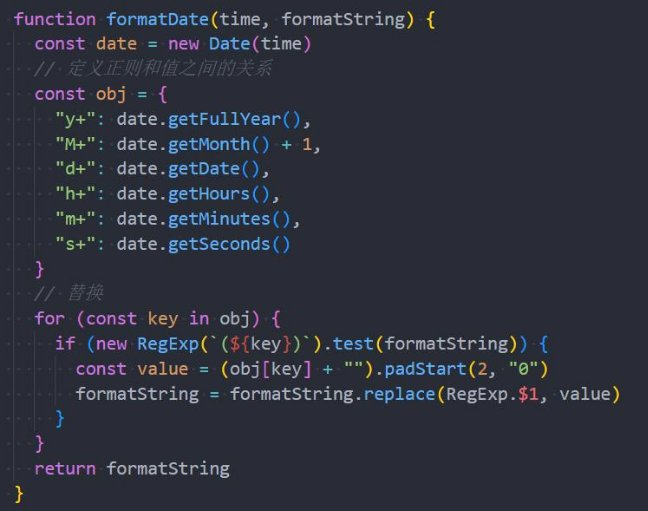

**Storage、正则表达式 **

王红元 coderwhy

|**目录 content**|**1**|**LocalStorage**|
| :- | - | - |
||**2**|**SessionStorage**|
||**3**|**正则表达式的使用**|
||**4**|**正则表达式常见规则**|
||**5**|**正则练习-歌词解析**|
||**6**|**正则练习-日期格式化**|

**认识Storage**

- **WebStorage主要提供了一种机制，可以让浏览器提供一种比cookie更直观的key、value存储方式：**
- localStorage：本地存储，提供的是一种永久性的存储方法，在关闭掉网页重新打开时，存储的内容依然保留；
- sessionStorage：会话存储，提供的是本次会话的存储，在关闭掉会话时，存储的内容会被清除；

**localStorage和sessionStorage的区别**

- 我们会发现localStorage和sessionStorage看起来非常的相似。
- **那么它们有什么区别呢？**
- 验证一：关闭网页后重新打开，localStorage会保留，而sessionStorage会被删除；
- 验证二：在页面内实现跳转，localStorage会保留，sessionStorage也会保留；
- 验证三：在页面外实现跳转（打开新的网页），localStorage会保留，sessionStorage不会被保留；

**Storage常见的方法和属性**

- **Storage有如下的属性和方法：**
- **属性：**
- Storage.length：只读属性

✓ 返回一个整数，表示存储在Storage对象中的数据项数量；

- 方法：
- Storage.key(index)：该方法接受一个数值n作为参数，返回存储中的第n个key名称；
- Storage.getItem()：该方法接受一个key作为参数，并且返回key对应的value；
- Storage.setItem()：该方法接受一个key和value，并且将会把key和value添加到存储中。
  - 如果key存储，则更新其对应的值；
- Storage.removeItem()：该方法接受一个key作为参数，并把该key从存储中删除；
- Storage.clear()：该方法的作用是清空存储中的所有key；

**什么是正则表达式？**

- **我们先来看一下维基百科对正则表达式的解释：**
- **正则表达式**（英语：Regular Expression，常简写为regex、regexp或RE），又称**正则表示式**、**正则表示法**、**规则表达式**、**常 规表示法**，是计算机科学的一个概念**；**
- 正则表达式使用单个字符串来描述、匹配一系列匹配某个句法规则的字符串**。**
- 许多程序设计语言都支持利用正则表达式进行字符串操作。
- **简单概况：正则表达式是一种字符串匹配利器，可以帮助我们搜索、获取、替代字符串；**

- **在JavaScript中，正则表达式使用**
- 正则表达式主要由两部分组成：模式（

**RegExp类来创建，也有对应的字面量的方式：**

patterns）和修饰符（flags）

**正则表达式的使用方法**

- **有了正则表达式我们要如何使用它呢？**
- JavaScript中的正则表达式被用于 RegExp 的 exec 和 test 方法；
- 也包括 String 的 match、matchAll、replace、search 和 split 方法；

|**方法**|**描述**|
| - | - |
|[exec](https://developer.mozilla.org/zh-CN/docs/Web/JavaScript/Reference/Global_Objects/RegExp/exec)|一个在字符串中执行查找匹配的 RegExp 方法，它返回一个数组（未匹配到则返回 null）。|
|[test](https://developer.mozilla.org/zh-CN/docs/Web/JavaScript/Reference/Global_Objects/RegExp/test)|一个在字符串中测试是否匹配的 RegExp 方法，它返回 true 或 false。|
|[match](https://developer.mozilla.org/zh-CN/docs/Web/JavaScript/Reference/Global_Objects/String/match)|一个在字符串中执行查找匹配的 String 方法，它返回一个数组，在未匹配到时会返回 null。|
|[matchAll](https://developer.mozilla.org/zh-CN/docs/Web/JavaScript/Reference/Global_Objects/String/matchAll)|一个在字符串中执行查找所有匹配的 String 方法，它返回一个迭代器（iterator）。|
|[search](https://developer.mozilla.org/zh-CN/docs/Web/JavaScript/Reference/Global_Objects/String/search)|一个在字符串中测试匹配的 String 方法，它返回匹配到的位置索引，或者在失败时返回-1。|
|[replace](https://developer.mozilla.org/zh-CN/docs/Web/JavaScript/Reference/Global_Objects/String/replace)|一个在字符串中执行查找匹配的 String 方法，并且使用替换字符串替换掉匹配到的子字符串。|
|[split](https://developer.mozilla.org/zh-CN/docs/Web/JavaScript/Reference/Global_Objects/String/split)|一个使用正则表达式或者一个固定字符串分隔一个字符串，并将分隔后的子字符串存储到数组中 的 String 方法。|

**修饰符flag的使用**

- 常见的修饰符： 

**flag 含义**

g 全部的，给我匹配全部的

i 忽略大小写

m 多行匹配

- 需求：
- 获取一个字符串中所有的abc；
- 将一个字符串中的所有abc换成大写；

**规则 – 字符类（Character classes）**

- **字符类（Character classes）** 是一个特殊的符号，匹配特定集中的任何符号。

**字符 含义**

\d（“d” 来自 “digit”） 数字：从 0 到 9 的字符。

\s（“s” 来自 “space”） 空格符号：包括空格，制表符 \t，换行符 \n 和其他少数稀有字符，例如 \v，\f 和 \r。 \w（“w” 来自 “word”） “单字”字符：拉丁字母或数字或下划线 \_。 .（点） 点 . 是一种特殊字符类，它与 “除换行符之外的任何字符” 匹配

- **反向类（Inverse classes）**
- \D 非数字：除 \d 以外的任何字符，例如字母。
- \S  非空格符号：除 \s 以外的任何字符，例如字母。
- \W 非单字字符：除 \w 以外的任何字符，例如非拉丁字母或空格。

**规则 – 锚点（Anchors）**

- **符号 ^ 和符号 $ 在正则表达式中具有特殊的意义，它们被称为“锚点”。**
- 符号 ^ 匹配文本开头； 
- 符号 $ 匹配文本末尾；
- **词边界（Word boundary）**
- 词边界 \b 是一种检查，就像 ^ 和 $ 一样，它会检查字符串中的位置是否是词边界。
- 词边界测试 \b 检查位置的一侧是否匹配 \w，而另一侧则不匹配 “\w”
- **在字符串 Hello, Java! 中，以下位置对应于 \b：**

- **匹配下面字符串中的时间：**

**规则 – 转义字符串**

- **如果要把特殊字符作为常规字符来使用，需要对其进行转义：**
- 只需要在它前面加个反斜杠；
- **常见的需要转义的字符：**

**[] \ ^ $ . | ? \* + ( )**

- 斜杠符号 ‘/’ 并不是一个特殊符号，但是在字面量正则表达式中也需要转义；
- **练习：匹配所有以.js或者jsx结尾的文件名**

- 在webpack当中，匹配文件名时就是以这样的方式。

**集合（Sets）和范围（Ranges）**

- **有时候我们只要选择多个匹配字符的其中之一就可以：**
- 在方括号 […] 中的几个字符或者字符类意味着“搜索给定的字符中的任意一个”；
- **集合（Sets）**
- 比如说，[eao] 意味着查找在 3 个字符 ‘a’、‘e’ 或者 `‘o’ 中的任意一个；
- **范围（Ranges）**
- 方括号也可以包含字符范围；
- 比如说，[a-z] 会匹配从 a 到 z 范围内的字母，[0-5] 表示从 0 到 5 的数字；
- [0-9A-F] 表示两个范围：它搜索一个字符，满足数字 0 到 9 或字母 A 到 F；
- \d —— 和 [0-9] 相同；
- \w —— 和 [a-zA-Z0-9\_] 相同；
- **案例：匹配手机号码 **
- **排除范围：除了普通的范围匹配，还有类似 [^…] 的“排除”范围匹配；**

**量词（Quantifiers）**

- **假设我们有一个字符串 +7(903)-123-45-67，并且想要找到它包含的所有数字。**
- 因为它们的数量是不同的，所以我们需要给与数量一个范围；
- 用来形容我们所需要的数量的词被称为**量词（ Quantifiers ）**。
- **数量 {n}**
- 确切的位数：{5}
- 某个范围的位数：{3,5}
- **缩写：**
- +：代表“一个或多个”，相当于 {1,}
- ?：代表“零个或一个”，相当于 {0,1}。换句话说，它使得符号变得可选；
- \*：代表着“零个或多个”，相当于 {0,}。也就是说，这个字符可以多次出现或不出现；
- **案例：匹配开始或结束标签**

**贪婪（ Greedy）和惰性（ lazy）模式**

- **如果我们有这样一个需求：匹配下面字符串中所有使用《》包裹的内容**

- **默认情况下的匹配规则是查找到匹配的内容后，会继续向后查找，一直找到最后一个匹配的内容**
- 这种匹配的方式，我们称之为贪婪模式（Greedy）
- **懒惰模式中的量词与贪婪模式中的是相反的。**
- 只要获取到对应的内容后，就不再继续向后匹配；
- 我们可以在量词后面再加一个问号 ‘?’ 来启用它；
- 所以匹配模式变为 \*? 或 +?，甚至将 '?' 变为 ??

**捕获组（capturing group）**

- **模式的一部分可以用括号括起来 (...)，这称为“捕获组（**
- **这有两个作用：**
- 它允许将匹配的一部分作为结果数组中的单独项；
- 它将括号视为一个整体；

**capturing group）”。**

- **方法 str.match(regexp)，如果 regexp 没有 g 标志，将查找第一个匹配并将它作为一个数组返回：**
- 在索引 0 处：完全匹配。
- 在索引 1 处：第一个括号的内容。
- 在索引 2 处：第二个括号的内容。
- …等等 …
- **案例：匹配到HTML标签，并且获取其中的内容**

**捕获组的补充**

- **命名组：**
- 用数字记录组很困难。
- 对于更复杂的模式，计算括号很不方便。我们有一个更好的选择：给括号起个名字。
- 这是通过在开始括号之后立即放置 ?`<name>` 来完成的。

- **非捕获组：**
- 有时我们需要括号才能正确应用量词，但我们不希望它们的内容出现在结果中。
- 可以通过在开头添加 ?: 来排除组。

- **or是正则表达式中的一个术语，实际上是一个简单的“或”。**
- 在正则表达式中，它用竖线 | 表示；
- 通常会和捕获组一起来使用，在其中表示多个值；

**案例练习 – 歌词解析**

- **歌词解析：[http://123.207.32.32:9001/lyric?id=167876**](http://123.207.32.32:9001/lyric?id=167876)**

**案例练习 – 时间格式化**

- **时间格式化：从服务器拿到时间戳，转成想要的时间格式**

**更多正则查询： [https://c.runoob.com/front-end/854/**](https://c.runoob.com/front-end/854/)**
