**JavaScript XHR、Fetch **

王红元 coderwhy

 

|**目录 content**|**1**|**前端数据请求方式**|
| :- | - | - |
||**2**|**Http协议的解析**|
||**3**|**XHR的基本用法**|
||**4**|**XHR的进阶和封装**|
||**5**|**Fetch的使用详解**|
||**6**|**前端文件上传流程**|

**前后端分离的优势**

- **早期的网页都是通过后端渲染来完成的：服务器端渲染（SSR，server side render）：**
- 客户端发出请求 -> 服务端接收请求并返回相应HTML文档 -> 页面刷新，客户端加载新的HTML文档；
- **服务器端渲染的缺点：**
- 当用户点击页面中的某个按钮向服务器发送请求时，页面本质上只是一些数据发生了变化，而此时服务器却要将重绘的整个页面再返 回给浏览器加载，这显然有悖于程序员的“DRY（ Don‘t repeat yourself ）”原则；

- 而且明明只是一些数据的变化却迫使服务器要返回整个
- **有没有办法在页面数据变动时，只向服务器请求新的数据**
- 答案正是“AJAX”。

HTML文档，这本身也会给 **，并且在阻止页面刷新的情况**

网络带宽带来不必要的开销。

**下，动态的替换页面中展示的数据呢？**

- **AJAX是“Asynchronous JavaScript And XML”的缩写(异步的JavaScript和XML)，是一种实现 无页面刷新 获取服务器数据的技术。**
- AJAX最吸引人的就是它的“异步”特性，也就是说它可以在不重新刷新页面的情况下与服务器通信，交换数据，或更新页面。
- **你可以使用AJAX最主要的两个特性做下列事：**
- 在不重新加载页面的情况下发送请求给服务器；
- 接受并使用从服务器发来的数据。

**网页的渲染过程 – 服务器端渲染**

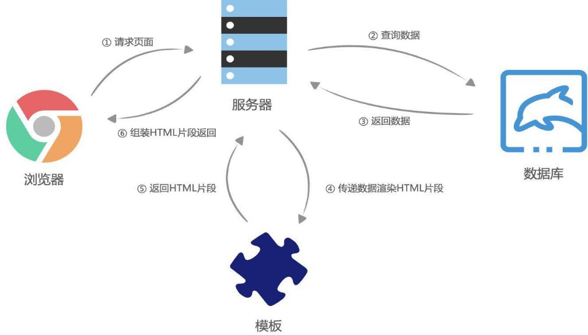

**网页的渲染过程 – 前后端分离**

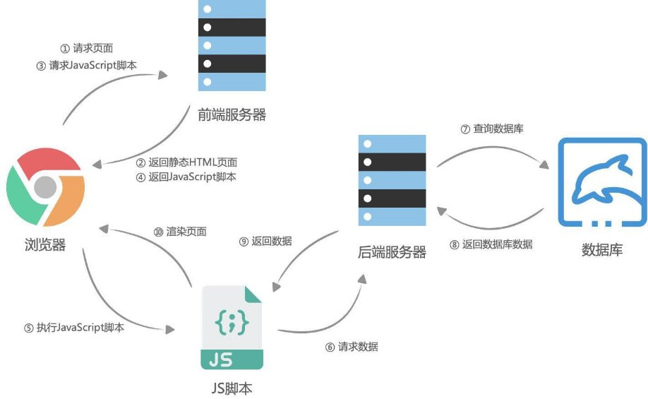

**什么是HTTP？**

- **什么是HTTP呢？我们来看一下维基百科的解释：**
- 超文本传输协议（英语：HyperText Transfer Protocol，缩写：HTTP）是一种用于分布式、协作式和超媒体信息系统的应用层协议；
- HTTP是万维网的数据通信的基础，设计HTTP最初的目的是为了提供一种发布和接收HTML页面的方法；
- 通过HTTP或者HTTPS协议请求的资源由统一资源标识符（Uniform Resource Identifiers，URI）来标识；
- **HTTP是一个客户端（用户）和服务端（网站）之间请求和响应的标准。**
- 通过使用网页浏览器、网络爬虫或者其它的工具，客户端发起一个HTTP请求到服务器上指定端口（默认端口为80）；
  - 我们称这个客户端为用户代理程序（user agent）；
- 响应的服务器上存储着一些资源，比如HTML文件和图像。
- 我们称这个响应服务器为源服务器（origin server）；

**网页中资源的获取**

- **我们网页中的资源通常是被放在Web资源服务器中，由浏览器自动发送HTTP请求来获取、解析、展示的。**

- **目前我们页面中很多数据是动态展示的：**
- 比如页面中的数据展示、搜索数据、表单验证等等，也是通过在

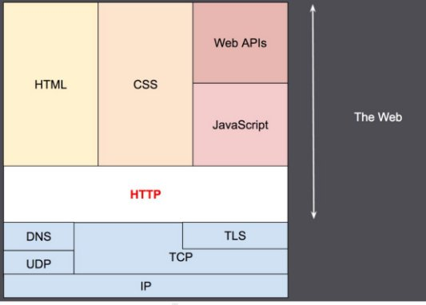

JavaScript中发送HTTP请求获取的；

**HTTP的组成**

- **一次HTTP请求主要包括：请求（Request）和响应（Response）**

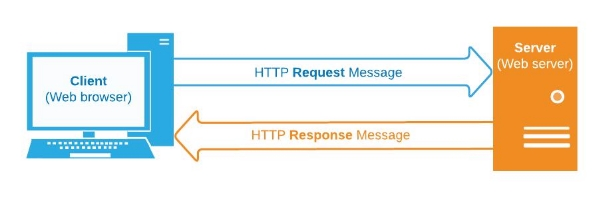

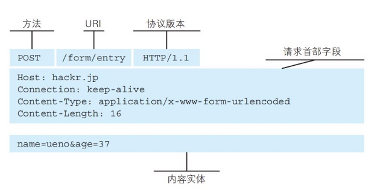 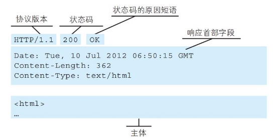

**HTTP的版本**

- **HTTP/0.9** 
- 发布于1991年；
- 只支持GET请求方法获取文本数据，当时主要是为了获取HTML页面内容；
- **HTTP/1.0** 
- 发布于1996年；
- 支持POST、HEAD等请求方法，支持请求头、响应头等，支持更多种数据类型(不再局限于文本数据) ；
- 但是浏览器的每次请求都需要与服务器建立一个TCP连接，请求处理完成后立即断开TCP连接，每次建立连接增加了性能损耗；
- **HTTP/1.1(目前使用最广泛的版本)** 
- 发布于1997年；
- 增加了PUT、DELETE等请求方法；
- 采用持久连接(Connection: keep-alive)，多个请求可以共用同一个TCP连接；
- **2015年，HTTP/2.0**
- **2018年，HTTP/3.0**

**HTTP的请求方式**

- **在RFC中定义了一组请求方式，来表示要对给定资源执行的操作：**
- GET：GET 方法请求一个指定资源的表示形式，使用 GET 的请求应该只被用于获取数据。
- HEAD：HEAD 方法请求一个与 GET 请求的响应相同的响应，但没有响应体。
  - 比如在准备下载一个文件前，先获取文件的大小，再决定是否进行下载；
- POST：POST 方法用于将实体提交到指定的资源。
- PUT：PUT 方法用请求有效载荷（payload）替换目标资源的所有当前表示；
- DELETE：DELETE 方法删除指定的资源；
- PATCH：PATCH 方法用于对资源应部分修改；
- CONNECT：CONNECT  方法建立一个到目标资源标识的服务器的隧道，通常用在代理服务器，网页开发很少用到。
- TRACE：TRACE 方法沿着到目标资源的路径执行一个消息环回测试。
- **在开发中使用最多的是GET、POST请求；**
- 在后续的后台管理项目中，我们也会使用PATCH、DELETE请求；

**HTTP Request Header（一）**

- **在request对象的header中也包含很多有用的信息，客户端会默认传递过来一些信息：**

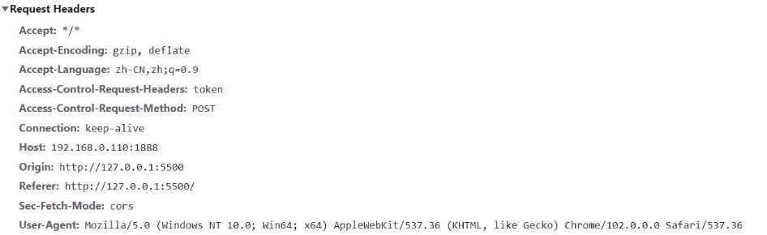

- **content-type是这次请求携带的数据的类型：**
- application/x-www-form-urlencoded：表示数据被编码成以 '&' 分隔的键 - 值对，同时以 '=' 分隔键和值
- application/json：表示是一个json类型；
- text/plain：表示是文本类型；
- application/xml：表示是xml类型；
- multipart/form-data：表示是上传文件；

**HTTP Request Header（二）**

- **content-length：文件的大小长度**
- **keep-alive：**
- http是基于TCP协议的，但是通常在进行一次请求和响应结束后会立刻中断；
- 在http1.0中，如果想要继续保持连接：
  - 浏览器需要在请求头中添加 connection: keep-alive；
  - 服务器需要在响应头中添加 connection:keey-alive；
  - 当客户端再次放请求时，就会使用同一个连接，直接一方中断连接；
- 在http1.1中，所有连接默认是 connection: keep-alive的；
- 不同的Web服务器会有不同的保持 keep-alive的时间；
- Node中默认是5s中；

**HTTP Request Header（二）**

- **accept-encoding**：告知服务器，客户端支持的文件压缩格式，比如js文件可以使用
- **accept**：告知服务器，客户端可接受文件的格式类型；
- **user-agent**：客户端相关的信息；

gzip编码，对应 .gz文件；

**HTTP Response响应状态码**

- **Http状态码（Http Status Code）是用来表示Http响应状态的数字代码：**
- Http状态码非常多，可以根据不同的情况，给客户端返回不同的状态码；
- MDN响应码解析地址：https[://developer.mozilla.org/zh-CN/docs/web/http/status](https://developer.mozilla.org/zh-CN/docs/web/http/status)

**常见HTTP状态码 状态描述 信息说明**

200 OK 客户端请求成功

201 Created POST请求，创建新的资源

301 Moved Permanently 请求资源的URL已经修改，响应中会给出新的URL

400 Bad Request 客户端的错误，服务器无法或者不进行处理

401 Unauthorized 未授权的错误，必须携带请求的身份信息

403 Forbidden 客户端没有权限访问，被拒接

404 Not Found 服务器找不到请求的资源。

500 Internal Server Error 服务器遇到了不知道如何处理的情况。

503 Service Unavailable 服务器不可用，可能处理维护或者重载状态，暂时无法访问

**HTTP Request Header**

- **响应的header中包括一些服务器给客户端的信息：**

**Chrome安装插件 - FeHelper**

- **为了之后查看数据更加的便捷、优雅，我们安装一个Chrome插件：**
- 方式一：可以直接通过Chrome的扩展商店安装；
- 方式二：手动安装
- 下载地址：ht[tps://github.com/zxlie/FeHelper/tree/master/apps/static/screenshot/crx](https://github.com/zxlie/FeHelper/tree/master/apps/static/screenshot/crx)

**AJAX发送请求**

- **AJAX 是异步的 JavaScript 和 XML（Asynchronous JavaScript And XML）**
- 它可以使用 JSON，XML，HTML 和 text 文本等格式发送和接收数据；
- **如何来完成AJAX请求呢？**
- 第一步：创建网络请求的AJAX对象（使用XMLHttpRequest）
- 第二步：监听XMLHttpRequest对象状态的变化，或者监听onload事件（请求完成时触发）；
- 第三步：配置网络请求（通过open方法）；
- 第四步：发送send网络请求；

**XMLHttpRequest的state（状态）**

- **事实上，我们在一次网络请求中看到状态发生了很多次变化，这是因为对于一次请求来说包括如下的状态：**

**值 状态 描述**

0 UNSENT 代理被创建，但尚未调用 open() 方法。

1 OPENED open() 方法已经被调用。

2 HEADERS\_RECEIVED send() 方法已经被调用，并且头部和状态已经可获得。 3 LOADING 下载中；responseText 属性已经包含部分数据。

4 DONE 下载操作已完成。

- **注意：这个状态并非是HTTP的相应状态，而是记录的XMLHttpRequest对象的状态变化。**
- http响应状态通过status获取；
- **发送同步请求：**
- 将open的第三个参数设置为false

**XMLHttpRequest其他事件监听**

- **除了onreadystatechange还有其他的事件可以监听**
- loadstart：请求开始。
- progress： 一个响应数据包到达，此时整个 response body 都在 response 中。
- abort：调用 xhr.abort() 取消了请求。
- error：发生连接错误，例如，域错误。不会发生诸如 404 这类的 HTTP 错误。
- load：请求成功完成。
- timeout：由于请求超时而取消了该请求（仅发生在设置了 timeout 的情况下）。
- loadend：在 load，error，timeout 或 abort 之后触发。
- **我们也可以使用load来获取数据：**

**响应数据和响应类型**

- **发送了请求后，我们需要获取对应的结果：response属性**
- XMLHttpRequest response 属性返回响应的正文内容；
- 返回的类型取决于responseType的属性设置；
- **通过responseType可以设置获取数据的类型**
- 如果将 responseType 的值设置为空字符串，则会使用 text 作为默认值。

- **和responseText、responseXML的区别：**
- 早期通常服务器返回的数据是普通的文本和XML，所以我们通常会通过responseText、 responseXML来获取响应结果；
- 之后将它们转化成JavaScript对象形式；
- 目前服务器基本返回的都是json数据，直接设置为json即可；

**HTTP响应的状态status**

- **XMLHttpRequest的state是用于记录xhr对象本身的状态变化，并非针对于HTTP的网络请求状态。**
- **如果我们希望获取HTTP响应的网络状态，可以通过status和statusText来获取：**

**常见HTTP状态码 状态描述 信息说明**

200 OK 客户端请求成功

201 Created POST请求，创建新的资源

301 Moved Permanently 请求资源的URL已经修改，响应中会给出新的URL

400 Bad Request 客户端的错误，服务器无法或者不进行处理

401 Unauthorized 未授权的错误，必须携带请求的身份信息

403 Forbidden 客户端没有权限访问，被拒接

404 Not Found 服务器找不到请求的资源。

500 Internal Server Error 服务器遇到了不知道如何处理的情况。

503 Service Unavailable 服务器不可用，可能处理维护或者重载状态，暂时无法访问

**GET/POST请求传递参数**

- **在开发中，我们使用最多的是GET和POST请求，在发送请求的过程中，我们也可以传递给服务器数据。**
- **常见的传递给服务器数据的方式有如下几种：**
- 方式一：GET请求的query参数
- 方式二：POST请求 x-www-form-urlencoded 格式
- 方式三：POST请求 FormData 格式
- 方式四：POST请求 JSON 格式

 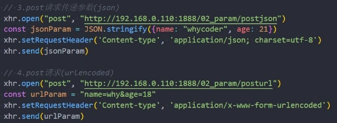

**ajax网络请求封装**

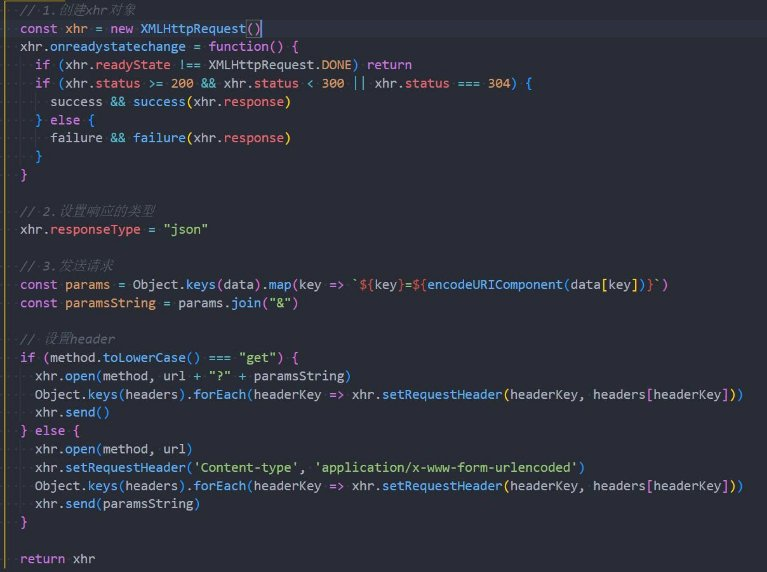

**延迟时间timeout和取消请求**

- **在网络请求的过程中，为了避免过长的时间服务器无法返回数据，通常我们会为请求设置一个超时时间：timeout。**
- 当达到超时时间后依然没有获取到数据，那么这个请求会自动被取消掉；
- 默认值为0，表示没有设置超时时间；
- **我们也可以通过abort方法强制取消请求；**

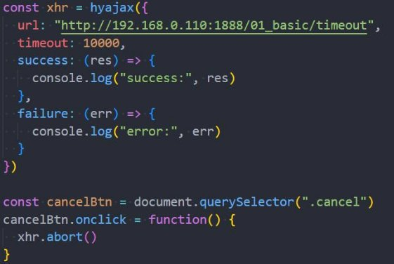

**认识Fetch和Fetch API**

- **Fetch可以看做是早期的XMLHttpRequest的替代方案，它提供了一种更加现代的处理方案：**
- 比如返回值是一个Promise，提供了一种更加优雅的处理结果方式
  - 在请求发送成功时，调用resolve回调then；
  - 在请求发送失败时，调用reject回调catch；
- 比如不像XMLHttpRequest一样，所有的操作都在一个对象上；
- **fetch函数的使用：**

- input：定义要获取的资源地址，可以是一个URL字符串，也可以使用一个
- init：其他初始化参数
- method: 请求使用的方法，如 GET、POST；
- headers: 请求的头信息；
- body: 请求的 body 信息；

Request对象（实验性特性）类型；

**Fetch数据的响应（Response）**

- **Fetch的数据响应主要分为两个阶段：**
- **阶段一：当服务器返回了响应（response）**
- fetch 返回的 promise 就使用内建的 Response class 对象来对响应头进行解析；
- 在这个阶段，我们可以通过检查响应头，来检查 HTTP 状态以确定请求是否成功；
- 如果 fetch 无法建立一个 HTTP 请求，例如网络问题，亦或是请求的网址不存在，那么 promise 就会 reject；
- 异常的 HTTP 状态，例如 404 或 500，不会导致出现 error；
- 我们可以在 response 的属性中看到 HTTP 状态：
- status：HTTP 状态码，例如 200；
- ok：布尔值，如果 HTTP 状态码为 200-299，则为 true；
- **第二阶段，为了获取 response body，我们需要使用一个其他的方法调用。**
- response.text() —— 读取 response，并以文本形式返回 response；
- response.json() —— 将 response 解析为 JSON；

**Fetch网络请求的演练**

- **基于Promise的使用方案：**

- **基于async、await的使用方案：**

**Fetch POST请求**

- **创建一个 POST 请求，或者其他方法的请求，我们需要使用 fetch 选项：**
- method：HTTP 方法，例如 POST，
- body：request body，其中之一：
- 字符串（例如 JSON 编码的），
- FormData 对象，以 multipart/form-data 形式发送数据，

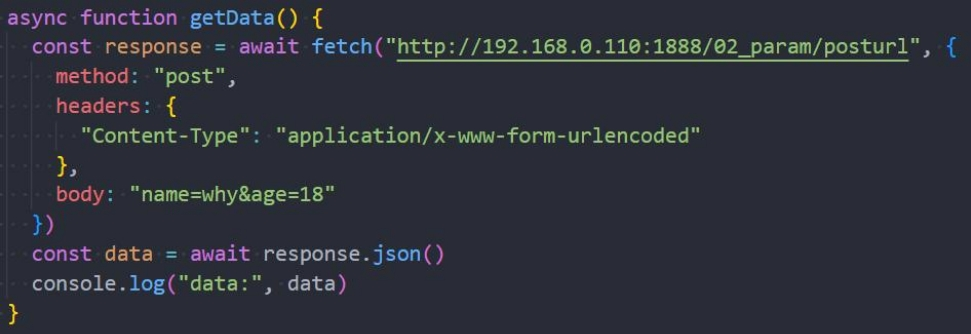

**XMLHttpRequest文件上传**

- **文件上传是开发中经常遇到的需求，比如头像上传、照片等。**
- 要想真正理解文件上传，必须了解服务器如何处理上传的文件信息；

 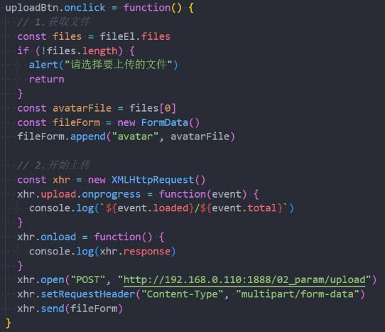

**Fetch文件上传**

- **Fetch也支持文件上传，但是Fetch没办法监听进度。**

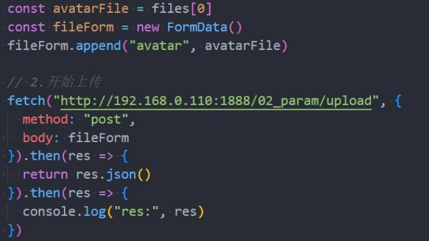
