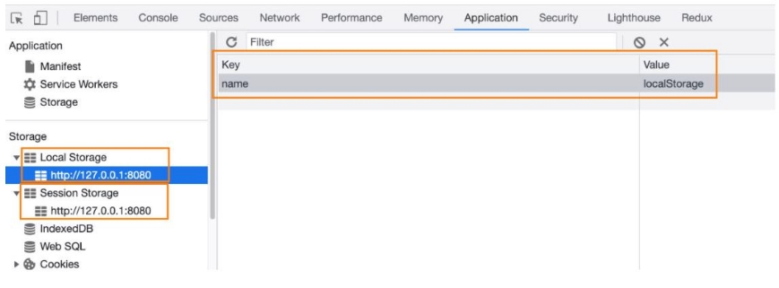

## **认识Storage**

- **WebStorage主要提供了一种机制，可以让浏览器提供一种比cookie更直观的key、value存储方式：**
  - localStorage：本地存储，提供的是一种永久性的存储方法，在关闭掉网页重新打开时，存储的内容依然保留；
  - sessionStorage：会话存储，提供的是本次会话的存储，在关闭掉会话时，存储的内容会被清除；




## **localStorage和sessionStorage的区别**

- 我们会发现localStorage和sessionStorage看起来非常的相似。
- **那么它们有什么区别呢？**
  - 验证一：关闭网页后重新打开，localStorage会保留，而sessionStorage会被删除；
  - 验证二：在页面内实现跳转，localStorage会保留，sessionStorage也会保留；
  - 验证三：在页面外实现跳转（打开新的网页），localStorage会保留，sessionStorage不会被保留；


### **Storage常见的方法和属性**

- **Storage有如下的属性和方法：**
- 属性：
  - Storage.length：只读属性
    - 返回一个整数，表示存储在Storage对象中的数据项数量；


- 方法：
  - Storage.key(index)：该方法接受一个数值n作为参数，返回存储中的第n个key名称；
  - Storage.getItem()：该方法接受一个key作为参数，并且返回key对应的value；
  - Storage.setItem()：该方法接受一个key和value，并且将会把key和value添加到存储中。
    - 如果key存储，则更新其对应的值；

  - Storage.removeItem()：该方法接受一个key作为参数，并把该key从存储中删除；
  - Storage.clear()：该方法的作用是清空存储中的所有key；


```js
class Cache {
  constructor(isLocal = true) {
    this.storage = isLocal ? localStorage: sessionStorage
  }

  setCache(key, value) {
    if (!value) {
      throw new Error("value error: value必须有值!")
    }

    if (value) {
      this.storage.setItem(key, JSON.stringify(value))
    }
  }

  getCache(key) {
    const result = this.storage.getItem(key)
    if (result) {
      return JSON.parse(result)
    }
  }

  removeCache(key) {
    this.storage.removeItem(key)
  }

  clear() {
    this.storage.clear()
  }
}

const localCache = new Cache()
const sessionCache = new Cache(false)

```

