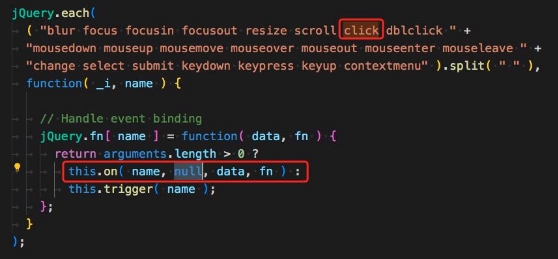
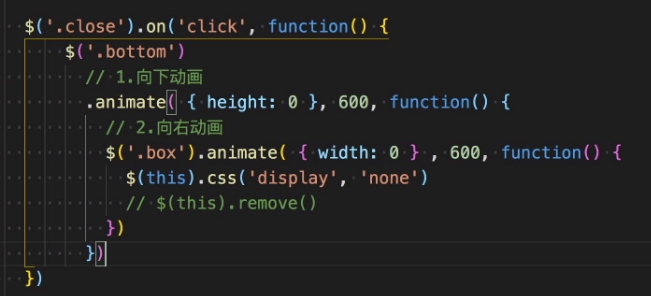
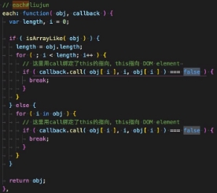
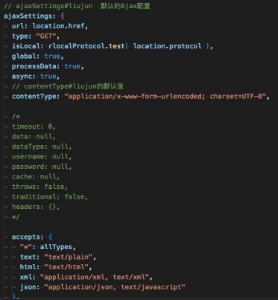

## **认识事件（Event）**

- **Web页面经常需要和用户之间进行交互，而交互的过程中我们可能想要捕捉这个交互的过程：**

  - 比如用户点击了某个按钮、用户在输入框里面输入了某个文本、用户鼠标经过了某个位置；
  - 浏览器需要搭建一条JavaScript代码和事件之间的桥梁；
  - 当某个事件发生时，让JavaScript执行某个函数，所以我们需要针对事件编写处理程序（handler）；

- **原生事件监听方法：**

  - 事件监听方式一：在script中直接监听（很少使用）。
  - 事件监听方式二：DOM属性，通过元素的on来监听事件。
  - 事件监听方式三：通过EventTarget中的addEventListener来监听。

  

- **jQuery事件监听方法：**

  - 事件监听方式一：直接调用jQuery对象中的事件处理函数来监听，例如：click，mouseenter....。
  - 事件监听方式二：调用jQuery对象中的on函数来监听，使用off函数来取消监听。

**click和on的区别**

- **click和on的区别：**
  - click是on的简写。它们重复监听，不会出现覆盖情况，都支持事件委托，底层用的是addEventListener。
  - 如果 on 没有使用 selector 的话，那么和使用click是一样的。
  - on 函数可以接受一个 selector 参数，用于筛选 可触发事件 的后代元素。
  - on 函数支持给事件添加命名空间。

**click和on中this指向**

- **click和on的this指向：**
- this都是指向原生的DOM Element

 

**jQuery的事件冒泡**

- **我们会发现默认情况下事件是从最内层（如下图span）向外依次传递的顺序，这个顺序我们称之为**
- **事实上，还有另外一种监听事件流的方式就是从外层到内层（如：body -> span），这种称之为**
- **为什么会产生两种不同的处理流呢？**
  - 这是因为早期在浏览器开发时，不管是IE还是Netscape公司都发现了这个问题;
  - 但是他们采用了完全相反的事件流来对事件进行了传递；
  - IE<9仅采用了事件冒泡的方式，Netscape采用了事件捕获的方式；
  - IE9+和现在所有主流浏览器都已支持这两种方式。

**事件冒泡（Event Bubble）; 事件捕获（Event Capture）；**

- **jQuery为了更好的兼容IE浏览器，底层并没有实现事件捕获。**

**jQuery的事件对象( Event Object)**

- jQuery事件系统的规范是根据W3C的标准来制定jQuery事件对象。原始事件对象的大多数属性都被复制到新的jQuery事件 对象上。如，以下原生的事件属性被复制到jQuery事件对象中：

altKey, clientX, clientY, currentTarget, data, detail,  key, keyCode, offsetX, offsetY, originalTarget, pageX, pageY, relatedTarget, screenX, screenY, target, ......

- jQuery事件对象通用的属性（以下属性已实现跨浏览器的兼容）：
- target、relatedTarget、pageX、pageY、which、metaKey
- jQuery事件对象常用的方法：
- preventDefault() :  取消事件的默认行为（例如，a标签、表单事件等）。
- stopPropagation() :  阻止事件的进一步传递（例如，事件冒泡）。 
- 要访问其它事件的属性，可以使用 event.originalEvent 获取原生对象。

**jQuery的事件委托（event delegation）**

- **事件冒泡在某种情况下可以帮助我们实现强大的事件处理模式 – 事件委托模式（也是一种设计模式）**
- **那么这个模式是怎么样的呢？**
- 因为当子元素被点击时，父元素可以通过冒泡监听到子元素的点击；
- 并且可以通过event.target获取到当前监听事件的元素（event.currentTarget获取到的是处理事件的元素）；
- **案例：一个ul中存放多个li，使用事件委托的模式来监听li中子元素的点击事件。**

**jQuery常见的事件**

- **鼠标事件（Mouse Events）**
- .click() 、.dblclick()、.hover()、.mousedown() 、.mouseup()
- .mouseenter()、.mouseleave()、.mousemove()
- .mouseover()、.mouseout() 、.contextmenu()、.toggle()
- **键盘事件（Keyboard Events）**
- .keydown() 、.keypress()、.keyup() 
- **文档事件（Document Loading Events）**
- load、ready()、.unload
- **表单事件（Form Events）**
- .blur() 、.focus()、.change()、.submit()、.select()
- **浏览器事件（Browser Events）**
- .resize()、.scroll()

**mouseover和mouseenter的区别**

- **mouseenter()和mouseleave() **
- 不支持冒泡 
- 进入子元素依然属于在该元素内，没有任何反应
- **mouseover()和mouseout()**
- 支持冒泡
- 进入元素的子元素时
- 先调用父元素的mouseout 
- 再调用子元素的mouseover
- 因为支持冒泡，所以会将mouseover传递到父元素中；

**jQuery的键盘事件**

- **事件的执行顺序是 keydown()、keypress()、keyup()**
- keydown事件先发生；
- keypress发生在文本被输入；
- keyup发生在文本输入完成（抬起、松开）；
- **我们可以通过key和code来区分按下的键：**
- code：“按键代码”（"KeyA"，"ArrowLeft" 等），特定于键盘上按键的物理位置。
- key：字符（"A"，"a"  等），对于非字符（non-character）的按键，通常具有与 code 相同的值。）

**jQuery的表单事件**

- **表单事件（Form Events）**
- .blur()  - 元素失去焦点时触发
- .focus() - 元素获取焦点时触发
- change() - 该事件在表单元素的内容改变时触发( `<input>`, `<keygen>`, `<select>`, 和 `<textarea>`)
- .submit() - 表单提交时触发
- **......**

**jQuery-选项卡切换**

**jQuery动画操作-animate**

- **.animate()： 执行一组 CSS属性的自定义动画，允许支持数字的**
- .animate( properties [, duration ] [, easing ] [, complete ] )
- .animate( properties, options )
- propertys参数的支持：
- 数值：number 、string
- 关键字：'show'、'hide'和'toggle'
- 相对值：+= 、 -=
- 支持 em 、% 单位（可能会进行单位转换）。
- **自定义修改宽高度动画**
- **height ：100% -> 0**
- **width： 100% -> 0**
- **opacity: 1 - > 0**

**CSS属性上创建动画。**

**jQuery常见动画函数**

- **.显示和隐藏**匹配的元素
  - .hide() 、.hide( [duration ] [, complete ] )、.hide( options )  - 隐藏元素 
  - .show() 、.show( [duration ] [, complete ] )、.show( options ) - 显示元素
  - .toggle() 、.toggle( [duration ] [, complete ] )、.toggle( options ) -显示或者隐藏元素
- **淡入淡出**
- .fadeIn()、.fadeIn( [duration ] [, complete ] )、.fadeIn( options )  - 淡入动画
- .fadeOut()、.fadeOut( [duration ] [, complete ] )、.fadeOut( options )  -淡出动画
- .fadeToggle()、.fadeToggle( [duration ] [, complete ] )、.fadeToggle( options )   - 淡入淡出的切换
- .fadeTo( duration, opacity [, complete ] ) - 渐变到

**jQuery元素中的动画队列**

- **jQuery匹配元素中的animate和delay动画是通过一个**
- .hide()  、 .show()
- .fadeIn()  、.fadeOut()
- .animate()、delay()
- ......

**动画队列(queue)来维护的。例如执行下面的动画都会添加到动画队列中：**

- **.queue()：查看当前选中元素中的动画队列。 **
- **.stop( [clearQueue ] [, jumpToEnd ] )：停止匹配元素上当前正在运行的动画。**
- clearQueue ：一个布尔值，指示是否也删除排队中的动画。默认为false
- jumpToEnd ：一个布尔值，指示是否立即完成当前动画。默认为false

**jQuery实现-隐藏侧边栏广告**

 

**jQuery中的遍历**

- **.each( function )： 遍历一个 jQuery 对象，为每个匹配的元素执行一个回调函数。**
- function 参数:
- Function( Integer index, Element element )， 函数中返回false会终止循环。
- **jQuery.each( array | object , callback ) : 一个通用的迭代器函数，可以用来无缝地迭代对象和数组。**
- array参数：支持数组（array）或者类数组（array-like）,底层使用for循环 。 
- object参数: 支持普通的对象 object 和 JSON对象等，底层用for in循环。
- function 参数:  
- Function( Integer index, Element element )， 函数中返回false会终止循环。
- **.each() 和 jQuery.each(）函数的区别：**
- .each()是jQuery对象上的方法，用于遍历 jQuery对象。
- jQuery.each( ) 是jQuery函数上的方法，可以遍历对象、数组、类数组等，它是一个通用的工具函数。

**jQuery的AJAX**

- **在前端页面开发中，如果页面中的数据是需要动态获取或者更新的，这时我们需要向服务器发送异步的请求来获取数据，然后在无需刷新页面的情 况来更新页面。那么这个发起异步请求获取数据来更新页面的技术叫做AJAX。**
- **AJAX全称（Asynchronous JavaScript And XML），是异步的 JavaScript 和 XML，它描述了一组用于构建网站和Web应用程序的开发技术。**
- 简单点说，就是使用 XMLHttpRequest 对象与服务器通信。它可以使用 JSON，XML，HTML 和 text 文本等格式发送和接收数据。
- AJAX 最吸引人的就是它的“异步”特性。也就是说它可以在不重新刷新页面的情况下与服务器通信，交换数据，或更新页面。
- **AJAX请求方法（Method）**
- GET、POST、PUT、PACTH、DELETE 等
- **jQuery中也有AJAX模块，该模块是在XMLHttpRequest的基础上进行了封装，语法（Syntax）如下：**
- $.ajax( [settings ] )  - 默认用 GET 请求从服务器加载数据， 会返回jQXHR对象，可以利用该对象的abort方法来取消请求。
- $.get( url [, data ] [, success ] [, dataType ] ) - 发起GET请求，底层调用的还是$ajax()
- $.post( url [, data ] [, success ] [, dataType ] ) - 发起POST请求，底层调用的还是$ajax()
- **初体验jQuery中的AJAX**
- <https://httpbin.org>  (是一个专门提供：免费测试http服务的网站)

**AJAX请求参数(Parameters)**

- **请求参数（Parameters） **
- url - 指定发送请求的 URL。
- method / type - 用于指定请求的类型 (e.g. "POST", "GET", "PUT")，默认为GET
- data - 指定要发送到服务器的数据（PlainObject or String or Array）
- processData：当data是一个对象时，jQuery  从对象的键/值对生成数据字符串，除非该processData选项设置为false.  例如，{ a: "bc", d: "e,f" }被转换为字符串"a=bc&d=e%2Cf"，默认为true。
- header - 请求头的内容（PlainObject） 
- contentType - 默认值：application/x-www-form-urlencoded; charset=UTF-8，向服务器发送数据时指定内容类型。
  - application/x-www-form-urlencoded; charset=UTF-8： 请求体的数据以查询字符串形式提交，如：a=bc&d=e%2Cf。
  - application/json; charset=UTF-8  指定为json字符串类型
  - 为时 false， 代表是 multipart/form-data  。表单类型，一般用于上传文件
- dataType - 期望服务器端发回的数据类型（json、xml、text...），默认会根据响应的类型来自动推断类型。
- timeout - 请求超时时间。它以毫秒为单位。
- beforeSend - 这是一个在发送请求之前运行的函数，返回false会取消网路请求。
- success - 请求成功回调的函数
- error - 请求失败回调的函数

**jQuery插件（plugins）开发**

- **在我们开发时，有时候jQuery提供的方法并不能满足我们的需求。如果我们想给jQuery扩展一些其它的方法，那这种情况下， 可能需要编写一个插件。**
- jQuery插件其实就是：编写一些新增的方法，并将这些方法添加到jQuery的原型对象上。
- **编写jQuery 插件的步骤：**
- 新建一个插件对应的JS文件（命名规范：jquery.插件名.js）
- 在立即执行函数中编写插件，这样可以避免插件中的变量与全局变量冲突。
- 在jQuery的原型对象上新增一些的方法。
- 最后在html中导入就可以像使用其他 jQuery对象方法一样使用了 
- 到此就开发完一个jQuery的插件了。
- **案例：开发一个 jquery.showlinklocation.js 的插件。**
- 功能：让网页上所有的a标签文本的后面追加对应的域名地址。

**jQuery项目实战**

- **项目的目录结构**

- **项目的接口地址**
- baseURL：<http://123.207.32.32:9060/beike/api>
- 首页数据(GET)：baseURL + /homePageInfo
- 搜索接口(GET)：baseURL + /sug/headerSearch?cityId=440100&cityName=广州&channel=site&keyword=白云山 &query=白云山
- 热门推荐(GET)：baseURL + /site/rent
- 城市数(GET)据：baseURL + /city
