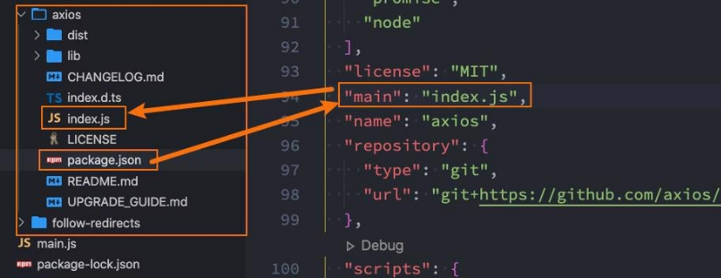
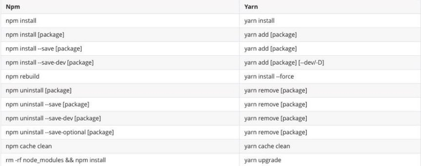

## **代码共享方案**

- 我们已经学习了在JavaScript中可以通过模块化的方式将代码划分成一个个小的结构：
  - 在以后的开发中我们就可以通过模块化的方式来封装自己的代码，并且封装成一个工具；
  - 这个工具我们可以让同事通过导入的方式来使用，甚至你可以分享给世界各地的程序员来使用；
- 如果我们分享给世界上所有的程序员使用，有哪些方式呢？
  - 方式一：**上传到GitHub上、其他程序员通过GitHub下载我们的代码手动的引用**；
  - 缺点是大家必须知道你的代码GitHub的地址，并且从GitHub上手动下载；
  - 需要在自己的项目中手动的引用，并且管理相关的依赖；
  - 不需要使用的时候，需要手动来删除相关的依赖；
  - 当遇到版本升级或者切换时，需要重复上面的操作；
  - 显然，上面的方式是有效的，但是这种传统的方式非常麻烦，并且容易出错；

- 方式二：**使用一个专业的工具来管理我们的代码**
  - 我们通过工具将代码发布到特定的位置；
  - 其他程序员直接通过工具来安装、升级、删除我们的工具代码；
  - 显然，通过第二种方式我们可以更好的管理自己的工具包，其他人也可以更好的使用我们的工具包。


## **包管理工具npm**

- **包管理工具npm：**
  - Node Package Manager，也就是Node包管理器；
  - 但是目前已经不仅仅是Node包管理器了，在前端项目中我们也在使用它来管理依赖的包；
  - 比如vue、vue-router、vuex、express、koa、react、react-dom、axios、babel、webpack等等；

- **如何下载和安装npm工具呢？**
  - npm属于node的一个管理工具，所以我们需要先安装Node；
  - node管理工具：[https://nodejs.org/en/](https://nodejs.org/en/)，安装Node的过程会自动安装npm工具；
  
- **npm管理的包可以在哪里查看、搜索呢？**
  - <https://www.npmjs.org/>
  - 这是我们安装相关的npm包的官网；

- **npm管理的包存放在哪里呢？**
  - 我们发布自己的包其实是发布到registry上面的；
  - 当我们安装一个包时其实是从registry上面下载的包；


### **npm的配置文件**

- **那么对于一个项目来说，我们如何使用npm来管理这么多包呢？**
  - 事实上，我们每一个项目都会有一个对应的配置文件，无论是前端项目（Vue、React）还是后端项目（Node）；
  - 这个配置文件会记录着你项目的名称、版本号、项目描述等；
  - 也会记录着你项目所依赖的其他库的信息和依赖库的版本号；

- **这个配置文件就是package.json**
- **那么这个配置文件如何得到呢？**
  - 方式一：手动从零创建项目，npm init –y
  - 方式二：通过脚手架创建项目，脚手架会帮助我们生成package.json，并且里面有相关的配置


### **常见的配置文件**

- Vue CLI4创建的Vue3项目


-  create-react-app创建的react17项目


- npm init #创建时填写信息 
  - npm init -y # 所有信息使用默认的 


### **常见的属性**

- **必须填写的属性：name、version**
  - name是项目的名称；
  - version是当前项目的版本号；
  - description是描述信息，很多时候是作为项目的基本描述；
  - author是作者相关信息（发布时用到）；
  - license是开源协议（发布时用到）；

- **private属性：**
  - private属性记录当前的项目是否是私有的；
  - 当值为true时，npm是不能发布它的，这是防止私有项目或模块发布出去的方式；

- **main属性：**
  - 设置程序的入口。
  - 比如我们使用axios模块 const axios = require('axios');
  - 如果有main属性，实际上是找到对应的main属性查找文件的；




- **scripts属性**
  - scripts属性用于配置一些脚本命令，以键值对的形式存在；
  - 配置后我们可以通过 npm run 命令的key来执行这个命令；
  - npm start和npm run start的区别是什么？
    - 它们是等价的；
    - 对于常用的 start、 test、stop、restart可以省略掉run直接通过 npm start等方式运行；

- **dependencies属性**
  - dependencies属性是指定无论开发环境还是生成环境都需要依赖的包；
  - 通常是我们项目实际开发用到的一些库模块vue、vuex、vue-router、react、react-dom、axios等等；
  - 与之对应的是devDependencies；

- **devDependencies属性**
  - 一些包在生成环境是不需要的，比如webpack、babel等；
  - 这个时候我们会通过 npm install webpack --save-dev，将它安装到devDependencies属性中；

- **peerDependencies属性**
  - 还有一种项目依赖关系是对等依赖，也就是你依赖的一个包，它必须是以另外一个宿主包为前提的；
  - 比如element-plus是依赖于vue3的，ant design是依赖于react、react-dom；

- **engines属性**
  - engines属性用于**指定Node和NPM的版本号**；
  - 在安装的过程中，会先检查对应的引擎版本，如果不符合就会报错；
  - 事实上也可以指定所在的操作系统 "os" : [ "darwin", "linux" ]，只是很少用到；
- **browserslist属性**
  - 用于配置打包后的JavaScript浏览器的兼容情况，参考；
  - 否则我们需要手动的添加polyfills来让支持某些语法；
  - 也就是说它是为webpack等打包工具服务的一个属性；

### **依赖的版本管理**

- **我们会发现安装的依赖版本出现：^2.0.3或~2.0.3，这是什么意思呢？**
- **npm的包通常需要遵从semver版本规范：**
  - semver：ht[tps://semver.org/lang/zh-CN/](https://semver.org/lang/zh-CN/)
  - npm semver：ht[tps://docs.npmjs.com/misc/semver](https://docs.npmjs.com/misc/semver)

- **semver版本规范是X.Y.Z：**
  - X主版本号（major）：当你做了不兼容的 API 修改（可能不兼容之前的版本）；
  - Y次版本号（minor）：当你做了向下兼容的功能性新增（新功能增加，但是兼容之前的版本）；
  - Z修订号（patch）：当你做了向下兼容的问题修正（没有新功能，修复了之前版本的bug）；

- **我们这里解释一下 ^和~的区别：**
  - x.y.z：表示一个明确的版本号；
  - ^x.y.z：表示x是保持不变的，y和z永远安装最新的版本；
  - ~x.y.z：表示x和y保持不变的，z永远安装最新的版本；


### **npm install 命令**

- **安装npm包分两种情况：**
  - 全局安装（global install）： npm install webpack -g;
  - 项目（局部）安装（local install）： npm install webpack

- **全局安装**
  - 全局安装是直接将某个包安装到全局：
  - 比如全局安装yarn：`npm install yarn -g`


- **但是很多人对全局安装有一些误会：**

  - 通常使用npm全局安装的包都是一些工具包：yarn、webpack等；
  - 并不是类似于 axios、express、koa等库文件；
  - 所以全局安装了之后并不能让我们在所有的项目中使用 axios等库；
  - **因为require()查找模块时，会查找当前目录的node_modules，如果查找不到，就一直向上查找，直到/node_modules。它并不会去查找全局安装的npm包。**

  ```js
  [
     '/Users/guingzheng/Desktop/未命名文件夹/node_modules',
      '/Users/guingzheng/Desktop/node_modules',
      '/Users/guingzheng/node_modules',
      '/Users/node_modules',
      '/node_modules'
  ]

### **项目安装**


- **项目安装会在当前目录下生成一个 node_modules 文件夹，我们之前讲解require查找顺序时有讲解过这个包在什么情况下被查找；**


- **局部安装分为开发时依赖和生产时依赖：**

```shell
- #默认安装开发和生产依赖 
npm install axios 
npm i axios
#开发依赖
npm install webpack --save-dev 
npm install webpack -D
npm i webpack –D
#根据package.json中的依赖包 
npm install
```

- **很多同学之前应该已经会了 `npm install <package>`，但是你是否思考过它的内部原理呢？**
  - 执行 npm install它背后帮助我们完成了什么操作？
  - 我们会发现还有一个称之为package-lock.json的文件，它的作用是什么？
  - 从npm5开始，npm支持缓存策略（来自yarn的压力），缓存有什么作用呢？
- **这是一幅我画出的根据 npm install 的原理图：**


### **npm install 原理图解析**

- **npm install会检测是有package-lock.json文件：**
- 没有lock文件
  - 分析依赖关系，这是因为我们可能包会依赖其他的包，并且多个包之间会产生相同依赖的情况；
  - 从registry仓库中下载压缩包（如果我们设置了镜像，那么会从镜像服务器下载压缩包）；
  - 获取到压缩包后会对压缩包进行缓存（从npm5开始有的）；
  - 将压缩包解压到项目的node\_modules文件夹中（前面我们讲过，require的查找顺序会在该包下面查找）
- 有lock文件
  - 检测lock中包的版本是否和package.json中一致（会按照semver版本规范检测）；
    - 不一致，那么会重新构建依赖关系，直接会走顶层的流程；
    - 一致的情况下，会去优先查找缓存
    - 没有找到，会从registry仓库下载，直接走顶层流程；
    - 查找到，会获取缓存中的压缩文件，并且将压缩文件解压到node\_modules文件夹中；


### **package-lock.json文件解析**

- **package-lock.json文件解析： **
  - name：项目的名称； 
  - version：项目的版本； 
  - lockfileVersion：lock文件的版本； 
  - requires：使用requires来跟踪模块的依赖关系； 
  - dependencies：项目的依赖 
    - 当前项目依赖axios，但是axios依赖follow-redireacts； 
    - axios中的属性如下： 
      - version表示实际安装的axios的版本； 
      - resolved用来记录下载的地址，registry仓库中的位置； 
      - requires/dependencies记录当前模块的依赖； 
      - integrity用来从缓存中获取索引，再通过索引去获取压缩包文件； 


### **npm其他命令**

- **我们这里再介绍几个比较常用的：**
- 卸载某个依赖包：

```shell
npm uninstall package

npm uninstall package --save-dev npm uninstall package -D
```

- 强制重新build
  - `npm rebuild`


- 清除缓存
  - `npm cache clean`


- **npm的命令其实是非常多的：**
- <https://docs.npmjs.com/cli-documentation/cli>
- 更多的命令，可以根据需要查阅官方文档

## **yarn工具**

- **另一个node包管理工具yarn：**
  - yarn是由Facebook、Google、Exponent 和 Tilde 联合推出了一个新的 JS 包管理工具；
  - yarn 是为了弥补 早期npm 的一些缺陷而出现的；
  - 早期的npm存在很多的缺陷，比如安装依赖速度很慢、版本依赖混乱等等一系列的问题；
  - 虽然从npm5版本开始，进行了很多的升级和改进，但是依然很多人喜欢使用yarn；




## **cnpm工具**

- **由于一些特殊的原因，某些情况下我们没办法很好的从 https://registry.npmjs.org下载下来一些需要的包。**
- 查看npm镜像：
  - `npm config get registry # npm config get registry`


- 我们可以直接设置npm的镜像：
  - `npm config set registry https://registry.npm.taobao.org`


- **但是对于大多数人来说（比如我），并不希望将npm镜像修改了：**
  - 第一，不太希望随意修改npm原本从官方下来包的渠道；
  - 第二，担心某天淘宝的镜像挂了或者不维护了，又要改来改去；

- **这个时候，我们可以使用cnpm，并且将cnpm设置为淘宝的镜像：**
  - `npm install -g cnpm --registry=https://registry.npm.taobao.org cnpm config get registry # https://r.npm.taobao.org/`


## **npx工具**

- **npx是npm5.2之后自带的一个命令。**
  - npx的作用非常多，但是比较常见的是使用它来调用项目中的某个模块的指令。

- **我们以webpack为例：**
  - 全局安装的是webpack5.1.3
  - 项目安装的是webpack3.6.0

- **如果我在终端执行 webpack --version使用的是哪一个命令呢？**
  - 显示结果会是 webpack 5.1.3，事实上使用的是全局的，为什么呢？
  - 原因非常简单，在当前目录下找不到webpack时，就会去全局找，并且执行命令；

- **如何解决这个问题呢？**

### **局部命令的执行**

- **那么如何使用项目（局部）的webpack，常见的是两种方式：**

  - 方式一：明确查找到node\_module下面的webpack
    - `./node\_modules/.bin/webpack --version`

  - 方式二：在 scripts定义脚本，来执行webpack；
    - `"scripts": {"webpack": "webpack --version" }`


  - 方式三：使用npx
    - `npx webpack --version`


- **npx的原理非常简单，它会到当前目录的node\_modules/.bin目录下查找对应的命令；**

## **npm发布自己的包**

- **注册npm账号： **
  - [https://www.npmjs.com/ ](https://www.npmjs.com/)
  - 选择sign up 

- **在命令行登录：** 
  - `npm login `


- **修改package.json** 
- **发布到npm registry上** 
  - `npm publish `


- **删除发布的包：**
  - `npm unpublish`

- **更新仓库：**
  - 1.修改版本号(最好符合semver规范)
  - 2.重新发布

- **让发布的包过期：**
  - `npm deprecate`


## **pnpm包管理工具**

- **什么是pnpm呢？我们来看一下官方的解释：**
  - pnpm：我们可以理解成是performant npm缩写；


- **哪些公司在用呢？**
  - 包括Vue在内的很多公司或者开源项目的包管理工具都切换到了pnpm；


### **硬链接和软连接的概念**

- **硬链接（hard link）：**
  - 硬链接（英语：hard link）是电脑文件系统中的多个文件平等地共享同一个文件存储单元；
  - 删除一个文件名字后，还可以用其它名字继续访问该文件；

- **符号链接（软链接soft link、Symbolic link）：**
  - 符号链接（软链接、Symbolic link）是一类特殊的文件；
  - 其包含有一条以绝对路径或者相对路径的形式指向其它文件或者目录的引用；


**硬链接和软连接的演练**

- **文件的拷贝：**文件的拷贝每个人都非常熟悉，会在硬盘中复制出来一份新的文件数据；

```shell
window: copy foo.js foo_copy.js 

macos : cp foo.js foo_copy.js 
```


- **文件的硬链接 **

```she
window: mklink H aaa_hard.js aaa.js 
macos : ln foo.js foo_hard.js 
```


- **文件的软连接： **

```shell
window: mklink aaa_soft.js aaa.js 
macos : ln -s foo.js foo_copy.js 
```


### **pnpm到底做了什么呢？**


- **当使用 npm 或 Yarn 时，如果你有 100 个项目，并且所有项目都有一个相同的依赖包，那么， 你在硬盘上就需要保存 100 份该相同依赖包的副本。**

  - **虽然npm和yarn有缓存，但是它会把缓存解压复制放到每个项目中，所以还是会有100份相同的包**

- **如果是使用 pnpm，依赖包将被 存放在一个统一的位置，然后采用硬链接方式引用这些包，因此：**

  - 如果你对同一依赖包使用相同的版本，那么磁盘上只有这个依赖包的一份文件；
  - 如果你对同一依赖包需要使用不同的版本，则仅有 版本之间不同的文件会被存储起来；
  - 所有文件都保存在硬盘上的统一的位置：
  - **当安装软件包时， 其包含的所有文件都会硬链接到此位置，而不会占用 额外的硬盘空间**；
  - 这让你可以在项目之间方便地共享相同版本的 依赖包；


### **pnpm创建非扁平的 node\_modules 目录**

- **npm或yarn的node_modules结构问题**

  - 早期的npm版本，node_modules不是扁平化的，而深层嵌套的，这样会造成同一个包如果被多个项目引用，但这个包会被下载多次。
  - 现在的npm或yarn，为了解决这个问题，使用的扁平化的结构。当安装依赖包时，所有软件包都将被提升到 node_modules 的 根目录下。
  - **其结果是，源码可以访问 本不属于当前项目所设定的依赖包；**
    - 比如a包依赖b包，当前项目本来不可以访问b包的。但是由于扁平化结构，b包被提到顶层node_modules。所以当前项目可以直接访问b包。

- pnpm通过软链接与硬链接结合，解决这个问题

  - 比如安装axios包，在项目的node_modules创建一个axios软链接，当node使用require('xxx')去查找文件时，遇到软链接时，会解析到真实的原目录。

  - 真实的原目录就放在.pnpm目录下的axios@版本号，里面的node_modules/axios目录里，这里的文件其实是硬链接，链接到pnpm的缓存里。

  - 如果axios包也有其他依赖，也会为这些依赖创建软链接。

    

### **pnpm的安装和使用**

- **那么我们应该如何安装pnpm呢？**
  - 官网提供了很多种方式来安装pnpm：htt[ps://www.pnpm.cn/installation](https://www.pnpm.cn/installation)
  - 因为我们每个同学都要求安装过Node，Node中有npm，所以我们通过npm安装即可；


- **以下 是一个与 npm 等价命令的对照表，帮助你快速入门：**


- 更多命令和用法可以参考pnpm的官网：https://[pnpm.io/zh/](https://pnpm.io/zh/)

### **pnpm的存储store**

- **在pnpm7.0之前，统一的存储位置是 ~/.pnpm-score中的；**
  - 但是这样有个问题，就是可能C盘与D盘，不是同一个磁盘的。跨磁盘是不能使用硬链接的。


- **在pnpm7.0之后，统一的存储位置进行了更改：`<pnpm home directory>/store`**
  - 在 Linux 上，默认是 ~/.local/share/pnpm/store
  - 在 Windows 上： %LOCALAPPDATA%/pnpm/store
  - 在 macOS 上： ~/Library/pnpm/store


- **我们可以通过一些终端命令获取这个目录：**
  - 获取当前活跃的store目录
    - `pnpm store path`


- **另外一个非常重要的store命令是prune（修剪）：**
  - 从store中删除当前未被引用的包来释放store的空间
    - `pnpm store prune `

