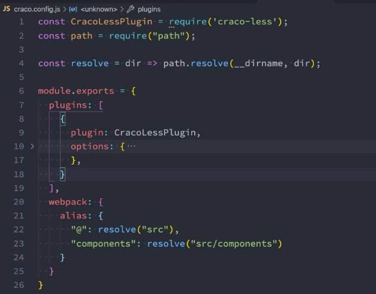
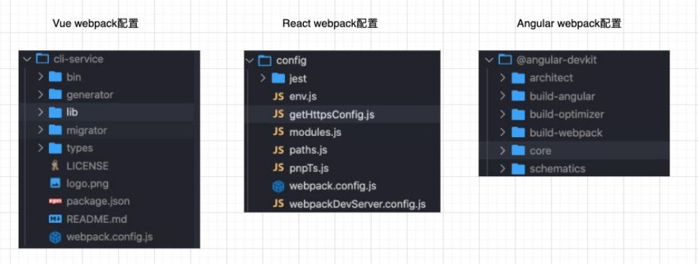
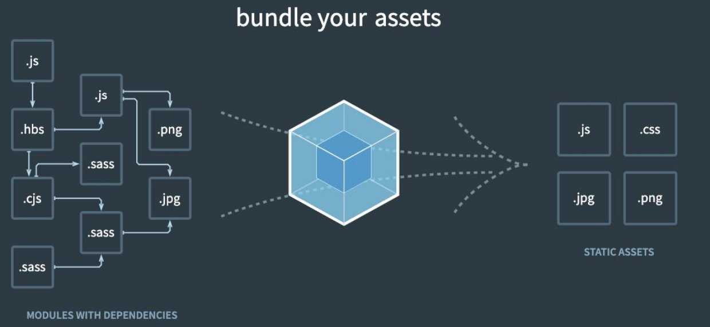
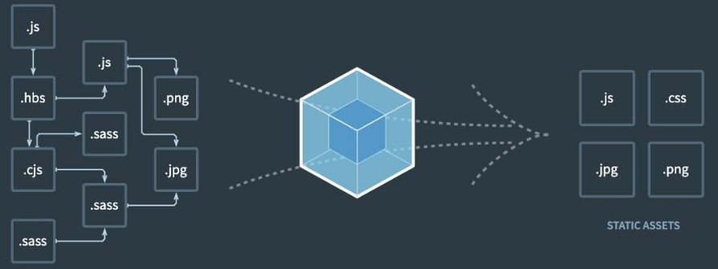
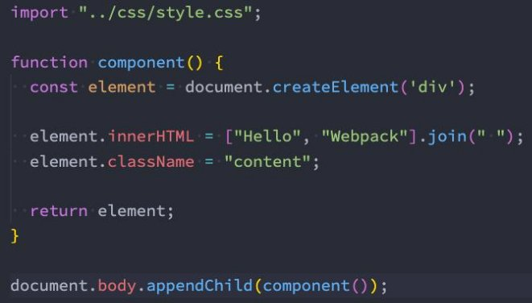

## **Node内置模块 path**

- **path模块⽤于对 路径和⽂件 进⾏处理，提供了很多好⽤的⽅法。**
- **我们知道在 Mac OS、 Linux和 window上的路径时不⼀样的**
  - window上会 使⽤` \`或者 `\\` 来作为⽂件路径的分隔符，当然⽬前也⽀持 /；  
  - 在 Mac OS、 Linux的 Unix操作系统上 使⽤ / 来作为⽂件路径的分隔符；


- **那么如果我们在 window上使⽤ \ 来作为分隔符开发了⼀个应⽤程序，要部署到 Linux上⾯应该怎么办呢？**  
  - 显示 路径会出现⼀些问题 ；
  - 所以 为了屏蔽他们之间的差异 ， 在开发中对于路径的操作我们可以使⽤ path 模块 ；


- **可移植操作系统接⼝（英语： Portable Operating System Interface，缩写为 POSIX）**

  - Linux和 Mac OS都实现了 POSIX接⼝；
  - Window部分电脑实现了 POSIX接⼝；


### **path常⻅的 API**

- **从路径中获取信息**  
  - dirname：获取⽂件的⽗⽂件夹；  
  - basename：获取⽂件名；  
  - extname：获取⽂件扩展名；

- **路径的拼接： **
  - **path.join**  
    - 如果我们希望将多个路径进⾏拼接，但是不同的操作系统可能使⽤的是不同的分隔符；  这个时候我们可以使⽤ path.join函数；

- **拼接绝对路径：**
  - **path.resolve**
    - path.resolve() ⽅法会把⼀个路径或路径⽚段的序列解析为⼀个绝对路径；  
    - 给定的路径的序列是从右往左被处理的，后⾯每个 path 被依次解析，直到构造完成⼀个绝对路径；  
    - 如果在处理完所有给定 path的段之后，还没有⽣成绝对路径，则使⽤当前⼯作⽬录； 
    -  ⽣成的路径被规范化并删除尾部斜杠，零⻓度 path段被忽略；
    - 如果没有 path传递参数， path.resolve()将返回当前⼯作⽬录的绝对路径；


### **在 webpack中的使⽤**

- **在 webpack中获取路径或者起别名的地⽅也可以使⽤**



## **认识 webpack**

- **事实上随着前端的快速发展，⽬前前端的开发已经变的越来越复杂了：**
  - ⽐如开发过程中我们需要通过 模块化的⽅式 来开发；
  - ⽐如也会使⽤⼀些 ⾼级的特性来加快我们的开发效率或者安全性 ，⽐如通过 ES6+、 TypeScript开发脚本逻辑，通过 sass、 less等⽅式来编写 css样式代码；
  - ⽐如开发过程中，我们还希望 实时的监听⽂件的变化 来并且 反映到浏览器上 ，提⾼开发的效率；
  - ⽐如开发完成后我们还需要 将代码进⾏压缩、合并以及其他相关的优化 ；
  - 等等 ….


- **但是对于很多的 前端开发者 来说，并不需要思考这些问题，⽇常的开发中根本就没有⾯临这些问题：**  
  - 这是因为⽬前前端开发我们通常都会直接使⽤三⼤框架来开发： Vue、 React、 Angular；  
  - 但是事实上，这三⼤框架的创建过程我们都是 借助于脚⼿架（ CLI） 的；
  - 事实上 Vue-CLI、 create-react-app、 Angular-CLI都是 基于 webpack来帮助我们⽀持模块化、 less、 TypeScript、打包优化等的；


- 事实上我们上⾯提到的所有脚⼿架都是依赖于 webpack的：



### **Webpack到底是什么呢？**

- **我们先来看⼀下官⽅的解释：**

> webpack is a static module bundler for modern JavaScript applications.
>

- **webpack是⼀个静态的模块化打包⼯具，为现代的 JavaScript应⽤程序；**
- 我们来对上⾯的解释进⾏拆解：

  - 打包 bundler： webpack可以将帮助我们进⾏打包，所以它是⼀个打包⼯具


  - 静态的 static： 这样表述的原因是我们最终可以将代码打包成最终的静态资源（部署到静态服务器）；


  - 模块化 module： webpack默认⽀持各种模块化开发， ES Module、 CommonJS、 AMD等；


  - 现代的 modern： 我们前端说过，正是因为现代前端开发⾯临各种各样的问题，才催⽣了 webpack的出现和发展；




### **Vue项⽬加载的⽂件有哪些呢？**

- **JavaScript的打包：**
  - 将 ES6转换成 ES5的语法；  
  - TypeScript的处理，将其转换成 JavaScript；


- **Css的处理：**  
  - CSS⽂件模块的加载、提取；  
  - Less、 Sass等预处理器的处理；

- **资源⽂件 img、 font：**  
  - 图⽚ img⽂件的加载；  
  - 字体 font⽂件的加载；

- **HTML资源的处理：**
  - 打包 HTML资源⽂件；


- **处理 vue项⽬的 SFC⽂件 .vue⽂件；**

### **Webpack的使⽤前提**

- **webpack的官⽅⽂档是 [https://webpack.js.org/ ](https://webpack.js.org/)** 
  - webpack的中⽂官⽅⽂档是 [https://webpack.docschina.org/ ](https://webpack.docschina.org/) 
  - DOCUMENTATION：⽂档详情，也是我们最关注的

- **Webpack的运⾏是依赖 Node环境 的，所以我们电脑上必须有 Node环境**
  - 所以我们需要先安装 Node.js，并且同时会安装 npm；
  - 我当前电脑上的 node版本是 v16.15.1， npm版本是 8.11.0（你也可以使⽤ nvm或者 n来管理 Node版本）；  Node官⽅⽹站： <https://nodejs.org/>


### **Webpack的安装**

- **webpack的安装⽬前分为两个： webpack、 webpack-cli**
- **那么它们是什么关系呢？**

  - 执⾏ webpack命令，会执⾏ node\_modules下的 .bin⽬录下的 webpack；


  - webpack在执⾏时是依赖 webpack-cli的，如果没有安装就会报错；


  - ⽽ webpack-cli中代码执⾏时，才是真正利⽤ webpack进⾏编译和打包的过程；


  - 所以在安装 webpack时，我们需要同时安装 webpack-cli（第三⽅的脚⼿架事实上是没有使⽤ webpack-cli的，⽽是类似于⾃⼰的 vue-service-cli的东⻄）


```shell
# 全局安装
npm install webpack webpack-cli –g 
# 局部安装
npm install webpack webpack-cli –D 
```

### **Webpack的默认打包**

- 我们可以通过 webpack进⾏打包，之后运⾏ 打包之后 的代码  在⽬录下直接执⾏ webpack 命令

- **⽣成⼀个 dist⽂件夹，⾥⾯存放⼀个main.js的⽂件，就是我们打包之后的⽂件：**  
  - 这个⽂件中的代码被压缩和丑化了；
  - 另外我们发现代码中依然存在 ES6的语法，⽐如箭头函数、 const等，这是因为默认情况下 webpack并不清楚我们打包后的⽂件是否需要转成 ES5之前的语法，后续我们需要通过 babel来进⾏转换和设置；


- **我们发现是可以正常进⾏打包的，但是有⼀个问题， webpack是如何确定我们的⼊⼝的呢？**  
  - 事实上，当我们运⾏ webpack时， webpack会查找当前⽬录下的 src/index.js作为⼊⼝；  
  - 所以，如果当前项⽬中没有存在 src/index.js⽂件，那么会报错；

- **当然，我们也可以通过配置来指定⼊⼝和出⼝**
  - `npx webpack --entry ./src/main.js --output-path ./build`


### **创建局部的 webpack**

- 前⾯我们直接执⾏ webpack命令使⽤的是全局的 webpack，如果希望使⽤局部的可以按照下⾯的步骤来操作。
- 第⼀步：创建 package.json⽂件，⽤于管理项⽬的信息、库依赖等
  - `npm init`


- 第⼆步：安装局部的 webpack
  - `npm install webpack webpack-cli -D`


- 第三步：使⽤局部的 webpack
  - `npx webpack`


- 第四步：在 package.json中创建 scripts脚本，执⾏脚本打包即可
  - `{scripts:{build:webpack}}`
  - `npm run build`


### **Webpack配置⽂件**

- 在通常情况下， webpack需要打包的项⽬是⾮常复杂的，并且我们需要⼀系列的配置来满⾜要求，默认配置必然是不可以的。

- 我们可以在根⽬录下创建⼀个 webpack.config.js⽂件，来作为 webpack的配置⽂件：

  ```js
  const path = require("path")
  
  module.exports = {
    entry: "./src/main.js",
    output: {
      filename: "bundle.js",
      path: path.resolve(__dirname, "./build")
    }
  }
  
  ```

### **指定配置⽂件**

- **但是如果我们的配置⽂件并不是 webpack.config.js的名字，⽽是其他的名字呢？**  
  - ⽐如我们将 webpack.config.js修改成了 wk.config.js；  
  - 这个时候我们可以通过 --config 来指定对应的配置⽂件；
  - `webpack --config wk.config.js`


- 但是每次这样执⾏命令来对源码进⾏编译，会⾮常繁琐，所以我们可以在 package.json中增加⼀个新的脚本：
  - 之后我们执⾏ npm run build来打包即可。
  - `"scripts": {"build": "webpack --config wk.config.js" }`


### **Webpack的依赖图**

- **webpack到底是如何对我们的项⽬进⾏打包的呢？**
  - 事实上 webpack在处理应⽤程序时，它会根据命令或者配置⽂件找到⼊⼝⽂件；
  - 从⼊⼝开始，会⽣成⼀个 依赖关系图 ，这个 依赖关系图 会包含应⽤程序中所需的所有模块（⽐如 .js⽂件、 css⽂件、图⽚、字体等）；
  - 然后遍历图结构，打包⼀个个模块（根据⽂件的不同使⽤不同的 loader来解析）；




**编写案例代码**

- **我们创建⼀个 component.js**
  - 通过 JavaScript创建了⼀个元素，并且希望给它设置⼀些样式；
  - 继续编译命令 npm run build

## Webpack处理样式资源

### **css-loader的使⽤**

- **上⾯的错误信息告诉我们需要⼀个 loader来加载这个 css⽂件，但是 loader是什么呢？**
  - loader 可以⽤于对 模块的源代码 进⾏转换；
  - 我们可以 将 css⽂件也看成是⼀个模块 ，我们是 通过 import来加载这个模块 的；
  - 在加载这个模块时， webpack其实并不知道如何对其进⾏加载 ，我们必须制定对应的 loader来完成这个功能；


- **那么我们需要⼀个什么样的 loader呢？**
  - 对于加载 css⽂件来说，我们需要⼀个可以读取 css⽂件的 loader；  这个 loader最常⽤的是 css-loader；


- css-loader的安装：
  - `npm install css-loader -D`


**css-loader的使⽤⽅案**

- **如何使⽤这个 loader来加载 css⽂件呢？有三种⽅式：**  
  - 内联⽅式；
  - CLI⽅式（ webpack5中不再使⽤）；  
  - 配置⽅式；


- **内联⽅式：** 
  - 内联⽅式使⽤较少，因为不⽅便管理； 
  -  在引⼊的样式前加上使⽤的 loader，并且使⽤ !分割；
  - `import "css-loader!./style.css"`


- **CLI⽅式**
  - 在 webpack5的⽂档中已经没有了 --module-bind；  
  - 实际应⽤中也⽐较少使⽤，因为不⽅便管理；


- **loader配置⽅式**

  - **配置⽅式表示的意思是在我们的 webpack.config.js⽂件中写明配置信息：**

    - module.rules中允许我们配置多个 loader（因为我们也会继续使⽤其他的 loader，来完成其他⽂件的加载）；

    - 这种⽅式可以更好的表示 loader的配置，也⽅便后期的维护，同时也让你对各个 Loader有⼀个全局的概览；


  - **module.rules的配置如下：**

    - rules属性对应的值是⼀个数组： **[Rule]**

    - 数组中存放的是⼀个个的 Rule， Rule是⼀个对象，对象中可以设置多个属性：

      - test属性： ⽤于对 resource（资源）进⾏匹配的，通常会设置成正则表达式；

      - use属性： 对应的值时⼀个数组： **[UseEntry]**
        - UseEntry是⼀个对象，可以通过对象的属性来设置⼀些其他属性
          - loader： 必须有⼀个 loader属性，对应的值是⼀个字符串；
          - options： 可选的属性，值是⼀个字符串或者对象，值会被传⼊到 loader中；
          - query： ⽬前已经使⽤ options来替代；

  - **module.rules的简写**

    - 简写一：如果只有一个loader
      - `loader: "css-loader"`
    - 简写二：多个loader不需要其他属性时, 可以直接写loader字符串形式
      - ` use: [ "style-loader","css-loader",  "postcss-loader" ]`


```js
const path = require("path")

module.exports = {
  entry: "./src/main.js",
  output: {
    filename: "bundle.js",
    path: path.resolve(__dirname, "./build")
  },
  module: {
    rules: [
      {
        // 告诉webpack匹配什么文件
        test: /\.css$/,
        // use中多个loader的使用顺序是从后往前
         use: [ 
           { loader: "style-loader" },
           { loader: "css-loader" }
        ],
        
        // 简写一: 如果loader只有一个
        // loader: "css-loader"
        // 简写二: 多个loader不需要其他属性时, 可以直接写loader字符串形式
       // use: [ "style-loader","css-loader",  "postcss-loader" ]
      }
    ]
  }
}

```

### **认识 style-loader**

- 我们已经可以通过 css-loader来加载 css⽂件了
  - 但是你会发现这个 css在我们的代码中并 没有⽣效（⻚⾯没有效果） 。


- 这是为什么呢？
  - 因为 css-loader只是 负责将 .css⽂件进⾏解析 ，并不会将解析之后的 css插⼊到⻚⾯ 中；  
  - 如果我们希望再完成 插⼊ style的操作 ，那么我们还需要另外⼀个 loader，就是 style-loader；


- 安装 style-loader：
  - `npm install style-loader -D`


#### **配置 style-loader**

- 那么我们应该如何使⽤ style-loader：
  - 在配置⽂件中，添加 style-loader；

- 注意：因为 loader的执⾏顺序是从右向左（或者说从下到上，或者说从后到前的），所以我们需要将 style-loader写到 css-loader的前⾯；

```js
//将 style-loader写到 css-loader的前⾯； 
use: [ 
    "style-loader",
    "css-loader", 
 ]
```

- 重新执⾏编译 npm run build，可以发现打包后的 css已经⽣效了：  
  - 当前⽬前我们的 css是通过⻚内样式的⽅式添加进来的；  
  - 后续我们也会讲如何将 css抽取到单独的⽂件中，并且进⾏压缩等操作；


### **如何处理 less⽂件？**

- 在我们开发中，我们可能会使⽤ less、 sass、 stylus的预处理器 来编写 css样式，效率会更⾼。
- 那么，如何可以让我们的 环境⽀持这些预处理器 呢？

  - ⾸先我们需要确定， less、 sass等编写的 css需要通过⼯具转换成普通的 css；

  - ⽐如我们编写如下的 less样式：


#### **Less⼯具处理**

- 我们可以使⽤ less⼯具来完成它的编译转换：
  - `npm install less -D`


- 执⾏如下命令：
  - `npx lessc ./src/css/title.less title.css`


**less-loader处理**

- 但是在项⽬中我们会编写⼤量的css，它们如何可以⾃动转换呢？ 
-   这个时候我们就可以使⽤less-loader，来⾃动使⽤ less⼯具转换 less到 css；
  - `npm install less-loader -D`


- 配置 webpack.config.js

  - ```js
     {
        test:/\.less$/,
        use:['style-loader','css-loader','less-loader']
     }
    ```

- 执⾏ npm run build

  - less就可以⾃动转换成 css，并且⻚⾯也会⽣效了


### **认识 PostCSS⼯具**

- 什么是 PostCSS呢？
  - PostCSS是⼀个通过 JavaScript来转换样式的⼯具；
  - 这个⼯具可以帮助我们进⾏⼀些 CSS的转换和适配，⽐如⾃动添加浏览器前缀、 css样式的重置；  
  - 但是实现这些功能，我们需要借助于 PostCSS对应的插件；


- 如何使⽤ PostCSS呢？主要就是两个步骤：
  - 第⼀步：查找 PostCSS在构建⼯具中的扩展，⽐如 webpack中的 postcss-loader；  
  - 第⼆步：选择可以添加你需要的 PostCSS相关的插件；


#### **postcss-loader**

- 我们可以借助于构建⼯具：
  - 在 webpack中使⽤ postcss就是使⽤ postcss-loader来处理的；


- 我们来安装 postcss-loader：
  - `npm install postcss-loader -D`


- 我们修改加载 css的 loader：
  - 注意：因为 postcss需要有对应的插件才会起效果，所以我们需要配置它的 plugin；


```js
{
  test:/\.css$/,
  use:['style-loader', 'css-loader', {
    loader:'postcss-loader',
    options:{
      postcssOptions:{
        plugins:[
          require('autoprefixer')
        ]
      }
    }
  } ]
}
```

#### **单独的 postcss配置⽂件**

- 因为我们需要添加前缀，所以要安装 autoprefixer：
  - `npm install autoprefixer -D`


- 我们可以将这些配置信息放到⼀个单独的⽂件中进⾏管理： 
  -  在根⽬录下创建 postcss.config.js


```js
module.exports = {
  plugins:[require('autoprefixer')]
}
```

#### **postcss-preset-env**

- 事实上，在配置 postcss-loader时，我们配置插件并不需要使⽤ autoprefixer。
- 我们可以使⽤另外⼀个插件： **`postcss-preset-env`**
  - postcss-preset-env也是⼀个 postcss的插件；
  - 它可以帮助我们将⼀些现代的 CSS特性，转成⼤多数浏览器认识的 CSS，并且会根据⽬标浏览器或者运⾏时环境添加所需的polyfill；
  - 也包括会⾃动帮助我们添加 autoprefixer（所以相当于已经内置了 autoprefixer）；


- ⾸先，我们需要安装 postcss-preset-env：
  - `npm install postcss-preset-env -D`

- 注意：我们在使⽤某些 postcss插件时，也可以直接传⼊字符串
- 之后，我们直接修改掉之前的 autoprefixer即可：

```js
module.exports = {
  plugins:['postcss-preset-env']
}
```


