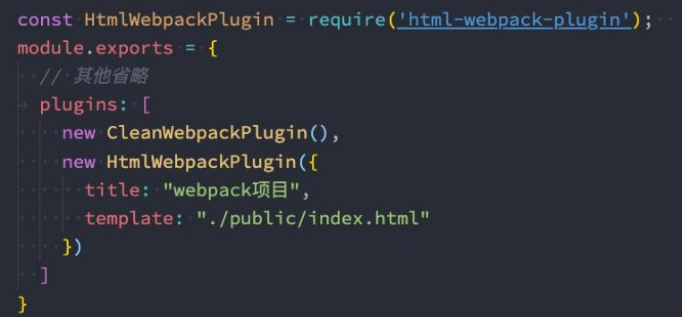
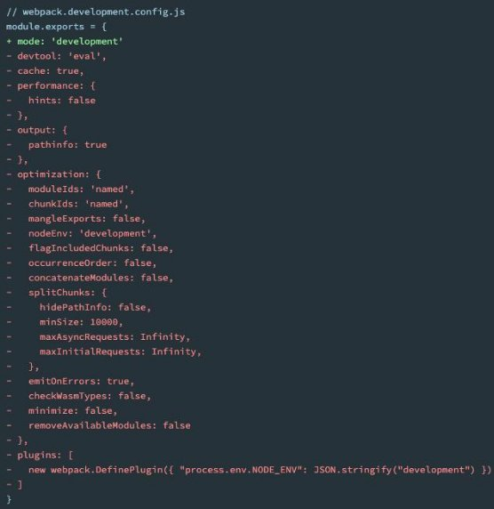
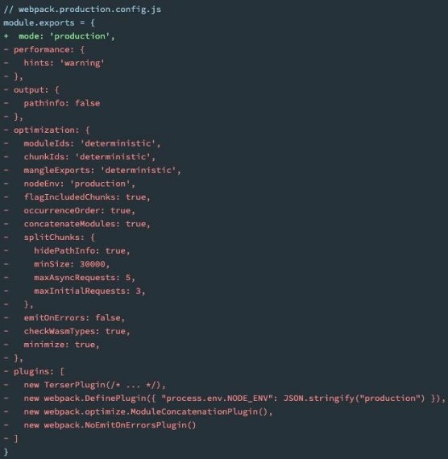


**认识Plugin**

- **Webpack的另一个核心是Plugin，官方有这样一段对Plugin的描述：**
- While loaders are used to transform certain types of modules, plugins can be leveraged to perform a wider range of tasks like bundle optimization, asset management and injection of environment variables.
- **上面表达的含义翻译过来就是：**
- Loader是用于特定的模块类型进行转换；
- Plugin可以用于执行更加广泛的任务，比如打包优化、资源管理、环境变量注入等；

**CleanWebpackPlugin**

- **前面我们演示的过程中，每次修改了一些配置，重新打包时，都需要**
- 我们可以借助于一个插件来帮助我们完成，这个插件就是
- **首先，我们先安装这个插件：**

**手动删除dist文件夹：** CleanWebpackPlugin；

npm install clean-webpack-plugin -D

- **之后在插件中配置：**

**HtmlWebpackPlugin**

- **另外还有一个不太规范的地方：**
- 我们的HTML文件是编写在根目录下的，而最终打包的dist文件夹中是没有index.html文件的。
- 在进行项目部署的时，必然也是需要有对应的入口文件index.html；
- 所以我们也需要对index.html进行打包处理；
- **对HTML进行打包处理我们可以使用另外一个插件：HtmlWebpackPlugin；**

npm install html-webpack-plugin -D

**生成index.html分析**

- **我们会发现，现在自动在dist文件夹中，生成了一个index.html的文件：**
- 该文件中也自动添加了我们打包的bundle.js文件；

- **这个文件是如何生成的呢？**
- 默认情况下是根据ejs的一个模板来生成的；
- 在html-webpack-plugin的源码中，有一个default\_index.ejs模块；

**自定义HTML模板**

- **如果我们想在自己的模块中加入一些比较特别的内容：**
- 比如添加一个noscript标签，在用户的JavaScript被关闭时，给予响应的提示；
- 比如在开发vue或者react项目时，我们需要一个可以挂载后续组件的根标签`

`；
- **这个我们需要一个属于自己的index.html模块：**

**自定义模板数据填充**

- **上面的代码中，会有一些类似这样的语法`<%  变量 %>`，这个是EJS模块填充数据的方式。**
- **在配置HtmlWebpackPlugin时，我们可以添加如下配置：**
- **template：**指定我们要使用的模块所在的路径；
- **title：**在进行htmlWebpackPlugin.options.title读取时，就会读到该信息；

**DefinePlugin的介绍**

- **但是，这个时候编译还是会报错，因为在我们的模块中还使用到一个BASE\_URL的常量：**

- **这是因为在编译template模块时，有一个BASE\_URL：**
- `<link rel="icon" href="<%= BASE\_URL %>favicon.ico">`；
- 但是我们并没有设置过这个常量值，所以会出现没有定义的错误；
- **这个时候我们可以使用DefinePlugin插件；**

**DefinePlugin的使用**

- **DefinePlugin允许在编译时创建配置的全局常量，是一个webpack内置的插件（不需要单独安装）：**

- **这个时候，编译template就可以正确的编译了，会读取到BASE\_URL的值；**

**Mode配置**

- **前面我们一直没有讲mode。**
- **Mode配置选项，可以告知webpack使用相应模式的内置优化：**
- 默认值是production（什么都不设置的情况下）；
- 可选值有：'none' | 'development' | 'production'；
- **这几个选项有什么样的区别呢？**

**Mode配置代表更多**

 
