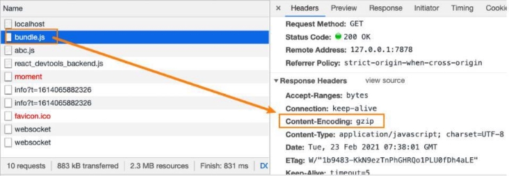
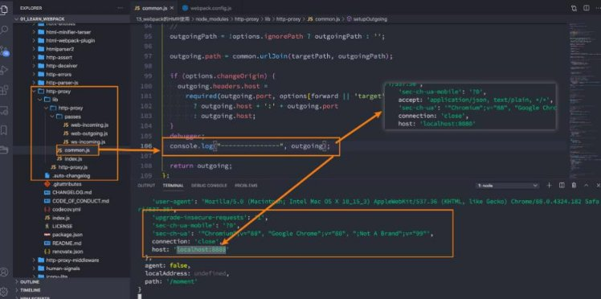

## 总结

### 4.1. 使用webpack-dev-server

### 4.2. HMR热模块替换

### 4.3. devServer配置

* host
* port
* open
* compress


## Webpack-搭建服务器

**为什么要搭建本地服务器？**

- **目前我们开发的代码，为了运行需要有两个操作：**
  - 操作一：npm run build，编译相关的代码；
  - 操作二：通过live server或者直接通过浏览器，打开index.html代码，查看效果；

- **这个过程经常操作会影响我们的开发效率，我们希望可以做到，当文件发生变化时，可以自动的完成 编译 和 展示；**
- **为了完成自动编译，webpack提供了几种可选的方式：**
  - webpack watch mode；
  - webpack-dev-server（常用）；
  - webpack-dev-middleware；


### **webpack-dev-server**

- **上面的方式可以监听到文件的变化，但是事实上它本身是没有自动刷新浏览器的功能的：**
  - 当然，目前我们可以在VSCode中使用live-server来完成这样的功能；
  - 但是，我们希望在不适用live-server的情况下，可以具备live reloading（实时重新加载）的功能；

- **安装webpack-dev-server**
  - `npm install webpack-dev-server -D`


- **修改配置文件，启动时加上serve参数：**

```js
"scripts": {
    "build": "webpack --config wk.config.js",
    "serve": "webpack serve --config wk.config.js"
},
```

- **webpack-dev-server 在编译之后不会写入到任何输出文件，而是将 bundle 文件保留在内存中：**
  - 事实上webpack-dev-server使用了一个库叫memfs（memory-fs webpack自己写的）


## **模块热替换（HMR）**

- **什么是HMR呢？**
  - HMR的全称是Hot Module Replacement，翻译为模块热替换；
  - 模块热替换是指在 应用程序运行过程中，替换、添加、删除模块，而无需重新刷新整个页面；

- **HMR通过如下几种方式，来提高开发的速度：**
  - 不重新加载整个页面，这样可以保留某些应用程序的状态不丢失；
  - 只更新需要变化的内容，节省开发的时间；
  - 修改了css、js源代码，会立即在浏览器更新，相当于直接在浏览器的devtools中直接修改样式；

- **如何使用HMR呢？**
  - 默认情况下，webpack-dev-server已经支持HMR，我们只需要开启即可（默认已经开启）；
  - 在不开启HMR的情况下，当我们修改了源代码之后，整个页面会自动刷新，使用的是live reloading；


### **开启HMR**

- **修改webpack的配置：**


- **浏览器可以看到如下效果：**


- **但是你会发现，当我们修改了某一个模块的代码时，依然是刷新的整个页面：**
  - 这是因为我们需要去指定哪些模块发生更新时，进行HMR；
  - 在入口文件中，写入以下代码


```js
//main.js
// 指定哪一个模块需要HMR
if (module.hot) {
  module.hot.accept("./utils/math.js", () => {
    console.log("math模块发生了刷新")
  })
}
```

- 如果修改入口文件main.js，整个页面还是会刷新。

### **框架的HMR**

- 有一个问题：在开发其他项目时，我们是否需要经常手动去写入 module.hot.accpet
- 比如开发Vue、React项目，我们修改了组件，希望进行热更新，这个时候应该如何去操作呢？相关的API呢？
- 事实上社区已经针对这些有很成熟的解决方案了：
  - 比如vue开发中，我们使用vue-loader，此loader支持vue组件的HMR，提供开箱即用的体验；
  - 比如react开发中，有React Hot Loader，实时调整react组件（目前React官方已经弃用了，改成使用react-refresh）；


## **webpack-server的配置**

- host：

  - host设置主机地址：
    - 默认值是localhost；
    - 如果希望其他地方也可以访问，可以设置为 0.0.0.0；


  - localhost 和 0.0.0.0 的区别：
    - localhost：本质上是一个域名，通常情况下会被解析成127.0.0.1;
      - 127.0.0.1：回环地址(Loop Back Address)，表达的意思其实是我们主机自己发出去的包，直接被自己接收;
      - 正常的数据库包经常 应用层 - 传输层 - 网络层 - 数据链路层 - 物理层 ;
      - 而回环地址，是在网络层直接就被获取到了，是不会经常数据链路层和物理层的; 
      - 比如我们监听 127.0.0.1时，在同一个网段下的主机中，通过ip地址是不能访问的;
      - 0.0.0.0：监听IPV4上所有的地址，再根据端口找到不同的应用程序;
        - 比如我们监听 0.0.0.0时，在同一个网段下的主机中，通过ip地址是可以访问的;


- port：
  - 设置监听的端口，默认情况下是8080

- open：
  - 是否打开浏览器：
  - 默认值是false，设置为true会打开浏览器；
  - 也可以设置为类似于 Google Chrome等值；

- compress：
  - 是否为静态文件开启gzip compression：
  - 默认值是false，可以设置为true；




- proxy：

  - proxy是我们开发中非常常用的一个配置选项，它的目的设置代理来解决跨域访问的问题：
    - 比如我们的一个api请求是 http://localhost:8888，但是本地启动服务器的域名是 http://localhost:8000，这个时候发送网 络请求就会出现跨域的问题；
    - 那么我们可以将请求先发送到一个代理服务器，代理服务器和API服务器没有跨域的问题，就可以解决我们的跨域问题了；


  - 我们可以进行如下的设置**：**
    - target：表示的是代理到的目标地址，比如 /api-hy/moment会被代理到 http://localhost:8888/api-hy/moment；
      - pathRewrite：默认情况下，我们的 /api-hy 也会被写入到URL中，如果希望删除，可以使用pathRewrite；
      - secure：默认情况下不接收转发到https的服务器上，如果希望支持，可以设置为false；
      - changeOrigin：它表示是否更新代理后请求的headers中host地址；


- changeOrigin的解析：
  - 修改代理请求中的headers中的host属性：
    - 因为我们真实的请求，其实是需要通过 http://localhost:8888来请求的；
    - 但是因为使用了代码，默认情况下它的值时 http://localhost:8000；
    - 如果我们需要修改，那么可以将changeOrigin设置为true即可；




- historyApiFallback：

  - historyApiFallback是开发中一个非常常见的属性，它主要的作用是解决SPA页面在路由跳转之后，进行页面刷新时，返回404 的错误。

  - boolean值：默认是false
    - 如果设置为true，那么在刷新时，返回404错误时，会自动返回index.html 的内容


  - object类型的值，可以配置rewrites属性：
    - 可以配置from来匹配路径，决定要跳转到哪一个页面；


- 事实上devServer中实现historyApiFallback功能是通过 connect-history-api-fallback库的：；
  - 可以查看[connect-history-api-fallback 文档](https://github.com/bripkens/connect-history-api-fallback)


**Webpack区分开发环境**

- **目前我们所有的webpack配置信息都是放到一个配置文件中的：webpack.config.js**
  - 当配置越来越多时，这个文件会变得越来越不容易维护；
  - 并且某些配置是在开发环境需要使用的，某些配置是在生成环境需要使用的，当然某些配置是在开发和生成环境都会使用的；
  - 所以，我们最好对配置进行划分，方便我们维护和管理；

- **那么，在启动时如何可以区分不同的配置呢？**
  - 方案一：编写两个不同的配置文件，开发和生成时，分别加载不同的配置文件即可；
  - 方式二：使用相同的一个入口配置文件，通过设置参数来区分它们；


### **入口文件解析**

- **我们之前编写入口文件的规则是这样的：./src/index.js，但是如果我们的配置文件所在的位置变成了 config 目录，我们是否应 该变成 ../src/index.js呢？**
  - 如果我们这样编写，会发现是报错的，依然要写成 ./src/index.js；
  - 这是因为入口文件其实是和另一个属性时有关的 context；

- **context的作用是用于解析入口（entry point）和加载器（loader）：**
  - 官方说法：默认是当前路径（但是经过我测试，默认应该是webpack的启动目录）
  - 另外推荐在配置中传入一个值；


 


### **区分开发和生成环境配置**

- **这里我们创建三个文件：**
  - webpack.comm.conf.js
  - webpack.dev.conf.js
  - webpack.prod.conf.js

## 作业

### webpack如何开启本地服务器，并且提高页面的更新效率（HMR）？
