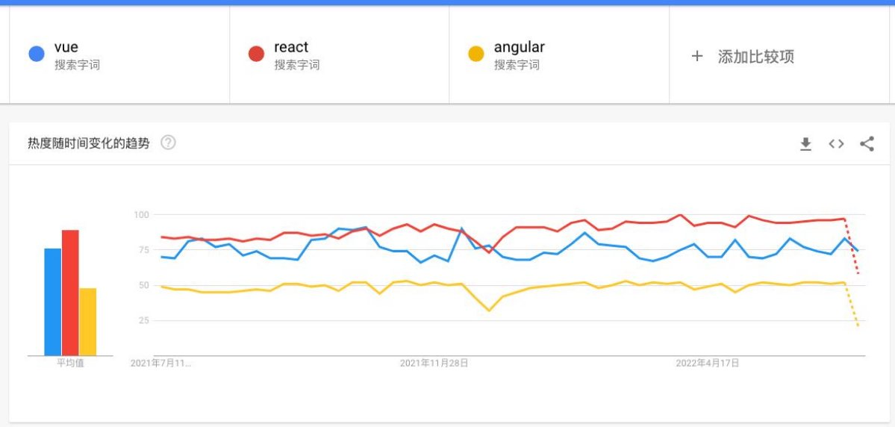

**邂逅Vue.js开发 **

王红元 coderwhy

|**目录 content**|**1**|**Vue在前端重要性**|
| :- | - | - |
||**2**|**Vue2和Vue3选择**|
||**3**|**引入Vue的方式**|
||**4**|**Vue案例初体验**|
||**5**|**命令和声明式编程**|
||**6**|**Vue的options**|

**认识Vue![ref1]**

- **Vue (读音 /vjuː/，类似于 view) 是一套用于构建用户界面的渐进式 JavaScript框架。**
- 全称是Vue.js或者Vuejs；
- 它基于标准 HTML、CSS 和 JavaScript 构建，并提供了一套声明式的、组件化的编程模型；
- 帮助你高效地开发用户界面，无论任务是简单还是复杂；
- **什么是渐进式框架呢？**

✓ 表示我们可以在项目中一点点来引入和使用Vue，而不一定需要全部使用Vue来开发整个项目；

**目前Vue在前端处于什么地位？![ref1]**

- **目前前端最流行的是三大框架：Vue、React、Angular。**

**Angular![ref2]**

入门门槛较高，并且国内市场占率较低； 不否认本身非常优秀的框架；

**React![ref2]**

React在国内外的市场占有率都是非常高的； 作为前端工程师也是必须学习的一个框架；

**Vue![ref2]**

Vue在国内市场占有率是最高的； 几乎所有的前端岗位都会对Vue有要求；

**框架数据对比（Google指数）![ref1]**

**框架数据对比（百度指数）![ref1]**

**npm下载量![ref1]**

**框架数据对比（GitHub）![ref1]**

**谁是最好的前端框架？![ref1]**

- **当然，我不会去给出我的结论：**
- 首先，这是一个敏感的话题，在很多地方都争论不休，就像很多人喜欢争论谁才是世界上最好的语言一样；
- 其次，争论这个话题是没有意义的，争论不休的话题；
- **但是，我们从现实的角度，分析一下，学习哪一门语言更容易找到工作？**
- 找后端的工作：优先推荐Java、其次推荐Go、再次推荐Node（JavaScript），可能不推荐PHP、C#；
- 找前端的工作：优先推荐JavaScript（TypeScript）、其次Flutter、再次Android（Java、Kotlin）、iOS（OC、Swift）；
- 也有很多的其他方向：游戏开发、人工智能、算法工程师等等；
- **那么，就前端来说，学习了HTML、CSS、JavaScript，哪一个框架更容易找到工作？**
- 如果去国外找工作，优先推荐React、其次是Vue和Angular；
- 如果在国内找工作，优先推荐、必须学习Vue，其次是React，其次是Angular；

**Vue对前端工程师的重要性**

**学好Vue你一定可以找到一份满意的前端工作 如果你没有掌握Vue很难找到一份满意的前端工作**

**前端岗位**

**学习vue2还是vue3？![ref1]**

**目前需要学习Vue3吗？![ref1]**

- 在2020年的9月19日，万众期待的
- 更好的性能；
- 更小的包体积；
- 更好的TypeScript集成；
- 更优秀的API设计。

Vue3终于发布了正式版，命名为

**“One Piece”**。

- **那么现在是否是学习vue3的时间呢？**
- 答案是肯定的
- Vue3目前已经是稳定的版本，并且Vue3在2022年2月7日已经成为默认安装版本；
- 目前社区也经过一定时间的沉淀，更加的完善了，包括AntDesignVue、Element-Plus都提供了对Vue3的支持，所以很多公 司目前新的项目都已经在使用Vue3来进行开发了。
- 并且在面试的时候，几乎都会问到各种各样Vue3相关的问题；

**如何使用Vue呢？![ref1]**

- **Vue的本质，就是一个JavaScript的库：**
- 刚开始我们不需要把它想象的非常复杂；
- 我们就把它理解成一个已经帮助我们封装好的库；
- 在项目中可以引入并且使用它即可。
- **那么安装和使用Vue这个JavaScript库有哪些方式呢？**
- 方式一：在页面中通过CDN的方式来引入；
- 方式二：下载Vue的JavaScript文件，并且自己手动引入；
- 方式三：通过npm包管理工具安装使用它（webpack再讲）；
- 方式四：直接通过Vue CLI创建项目，并且使用它；

**方式一：CDN引入![ref1]**

- **Vue的CDN引入：**

- Hello Vue案例的实现：

**方式二：下载和引入![ref1]**

- **下载Vue的源码，可以直接打开CDN的链接：**
- 打开链接，复制其中所有的代码；
- 创建一个新的文件，比如vue.js，将代码复制到其中；
- **通过script标签，引入刚才的文件：**

- **你好啊，Vue3，案例的实现：**

**Vue初体验![ref1]**

- 案例体验一：动态展示Hello World数据
- 案例体验二：展示列表的数据
- 案例体验三：计数器功能实现

` `

**计数器案例![ref1]**

- **如果我们希望实现一个计数器的案例：**
- 点击+1，那么内容会显示数字+1；
- 点击-1，那么内容会显示数字-1；
- **我们可以选择很多种方式来实现：**
- 在这里我们就对比原生和Vue的实现方式的不同。

**计数器原生实现![ref1]**

**计数器Vue实现![ref1]**

` `

**声明式和命令式![ref1]**

- 原生开发和Vue开发的模式和特点，我们会发现是完全不同的，这里其实涉及到
- 命令式编程和声明式编程；
- 命令式编程关注的是 “how to do”自己完成整个how的过程；
- 声明式编程关注的是 “what to do”，由框架(机器)完成 “how”的过程；

**两种不同的编程范式**：

- **在原生的实现过程中，我们是如何操作的呢？**
- 我们每完成一个操作，都需要通过JavaScript编写一条代码，来给浏览器一个指令；
- 这样的编写代码的过程，我们称之为命令式编程；
- 在早期的原生JavaScript和jQuery开发的过程中，我们都是通过这种命令式的方式在编写代码的；
- **在Vue的实现过程中，我们是如何操作的呢？**
- 我们会在createApp传入的对象中声明需要的内容，模板template、数据data、方法methods；
- 这样的编写代码的过程，我们称之为是声明式编程；
- 目前Vue、React、Angular、小程序的编程模式，我们称之为声明式编程；

**MVVM模型![ref1]**

- **MVC和MVVM都是一种软件的体系结构**
- MVC是Model – View –Controller的简称，是在前期被使用非常框架的架构模式，比如iOS、前端；
- MVVM是Model-View-ViewModel的简称，是目前非常流行的架构模式；
- **通常情况下，我们也经常称Vue是一个MVVM的框架。**
- Vue官方其实有说明，Vue虽然并没有完全遵守MVVM的模型，但是整个设计是受到它的启发的。

**data属性![ref1]**

- **data属性是传入一个函数，并且该函数需要返回一个对象：**
- 在Vue2.x的时候，也可以传入一个对象（虽然官方推荐是一个函数）；
- 在Vue3.x的时候，必须传入一个函数，否则就会直接在浏览器中报错；
- **data中返回的对象会被Vue的响应式系统劫持，之后对该对象的修改或者访问都会在劫持中被处理：**
- 所以我们在template或者app中通过 {{counter}} 访问counter，可以从对象中获取到数据；
- 所以我们修改counter的值时，app中的 {{counter}}也会发生改变；
- **具体这种响应式的原理，我们后面会有专门的篇幅来讲解。**

**methods属性![ref1]**

- **methods属性是一个对象，通常我们会在这个对象中定义很多的方法：**
- 这些方法可以被绑定到 模板中；
- 在该方法中，我们可以使用this关键字来直接访问到data中返回的对象的属性；
- **对于有经验的同学，在这里我提一个问题，官方文档有这么一段描述：**
- 问题一：为什么不能使用箭头函数（官方文档有给出解释）？
- 问题二：不使用箭头函数的情况下，this到底指向的是什么？（可以作为一道面试题）

**问题一：不能使用箭头函数？![ref1]**

- **我们在methods中要使用data返回对象中的数据：**
- 那么这个this是必须有值的，并且应该可以通过this获取到data返回对象中的数据。
- **那么我们这个this能不能是window呢？**
- 不可以是window，因为window中我们无法获取到data返回对象中的数据；
- 但是如果我们使用箭头函数，那么这个this就会是window了；
- **为什么是window呢？**
- 这里涉及到箭头函数使用this的查找规则，它会在自己的上层作用于中来查找this；
- 最终刚好找到的是script作用于中的this，所以就是window；

**问题二：this到底指向什么？![ref1]**

- 事实上Vue的源码当中就是对methods中的所有函数进行了遍历，并且通过bind绑定了this：

**其他属性![ref1]**

- **当然，这里还可以定义很多其他的属性，我们会在后续进行讲解：**
- 比如props、computed、watch、emits、setup等等；
- 也包括很多的生命周期函数；
- **不用着急，我们会一个个学习它们的。**

[ref1]: ./image/Aspose.Words.07eec04f-49aa-40cc-9278-adf3961d1d8b.011.png
[ref2]: ./image/Aspose.Words.07eec04f-49aa-40cc-9278-adf3961d1d8b.014.png
