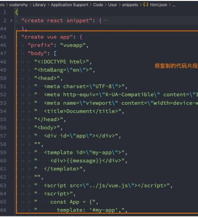
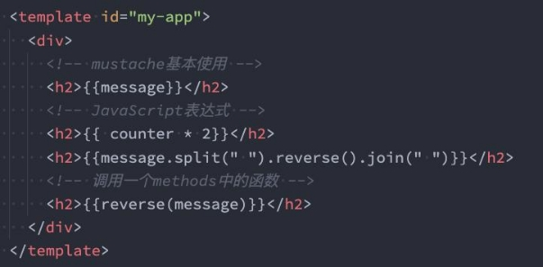
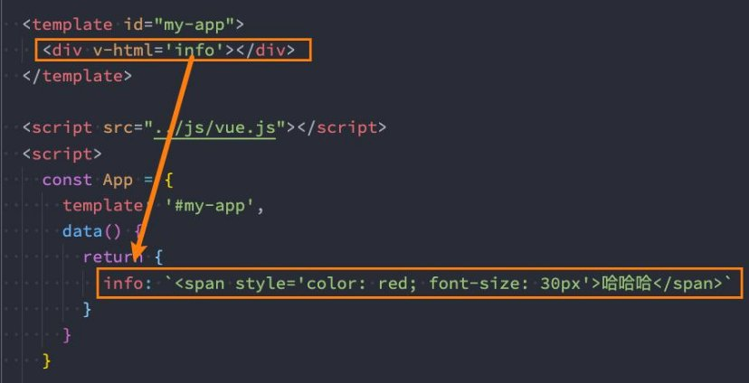
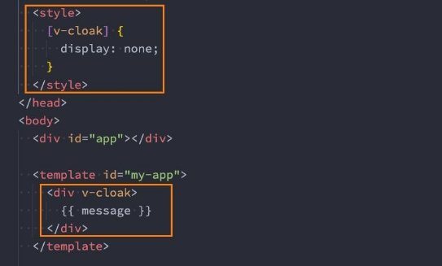
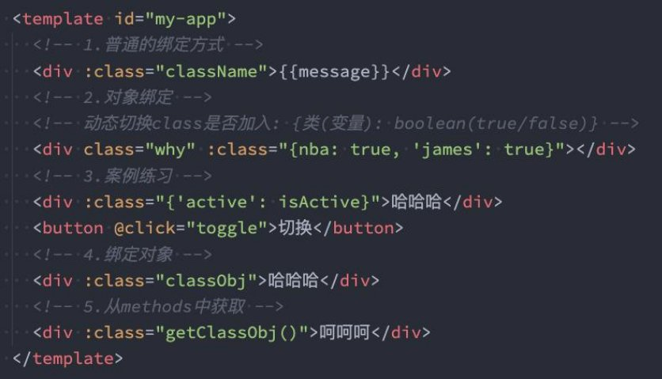
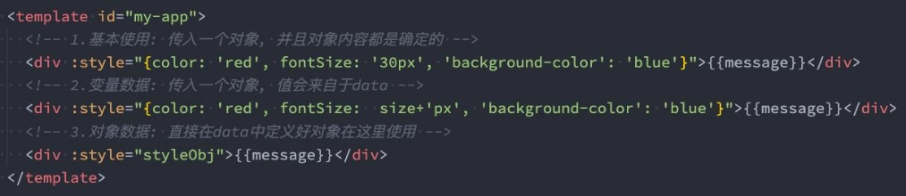

**Vue基础 – 模板语法 **

王红元 coderwhy

|**目录 content**|**1**|**Mustache语法**|
| :- | - | - |
||**2**|**常见的基本指令**|
||**3**|**v-bind绑定属性**|
||**4**|**绑定class和style**|
||**5**|**v-on绑定事件**|
||**6**|**Vue的条件渲染**|

**VSCode代码片段![ref1]**

- **我们在前面练习Vue的过程中，有些代码片段是需要经常写的，我们再VSCode中我们可以生成一个代码片段，方便我们快速生 成。**
- **VSCode中的代码片段有固定的格式，所以我们一般会借助于一个在线工具来完成。**
- **具体的步骤如下：**
- 第一步，复制自己需要生成代码片段的代码；
- 第二步，ht[tps://snippet-generator.app/在该网站中](https://snippet-generator.app/)生成代码片段；
- 第三步，在VSCode中配置代码片段；

**代码片段过程![ref1]**

`  `

**模板语法![ref1]**

- **React的开发模式：**
- React使用的jsx，所以对应的代码都是编写的类似于js的一种语法；
- 之后通过Babel将jsx编译成 React.createElement 函数调用；
- **Vue也支持jsx的开发模式（后续有时间也会讲到）：**
- 但是大多数情况下，使用基于HTML的模板语法；
- 在模板中，允许开发者以声明式的方式将DOM和底层组件实例的数据绑定在一起；
- 在底层的实现中，Vue将模板编译成虚拟DOM渲染函数，这个我会在后续给大家讲到；
- **所以，对于学习Vue来说，学习模板语法是非常重要的。**

**Mustache双大括号语法（掌握）![ref1]**

- **如果我们希望把数据显示到模板（template）中，使用最多的语法是 “Mustache”语法 (双大括号) 的文本插值。**
- 并且我们前端提到过，data返回的对象是有添加到Vue的响应式系统中；
- 当data中的数据发生改变时，对应的内容也会发生更新。
- 当然，Mustache中不仅仅可以是data中的属性，也可以是一个JavaScript的表达式。
- **另外这种用法是错误的：**

 

**v-once指令（了解）![ref1]**

- **v-once用于指定元素或者组件只渲染一次：**
- 当数据发生变化时，元素或者组件以及其所有的子元素将视为静态内容并且跳过；
- 该指令可以用于性能优化；

- **如果是子节点，也是只会渲染一次：**

**v-text指令（了解）![ref1]**

- 用于更新元素的 textContent：

**v-html![ref1]**

- **默认情况下，如果我们展示的内容本身是 html 的，那么vue并不会对其进行特殊的解析。**
- 如果我们希望这个内容被Vue可以解析出来，那么可以使用 v-html 来展示；

**v-pre![ref1]**

- **v-pre用于跳过元素和它的子元素的编译过程，显示原始的**
- 跳过不需要编译的节点，加快编译的速度；

**Mustache标签：**

**v-cloak![ref1]**

- **这个指令保持在元素上直到关联组件实例结束编译。**
- 和 CSS 规则如 [v-cloak] { display: none } 一起用时，这个指令可以隐藏未编译的 Mustache 标签直到组件实例准备完毕。
- 
 不会显示，直到编译结束。

**v-bind的绑定属性![ref1]**

- **前端讲的一系列指令，主要是将值插入到**
- **但是，除了内容需要动态来决定外，某些**
- 比如动态绑定a元素的href属性；
- 比如动态绑定img元素的src属性；

**模板内容中。 属性我们也希望动态来绑定。**

- **绑定属性我们使用v-bind：**
- **缩写**：:
- **预期**：any (with argument) | Object (without argument)
- **参数**：attrOrProp (optional)
- **修饰符**：
  - .camel - 将 kebab-case attribute 名转换为 camelCase。
- **用法**：动态地绑定一个或多个 attribute，或一个组件 prop 到表达式。

**绑定基本属性![ref1]**

- **v-bind用于绑定一个或多个属性值，或者向另一个组件传递props值（这个学到组件时再介绍）；**
- **在开发中，有哪些属性需要动态进行绑定呢？**
- 还是有很多的，比如图片的链接src、网站的链接href、动态绑定一些类、样式等等
- v-bind有一个对应的**语法糖**，也就是简写方式。
- 在开发中，我们通常会使用语法糖的形式，因为这 样更加简洁。

**绑定class介绍![ref1]**

- **在开发中，有时候我们的元素class也是动态的，比如：**
- 当数据为某个状态时，字体显示红色。
- 当数据另一个状态时，字体显示黑色。
- **绑定class有两种方式：**
- 对象语法
- 数组语法

**绑定class – 对象语法![ref1]**

- **对象语法：**我们可以传给 :class (v-bind:class 的简写) 一个对象，以动态地切换 class。

**绑定class – 数组语法![ref1]**

- **数组语法：**我们可以把一个数组传给 :class，以应用一个 class 列表；

**绑定style介绍![ref1]**

- **我们可以利用v-bind:style来绑定一些CSS内联样式：**
- 这次因为某些样式我们需要根据数据动态来决定；
- 比如某段文字的颜色，大小等等；
- **CSS property 名可以用驼峰式 (camelCase) 或短横线分隔 (kebab-case，记得用引号括起来) 来命名；**
- **绑定class有两种方式：**
- 对象语法
- 数组语法

**绑定style演练![ref1]**

- **对象语法：**

- **数组语法：**
- :style 的数组语法可以将多个样式对象应用到同一个元素上；

**动态绑定属性![ref1]**

- **在某些情况下，我们属性的名称可能也不是固定的：**
- 前端我们无论绑定src、href、class、style，属性名称都是固定的；
- 如果属性名称不是固定的，我们可以使用 :[属性名]=“值” 的格式来定义；
- 这种绑定的方式，我们称之为动态绑定属性；

**绑定一个对象![ref1]**

- **如果我们希望将一个对象的所有属性**
- 非常简单，我们可以直接使用

**，绑定到元素上的所有属性** v-bind 绑定一个 对象；

**，应该怎么做呢？**

- **案例：info对象会被拆解成div的各个属性**

**v-on绑定事件![ref1]**

- **前面我们绑定了元素的内容和属性，在前端开发中另外一个非常重要的特性就是交互。**
- **在前端开发中，我们需要经常和用户进行各种各样的交互：**
- 这个时候，我们就必须监听用户发生的事件，比如点击、拖拽、键盘事件等等
- 在Vue中如何监听事件呢？使用v-on指令。
- **接下来我们来看一下v-on的用法：**

**v-on的用法![ref1]**

- **v-on的使用：**
- **缩写**：@
- **预期**：Function | Inline Statement | Object
- **参数**：event
- **修饰符**：
  - .stop - 调用 event.stopPropagation()。
  - .prevent - 调用 event.preventDefault()。
  - .capture - 添加事件侦听器时使用 capture 模式。
  - .self - 只当事件是从侦听器绑定的元素本身触发时才触发回调。
  - .{keyAlias} - 仅当事件是从特定键触发时才触发回调。
  - .once - 只触发一次回调。
  - .left - 只当点击鼠标左键时触发。
  - .right - 只当点击鼠标右键时触发。
  - .middle - 只当点击鼠标中键时触发。
  - .passive - { passive: true } 模式添加侦听器
- **用法**：绑定事件监听

**v-on的基本使用![ref1]**

- 我们可以使用v-on来监听一下点击的事件：

- v-on:click可以写成@click，是它的语法糖写法：

- 当然，我们也可以绑定其他的事件：

- 如果我们希望一个元素绑定多个事件，这个时候可以传入一个对象：

**v-on参数传递![ref1]**

- **当通过methods中定义方法，以供@click调用时，需要注意参数问题：**
- 情况一：如果该方法不需要额外参数，那么方法后的()可以不添加。
- 但是注意：如果方法本身中有一个参数，那么会默认将原生事件event参数传递进去
- 情况二：如果需要同时传入某个参数，同时需要event时，可以通过$event传入事件。

` `

**v-on的修饰符![ref1]**

- **v-on支持修饰符，修饰符相当于对事件进行了一些特殊的处理：**
- .stop - 调用 event.stopPropagation()。
- .prevent - 调用 event.preventDefault()。
- .capture - 添加事件侦听器时使用 capture 模式。
- .self - 只当事件是从侦听器绑定的元素本身触发时才触发回调。
- .{keyAlias}- 仅当事件是从特定键触发时才触发回调。
- .once - 只触发一次回调。
- .left - 只当点击鼠标左键时触发。
- .right - 只当点击鼠标右键时触发。 
- .middle - 只当点击鼠标中键时触发。 
- .passive - { passive: true } 模式添加侦听器 

**条件渲染![ref1]**

- **在某些情况下，我们需要根据当前的条件决定某些元素或组件是否渲染，这个时候我们就需要进行条件判断了。**
- **Vue提供了下面的指令来进行条件判断：**
- v-if
- v-else
- v-else-if
- v-show
- **下面我们来对它们进行学习。**

**v-if、v-else、v-else-if![ref1]**

- **v-if、v-else、v-else-if用于根据条件来渲染某一块的内容：**
- 这些内容只有在条件为true时，才会被渲染出来；
- 这三个指令与JavaScript的条件语句if、else、else if类似；

- **v-if的渲染原理：**
- v-if是惰性的；
- 当条件为false时，其判断的内容完全不会被渲染或者会被销毁掉；
- 当条件为true时，才会真正渲染条件块中的内容；

**template元素![ref1]**

- **因为v-if是一个指令，所以必须将其添加到一个元素上：**
- 但是如果我们希望切换的是多个元素呢？
- 此时我们渲染div，但是我们并不希望div这种元素被渲染；
- 这个时候，我们可以选择使用template；
- **template元素可以当做不可见的包裹元素，并且在v-if上使用，但是最终template不会被渲染出来：**
- 有点类似于小程序中的block

**v-show![ref1]**

- **v-show和v-if的用法看起来是一致的，也是根据一个条件决定是否显示元素或者组件：**

**v-show和v-if的区别![ref1]**

- **首先，在用法上的区别：**
- v-show是不支持template；
- v-show不可以和v-else一起使用；
- **其次，本质的区别：**
- v-show元素无论是否需要显示到浏览器上，它的DOM实际都是有存在的，只是通过CSS的display属性来进行切换；
- v-if当条件为false时，其对应的原生压根不会被渲染到DOM中；
- **开发中如何进行选择呢？**
- 如果我们的原生需要在显示和隐藏之间频繁的切换，那么使用v-show；
- 如果不会频繁的发生切换，那么使用v-if；

[ref1]: ./image/Aspose.Words.a1b9167e-6eb8-4ce3-83e6-bcc47575c200.011.png
