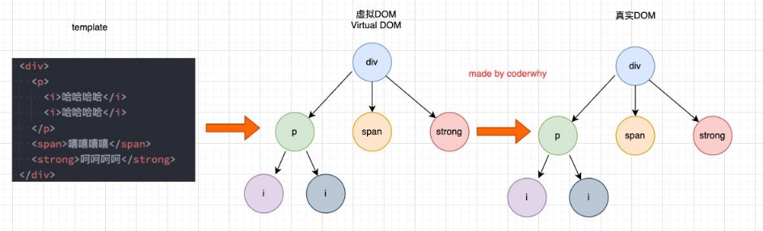
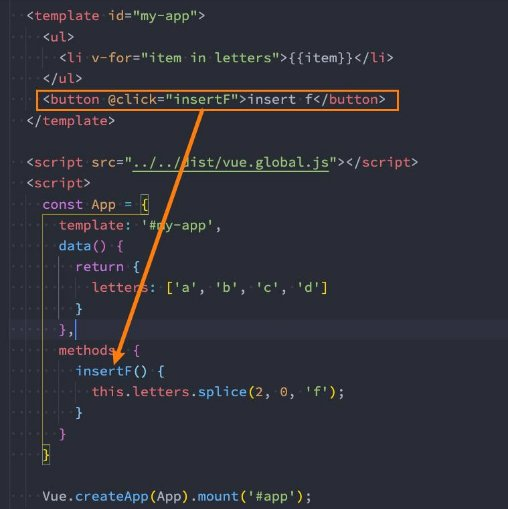
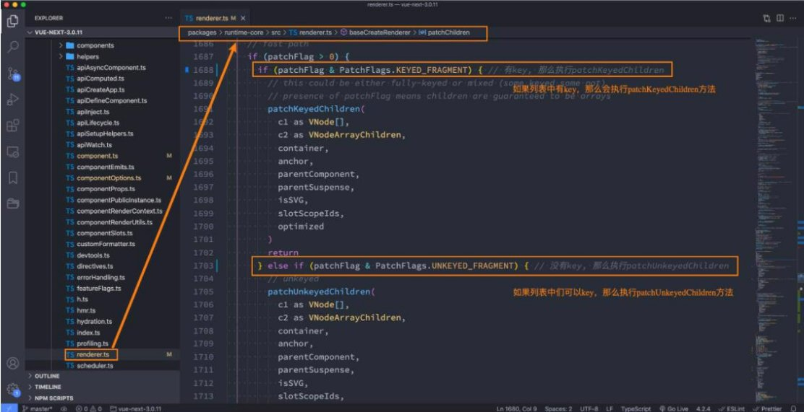
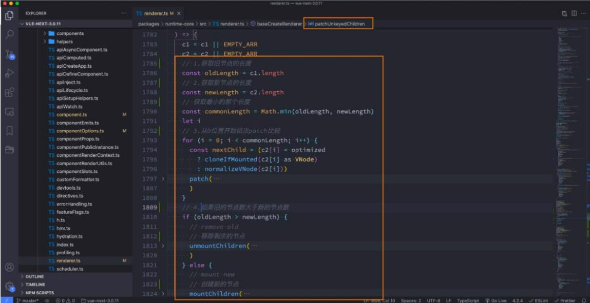
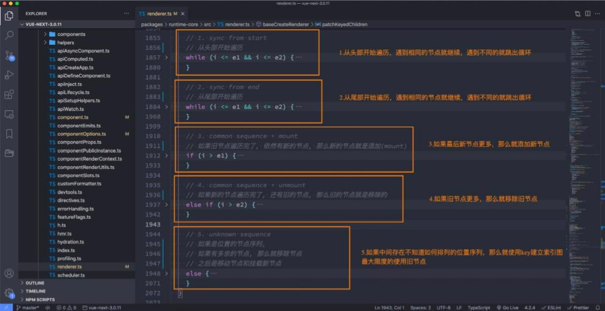

## 总结

### 1.1. v-for的基本使用

* item in 数组
* (item, index) in 数组
* (item, index) of 数组

### 1.2. v-for其他的类型

* 对象
  * (value, key, index) in obj
* 数字
  * item in 10
* 可迭代对象(字符串)

### 1.3. v-for绑定key属性

#### 1.3.1. VNode/虚拟DOM

* template元素 -> VNode
* 虚拟DOM作用之一:
  * 跨平台

#### 1.3.2. key的作用

* 有key的操作:
  * 根据key找到之前的VNode进行复用;
  * 没有VNode可以复用, 再创建新的VNode
* 没有key的操作:
  * diff算法, 后续VNode复用性就不强

#### 1.3.3. key绑定id


## **列表渲染**

- **在真实开发中，我们往往会从服务器拿到一组数据，并且需要对其进行渲染。**
  - 这个时候我们可以使用v-for来完成；
  - v-for类似于JavaScript的for循环，可以用于遍历一组数据；


### **v-for基本使用**

- **v-for的基本格式是 "item in 数组"：**
  - 数组通常是来自data或者prop，也可以是其他方式；
  - item是我们给每项元素起的一个别名，这个别名可以自定来定义；

- **我们知道，在遍历一个数组的时候会经常需要拿到数组的索引：**
  - 如果我们需要索引，可以使用格式： "(item, index) in 数组"；
  - 注意上面的顺序：数组元素项item是在前面的，索引项index是在后面的；


 

```html
 <div id="app">
    <!-- 1.电影列表进行渲染 -->
    <h2>电影列表</h2>
    <ul>
      <li v-for="movie in movies">{{ movie }}</li>
    </ul>

    <!-- 2.电影列表同时有索引 -->
    <ul>
      <li v-for="(movie, index) in movies">{{index + 1}} - {{ movie }}</li>
    </ul>

    <!-- 3.遍历数组复杂数据 -->
    <h2>商品列表</h2>
    <div class="item" v-for="item in products">
      <h3 class="title">商品: {{item.name}}</h3>
      <span>价格: {{item.price}}</span>
      <p>秒杀: {{item.desc}}</p>
    </div>
  </div>
  
  <script src="../lib/vue.js"></script>
  <script>
    // 1.创建app
    const app = Vue.createApp({
      // data: option api
      data() {
        return {
          // 1.movies
          movies: ["星际穿越", "少年派", "大话西游", "哆啦A梦"],

          // 2.数组: 存放的是对象
          products: [
            { id: 110, name: "Macbook", price: 9.9, desc: "9.9秒杀, 快来抢购!" },
            { id: 111, name: "iPhone", price: 8.8, desc: "9.9秒杀, 快来抢购!" },
            { id: 112, name: "小米电脑", price: 9.9, desc: "9.9秒杀, 快来抢购!" },
          ]
        }
      },
    })

    // 2.挂载app
    app.mount("#app")
  </script>
```

### **v-for支持的类型**

- **v-for也支持遍历对象，并且支持有一二三个参数：**
  - 一个参数： "value in object";
  - 二个参数： "(value, key) in object";
  - 三个参数： "(value, key, index) in object";

- **v-for同时也支持数字的遍历：**
  - 每一个item都是一个数字；

- **v-for也可以遍历其他可迭代对象(Iterable)**

```html
<div id="app">
    <!-- 1.遍历数组 -->

    <!-- 2.遍历对象 -->
    <ul>
      <li v-for="(value, key, index) in info">{{value}}-{{key}}-{{index}}</li>
    </ul>

    <!-- 3.遍历字符串(iterable) -->
    <ul>
      <li v-for="item in message">{{item}}</li>
    </ul>

    <!-- 4.遍历数字 -->
    <ul>
      <li v-for="item in 100">{{item}}</li>
    </ul>
  </div>
  
  <script src="../lib/vue.js"></script>
  <script>
    // 1.创建app
    const app = Vue.createApp({
      // data: option api
      data() {
        return {
          message: "Hello Vue",
          movies: [],
          info: { name: "why", age: 18, height: 1.88 }
        }
      },
    })

    // 2.挂载app
    app.mount("#app")
```

### **template元素**

- **类似于v-if，你可以使用 template 元素来循环渲染一段包含多个元素的内容：**
  - 我们使用template来对多个元素进行包裹，而不是使用div来完成；


```html
div id="app">
    <!-- 如果div没有实际的意义, 那么可以使用template替换 -->
    <div v-for="(value, key, index) in infos">
      <span>{{value}}</span>
      <strong>{{key}}</strong>
      <i>{{index}}</i>
    </div>
  </div>
  
  <script src="../lib/vue.js"></script>
  <script>
    // 1.创建app
    const app = Vue.createApp({
      // data: option api
      data() {
        return {
          infos: { name: "why", age: 18, height: 1.88 }
        }
      },
    })

    // 2.挂载app
    app.mount("#app")
  </script>
```

## **数组更新检测**

- **Vue 将被侦听的数组的变更方法进行了包裹，所以它们也将会触发视图更新。**
- **这些被包裹过的方法包括：**
  - push()
  - pop()
  - shift()
  - unshift()
  - splice()
  - sort()
  - reverse()

- **替换数组的方法**
  - 上面的方法会直接修改原来的数组；
  - 但是某些方法不会替换原来的数组，而是会生成新的数组，比如 filter()、concat() 和 slice()；


```html

  <div id="app">
    <ul>
      <li v-for="item in names">{{ item }}</li>
    </ul>
    <button @click="changeArray">修改数组</button>
  </div>
  
  <script src="../lib/vue.js"></script>
  <script>
    // 1.创建app
    const app = Vue.createApp({
      // data: option api
      data() {
        return {
          names: ["abc", "cba", "nba", "aaa", "ccc"]
        }
      },
      methods: {
        changeArray() {
          // 1.直接将数组修改为一个新的数组
          // this.names = ["why", "kobe"]

          // 2.通过一些数组的方法, 修改数组中的元素
          // this.names.push("why")
          // this.names.pop()
          // this.names.splice(2, 1, "why")
          // this.names.sort()
          // this.names.reverse()

          // 3.不修改原数组的方法是不能侦听(watch)
          const newNames = this.names.map(item => item + "why")
          this.names = newNames
        }
      }
    })

    // 2.挂载app
    app.mount("#app")
  </script>
```

## **v-for中的key**

- **在使用v-for进行列表渲染时，我们通常会给元素或者组件绑定一个key属性。**
- **这个key属性有什么作用呢？我们先来看一下官方的解释：**

  > - key属性主要用在Vue的虚拟DOM算法，在新旧nodes对比时辨识VNodes；
  > - 如果不使用key，Vue会使用一种最大限度减少动态元素并且尽可能的尝试就地修改/复用相同类型元素的算法；
  > - 而使用key时，它会基于key的变化重新排列元素顺序，并且会移除/销毁key不存在的元素；
  >
- **官方的解释对于初学者来说并不好理解，比如下面的问题：**

  - 什么是新旧nodes，什么是VNode？
  - 没有key的时候，如何尝试修改和复用的？
  - 有key的时候，如何基于key重新排列的？


## **Vue的虚拟DOM**

### **认识VNode**

- **我们先来解释一下VNode的概念：**
  - 因为目前我们还没有比较完整的学习组件的概念，所以目前我们先理解HTML元素创建出来的VNode；
  - VNode的全称是Virtual Node，也就是虚拟节点；
  - 事实上，无论是组件还是元素，它们最终在Vue中表示出来的都是一个个VNode；
  - **VNode的本质是一个JavaScript的对象；**


 

### **虚拟DOM**

- **如果我们不只是一个简单的div，而是有一大堆的元素，那么它们应该会形成一个VNode Tree：**




### **插入F的案例**

- 我们先来看一个案例：这个案例是当我点击按钮时会在中间插入一个f；
- **我们可以确定的是，这次更新对于ul和button是不需要进行更新，需 要更新的是我们li的列表：**
  - 在Vue中，对于相同父元素的子元素节点并不会重新渲染整个列 表；
  - 因为对于列表中 a、b、c、d它们都是没有变化的；
  - 在操作真实DOM的时候，我们只需要在中间插入一个f的li即可；

- **那么Vue中对于列表的更新究竟是如何操作的呢？**
  - Vue事实上会对于有key和没有key会调用两个不同的方法；
    - **有key，那么就使用 patchKeyedChildren方法；**
    - **没有key，那么就使用 patchUnkeyedChildren方法；**




### **Vue源码对于key的判断**



#### **没有key的操作（源码）**



#### **没有key的过程如下**

- **我们会发现上面的diff算法效率并不高：**
  - c和d来说它们事实上并不需要有任何的改动；
  - 但是因为我们的c被f所使用了，所有后续所有的内容都要一次进行改动，并且最后进行新增；


### **有key执行操作（源码）**



#### **有key的diff算法如下（一）**

- **第一步的操作是从头开始进行遍历、比较：**
  - a和b是一致的会继续进行比较；
  - c和f因为key不一致，所以就会break跳出循环；

- 第二步的操作是从尾部开始进行遍历、比较：


#### **有key的diff算法如下（二）**

- **第三步是如果旧节点遍历完毕，但是依然有新的节点，那么就新增节点：**


- **第四步是如果新的节点遍历完毕，但是依然有旧的节点，那么就移除旧节点：**


#### **有key的diff算法如下（三）**

- **第五步是最特色的情况，中间还有很多未知的或者乱序的节点：**


- **所以我们可以发现，Vue在进行diff算法的时候，会尽量利用我们的key来进行优化操作：**
  - 在没有key的时候我们的效率是非常低效的；
  - 在进行插入或者重置顺序的时候，保持相同的key可以让diff算法更加的高效；


## 作业

### 四. v-for中的key有什么作用？什么是虚拟DOM？

