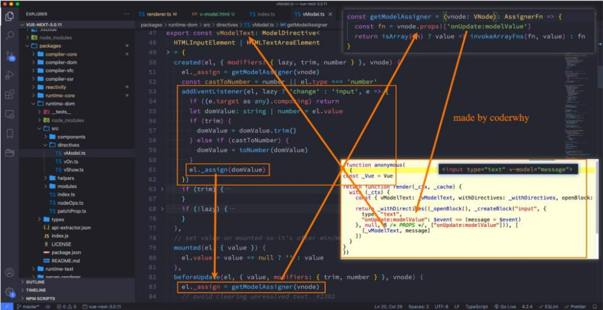
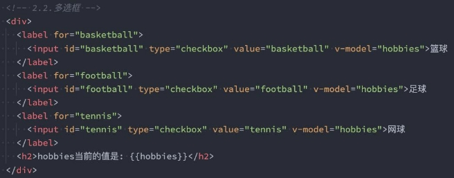
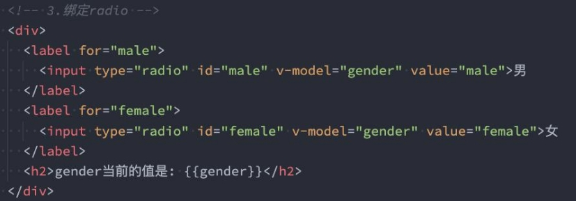

**Vue基础 – v-model表单 **

王红元 coderwhy

 

<table><tr><th colspan="1" rowspan="2" valign="top"><b>目录 content</b></th><th colspan="1" rowspan="2" valign="top"><b>1</b></th><th colspan="2" valign="top"><b>v-model</b></th><th colspan="2" valign="top"><b>基本使用</b></th></tr>
<tr><td colspan="2"></td></tr>
<tr><td colspan="1" rowspan="2"></td><td colspan="1" rowspan="2" valign="top"><b>2</b></td><td colspan="2" valign="top"><b>v-model</b></td><td colspan="2" valign="top"><b>绑定原理</b></td></tr>
<tr><td colspan="2"></td></tr>
<tr><td colspan="1" rowspan="2"></td><td colspan="1" rowspan="2" valign="top"><b>3</b></td><td colspan="2" valign="top"><b>v-model</b></td><td colspan="2" valign="top"><b>绑定radio</b></td></tr>
<tr><td colspan="2"></td></tr>
<tr><td colspan="1" rowspan="2"></td><td colspan="1" valign="bottom"><b>4</b></td><td colspan="2" valign="top"><b>v-model</b></td><td colspan="2" valign="top"><b>绑定checkbox</b></td></tr>
<tr><td colspan="2"></td><td colspan="2" valign="top"></td></tr>
<tr><td colspan="1" rowspan="2"></td><td colspan="1" rowspan="2" valign="top"><b>5</b></td><td colspan="2" valign="top"><b>v-model</b></td><td colspan="2" valign="top"><b>绑定select</b></td></tr>
<tr><td colspan="2"></td></tr>
<tr><td colspan="1" rowspan="2"></td><td colspan="1" rowspan="2" valign="top"><b>6</b></td><td colspan="2" valign="top"><b>v-model</b></td><td colspan="2" valign="top"><b>的修饰符</b></td></tr>
<tr><td colspan="2"></td></tr>
</table>
**综合案例![ref1]**

- **现在我们来做一个相对综合一点的练习：书籍购物车**

- **案例说明：**
- 1.在界面上以表格的形式，显示一些书籍的数据；
- 2.在底部显示书籍的总价格；
- 3.点击+或者-可以增加或减少书籍数量（如果为1，那么不能继续-）；
- 4.点击移除按钮，可以将书籍移除（当所有的书籍移除完毕时，显示：购物车为空~）；

**v-model的基本使用![ref1]**

- **表单提交**是开发中非常常见的功能，也是和用户交互的重要手段：
  - 比如用户在登录、注册时需要提交账号密码；
  - 比如用户在检索、创建、更新信息时，需要提交一些数据；
- 这些都要求我们可以在**代码逻辑中获取到用户提交的数据**，我们通常会使用**v-model指令**来完成：
- v-model指令可以在表单 input、textarea以及select元素上创建双向数据绑定；
- 它会根据控件类型自动选取正确的方法来更新元素；
- 尽管有些神奇，但 v-model 本质上不过是语法糖，它负责监听用户的输入事件来更新数据，并在某种极端场景下进行一些特 殊处理；

 

**v-model的原理![ref1]**

- **官方有说到，v-model的原理其实是背后有两个操作：**
- v-bind绑定value属性的值；
- v-on绑定input事件监听到函数中，函数会获取最新的值赋值到绑定的属性中；

**事实上v-model更加复杂![ref1]**

**v-model绑定textarea![ref1]**

- 我们再来绑定一下**其他的表单类型**
- **我们来看一下绑定textarea：**

：textarea、checkbox、radio、select

**v-model绑定checkbox![ref1]**

- **我们来看一下v-model绑定checkbox：单个勾选框和多个勾选框**
- **单个勾选框：**
- v-model即为布尔值。
- 此时input的value属性并不影响v-model的值。
- **多个复选框：**
- 当是多个复选框时，因为可以选中多个，所以对应的data中属性是一个数组。
- 当选中某一个时，就会将input的value添加到数组中。

**v-model绑定radio![ref1]**

- **v-model绑定radio，用于选择其中一项；**

**v-model绑定select![ref1]**

- **和checkbox一样，select也分单选和多选两种情况。**
- **单选：只能选中一个值**
- v-model绑定的是一个值；
- 当我们选中option中的一个时，会将它对应的value赋值到fruit中；
- **多选：可以选中多个值**
- v-model绑定的是一个数组；
- 当选中多个值时，就会将选中的option对应的value添加到数组fruit中；

 

**v-model的值绑定![ref1]**

- **目前我们在前面的案例中大部分的值都是在template中固定好的：**
- 比如gender的两个输入框值male、female；
- 比如hobbies的三个输入框值basketball、football、tennis；

- 在真实开发中，我们的数据可能是来自服务器的，那么我们就可以先将值 进行值的绑定，这个过程就是**值绑定**。
- 这里不再给出具体的做法，因为还是v-bind的使用过程。

请求下来，绑定到data返回的对象

中，再通过v-bind来

**v-model修饰符 - lazy![ref1]**

- **lazy修饰符是什么作用呢？**
- 默认情况下，v-model在进行双向绑定时，绑定的是input事件，那么会在每次内容输入后就将最新的值和绑定的属性进行同 步；
- 如果我们在v-model后跟上lazy修饰符，那么会将绑定的事件切换为 change 事件，只有在提交时（比如回车）才会触发；

**v-model修饰符 - number![ref1]**

- **我们先来看一下v-model绑定后的值是什么类型的：**
- message总是string类型，即使在我们设置type为number也是string类型；

- **如果我们希望转换为数字类型，那么可以使用 .number 修饰符：**

- **另外，在我们进行逻辑判断时，如果是一个string类型，在可以转化的情况下会进行隐式转换的：**
- 下面的score在进行判断的过程中会进行隐式转化的；

**v-model修饰符 - trim![ref1]**

- **如果要自动过滤用户输入的守卫空白字符，可以给v-model添加 trim 修饰符：**

**v-mode组件上使用![ref1]**

- **v-model也可以使用在组件上，**
- 具体的使用方法，后面讲

**Vue2版本和Vue3版本有一些区别。** 组件化开发再具体学习。

[ref1]: ./image/Aspose.Words.9d17beed-ac01-43a4-afa6-5a8f23c19845.013.png
