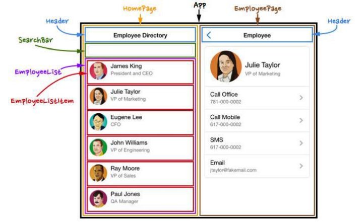
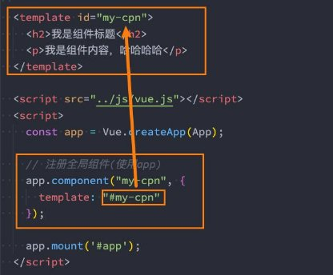
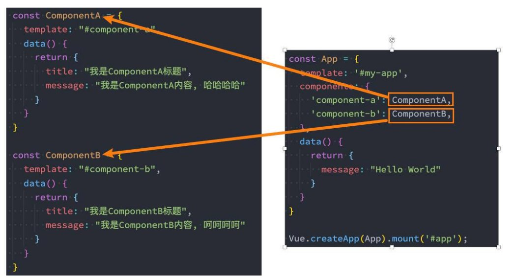
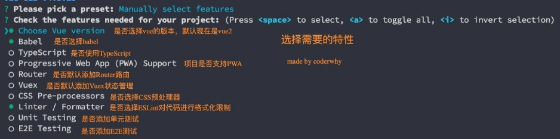
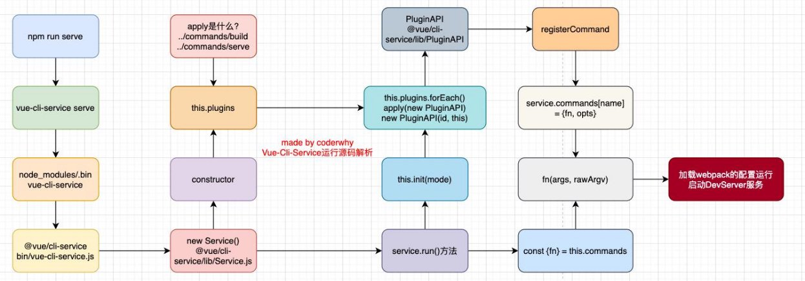

## 总结

### 3.1. 组件化的思想

### 3.2. 注册全局组件

```js
app.component("my-cpn", {
    
})
```

### 3.3. 注册局部组件

```js
const App = {
  components: {
      "my-cpn": {}
  }
}
```

### 4.1. Vue的开发模式

* html
* .vue文件

### 4.2. Vue CLI安装和使用

### 4.3. Vue项目目录结构

### 4.4. browserslistrc文件作用(了解)

### 4.5. 从main.js入口开始, 如何一步步创建自己的组件

* App.vue
* ProductItem.vue


## Vue组件化开发思想

### **人处理问题的方式**

- **人面对复杂问题的处理方式：**
  - 任何一个人处理信息的逻辑能力都是有限的
  - 所以，当面对一个非常复杂的问题时，我们不太可能一次性搞定一大堆的内容。
  - 但是，我们人有一种天生的能力，就是将问题进行拆解。
  - 如果将一个复杂的问题，拆分成很多个可以处理的小问题，再将其放在整体当中，你会发现大的问题也会迎刃而解。


### **认识组件化开发**

- **组件化也是类似的思想：**
  - 如果我们将一个页面中所有的处理逻辑全部放 在一起，处理起来就会变得非常复杂，而且不 利于后续的管理以及扩展； 
  - 但如果，我们讲一个页面拆分成一个个小的功 能块，每个功能块完成属于自己这部分独立的 功能，那么之后整个页面的管理和维护就变得 非常容易了； 
  - 如果我们将一个个功能块拆分后，就可以像搭 建积木一下来搭建我们的项目； 




### **组件化开发**

- **现在可以说整个的大前端开发都是组件化的天下**，
  - 无论从三大框架（Vue、React、Angular），还是跨平台方案的Flutter，甚至是移动端都在转向组件化开发，包括小程序的 开发也是采用组件化开发的思想。
  - 所以，学习组件化最重要的是它的思想，每个框架或者平台可能实现方法不同，但是思想都是一样的。

- **我们需要通过组件化的思想来思考整个应用程序：**
  - 我们将一个完整的页面分成很多个组件；
  - 每个组件都用于实现页面的一个功能块；
  - 而每一个组件又可以进行细分；
  - 而组件本身又可以在多个地方进行复用；


## **Vue的组件化**

- **组件化是Vue、React、Angular的核心思想，也是我们后续课程的重点（包括以后实战项目）：**
  - 前面我们的createApp函数传入了一个对象App，这个对象其实本质上就是一个组件，也是我们应用程序的根组件；
  - 组件化提供了一种抽象，让我们可以开发出一个个独立可复用的小组件来构造我们的应用；
  - 任何的应用都会被抽象成一颗组件树；


- 接下来，我们来学习一下在**Vue中如何注册一个组件**，以及之后**如何使用这个注册后的组件**。

## **注册组件的方式**

- 如果我们现在有一部分**内容（模板、逻辑等）**，我们希望将这部分内容抽取到一个**独立的组件中去维护**，这个时候如何注册一个组件呢？
- 我们先从简单的开始谈起，比如下面的模板希望抽离到一个单独的组件：


- **注册组件分成两种：**
  - 全局组件：在任何其他的组件中都可以使用的组件；
  - 局部组件：只有在注册的组件中才能使用的组件；


## **注册全局组件**

- **我们先来学习一下全局组件的注册：**
  - 全局组件需要使用我们全局创建的app来注册组件；
  - 通过component方法传入组件名称、组件对象即可注册一个全局组件了；
  - 之后，我们可以在App组件的template中直接使用这个全局组件：


 

### **全局组件的逻辑**

- **当然，我们组件本身也可以有自己的代码逻辑：**
- 比如自己的data、computed、methods等等


### **组件的名称**

- **在通过app.component注册一个组件的时候，第一个参数是组件的名称，定义组件名的方式有两种：**
- **方式一：使用kebab-case（短横线分割符）**
  - 当使用 kebab-case (短横线分隔命名) 定义一个组件时，你也必须在引用这个自定义元素时使用 kebab-case，例如 <my - component-name>；


- **方式二：使用PascalCase（驼峰标识符）**
  - 当使用 PascalCase (首字母大写命名) 定义一个组件时，你在引用这个自定义元素时两种命名法都可以使用。
  - 也就是说 `<my-component-name>` 和 `<MyComponentName> `都是可接受的；


## **注册局部组件**

- 全局组件往往是在应用程序一开始就会**全局组件**完成，那么就意味着如果**某些组件我们并没有用到**，**也会一起被注册：**
  - 比如我们注册了三个全局组件：ComponentA、ComponentB、ComponentC；
  - 在开发中我们只使用了ComponentA、ComponentB，如果ComponentC没有用到但是我们依然在全局进行了注册，那么 就意味着类似于webpack这种打包工具在打包我们的项目时，我们依然会对其进行打包；
  - 这样最终打包出的JavaScript包就会有关于ComponentC的内容，用户在下载对应的JavaScript时也会增加包的大小；

- **所以在开发中我们通常使用组件的时候采用的都是局部注册：**
  - 局部注册是在我们需要使用到的组件中，通过components属性选项来进行注册；
  - 比如之前的App组件中，我们有data、computed、methods等选项了，事实上还可以有一个components选项；
  - 该components选项对应的是一个对象，对象中的键值对是 组件的名称: 组件对象；


### **布局组件注册代码**



## **Vue的开发模式**

- 目前我们使用vue的过程都是**在html文件中**，通过template编写自己的模板、脚本逻辑、样式等。
- **但是随着项目越来越复杂，我们会采用组件化的方式来进行开发：**
  - 这就意味着每个组件都会有自己的模板、脚本逻辑、样式等；
  - 当然我们依然可以把它们抽离到单独的js、css文件中，但是它们还是会分离开来；
  - 也包括我们的script是在一个全局的作用域下，很容易出现命名冲突的问题；
  - 并且我们的代码为了适配一些浏览器，必须使用ES5的语法；
  - 在我们编写代码完成之后，依然需要通过工具对代码进行构建、代码；

- **所以在真实开发中，我们可以通过一个后缀名为 .vue 的single-file components (单文件组件) 来解决，并且可以使用 webpack或者vite或者rollup等构建工具来对其进行处理。**

### **单文件的特点**

- **在这个组件中我们可以获得非常多的特性： **
  - 代码的高亮； 
  - ES6、CommonJS的模块化能力； 
  - 组件作用域的CSS； 
  - 可以使用预处理器来构建更加丰富的组件，比如 TypeScript、Babel、Less、Sass等； 


### **如何支持SFC**

- 如果我们想要使用这一的SFC的.vue文件，比较**常见的是两种方式**：
  - 方式一：使用Vue CLI来创建项目，项目会默认帮助我们配置好所有的配置选项，可以在其中直接使用.vue文件；
  - 方式二：自己使用webpack或rollup或vite这类打包工具，对其进行打包处理；
- **我们最终，无论是后期我们做项目，还是在公司进行开发，通常都会采用Vue CLI的方式来完成。**

### **VSCode对SFC文件的支持**

- **在前面我们提到过，真实开发中多数情况下我们都是使用SFC（ single-file components (单文件组件) ）。**
- **我们先说一下VSCode对SFC的支持：**
  - 插件一：Vetur，从Vue2开发就一直在使用的VSCode支持Vue的插件；
  - 插件二：Volar，官方推荐的插件；


## **Vue CLI脚手架**

- **什么是Vue脚手架？**
  - 我们前面学习了如何通过webpack配置Vue的开发环境，但是在真实开发中我们不可能每一个项目从头来完成所有的 webpack配置，这样显示开发的效率会大大的降低；

  - 所以在真实开发中，我们通常会使用脚手架来创建一个项目，Vue的项目我们使用的就是Vue的脚手架；
  - 脚手架其实是建筑工程中的一个概念，在我们软件工程中也会将一些帮助我们搭建项目的工具称之为脚手架；


- **Vue的脚手架就是Vue CLI： **
  - CLI是Command-Line Interface, 翻译为命令行界面； 
  - 我们可以通过CLI选择项目的配置和创建出我们的项目； 
  - Vue CLI已经内置了webpack相关的配置，我们不需要从零来配置； 


### **Vue CLI安装和使用**

- **安装Vue CLI（目前最新的版本是v5.0.8）**
  - 我们是进行全局安装，这样在任何时候都可以通过vue的命令来创建项目；
    - `npm install @vue/cli -g`


- **升级Vue CLI：**
- 如果是比较旧的版本，可以通过下面的命令来升级
  - `npm update @vue/cli -g`


- **通过Vue的命令来创建项目**
  - `Vue create 项目的名称`


### **vue create 项目的过程**





### **项目的目录结构**


### **Vue CLI的运行原理**



## Vue项目中jsconfig.json的作用

- `jsconfig.json` 文件主要用于配置 JavaScript 项目的一些选项和设置。
- VSCode是支持 JavaScript 语言服务的编辑器，而 `jsconfig.json` 文件可以帮助编辑器更好地理解项目的结构和提供更好的代码提示、导航和补全功能。
- 它有以下作用
  - **代码智能提示：**
    - 在编写代码时，编辑器会自动显示相关的方法、变量、属性和参数等信息，提高代码编写的效率。
  - **代码智能提示：**
    - `"baseUrl"` 和 `"paths"` 字段允许我们使用别名或者相对于项目根目录的路径来引用模块文件。
  - **代码重构：**
    - 重命名变量、函数或者模块时，编辑器可以帮助在整个项目中更新相关的引用。
  - **错误检查和代码校验：**
    - 重命名变量、函数或者模块时，编辑器可以帮助在整个项目中更新相关的引用。
    - 编辑器可以根据这些选项对代码进行静态检查，提供错误提示和代码校验，帮助我们找出潜在的问题。

```json
{
  "compilerOptions": {
    "target": "es5", //编译目标
    "module": "esnext", //当前使用的是哪个版本的JS语法
    "baseUrl": "./", //项目基础路径
    "moduleResolution": "node", //模块使用的是哪种查找方法
    "paths": {  //起变量别名，方便代码提示
      "@/*": [
        "src/*"
      ],
      "utils/*": [
        "src/utils/*"
      ]
    },
    "lib": [  //JS代码提示，要包含哪一种库，比如浏览器dom，es6的语法
      "esnext",
      "dom",
      "dom.iterable",
      "scripthost"
    ]
  }
}

```


## 作业

### 四. 什么是组件化开发？有什么作用？

### 五. Vue中注册全局组件和局部组件有什么区别？

### 六. 什么是Vue CLI，如何使用它创建Vue项目？

### 七. 自己整理Vue项目目录结构中各个文件的作用
