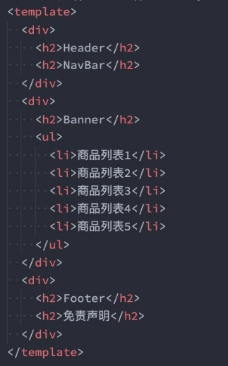
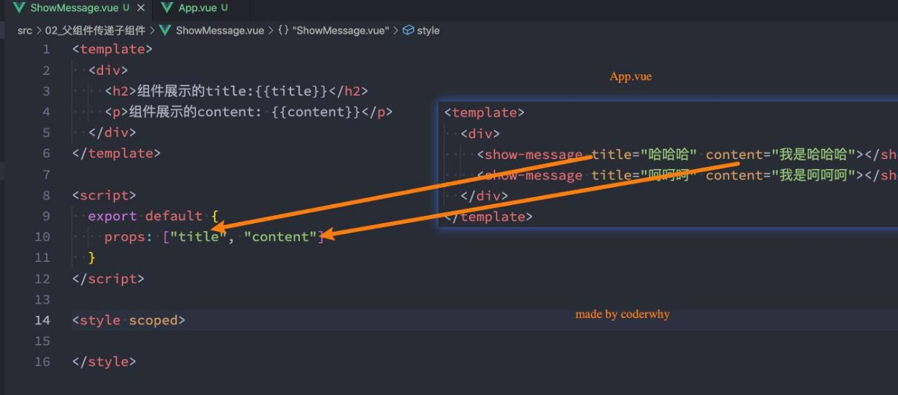
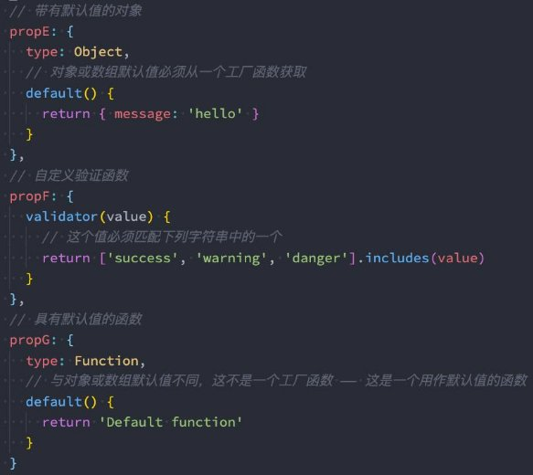
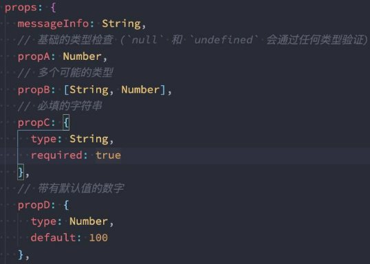
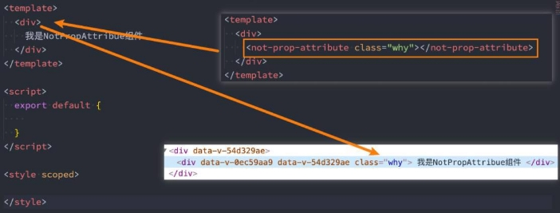
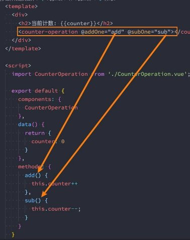
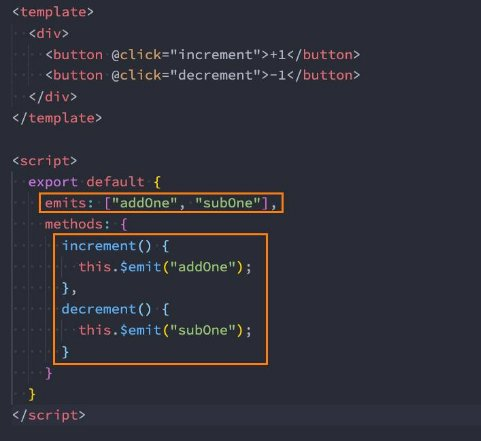

**组件化 – 组件间通信 **

王红元 coderwhy

|
**目录 content**

|
1	 **Vue组件的嵌套关系**

2	 **父组件传递子组件**

3	 **非props的attribute**

4	 **子组件传递父组件**

5	 **组件通信案例练习**
|
| :- | - |

**认识组件的嵌套![ref1]**

- **前面我们是将所有的逻辑放到一个App.vue中： **
- 在之前的案例中，我们只是创建了一个组件App； 
- 如果我们一个应用程序将所有的逻辑都放在一个组件中，那么这个组件就会变成非常的臃 肿和难以维护； 
- 所以组件化的核心思想应该是对组件进行拆分，拆分成一个个小的组件； 
- 再将这些组件组合嵌套在一起，最终形成我们的应用程序； 
- 我们来分析一下下面代码的嵌套逻辑，假如我们将所有的代码逻辑都放到一个App.vue组件 中： 
- 我们会发现，将所有的代码逻辑全部放到一个组件中，代码是非常的臃肿和难以维护的。 
- 并且在真实开发中，我们会有更多的内容和代码逻辑，对于扩展性和可维护性来说都是非 常差的。 
- 所以，在真实的开发中，我们会对组件进行拆分，拆分成一个个功能的小组件。 

**组件的拆分![ref1]**

- **我们可以按照如下的方式进行拆分：**

- **按照如上的拆分方式后，我们开发对应的逻辑只需要去对应的组件编写就可。**

**组件的通信![ref1]**

- **上面的嵌套逻辑如下，它们存在如下关系：**
- App组件是Header、Main、Footer组件的父组件；
- Main组件是Banner、ProductList组件的父组件；
- 在开发过程中，我们会经常遇到需要**组件之间相互进行通信**：
- 比如App可能使用了多个Header，每个地方的Header展示的内容不同，那么我们就需要使用者传递给Header一些数据，让 其进行展示；
- 又比如我们在Main中一次性请求了Banner数据和ProductList数据，那么就需要传递给它们来进行展示；
- 也可能是子组件中发生了事件，需要由父组件来完成某些操作，那就需要子组件向父组件传递事件；
- **总之，在一个Vue项目中，组件之间的通信是非常重要的环节，所以接下来我们就具体学习一下组件之间是如何相互之间传递数 据的；**

**父子组件之间通信的方式![ref1]**

- **父子组件之间如何进行通信呢？**
- 父组件传递给子组件：通过props属性；
- 子组件传递给父组件：通过$emit触发事件；

**父组件传递给子组件![ref1]**

- 在开发中很常见的就是**父子组件之间通信**，比如父组件有一些数据，需要子组件来进行展示：
  - 这个时候我们可以通过props来完成组件之间的通信；
- **什么是Props呢？**
- Props是你可以在组件上注册一些自定义的attribute；
- 父组件给这些attribute赋值，子组件通过attribute的名称获取到对应的值；
- **Props有两种常见的用法：**
- 方式一：字符串数组，数组中的字符串就是attribute的名称；
- 方式二：对象类型，对象类型我们可以在指定attribute名称的同时，指定它需要传递的类型、是否是必须的、默认值等等；

**Props的数组用法![ref1]**

**Props的对象用法![ref1]**

- 数组用法中我们**只能说明传入的attribute的名称**，并**不能对其进行任何形式的限制**，接下来我们来看一下**对象的写法**是如何让 我们的props变得更加完善的。
- **当使用对象语法的时候，我们可以对传入的内容限制更多：**
- 比如指定传入的attribute的类型；
- 比如指定传入的attribute是否是必传的；
- 比如指定没有传入时，attribute的默认值；

**细节一：那么type的类型都可以是哪些呢？![ref1]**

- **那么type的类型都可以是哪些呢？**
- String
- Number
- Boolean
- Array
- Object
- Date
- Function
- Symbol

**细节二：对象类型的其他写法![ref1]**

` `

**细节三：Prop 的大小写命名![ref1]**

- **Prop 的大小写命名(camelCase vs kebab-case)**
- HTML 中的 attribute 名是大小写不敏感的，所以浏览器会把所有大写字符解释为小写字符；
- 这意味着当你使用 DOM 中的模板时，camelCase (驼峰命名法) 的 prop 名需要使用其等价的 kebab-case (短横线分隔命名) 命名；

**非Prop的Attribute![ref1]**

- **什么是非Prop的Attribute呢？**
- 当我们传递给一个组件某个属性，但是该属性并没有定义对应的props或者emits时，就称之为 **非Prop的Attribute**；
- 常见的包括class、style、id属性等；
- **Attribute继承**
- 当组件有单个根节点时，非Prop的Attribute将自动添加到根节点的Attribute中：

**禁用Attribute继承和多根节点![ref1]**

- 如果我们**不希望组件的根元素继承attribute**，可以在组件中设置 **inheritAttrs: false**：
- 禁用attribute继承的常见情况是需要将attribute应用于根元素之外的其他元素；
- 我们可以通过 $attrs来访问所有的 非props的attribute；

- **多个根节点的attribute**
- 多个根节点的attribute如果没有显示的绑定，那么会报警告，我们必须手动的指定要绑定到哪一个属性上：

**子组件传递给父组件![ref1]**

- **什么情况下子组件需要传递内容到父组件呢？**
- 当子组件有一些事件发生的时候，比如在组件中发生了点击，父组件需要切换内容；
- 子组件有一些内容想要传递给父组件的时候；
- **我们如何完成上面的操作呢？**
- 首先，我们需要在子组件中定义好在某些情况下触发的事件名称；
- 其次，在父组件中以v-on的方式传入要监听的事件名称，并且绑定到对应的方法中；
- 最后，在子组件中发生某个事件的时候，根据事件名称触发对应的事件；

**自定义事件的流程![ref1]**

- 我们封装一个CounterOperation.vue的组件：
- 内部其实是监听两个按钮的点击，点击之后通过 this.$emit的方式发出去事件；

` `

**自定义事件的参数和验证（了解）![ref1]**

- **自定义事件的时候，我们也可以传递一些参数给父组件：**

- **在vue3当中，我们可以对传递的参数进行验证：**

**组件间通信案例练习![ref1]**

- **我们来做一个相对综合的练习：**

[ref1]: ./image/Aspose.Words.35f8f2d0-3ed0-49c1-8d1d-5b0224d5fcbd.011.png
