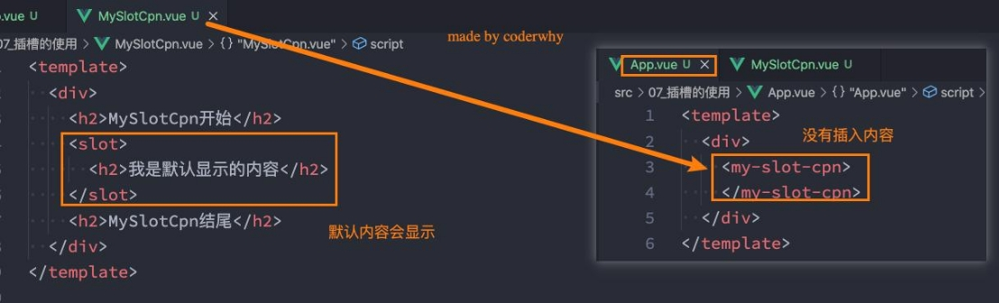
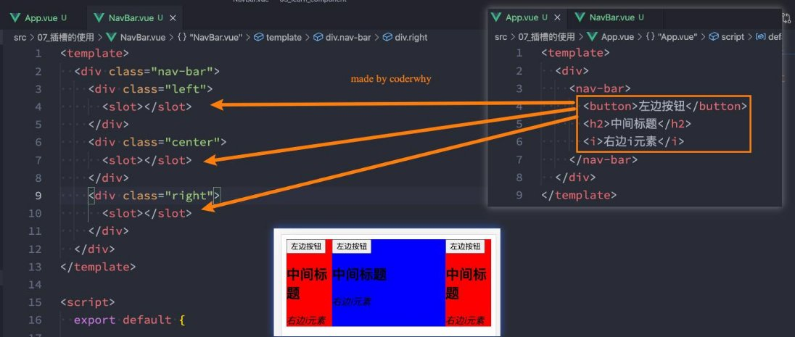
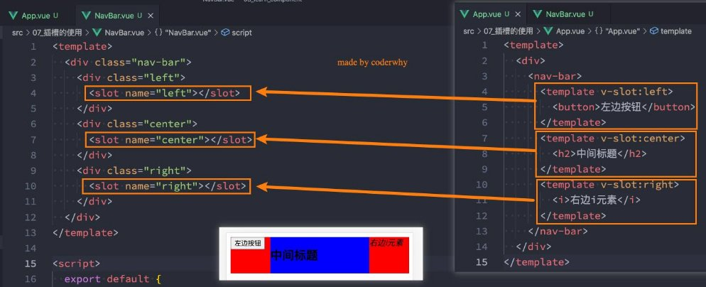
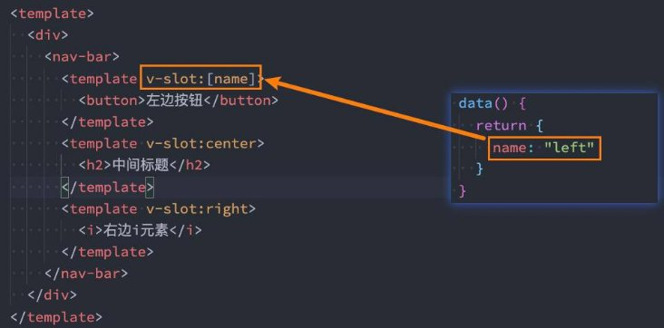
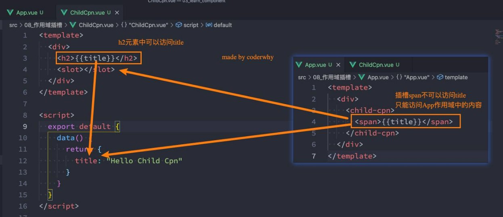
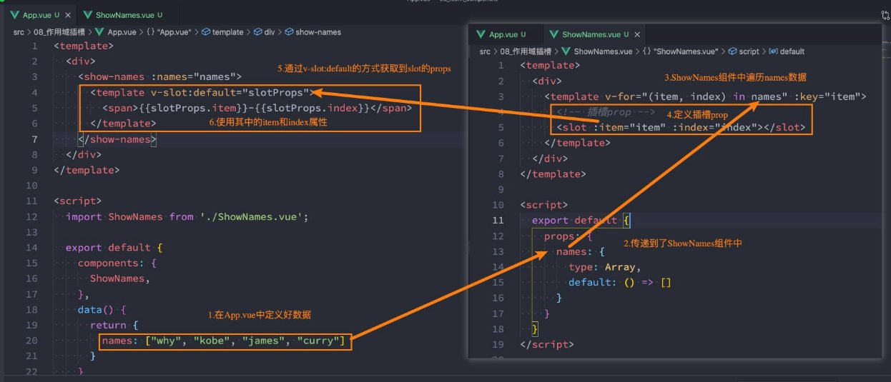
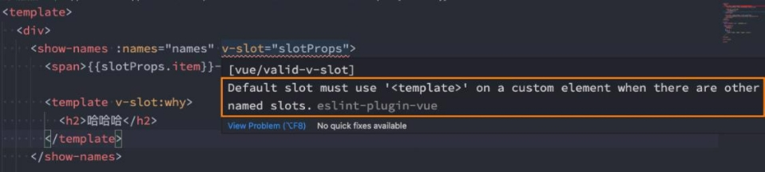
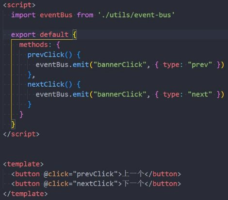
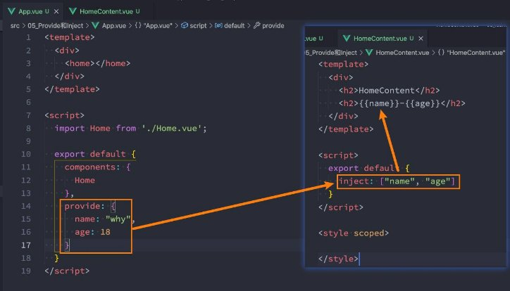
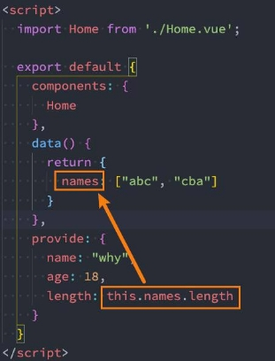



**Vue组件化 - 插槽Slot/非父子通信**

王红元 coderwhy

 

|**目录 content**|**1**|**认识插槽Slot作用**|
| :- | - | - |
||**2**|**插槽Slot基本使用**|
||**3**|**具名插槽Slot使用**|
||**4**|**作用域插槽Slot使用**|
||**5**|**全局事件总线使用**|
||**6**|**依赖注入Provide/Inject**|

**认识插槽Slot![ref1]**

- **在开发中，我们会经常封装一个个可复用的组件：**
- 前面我们会通过props传递给组件一些数据，让组件来进行展示；
- 但是为了让这个组件具备更强的通用性，我们不能将组件中的内容限制为固定的div、span等等这些元素；
- 比如某种情况下我们使用组件，希望组件显示的是一个按钮，某种情况下我们使用组件希望显示的是一张图片；
- 我们应该让使用者可以决定某一块区域到底存放什么内容和元素；
- **举个栗子：假如我们定制一个通用的导航组件 - NavBar**
- 这个组件分成三块区域：左边-中间-右边，每块区域的内容是不固定；
- 左边区域可能显示一个菜单图标，也可能显示一个返回按钮，可能什么都不显示；
- 中间区域可能显示一个搜索框，也可能是一个列表，也可能是一个标题，等等；
- 右边可能是一个文字，也可能是一个图标，也可能什么都不显示；

**如何使用插槽slot？![ref1]**

- **这个时候我们就可以来定义插槽slot：**
- 插槽的使用过程其实是抽取共性、预留不同；
- 我们会将共同的元素、内容依然在组件内进行封装；
- 同时会将不同的元素使用slot作为占位，让外部决定到底显示什么样的元素；
- **如何使用slot呢？**
- Vue中将 <slot> 元素作为承载分发内容的出口；
- 在封装组件中，使用特殊的元素<slot>就可以为封装组件开启一个插槽；
- 该插槽插入什么内容取决于父组件如何使用；

**插槽的默认内容![ref1]**

- 有时候我们希望在使用插槽时，如果**没有插入对应的内容，那么我们需要显示一个默认的内容**：
- 当然这个默认的内容只会在没有提供插入的内容时，才会显示；

**多个插槽的效果![ref1]**

- 我们先测试一个知识点：如果一个组件中**含有多个插槽，我们插入多个内容时是什么效果？**
- 我们会发现默认情况下每个插槽都会获取到我们插入的内容来显示；

**插槽的基本使用![ref1]**

- **我们一个组件MySlotCpn.vue：该组件中有一个插槽，我们可以在插槽中放入需要显示的内容；**
- **我们在App.vue中使用它们：**
- 我们可以插入普通的内容、html元素、组件，都可以是可以的；

` `

**具名插槽的使用![ref1]**

- 事实上，我们希望达到的效果是插槽对应的显示，这个时候我们就可以使用
- 具名插槽顾名思义就是给插槽起一个名字，<slot> 元素有一个
- 一个不带 name 的slot，会带有隐含的名字 default；

**具名插槽：**         特殊的 attribute：name；

**动态插槽名![ref1]**

- **什么是动态插槽名呢？**
- 目前我们使用的插槽名称都是固定的；
- 比如 v-slot:left、v-slot:center等等；
- 我们可以通过 v-slot:[dynamicSlotName]方式动态绑定一个名称；

**具名插槽使用的时候缩写![ref1]**

- **具名插槽使用的时候缩写：**
- 跟 v-on 和 v-bind 一样，v-slot 也有缩写；
- 即把参数之前的所有内容 (v-slot:) 替换为字符 #；

**渲染作用域![ref1]**

- **在Vue中有渲染作用域的概念：**
- 父级模板里的所有内容都是在父级作用域中编译的；
- 子模板里的所有内容都是在子作用域中编译的；
- **如何理解这句话呢？我们来看一个案例：**
- 在我们的案例中ChildCpn自然是可以让问自己作用域中的title内容的；
- 但是在App中，是访问不了ChildCpn中的内容的，因为它们是跨作用域的访问；
- 案例见下页

**渲染作用域案例![ref1]**

**认识作用域插槽![ref1]**

- 但是有时候我们希望插槽**可以访问到子组件中的内容**是非常重要的：
  - 当一个组件被用来渲染一个数组元素时，我们使用插槽，并且希望插槽中没有显示每项的内容；
  - 这个Vue给我们提供了作用域插槽；
- **我们来看下面的一个案例：**
- 1.在App.vue中定义好数据
- 2.传递给ShowNames组件中
- 3.ShowNames组件中遍历names数据
- 4.定义插槽的prop
- 5.通过v-slot:default的方式获取到slot的props
- 6.使用slotProps中的item和index

**作用域插槽的案例![ref1]**

**独占默认插槽的缩写![ref1]**

- **如果我们的插槽是默认插槽default，那么在使用的时候 v-slot:default="slotProps"可以简写为v-slot="slotProps"：**

- **并且如果我们的插槽只有默认插槽时，组件的标签可以被当做插槽的模板来使用，这样，我们就可以将 v-slot 直接用在组件上：**

**默认插槽和具名插槽混合![ref1]**

- **但是，如果我们有默认插槽和具名插槽，那么按照完整的template来编写。**

- **只要出现多个插槽，请始终为所有的插槽使用完整的基于 <template> 的语法：**

**非父子组件的通信![ref1]**

- 在开发中，我们构建了组件树之后，除了
- **这里我们主要讲两种方式：**
- 全局事件总线；
- Provide/Inject；

**父子组件之间的通信**

之外，还会有

**非父子组件之间**的通信。

**全局事件总线mitt库![ref1]**

- **Vue3从实例中移除了 $on、$off 和 $once 方法，所以我们如果希望继续使用全局事件总线，要通过第三方的库**：
  - Vue3官方有推荐一些库，例如 mitt [或 tiny](https://github.com/developit/mitt)-e[mitter；](https://github.com/scottcorgan/tiny-emitter)
  - 这里我们主要讲解一下 hy-event-store 的使用；
- **首先，我们需要先安装这个库：**

npm install hy-event-bus

- **其次，我们可以封装一个工具eventbus.js：**

**使用事件总线工具![ref1]**

- **在项目中可以使用它们：**
- 我们在App.vue中监听事件；
- 我们在Banner.vue中触发事件；

 

**Mitt的事件取消![ref1]**

- 在某些情况下我们可能希望**取消掉之前注册的函数监听**：

**Provide和Inject![ref1]**

- Provide/Inject用于**非父子组件之间共享数据**：
- 比如有一些深度嵌套的组件，子组件想要获取父组件的部分内 容； 
- 在这种情况下，如果我们仍然将props沿着组件链逐级传递下 去，就会非常的麻烦； 
- 对于这种情况下，**我们可以使用 Provide 和 Inject ：** 
- 无论层级结构有多深，父组件都可以作为其所有子组件的依赖 提供者； 
- 父组件有一个 provide 选项来提供数据； 
- 子组件有一个 inject 选项来开始使用这些数据； 
- 实际上，你可以将依赖注入看作是“**long range props”**，除了： 
- 父组件不需要知道哪些子组件使用它 provide 的 property 
- 子组件不需要知道 inject 的 property 来自哪里

**Provide和Inject基本使用![ref1]**

- 我们开发一个这样的结构：

**Provide和Inject函数的写法![ref1]**

- 如果Provide中提供的一些数据是
- **这个时候会报错：**
- 这里给大家留一个思考题，我们的

**来自data**，那么我们可能会想要

this使用的是哪里的this？

**通过this来获取**：

 

**处理响应式数据![ref1]**

- 我们先来验证一个结果：**如果我们修改了this.names的内容，那么使用length的子组件会不会是响应式的？**
- 我们会发现对应的子组件中是**没有反应的**：
- 这是因为当我们修改了names之后，之前在provide中引入的 this.names.length 本身并不是响应式的；
- **那么怎么样可以让我们的数据变成响应式的呢？**
- 非常的简单，我们可以使用响应式的一些API来完成这些功能，比如说computed函数；
- 当然，这个computed是vue3的新特性，在后面我会专门讲解，这里大家可以先直接使用一下；
- **注意：我们在使用length的时候需要获取其中的value**
- 这是因为computed返回的是一个ref对象，需要取出其中的value来使用；

[ref1]: ./image/Aspose.Words.7744bdd7-32c7-4dad-acc2-6117f15d4e08.011.png
