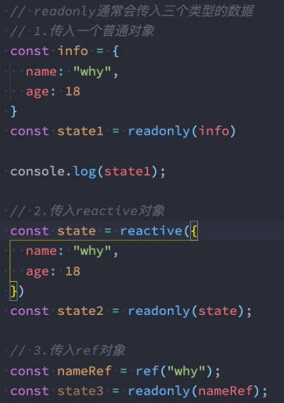
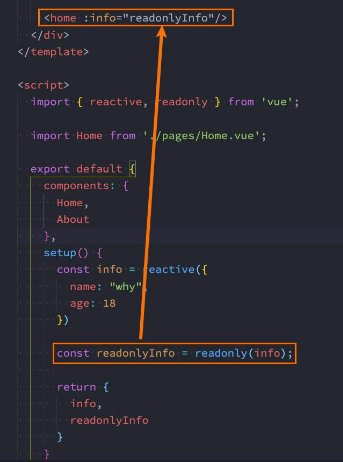
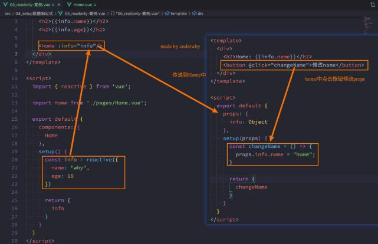
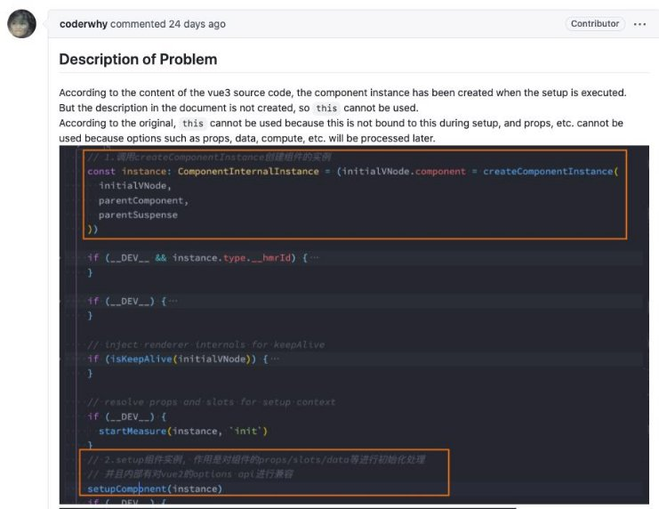
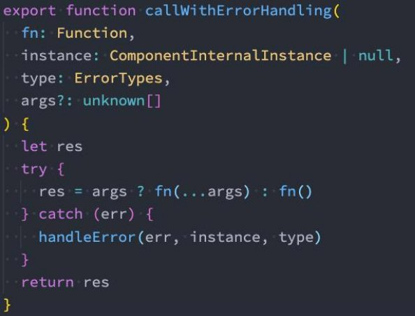

**Vue3 – Composition API **

王红元 coderwhy

 

|**目录 content**|**1**|**认识CompositionAPI**|
| :- | - | - |
||**2**|**Setup函数的基本使用**|
||**3**|**Setup中数据的响应式**|
||**4**|**Reactive知识点补充**|
||**5**|**Ref知识点补充**|
||**6**|**setup中禁用this**|

**Options API的弊端![ref1]**

- 在Vue2中，我们**编写组件的方式是Options API**：
  - Options API的一大特点就是在对应的属性中编写对应的功能模块；
  - 比如data定义数据、methods中定义方法、computed中定义计算属性、watch中监听属性改变，也包括生命周期钩子；
- **但是这种代码有一个很大的弊端：**
- 当我们实现某一个功能时，这个功能对应的代码逻辑会被拆分到各个属性中；
- 当我们组件变得更大、更复杂时，逻辑关注点的列表就会增长，那么同一个功能的逻辑就会被拆分的很分散；
- 尤其对于那些一开始没有编写这些组件的人来说，这个组件的代码是难以阅读和理解的（阅读组件的其他人）；
- **下面我们来看一个非常大的组件，其中的逻辑功能按照颜色进行了划分：**
- 这种碎片化的代码使用理解和维护这个复杂的组件变得异常困难，并且隐藏了潜在的逻辑问题；
- 并且当我们处理单个逻辑关注点时，需要不断的跳到相应的代码块中；

**大组件的逻辑分散![ref1]**

- 如果我们能将同一个逻辑关注 点相关的代码收集在一起会更 好。
- **这就是Composition API想 要做的事情，以及可以帮助我 们完成的事情。**
- 也有人把Vue Composition API简称为**VCA**。

**认识Composition API![ref1]**

- 那么既然知道Composition API想要帮助我们做什么事情，接下来看一下
- 为了开始使用Composition API，我们需要有一个可以实际使用它
- 在Vue组件中，这个位置就是 setup 函数；

**到底是怎么做**呢？ （编写代码）的地方；

- **setup其实就是组件的另外一个选项：**
- 只不过这个选项强大到我们可以用它来替代之前所编写的大部分其他选项；
- 比如methods、computed、watch、data、生命周期等等；
- **接下来我们一起学习这个函数的使用：**
- 函数的参数
- 函数的返回值

**setup函数的参数![ref1]**

- 我们先来研究一个setup函数的参数，它主要
- 第一个参数：props
- 第二个参数：context

**有两个参数**：

- props非常好理解，它其实就是**父组件传递过来的属性**会被**放到props对象**中，我们在**setup中如果需要使用**，那么就可以直接 **通过props参数获取：**
- 对于定义props的类型，我们还是和之前的规则是一样的，在props选项中定义；
- 并且在template中依然是可以正常去使用props中的属性，比如message；
- 如果我们在setup函数中想要使用props，那么不可以通过 this 去获取（后面我会讲到为什么）；
- 因为props有直接作为参数传递到setup函数中，所以我们可以直接通过参数来使用即可；
- 另外一个参数是context，我们也称之为是一个**SetupContext**，它里面**包含三个属性**：
- attrs：所有的非prop的attribute；
- slots：父组件传递过来的插槽（这个在以渲染函数返回时会有作用，后面会讲到）；
- emit：当我们组件内部需要发出事件时会用到emit（因为我们不能访问this，所以不可以通过 this.$emit发出事件）；

**setup函数的返回值![ref1]**

- setup既然是一个函数，那么它也可以有**返回值**，**它的返回值用来做什么呢？**
- setup的返回值可以在模板template中被使用；
- 也就是说我们可以通过setup的返回值来替代data选项；
- 甚至是我们可以**返回一个执行函数**来**代替在methods中定义的方法**：

 

- 但是，如果我们将 counter 在 increment 或者 decrement进行操作时，**是否可以实现界面的响应式呢？**
- 答案是不可以；
- 这是因为对于一个定义的变量来说，默认情况下，Vue并不会跟踪它的变化，来引起界面的响应式操作；

**Reactive API![ref1]**

- 如果想为在setup中定义的数据提供响应式的特性，那么我们可以**使用reactive的函数**：

- **那么这是什么原因呢？为什么就可以变成响应式的呢？**
- 这是因为当我们使用reactive函数处理我们的数据之后，数据再次被使用时就会进行依赖收集；
- 当数据发生改变时，所有收集到的依赖都是进行对应的响应式操作（比如更新界面）；
- 事实上，我们编写的data选项，也是在内部交给了reactive函数将其编程响应式对象的；

**Ref API![ref1]**

- reactive API对**传入的类型是有限制的**
- 如果我们传入一个基本数据类型（

，它要求我们必须传入的是**一个对象或者数组类型**： String、Number、Boolean）会报一个警告；

- 这个时候Vue3给我们提供了**另外一个API：ref API**
- ref 会返回一个可变的响应式对象，该对象作为一个 **响应式的引用** 维护着它内部的值，这就是ref名称的来源；
- 它内部的值是在ref的 value 属性中被维护的；

- **这里有两个注意事项：**
- 在模板中引入ref的值时，Vue会自动帮助我们进行解包操作，所以我们并不需要在模板中通过 ref.value 的方式来使用；
- 但是在 setup 函数内部，它依然是一个 ref引用， 所以对其进行操作时，我们依然需要使用 ref.value的方式；

**Ref自动解包![ref1]**

- **模板中的解包是浅层的解包**，如果我们的代码是下面的方式：
- 如果我们**将ref放到一个reactive的属性**当中，那么**在模板中使用时，它会自动解包**：

` `

**认识readonly![ref1]**

- 我们通过**reactive或者ref可以获取到一个响应式的对象**，但是某些情况下，我们**传入给其他地方（组件）**的这个响应式对象希 望**在另外一个地方（组件）被使用**，但是**不能被修改**，这个时候**如何防止这种情况的出现**呢？
- Vue3为我们提供了readonly的方法；
- readonly会返回原始对象的只读代理（也就是它依然是一个Proxy，这是一个proxy的set方法被劫持，并且不能对其进行修 改）；
- **在开发中常见的readonly方法会传入三个类型的参数：**
- 类型一：普通对象；
- 类型二：reactive返回的对象；
- 类型三：ref的对象；

**readonly的使用![ref1]**

- **在readonly的使用过程中，有如下规则： **
- readonly返回的对象都是不允许修改的； 
- 但是经过readonly处理的原来的对象是允许被修改的； 
- 比如 const info = readonly(obj)，info对象是不允许被修改的； 
- 当obj被修改时，readonly返回的info对象也会被修改； 
- 但是我们不能去修改readonly返回的对象info； 
- **其实本质上就是readonly返回的对象的setter方法被劫持了而已；** 

**readonly的应用![ref1]**

- **那么这个readonly有什么用呢？**
- 在我们传递给其他组件数据时，往往希望其他组件使用我们传递的内容，但是不允许它们修改时，就可以使用readonly了；

` `

**Reactive判断的API![ref1]**

- **isProxy**
- 检查对象是否是由 reactive 或 readonly创建的 proxy。
- **isReactive**
- 检查对象是否是由 reactive创建的响应式代理：
- 如果该代理是 readonly 建的，但包裹了由 reactive 创建的另一个代理，它也会返回 true；
- **isReadonly**
- 检查对象是否是由 readonly 创建的只读代理。
- **toRaw**
- 返回 reactive 或 readonly 代理的原始对象（**不**建议保留对原始对象的持久引用。请谨慎使用）。
- **shallowReactive**
- 创建一个响应式代理，它跟踪其自身 property 的响应性，但不执行嵌套对象的深层响应式转换 (深层还是原生对象)。
- **shallowReadonly**
- 创建一个 proxy，使其自身的 property 为只读，但不执行嵌套对象的深度只读转换（深层还是可读、可写的）。

**toRefs![ref1]**

- 如果我们使用**ES6的解构语法**，对**reactive返回的对象进行解构获取值**，那么之后无论是**修改结构后的变量**，还是**修改reactive 返回的state对象**，**数据都不再是响应式**的：

- 那么有没有办法**让我们解构出来的属性是响应式**的呢？
- Vue为我们提供了一个toRefs的函数，可以将reactive返回的对象中的属性都转成ref；
- 那么我们再次进行结构出来的 name 和 age 本身都是 ref的；

- 这种做法相当于已经在state.name和ref.value之间建立了 链接，任何一个修改都会引起另外一个变化；

**toRef![ref1]**

- 如果我们只希望转换一个**reactive对象中的属性为ref**, 那么可以**使用toRef的方法**：

**ref其他的API![ref1]**

- **unref**
- 如果我们想要**获取一个ref引用中的value**，那么也可以**通过unref方法**：
- 如果参数是一个 ref，则返回内部值，否则返回参数本身；
- 这是 val = isRef(val) ? val.value : val 的语法糖函数；
- **isRef**
- 判断值是否是一个ref对象。
- **shallowRef **
- 创建一个浅层的ref对象； 
- **triggerRef** 
- 手动触发和 shallowRef 相关联的副作用： 

**setup不可以使用this![ref1]**

- **官方关于this有这样一段描述（这段描述是我给官方提交了PR之后的一段描述）：**
- 表达的含义是this并没有指向当前组件实例；
- 并且在setup被调用之前，data、computed、methods等都没有被解析；
- 所以无法在setup中获取this；

- **其实在之前的这段描述是和源码有出入的（我向官方提交了PR，做出了描述的修改）：**
- 之前的描述大概含义是不可以使用this是因为组件实例还没有被创建出来；
- 后来我的PR也有被合并到官方文档中；

**之前关于this的描述问题![ref1]**

**我是如何发现官方文档的错误的呢？![ref1]**

- 在阅读源码的过程中，代码是按照如下顺序执行的：
- 调用 createComponentInstance 创建组件实例； 
- 调用 setupComponent 初始化component内部的操 作； 
- 调用 setupStatefulComponent 初始化有状态的组 件； 
- 在 setupStatefulComponent 取出了 setup 函数； 
- 通过callWithErrorHandling 的函数执行 setup； 
- 从上面的代码我们可以看出， **组件的instance肯定是在 执行 setup 函数之前就创建出来**的。 

[ref1]: ./image/Aspose.Words.58cd555b-0278-4c1b-a3eb-d2a42d8c9534.013.png
