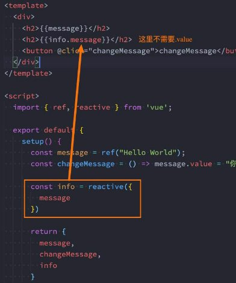
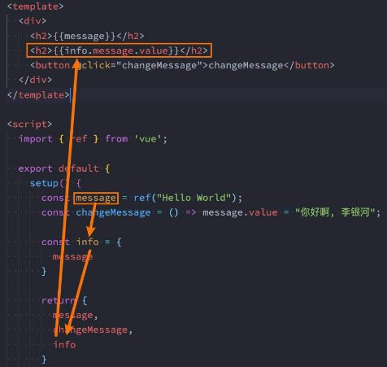

## **Options API的弊端**

- 在Vue2中，我们编写组件的方式是Options API：
  - **Options API的一大特点就是在对应的属性中编写对应的功能模块**；
  - 比如data定义数据、methods中定义方法、computed中定义计算属性、watch中监听属性改变，也包括生命周期钩子；
- **但是这种代码有一个很大的弊端：**
  - **当我们实现某一个功能时，这个功能对应的代码逻辑会被拆分到各个属性中；**
  - **当我们组件变得更大、更复杂时，逻辑关注点的列表就会增长，那么同一个功能的逻辑就会被拆分的很分散；**
  - 尤其对于那些一开始没有编写这些组件的人来说，这个组件的代码是难以阅读和理解的（阅读组件的其他人）；

- 下面我们来看一个非常大的组件，其中的逻辑功能按照颜色进行了划分：
  - **这种碎片化的代码使用理解和维护这个复杂的组件变得异常困难，并且隐藏了潜在的逻辑问题**；
  - 并且当我们处理单个逻辑关注点时，需要不断的跳到相应的代码块中；

**大组件的逻辑分散**

- 如果我们能将同一个逻辑关注 点相关的代码收集在一起会更 好。
- **这就是Composition API想 要做的事情，以及可以帮助我 们完成的事情。**
  - 也有人把Vue Composition API简称为**VCA**。

## **认识Composition API**

- 那么既然知道Composition API想要帮助我们做什么事情，接下来看一下到底是怎么做呢？ 
  - 为了开始使用Composition API，我们需要有一个可以实际使用它（编写代码）的地方；
  - 在Vue组件中，这个位置就是 **setup 函数**；


- **setup其实就是组件的另外一个选项：**
  - 只不过这个选项强大到我们可以用它来替代之前所编写的大部分其他选项；
  - 比如methods、computed、watch、data、生命周期等等；

- 接下来我们一起学习这个函数的使用：
  - 函数的参数
  - 函数的返回值

## Setup函数的基本使用


### **setup函数的参数**

- 我们先来研究一个setup函数的参数，它主要**有两个参数**：
  - 第一个参数：**props**
  - 第二个参数：**context**


- props非常好理解，它其实就是**父组件传递过来的属性**会被**放到props对象**中，我们在**setup中如果需要使用**，那么就可以直接 **通过props参数获取：**
  - 对于定义props的类型，我们还是和之前的规则是一样的，在props选项中定义；
  - 并且在template中依然是可以正常去使用props中的属性，比如message；
  - 如果我们在setup函数中想要使用props，那么不可以通过 this 去获取；
  - 因为props有直接作为参数传递到setup函数中，所以我们可以直接通过参数来使用即可；

- 另外一个参数是，我们也称之为是一个**SetupContext**，它里面**包含三个属性**：
  - **attrs：所有的非prop的attribute；**
  - **slots：父组件传递过来的插槽（这个在以渲染函数返回时会有作用，后面会讲到）；**
  - **emit：当我们组件内部需要发出事件时会用到emit（因为我们不能访问this，所以不可以通过 this.$emit发出事件）；**


### **setup函数的返回值**

- **setup的返回值可以在模板template中被使用**；
  - 也就是说我们可以通过setup的返回值来替代data选项；
- **但是我们在setup中定义的数据都不是响应式数据**

```vue
<template>
  <div class="app">
    <!-- template中ref对象自动解包 -->
    <h2>当前计数: {{ counter }}</h2>
    <button @click="increment">+1</button>
    <button @click="decrement">-1</button>
  </div>
</template>

<script>
import { ref } from 'vue'
import useCounter from './hooks/useCounter'

export default {
  setup() {
    // 1.定义counter的内容
    // 默认定义的数据都不是响应式数据
    let counter = ref(100)
    const increment = () => {
      counter.value++
      console.log(counter.value)
    }
    const decrement = () => {
      counter.value--
    }


    return {
      counter,
      increment,
      decrement
    }
  }
}
</script>
```

## Setup定义数据

### **Reactive API**

- 如果想为在setup中定义的数据提供响应式的特性，那么我们可以**使用reactive的函数**：

```js
  // 2.1.reactive函数: 定义复杂类型的数据
      const account = reactive({
        username: "coderwhy",
        password: "123456"
      })
```

- **为什么就可以变成响应式的呢？**
  - 这是因为**当我们使用reactive函数处理我们的数据之后，数据再次被使用时就会进行依赖收集**；
  - **当数据发生改变时，所有收集到的依赖都是进行对应的响应式操作**（比如更新界面）；
  - 事实上，**我们编写的data选项，也是在内部交给了reactive函数将其编程响应式对象的**；


### **Ref API**

- reactive API对**传入的类型是有限制的**，它要求我们必须传入的是**一个对象或者数组类型**：
- 如果我们传入一个基本数据类型（ String、Number、Boolean）会报一个警告；


- 这个时候Vue3给我们提供了另外一个API：**ref API**
  - ref 会返回一个可变的响应式对象，该对象作为一个 **响应式的引用** 维护着它内部的值，这就是ref名称的来源；
  - 它内部的值是在ref的 value 属性中被维护的；
- **注意： ref也可以定义复杂的数据**

```js
    // counter定义响应式数据
      const counter = ref(0)
      function increment() {
        counter.value++
      }
```

- **这里有两个注意事项：**
  - 在模板中引入ref的值时，Vue会自动帮助我们进行解包操作，所以我们并不需要在模板中通过 ref.value 的方式来使用；
    - `  <h2>当前计数: {{ info.counter }}</h2>`
  - 但是在 setup 函数内部，它依然是一个 ref引用， 所以对其进行操作时，我们依然需要使用 ref.value的方式；
    - ` counter.value++`


### **Ref自动解包**

- 如果我们**将ref放到一个reactive的属性**当中，那么**在模板中使用时，它会自动解包**：



- **模板中的解包是浅层的解包**，如果我们的代码是下面的方式，则需要手动解包



```vue
<template>
  <div>
    <h2>message: {{ message }}</h2>
    <button @click="changeMessage">修改message</button>
    <hr>
    <h2>账号: {{ account.username }}</h2>
    <h2>密码: {{ account.password }}</h2>
    <button @click="changeAccount">修改账号</button>
    <hr>
    <!-- 默认情况下在template中使用ref时, vue会自动对其进行解包(取出其中value) -->
    <h2>当前计数: {{ counter }}</h2>
    <button @click="increment">+1</button>
    <button @click="counter++">+1</button>

    <hr>
    <!-- 使用的时候不需要写.value -->
    <h2>当前计数: {{ info.counter }}</h2>
    <!-- 修改的时候需要写.value -->
    <button @click="info.counter.value++">+1</button>
  </div>
</template>

<script>
  import { reactive, ref } from 'vue'

  export default {
    setup() {
      // 1.定义普通的数据: 可以正常的被使用
      // 缺点: 数据不是响应式的
      let message = "Hello World"
      function changeMessage() {
        message = "你好啊,李银河!"
        console.log(message)
      }

      // 2.定义响应式数据
      // 2.1.reactive函数: 定义复杂类型的数据
      const account = reactive({
        username: "coderwhy",
        password: "123456"
      })
      function changeAccount() {
        account.username = "kobe"
      }

      // 2.2.ref函数: 定义简单类型的数据(也可以定义复杂类型的数据)
      // counter定义响应式数据
      const counter = ref(0)
      function increment() {
        counter.value++
      }

      // 3.ref是浅层解包
      const info = {
        counter
      }

      return {
        message,
        changeMessage,
        account,
        changeAccount,
        counter,
        increment,
        info
      }
    }
  }
</script>
```

```vue
<template>
  <div>
    <form>
      账号: <input type="text" v-model="account.username">
      密码: <input type="password" v-model="account.password">
    </form>
    
    <form>
      账号: <input type="text" v-model="username">
      密码: <input type="password" v-model="password">
    </form>

    <hr>

    <show-info :name="name" :age="age"></show-info>
  </div>
</template>

<script>
  import { onMounted, reactive, ref } from 'vue'
  import ShowInfo from './ShowInfo.vue'

  export default {
    components: {
      ShowInfo
    },
    data() {
      return {
        message: "Hello World"
      }
    },
    setup() {
      // 定义响应式数据: reactive/ref
      // 强调: ref也可以定义复杂的数据
      const info = ref({})
      console.log(info.value)

      // 1.reactive的应用场景
      // 1.1.条件一: reactive应用于本地的数据
      // 1.2.条件二: 多个数据之间是有关系/联系(聚合的数据, 组织在一起会有特定的作用)
      const account = reactive({
        username: "coderwhy",
        password: "1234567"
      })

      const username = ref("coderwhy")
      const password = ref("123456")

      // 2.ref的应用场景: 其他的场景基本都用ref(computed)
      // 2.1.定义本地的一些简单数据
      const message = ref("Hello World")
      const counter = ref(0)
      const name = ref("why")
      const age = ref(18)

      // 2.定义从网络中获取的数据也是使用ref
      // const musics = reactive([])
      const musics = ref([])
      onMounted(() => {
        const serverMusics = ["海阔天空", "小苹果", "野狼"]
        musics.value = serverMusics
      })


      return {
        account,
        username,
        password,
        name,
        age
      }
    }
  }
</script>

```

### **认识readonly**

- 我们通过reactive或者ref可以获取到一个响应式的对象，但是某些情况下，我们传入给其他地方（组件）的这个响应式对象希 望在另外一个地方（组件）被使用，但是**不能被修改**，这个时候如何防止这种情况的出现呢？
  - Vue3为我们提供了readonly的方法；
  - **readonly会返回原始对象的只读代理（也就是它依然是一个Proxy，这是一个proxy的set方法被劫持，并且不能对其进行修 改）**；

- **在开发中常见的readonly方法会传入三个类型的参数：**
  - 类型一：普通对象；
  - 类型二：reactive返回的对象；
  - 类型三：ref的对象；


### **readonly的使用**

- 在readonly的使用过程中，有如下规则： 
  - **readonly返回的对象都是不允许修改的；** 
  - **但是经过readonly处理的原来的对象是允许被修改的；** 
    - 比如 const info = readonly(obj)，info对象是不允许被修改的； 
    - 当obj被修改时，readonly返回的info对象也会被修改； 
  - 但是我们不能去修改readonly返回的对象info； 

- **其实本质上就是readonly返回的对象的setter方法被劫持了而已；** 


### **readonly的应用**

- **那么这个readonly有什么用呢？**
  - 在我们传递给其他组件数据时，往往希望其他组件使用我们传递的内容，但是不允许它们修改时，就可以使用readonly了；


```vue
<template>
  <h2>App: {{ info }}</h2>
  <show-info :info="info" 
             :roInfo="roInfo" 
             @changeInfoName="changeInfoName"
             @changeRoInfoName="changeRoInfoName">
  </show-info>
</template>

<script>
  import { reactive, readonly } from 'vue'
  import ShowInfo from './ShowInfo.vue'

  export default {
    components: {
      ShowInfo
    },
    setup() {
      // 本地定义多个数据, 都需要传递给子组件
      // name/age/height
      const info = reactive({
        name: "why",
        age: 18,
        height: 1.88
      })

      function changeInfoName(payload) {
        info.name = payload
      }

      // 使用readOnly包裹info
      const roInfo = readonly(info)
      function changeRoInfoName(payload) {
        info.name = payload
      }

      return {
        info,
        changeInfoName,
        roInfo,
        changeRoInfoName
      }
    }
  }
</script>
```

```vue
<template>
  <div>
    <h2>ShowInfo: {{ info }}</h2>
    <!-- 代码没有错误, 但是违背规范(单项数据流) -->
    <button @click="info.name = 'kobe'">ShowInfo按钮</button>
    <!-- 正确的做法: 符合单项数据流-->
    <button @click="showInfobtnClick">ShowInfo按钮</button>
    <hr>
    <!-- 使用readonly的数据 -->
    <h2>ShowInfo: {{ roInfo }}</h2>
    <!-- 代码就会无效(报警告) -->
    <!-- <button @click="roInfo.name = 'james'">ShowInfo按钮</button> -->
    <!-- 正确的做法 -->
    <button @click="roInfoBtnClick">roInfo按钮</button>
  </div>
</template>

<script>
  export default {
    props: {
      // reactive数据
      info: {
        type: Object,
        default: () => ({})
      },
      // readonly数据
      roInfo: {
        type: Object,
        default: () => ({})
      }
    },
    emits: ["changeInfoName", "changeRoInfoName"],
    setup(props, context) {
      function showInfobtnClick() {
        context.emit("changeInfoName", "kobe")
      }

      function roInfoBtnClick() {
        context.emit("changeRoInfoName", "james")
      }

      return {
        showInfobtnClick,
        roInfoBtnClick
      }
    }
  }
</script>
```

## 响应式数据的其他API

### **Reactive判断的API**

- **isProxy**
  - 检查对象是否是由 reactive 或 readonly创建的 proxy。

- **isReactive**
  - 检查对象是否是由 reactive创建的响应式代理：
  - 如果该代理是 readonly 建的，但包裹了由 reactive 创建的另一个代理，它也会返回 true；

- **isReadonly**
  - 检查对象是否是由 readonly 创建的只读代理。

- **toRaw**
  - 返回 reactive 或 readonly 代理的原始对象（**不**建议保留对原始对象的持久引用。请谨慎使用）。

- **shallowReactive**
  - 创建一个响应式代理，它跟踪其自身 property 的响应性，但不执行嵌套对象的深层响应式转换 (深层还是原生对象)。

- **shallowReadonly**
  - 创建一个 proxy，使其自身的 property 为只读，但不执行嵌套对象的深度只读转换（深层还是可读、可写的）。

### **ref其他的API**

- **unref**
  - 如果我们想要**获取一个ref引用中的value**，那么也可以**通过unref方法**：
  - 如果参数是一个 ref，则返回内部值，否则返回参数本身；
  - 这是 val = isRef(val) ? val.value : val 的语法糖函数；

- **isRef**
  - 判断值是否是一个ref对象。

- **shallowRef **
  - 创建一个浅层的ref对象； 

- **triggerRef** 
  - 手动触发和 shallowRef 相关联的副作用： 


## **toRefs**

- 如果我们使用**ES6的解构语法**，对**reactive返回的对象进行解构获取值**，那么之后无论是**修改结构后的变量**，还是**修改reactive 返回的state对象**，**数据都不再是响应式**的：


- 那么有没有办法**让我们解构出来的属性是响应式**的呢？
  - Vue为我们提供了一个toRefs的函数，可以将reactive返回的对象中的属性都转成ref；
  - 那么我们再次进行结构出来的 name 和 age 本身都是 ref的；


- 这种做法相当于已经在state.name和ref.value之间建立了 链接，任何一个修改都会引起另外一个变化；

## **toRef**

- 如果我们只希望转换一个**reactive对象中的属性为ref**, 那么可以**使用toRef的方法**：


## **setup不可以使用this**

- setup() 之前组件实例就已经创建了，看源码可以看出来，不能用this只是因为setup函数根本没有进行this的绑定，所以才不能用this吧

  - 在阅读源码的过程中，代码是按照如下顺序执行的：

    - 调用 createComponentInstance 创建组件实例； 

    - 调用 setupComponent 初始化component内部的操 作； 

    - 调用 setupStatefulComponent 初始化有状态的组 件； 

    - 在 setupStatefulComponent 取出了 setup 函数； 

    - 通过callWithErrorHandling 的函数执行 setup； 

    - 从上面的代码我们可以看出， **组件的instance肯定是在 执行 setup 函数之前就创建出来**的。 


  

