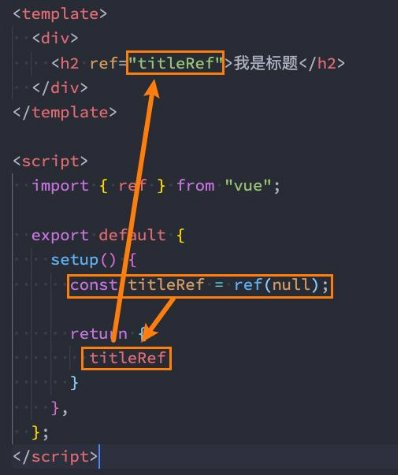
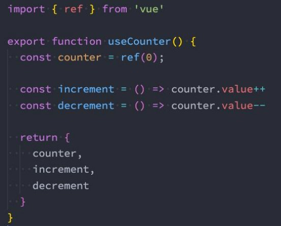

**Vue3 – Composition API **

王红元 coderwhy

 

|**目录 content**|**1**|**computed函数使用**|
| :- | - | - |
||**2**|**组件的生命周期函数**|
||**3**|**Provide/Inject使用**|
||**4**|**watch/watchEffect**|
||**5**|**自定义Hook练习**|
||**6**|**script setup语法糖**|

**computed![ref1]**

- **在前面我们讲解过计算属性computed：当我们的某些属性是依赖其他状态时，我们可以使用计算属性来处理**
- 在前面的Options API中，我们是使用computed选项来完成的；
- 在Composition API中，我们可以在 setup 函数中使用 computed 方法来编写一个计算属性；
- **如何使用computed呢？**
- 方式一：接收一个getter函数，并为 getter 函数返回的值，返回一个不变的 ref 对象；
- 方式二：接收一个具有 get 和 set 的对象，返回一个可变的（可读写）ref  对象；

` `

**setup中使用ref![ref1]**

- **在setup中如何使用ref获取元素或者组件？**
- 其实非常简单，我们只需要定义一个ref对象，绑定到元素或者组件的ref属性上即可；

**生命周期钩子![ref1]**

- **我们前面说过 setup 可以用来替代 data 、 methods 、 computed**  
- **那么setup中如何使用生命周期函数呢？**
- 可以使用直接导入的 onX 函数注册生命周期钩子；

**等等这些选项，也可以替代**

**生命周期钩子。**

` ` 

**Provide函数![ref1]**

- **事实上我们之前还学习过Provide和Inject，Composition API**
- **我们可以通过 provide来提供数据：**
- 可以通过 provide 方法来定义每个 Property；

**也可以替代之前的 Provide 和 Inject 的选项。**

- **provide可以传入两个参数：**
- name：提供的属性名称；
- value：提供的属性值；

**Inject函数![ref1]**

- **在 后代组件 中可以通过 inject 来注入需要的属性和对应的值：**
- 可以通过 inject 来注入需要的内容；
- **inject可以传入两个参数：**
- 要 inject 的 property 的 name；
- 默认值；

**数据的响应式![ref1]**

- 为了增加 provide 值和 inject 值之间的响应性，我们可以在 provide 值时使用 ref 和 reactive。

**侦听数据的变化![ref1]**

- **在前面的Options API中，我们可以通过watch选项来侦听data或者props的数据变化，当数据变化时执行某一些操作。**
- **在Composition API中，我们可以使用watchEffect和watch来完成响应式数据的侦听；**
- watchEffect：用于自动收集响应式数据的依赖；
- watch：需要手动指定侦听的数据源；

**Watch的使用![ref1]**

- **watch的API完全等同于组件watch选项的Property：**
- watch需要侦听特定的数据源，并且执行其回调函数；
- 默认情况下它是惰性的，只有当被侦听的源发生变化时才会执行回调；

**侦听多个数据源![ref1]**

- **侦听器还可以使用数组同时侦听多个源：**

**watch的选项![ref1]**

- **如果我们希望侦听一个深层的侦听，那么依然需要设置 deep 为true：**
- 也可以传入 immediate 立即执行；

**watchEffect![ref1]**

- **当侦听到某些响应式数据变化时，我们希望执行某些操作，这个时候可以使用**
- 我们来看一个案例：
- 首先，watchEffect传入的函数会被立即执行一次，并且在执行的过程中会收集依赖；
- 其次，只有收集的依赖发生变化时，watchEffect传入的函数才会再次执行；

**watchEffect。**

**watchEffect的停止侦听![ref1]**

- **如果在发生某些情况下，我们希望停止侦听，这个时候我们可以获取watchEffect的返回值函数**
- 比如在上面的案例中，我们age达到20的时候就停止侦听：

**，调用该函数即可。**

**useCounter![ref1]**

- 我们先来对之前的counter逻辑进行抽取：

**useTitle![ref1]**

- 我们编写一个修改title的Hook：

**useScrollPosition（作业）![ref1]**

- 我们来完成一个监听界面滚动位置的Hook：

**script setup语法![ref1]**

- **<script setup> 是在单文件组件 (SFC) 中使用组合式 API 的编译时语法糖，**
- 更少的样板内容，更简洁的代码；
- 能够使用纯 Typescript 声明 prop 和抛出事件；
- 更好的运行时性能 ；
- 更好的 IDE 类型推断性能 ；
- **使用这个语法，需要将 setup attribute 添加到 <script> 代码块上：**

- 里面的代码会被编译成组件 setup() 函数的内容：
- 这意味着与普通的 <script> 只在组件被首次引入的时候执行一次不同；
- <script setup> 中的代码会在每次组件实例被创建的时候执行。

**当同时使用 SFC 与组合式**

**API 时则推荐该语法。**

**顶层的绑定会被暴露给模板![ref1]**

- **当使用 <script setup> 的时候，任何在 <script setup> 声明的顶层的绑定 (包括变量，函数声明，以及 import 引入的内容) 都能在模板中直接使用：**

- **响应式数据需要通过ref、reactive来创建。**

**导入的组件直接使用![ref1]**

- **<script setup> 范围里的值也能被直接作为自定义组件的标签名使用：**

**defineProps() 和 defineEmits()![ref1]**

- **为了在声明 props 和 emits 选项时获得完整的类型推断支持，我们可以使用 defineProps 和 defineEmits API，它们将自动 地在 <script setup> 中可用：**

 

**defineExpose()![ref1]**

- **使用 <script setup> 的组件是默认关闭的：**
- 通过模板 ref 或者 $parent 链获取到的组件的公开实例，不会暴露任何在 <script setup> 中声明的绑定；
- **通过 defineExpose 编译器宏来显式指定在 <script setup> 组件中要暴露出去的 property：**

 

**案例实战练习![ref1]**

[ref1]: ./image/Aspose.Words.94dcc159-35e2-49a5-9892-4e6f4363402d.013.png
