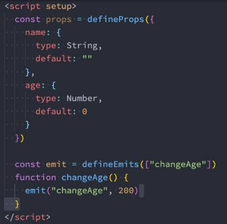

## **computed**

- **在前面我们讲解过计算属性computed：当我们的某些属性是依赖其他状态时，我们可以使用计算属性来处理**
  - 在前面的Options API中，我们是使用computed选项来完成的；
  - 在Composition API中，我们可以在 setup 函数中使用 computed 方法来编写一个计算属性；

- **如何使用computed呢？**
  - 方式一：接收一个getter函数，并为 getter 函数返回的值，返回一个不变的 ref 对象；
  - 方式二：接收一个具有 get 和 set 的对象，返回一个可变的（可读写）ref  对象；

```js
//方式一：接收一个getter函数，并为 getter 函数返回的值，返回一个不变的 ref 对象；
const fullname = computed(() => {
    return names.firstName + " " + names.lastName
  })
//方式二：接收一个具有 get 和 set 的对象，返回一个可变的（可读写）ref  对象；
  const fullname = computed({
    set: function(newValue) {
      const tempNames = newValue.split(" ")
      names.firstName = tempNames[0]
      names.lastName = tempNames[1]
    },
    get: function() {
      return names.firstName + " " + names.lastName
    }
  })
```

## **setup中使用ref**

- **在setup中如何使用ref获取元素或者组件？**
  - 其实非常简单，我们只需要定义一个ref对象，绑定到元素或者组件的ref属性上即可；


```vue
<template>
  <!-- 1.获取元素 -->
  <h2 ref="titleRef">我是标题</h2>
  <button ref="btnRef">按钮</button>

  <!-- 2.获取组件实例 -->
  <show-info ref="showInfoRef"></show-info>

  <button @click="getElements">获取元素</button>
</template>

<script>
  import { ref, onMounted } from 'vue'
  import ShowInfo from './ShowInfo.vue'

  export default {
    components: {
      ShowInfo
    },
    setup() {
      const titleRef = ref()
      const btnRef = ref()
      const showInfoRef = ref()

      // mounted的生命周期函数
      onMounted(() => {
        console.log(titleRef.value)
        console.log(btnRef.value)
        console.log(showInfoRef.value)

        showInfoRef.value.showInfoFoo()
      })

      function getElements() {
        console.log(titleRef.value)
      }

      return {
        titleRef,
        btnRef,
        showInfoRef,
        getElements
      }
    }
  }
</script>
```


## **生命周期钩子**

- **我们前面说过 setup 可以用来替代 data 、 methods 、 computed等等这些选项，也可以替代生命周期钩子。**  
- **那么setup中如何使用生命周期函数呢？**
  - 可以使用直接导入的 onX 函数注册生命周期钩子；

 


## Provide/Inject使用

### **Provide函数**

- **事实上我们之前还学习过Provide和Inject，Composition API也可以替代之前的 Provide 和 Inject 的选项。**
- **我们可以通过 provide来提供数据：**
  - 可以通过 provide 方法来定义每个 Property；


- **provide可以传入两个参数：**
  - name：提供的属性名称；
  - value：提供的属性值；


### **Inject函数**

- **在 后代组件 中可以通过 inject 来注入需要的属性和对应的值：**
  - 可以通过 inject 来注入需要的内容；

- **inject可以传入两个参数：**
  - 要 inject 的 property 的 name；
  - 默认值；


### **数据的响应式**

- 为了增加 provide 值和 inject 值之间的响应性，我们可以在 provide 值时使用 ref 和 reactive。


- 如何通过options方式注入inject时，则需要手动解包

```vue
<template>
<!--手动带.value-->
  <div>ShowInfo: {{ name.value }}-{{ age }} </div>
</template>

<script>
  import { inject } from 'vue'

  export default {
    // inject的options api注入, 那么依然需要手动来解包
    inject: ["name", "age"],
  
  }
</script>
```


## **侦听数据的变化**

- **在前面的Options API中，我们可以通过watch选项来侦听data或者props的数据变化，当数据变化时执行某一些操作。**
- **在Composition API中，我们可以使用watchEffect和watch来完成响应式数据的侦听；**
  - watchEffect：用于自动收集响应式数据的依赖；
  - watch：需要手动指定侦听的数据源；


### **Watch的使用**

- **watch的API完全等同于组件watch选项的Property：**
  - watch需要侦听特定的数据源，并且执行其回调函数；
  - 默认情况下它是惰性的，只有当被侦听的源发生变化时才会执行回调；


### **侦听多个数据源**

- **侦听器还可以使用数组同时侦听多个源：**


### **watch的选项**

- **如果我们希望侦听一个深层的侦听，那么依然需要设置 deep 为true：**
  - 也可以传入 immediate 立即执行；


### **watchEffect**

- **当侦听到某些响应式数据变化时，我们希望执行某些操作，这个时候可以使用watchEffect。**
  - 我们来看一个案例：
  - **首先，watchEffect传入的函数会被立即执行一次，并且在执行的过程中会收集依赖；**
  - **其次，只有收集的依赖发生变化时，watchEffect传入的函数才会再次执行；**


**watchEffect的停止侦听**

- **如果在发生某些情况下，我们希望停止侦听，这个时候我们可以获取watchEffect的返回值函数，调用该函数即可。**
  - 比如在上面的案例中，我们age达到20的时候就停止侦听：


## **自定义Hook练习**

### **useCounter**

- 我们先来对之前的counter逻辑进行抽取：

```js
import { ref, onMounted } from 'vue'

export default function useCounter() {
  const counter = ref(0)
  function increment() {
    counter.value++
  }
  function decrement() {
    counter.value--
  }
  onMounted(() => {
    setTimeout(() => {
      counter.value = 989
    }, 1000);
  })

  return {
    counter,
    increment,
    decrement
  }
}


```

### **useTitle**

- 我们编写一个修改title的Hook：

```js
import { ref, watch } from "vue";

export default function useTitle(titleValue) {
  // document.title = title

  // 定义ref的引入数据
  const title = ref(titleValue)

  // 监听title的改变
  watch(title, (newValue) => {
    document.title = newValue
  }, {
    immediate: true
  })

  // 返回ref值
  return {
    title
  }
}


```

### **useScrollPosition**

- 我们来完成一个监听界面滚动位置的Hook：

```js
import { reactive } from 'vue'

export default function useScrollPosition() {
  // 1.使用reative记录位置
  const scrollPosition = reactive({
    x: 0,
    y: 0
  })

  // 2.监听滚动
  document.addEventListener("scroll", () => {
    scrollPosition.x = window.scrollX
    scrollPosition.y = window.scrollY
  })


  return {
    scrollPosition
  }
}
```


## **script setup语法**

- **`<script setup>` 是在单文件组件 (SFC) 中使用组合式 API 的编译时语法糖，当同时使用 SFC 与组合式API 时则推荐该语法。**
  - 更少的样板内容，更简洁的代码；
  - 能够使用纯 Typescript 声明 prop 和抛出事件；
  - 更好的运行时性能 ；
  - 更好的 IDE 类型推断性能 ；

- **使用这个语法，需要将 setup attribute 添加到 `<script> `代码块上：**


- 里面的代码会被编译成组件 setup() 函数的内容：
  - 这意味着与普通的 `<script>` 只在组件被首次引入的时候执行一次不同；
  - `<script setup>` 中的代码会在每次组件实例被创建的时候执行。


### **顶层的绑定会被暴露给模板**

- **当使用 `<script setup>` 的时候，任何在 `<script setup>` 声明的顶层的绑定 (包括变量，函数声明，以及 import 引入的内容) 都能在模板中直接使用：**


- **响应式数据需要通过ref、reactive来创建。**

### **导入的组件直接使用**

- **`<script setup>` 范围里的值也能被直接作为自定义组件的标签名使用：**


### **defineProps() 和 defineEmits()**

- **为了在声明 props 和 emits 选项时获得完整的类型推断支持，我们可以使用 defineProps 和 defineEmits API，它们将自动 地在 `<script setup>` 中可用：**

 

### **defineExpose()**

- **使用` <script setup>` 的组件是默认关闭的：**
  - 通过模板 ref 或者 $parent 链获取到的组件的公开实例，不会暴露任何在 `<script setup> `中声明的绑定；
  - **通过 defineExpose 编译器宏来显式指定在 `<script setup>` 组件中要暴露出去的 property：**

 


```vue
<template>
  <div>AppContent: {{ message }}</div>
  <button @click="changeMessage">修改message</button>
  <show-info name="why" 
             :age="18"
             @info-btn-click="infoBtnClick"
             ref="showInfoRef">
  </show-info>
  <show-info></show-info>
  <show-info></show-info>
</template>

<script setup>
  // 1.所有编写在顶层中的代码, 都是默认暴露给template可以使用
  import { ref, onMounted } from 'vue'
  import ShowInfo from './ShowInfo.vue'

  // 2.定义响应式数据
  const message = ref("Hello World")
  console.log(message.value)

  // 3.定义绑定的函数
  function changeMessage() {
    message.value = "你好啊, 李银河!"
  }

  function infoBtnClick(payload) {
    console.log("监听到showInfo内部的点击:", payload)
  }

  // 4.获取组件实例
  const showInfoRef = ref()
  onMounted(() => {
    showInfoRef.value.foo()
  })

</script>
```

```vue
<template>
  <div>ShowInfo: {{ name }}-{{ age }}</div>
  <button @click="showInfoBtnClick">showInfoButton</button>
</template>

<script setup>

// 定义props
const props = defineProps({
  name: {
    type: String,
    default: "默认值"
  },
  age: {
    type: Number,
    default: 0
  }
})

// 绑定函数, 并且发出事件
const emits = defineEmits(["infoBtnClick"])
function showInfoBtnClick() {
  emits("infoBtnClick", "showInfo内部发生了点击")
}

// 定义foo的函数
function foo() {
  console.log("foo function")
}
defineExpose({
  foo
})

</script>

<style scoped>
</style>


```

**案例实战练习**


