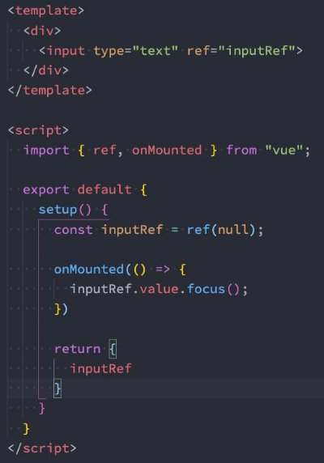
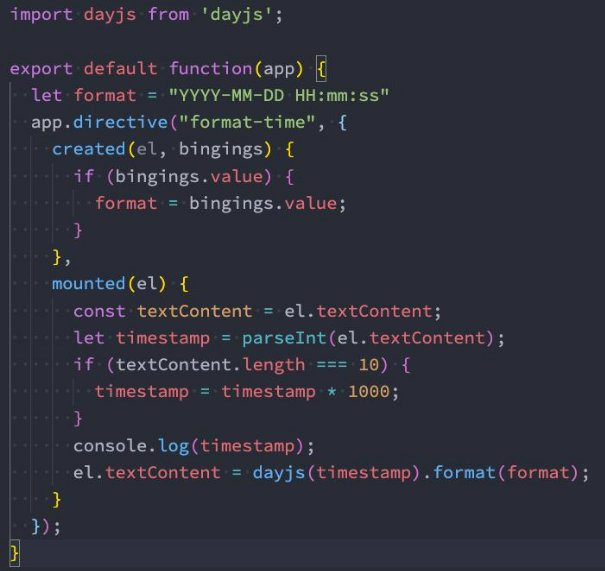

## **认识自定义指令**

- 在Vue的模板语法中我们学习过各种各样的指令：v-show、v-for、v-model等等，除了使用这些指令之外，**Vue也允许我们来 自定义自己的指令。**
  - 注意：在Vue中，代码的复用和抽象主要还是通过组件；
  - 通常在某些情况下，你需要对DOM元素进行底层操作，这个时候就会用到自定义指令；

- **自定义指令分为两种：**
  - 自定义局部指令：组件中通过 directives 选项，只能在当前组件中使用；
  - 自定义全局指令：app的 directive 方法，可以在任意组件中被使用；

- **比如我们来做一个非常简单的案例：当某个元素挂载完成后可以自定获取焦点**
  - 实现方式一：如果我们使用默认的实现方式；
  - 实现方式二：自定义一个 v-focus 的局部指令；
  - 实现方式三：自定义一个 v-focus 的全局指令；

**实现方式一：聚焦的默认实现**

**实现方式二：局部自定义指令**

- 实现方式二：自定义一个 v-focus 的局部指令
  - 这个自定义指令实现非常简单，我们只需要在组件选项中使用 directives 即可；
  - 它是一个对象，在对象中编写我们自定义指令的名称（注意：这里不需要加v-）；
  - 自定义指令有一个生命周期，是在组件挂载后调用的 mounted，我们可以在其中完成操作；

**方式三：自定义全局指令**

- 自定义一个**全局的v-focus指令**可以让我们在任何地方直接使用

### **指令的生命周期**

- **一个指令定义的对象，Vue提供了如下的几个钩子函数：**
  - created：在绑定元素的 attribute 或事件监听器被应用之前调用；
  - beforeMount：当指令第一次绑定到元素并且在挂载父组件之前调用；
  - mounted：在绑定元素的父组件被挂载后调用；
  - beforeUpdate：在更新包含组件的 VNode 之前调用；
  - updated：在包含组件的 VNode **及其子组件的 VNode** 更新后调用；
  - beforeUnmount：在卸载绑定元素的父组件之前调用；
  - unmounted：当指令与元素解除绑定且父组件已卸载时，只调用一次；

### **指令的参数和修饰符**

- 如果我们指令需要**接受一些参数或者修饰符**应该如何操作呢？
  - info是参数的名称；
  - aaa-bbb是修饰符的名称；
  - 后面是传入的具体的值；

- 在我们的生命周期中，我们可以**通过 bindings 获取到对应的内容**：

### **自定义指令练习**

- **自定义指令案例：时间戳的显示需求：v-format-time**
  - 在开发中，大多数情况下从服务器获取到的都是时间戳；
  - 我们需要将时间戳转换成具体格式化的时间来展示；
  - 在Vue2中我们可以通过过滤器来完成；
  - 在Vue3中我们可以通过 计算属性（computed） 或者 自定义一个方法（methods） 来完成；
  - 其实我们还可以通过一个自定义的指令来完成；

  - 我们来实现一个可以自动对**时间格式化的指令**
  - 这里我封装了一个函数，在首页中我们只需要调用这个函数并且传入app即可；

- 代码见下页：

**时间格式化指令**

## **认识Teleport**

- 在组件化开发中，我们**封装一个组件A**，在**另外一个组件B中使用**：
  - 那么组件A中template的元素，会被挂载到组件B中template的某个位置；
  - 最终我们的应用程序会形成**一颗DOM树结构**；

- 但是某些情况下，我们希望**组件不是挂载在这个组件树上**的，可能是**移动到Vue app之外的其他位置**： 
  - 比如移动到body元素上，或者我们有其他的div#app之外的元素
  - 这个时候我们就可以通过teleport来完成；

- **Teleport是什么呢？**

  - 它是一个Vue提供的内置组件，类似于react的Portals；
  - teleport翻译过来是心灵传输、远距离运输的意思；
  -  它有两个属性：

    - to：指定将其中的内容移动到的目标元素，可以使用选择器；

    - disabled：是否禁用 teleport 的功能；

**我们来看下面代码的效果：**

**和组件结合使用**

- 当然，**teleport也可以和组件结合一起来使用：**
- 我们可以在 teleport 中使用组件，并且也可以给他传入一些数据；

### **多个teleport**

- 如果我们将**多个teleport应用**到**同一个目标上（to的值相同）**，那么这些**目标会进行合并**：
- 实现效果如下：
- 

## **异步组件和Suspense**

- 注意：**目前（2021-06-08）Suspense显示的是一个实验性的特性，API随时可能会修改。**
- **Suspense是一个内置的全局组件，该组件有两个插槽：**
  - default：如果default可以显示，那么显示default的内容；
  - fallback：如果default无法显示，那么会显示fallback插槽的内容；

## **认识Vue插件**

- 通常我们**向Vue全局添加一些功能**时，会采用**插件的模式，它有两种编写方式**：
  - 对象类型：一个对象，但是必须包含一个install 的函数，该函数会在安装插件时执行；
  - 函数类型：一个function，这个函数会在 安装插件时自动执行；

- 插件可以**完成的功能没有限制**，比如下面的几种都是可以的：
  - 添加全局方法或者 property，通过把它们添加到 config.globalProperties 上实现；
  - 添加全局资源：指令/过滤器/过渡等；
  - 通过全局 mixin 来添加一些组件选项；
  - 一个库，提供自己的 API，同时提供上面提到的一个或多个功能；

**插件的编写方式**

对象类型的写法 函数类型的写法

 

