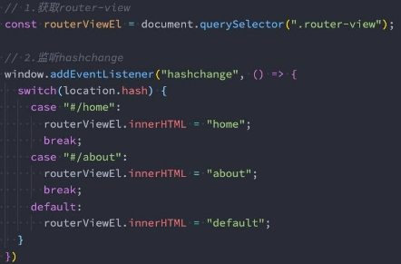
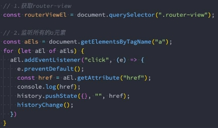
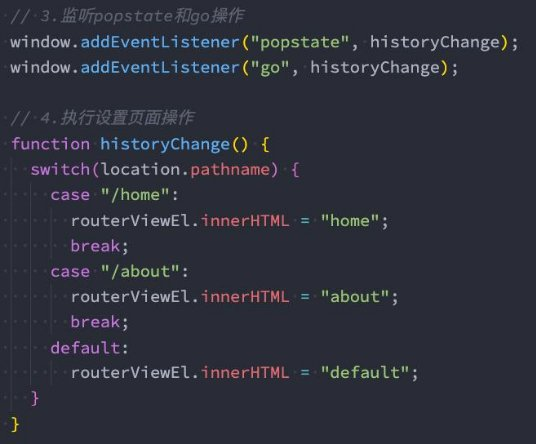
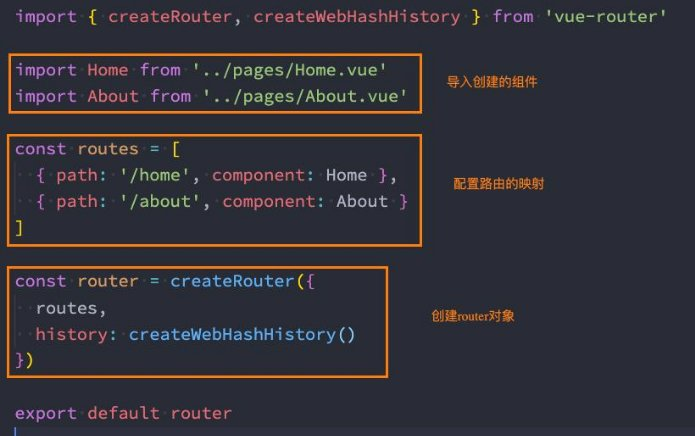
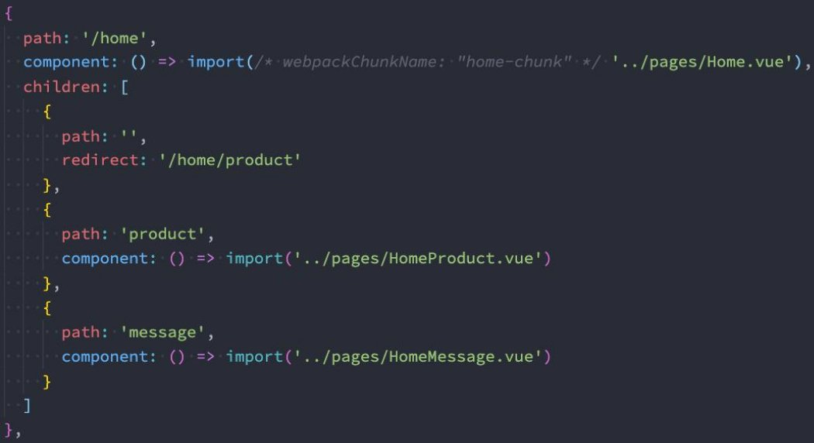
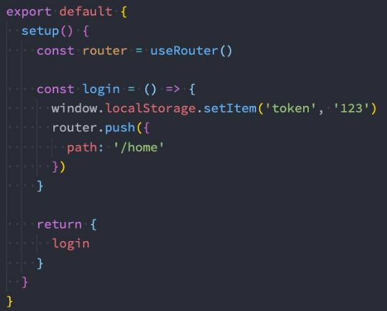
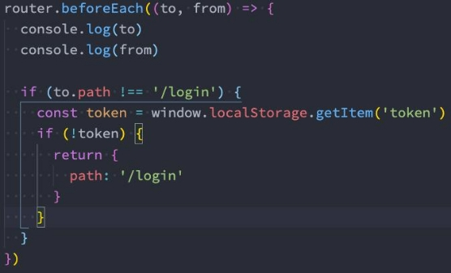

**Vue全家桶 - Vue-Router详解 **

王红元 coderwhy

 

|**目录 content**|**1**|**前端路由的发展历程**|
| :- | - | - |
||**2**|**Vue-Router基本使用**|
||**3**|**路由懒加载分包处理**|
||**4**|**动态路由和路由嵌套**|
||**5**|**路由的编程式导航**|
||**6**|**动态管理路由对象**|
||**7**|**路由导航守卫钩子**|

**认识前端路由![ref1]**

- **路由其实是网络工程中的一个术语：**
- 在架构一个网络时，非常重要的两个设备就是路由器和交换机。
- 当然，目前在我们生活中路由器也是越来越被大家所熟知，因为我们生活中都会用到路由器：
- 事实上，路由器主要维护的是一个映射表；
- 映射表会决定数据的流向；
- 路由的概念在软件工程中出现，最早是在后端路由中实现的，原因是web的发展主要经历了这样一些阶段：
- 后端路由阶段；
- 前后端分离阶段；
- 单页面富应用（SPA）；

**后端路由阶段![ref1]**

- 早期的网站开发整个HTML页面是由**服务器来渲染**的.
  - 服务器直接生产渲染好对应的HTML页面, 返回给客户端进行展示.
- 但是, 一个网站, **这么多页面服务器如何处理呢?**
- 一个页面有自己对应的网址, 也就是URL；
- URL会发送到服务器, 服务器会通过正则对该URL进行匹配, 并且最后交给一个Controller进行处理；
- Controller进行各种处理, 最终生成HTML或者数据, 返回给前端.
- 上面的这种操作, 就是**后端路由**：
  - 当我们页面中需要请求不同的**路径**内容时, 交给服务器来进行处理, 服务器渲染好整个页面, 并且将页面返回给客户端.
  - 这种情况下渲染好的页面, 不需要单独加载任何的js和css, 可以直接交给浏览器展示, 这样也有利于SEO的优化.
- **后端路由的缺点:**
- 一种情况是整个页面的模块由后端人员来编写和维护的；
- 另一种情况是前端开发人员如果要开发页面, 需要通过PHP和Java等语言来编写页面代码；
- 而且通常情况下HTML代码和数据以及对应的逻辑会混在一起, 编写和维护都是非常糟糕的事情；

**前后端分离阶段![ref1]**

- **前端渲染的理解：**
- 每次请求涉及到的静态资源都会从**静态资源服务器获取**，这些资源**包括HTML+CSS+JS**，然后在前端对这些请求回来的资源进行渲染；
- 需要注意的是，客户端的每一次请求，都会从静态资源服务器请求文件；
- 同时可以看到，和之前的后端路由不同，这时后端只是负责提供API了；
- **前后端分离阶段：**
- 随着Ajax的出现, 有了前后端分离的开发模式；
- 后端只提供API来返回数据，前端通过Ajax获取数据，并且可以通过JavaScript将数据渲染到页面中；
- 这样做最大的优点就是前后端责任的清晰，后端专注于数据上，前端专注于交互和可视化上；
- 并且当移动端(iOS/Android)出现后，后端不需要进行任何处理，依然使用之前的一套API即可；
- 目前比较少的网站采用这种模式开发；
- **单页面富应用阶段:**
- 其实SPA最主要的特点就是在前后端分离的基础上加了一层前端路由.
- 也就是前端来维护一套路由规则.
- 前端路由的核心是什么呢？改变URL，但是页面不进行整体的刷新。

**URL的hash![ref1]**

- **前端路由是如何做到URL和内容进行映射呢？监听URL的改变。**
- **URL的hash**
- URL的hash也就是锚点(#),  本质上是改变window.location的href属性；
- 我们可以通过直接赋值location.hash来改变href, 但是页面不发生刷新；

` `

- hash的优势就是兼容性更好，在老版IE中都可以运行，但是缺陷是有一个#，显得不像一个真实的路径。

**HTML5的History![ref1]**

- **history接口是HTML5新增的, 它有六种模式改变**
- replaceState：替换原来的路径；
- pushState：使用新的路径；
- popState：路径的回退；
- go：向前或向后改变路径；
- forward：向前改变路径；
- back：向后改变路径；

**URL而不刷新页面：**

**认识vue-router![ref1]**

- **目前前端流行的三大框架**
- Angular的ngRouter
- React的ReactRouter
- Vue的vue-router

**, 都有自己的路由实现:**

- **Vue Router 是 V[ue.js ](http://v3.vuejs.org/)的官方路由：**
- 它与 Vue.js 核心深度集成，让用 Vue.js 构建单页应用（SPA）变得非常容易；
- 目前Vue路由最新的版本是4.x版本，我们上课会基于最新的版本讲解；
- **vue-router是基于路由和组件的**
- 路由用于设定访问路径, 将路径和组件映射起来；
- 在vue-router的单页面应用中, 页面的路径的改变就是组件的切换；
- **安装Vue Router：**

npm install vue-router

**路由的使用步骤![ref1]**

- **使用vue-router的步骤:**
- 第一步：创建路由需要映射的组件（打算显示的页面）；
- 第二步：通过createRouter创建路由对象，并且传入routes和history模式；
  - 配置路由映射: 组件和路径映射关系的routes数组；
  - 创建基于hash或者history的模式；
- 第三步：使用app注册路由对象（use方法）；
- 第四步：路由使用: 通过<router-link>和<router-view>；

**路由的基本使用流程![ref1]**

 

**路由的默认路径![ref1]**

- **我们这里还有一个不太好的实现:**
- 默认情况下, 进入网站的首页, 我们希望<router-view>渲染首页的内容；
- 但是我们的实现中, 默认没有显示首页组件, 必须让用户点击才可以；
- **如何可以让路径默认跳到到首页, 并且<router-view>渲染首页组件呢?**

- **我们在routes中又配置了一个映射：**
- path配置的是根路径: /
- redirect是重定向, 也就是我们将根路径重定向到/home的路径下, 这样就可以得到我们想要的结果了.

**history模式![ref1]**

- **另外一种选择的模式是history模式：**

**router-link![ref1]**

- **router-link事实上有很多属性可以配置：**
- **to属性：**
- 是一个字符串，或者是一个对象
- **replace属性：**
- 设置 replace 属性的话，当点击时，会调用 router.replace()，而不是 router.push()；
- **active-class属性：**
- 设置激活a元素后应用的class，默认是router-link-active
- **exact-active-class属性：**
- 链接精准激活时，应用于渲染的 <a> 的 class，默认是router-link-exact-active；

**路由懒加载![ref1]**

- **当打包构建应用时，JavaScript 包会变得非常大，影响页面加载：**
- 如果我们能把不同路由对应的组件分割成不同的代码块，然后当路由被访问的时候才加载对应组件，这样就会更加高效；
- 也可以提高首屏的渲染效率；
- **其实这里还是我们前面讲到过的webpack的分包知识，而Vue Router默认就支持动态来导入组件：**
- 这是因为component可以传入一个组件，也可以接收一个函数，该函数 需要放回一个Promise；
- 而import函数就是返回一个Promise；

**打包效果分析![ref1]**

- 我们看一下打包后的效果：
- 我们会发现分包是没有一个很明确的名称的，其实webpack从3.x开始支持对分包进行命名（chunk name）：

 

**路由的其他属性![ref1]**

- name属性：路由记录独一无二的名称；
- meta属性：自定义的数据

**动态路由基本匹配![ref1]**

- **很多时候我们需要将给定匹配模式的路由映射到同一个组件：**
- 例如，我们可能有一个 User 组件，它应该对所有用户进行渲染，但是用户的ID是不同的；
- 在Vue Router中，我们可以在路径中使用一个动态字段来实现，我们称之为 路径参数；

- **在router-link中进行如下跳转：**

**获取动态路由的值![ref1]**

- **那么在User中如何获取到对应的值呢？**
- 在template中，直接通过 $route.params获取值；
- 在created中，通过 this.$route.params获取值；
- 在setup中，我们要使用 vue-router库给我们提供的一个hook useRoute；

➢ 该Hook会返回一个Route对象，对象中保存着当前路由相关的值；

` `

**NotFound![ref1]**

- 对于哪些没有匹配到的路由，我们通常会匹配到固定的某个页面
- 比如NotFound的错误页面中，这个时候我们可编写一个动态路由用于匹配所有的页面；

- 我们可以通过 $route.params.pathMatch获取到传入的参数：

**匹配规则加\*![ref1]**

- **这里还有另外一种写法：**
- 注意：我在/:pathMatch(.\*)后面又加了一个 \*；

- 它们的区别在于解析的时候，是否解析 /：

**路由的嵌套![ref1]**

- **什么是路由的嵌套呢？**
- 目前我们匹配的Home、About、User等都属于第一层路由，我们在它们之间可以来回进行切换；
- **但是呢，我们Home页面本身，也可能会在多个组件之间来回切换：**
- 比如Home中包括Product、Message，它们可以在Home内部来回切换；
- 这个时候我们就需要使用嵌套路由，在Home中也使用 router-view 来占位之后需要渲染的组件；

**路由的嵌套配置![ref1]**

**代码的页面跳转![ref1]**

- 有时候我们希望通过代码来完成页面的跳转，比如点击的是一个按钮：

- 当然，我们也可以传入一个对象：

- 如果是在setup中编写的代码，那么我们可以通过 useRouter 来获取：

**query方式的参数![ref1]**

- 我们也可以通过query的方式来传递参数：

- 在界面中通过 $route.query 来获取参数：

**替换当前的位置![ref1]**

- 使用push的特点是压入一个新的页面，那么在用户点击返回时，上一个页面还可以回退，但是如果我们希望当前页面是一个替换 操作，那么可以使用replace：

**页面的前进后退![ref1]**

- **router的go方法：**

- **router也有back：**
- 通过调用 history.back() 回溯历史。相当于 router.go(-1)；
- **router也有forward：**
- 通过调用 history.forward() 在历史中前进。相当于 router.go(1)；

**动态添加路由![ref1]**

- **某些情况下我们可能需要动态的来添加路由：**
- 比如根据用户不同的权限，注册不同的路由；
- 这个时候我们可以使用一个方法 addRoute；
- **如果我们是为route添加一个children路由，那么可以传入对应的name：**

 

**动态管理路由的其他方法（了解）![ref1]**

- **删除路由有以下三种方式：**
- 方式一：添加一个name相同的路由；
- 方式二：通过removeRoute方法，传入路由的名称；
- 方式三：通过addRoute方法的返回值回调；

- **路由的其他方法补充：**
- router.hasRoute()：检查路由是否存在。
- router.getRoutes()：获取一个包含所有路由记录的数组。

**路由导航守卫![ref1]**

- **vue-router 提供的导航守卫主要用来通过跳转或取消的方式守卫导航。**
- **全局的前置守卫beforeEach是在导航触发时会被回调的：**
- **它有两个参数：**
- to：即将进入的路由Route对象；
- from：即将离开的路由Route对象； 
- **它有返回值：** 
- false：取消当前导航； 
- 不返回或者undefined：进行默认导航； 
- 返回一个路由地址： 
- 可以是一个string类型的路径；
- 可以是一个对象，对象中包含path、query、params等信息；
- **可选的第三个参数：next（不推荐使用）**
- 在Vue2中我们是通过next函数来决定如何进行跳转的；
- 但是在Vue3中我们是通过返回值来控制的，不再推荐使用next函数，这是因为开发中很容易调用多次next；

**登录守卫功能![ref1]**

- 比如我们完成一个功能，只有登录后才能看到其他页面：

` `

**其他导航守卫![ref1]**

- **Vue还提供了很多的其他守卫函数，目的都是在某一个时刻给予我们回调，让我们可以更好的控制程序的流程或者功能：**
  - <https://next.router.vuejs.org/zh/guide/advanced/navigation-guards.html>
- 我们一起来看一下**完整的导航解析流程**：
  - 导航被触发。
  - 在失活的组件里调用 beforeRouteLeave 守卫。
  - 调用全局的 beforeEach 守卫。
  - 在重用的组件里调用 beforeRouteUpdate 守卫(2.2+)。
  - 在路由配置里调用 beforeEnter。
  - 解析异步路由组件。
  - 在被激活的组件里调用 beforeRouteEnter。
  - 调用全局的 beforeResolve 守卫(2.5+)。
  - 导航被确认。
  - 调用全局的 afterEach 钩子。
  - 触发 DOM 更新。
  - 调用 beforeRouteEnter 守卫中传给 next 的回调函数，创建好的组件实例会作为回调函数的参数传入。

[ref1]: ./image/Aspose.Words.3075c5e0-ea8d-4150-a63a-41969d739eec.014.png
