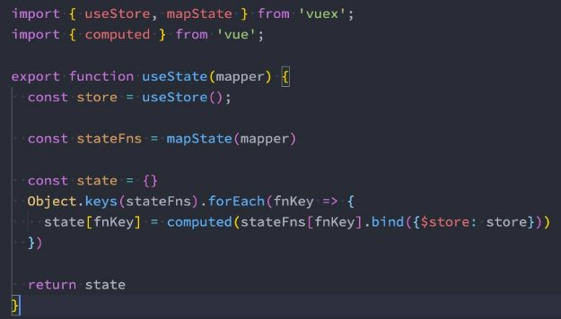
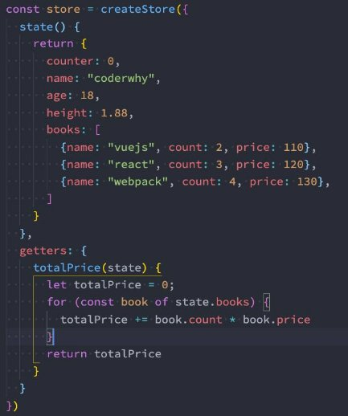
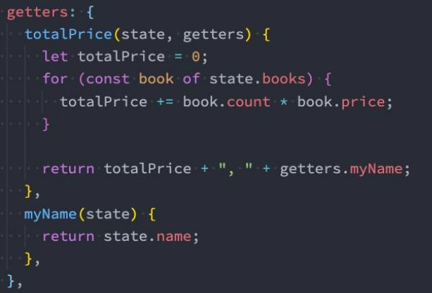
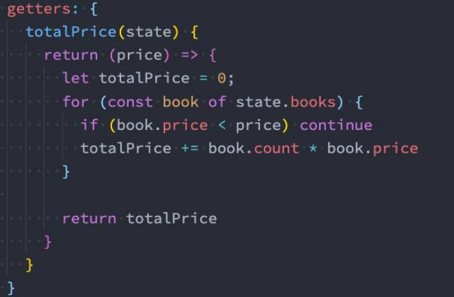
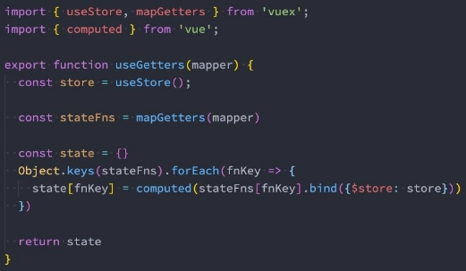

**Vue全家桶 – Vuex状态管理 **

王红元 coderwhy

|**目录 content**|**1**|**认识应用状态管理**|
| :- | - | - |
||**2**|**Vuex的基本使用**|
||**3**|**核心概念State**|
||**4**|**核心概念Getters**|
||**5**|**核心概念Mutations**|
||**6**|**核心概念Actions**|
||**7**|**核心概念Modules**|

**什么是状态管理![ref1]**

- **在开发中，我们会的应用程序需要处理各种各样的数据，这些数据需 要保存在我们应用程序中的某一个位置，对于这些数据的管理我们就 称之为是 状态管理。 **
- **在前面我们是如何管理自己的状态呢？** 
- 在Vue开发中，我们使用组件化的开发方式； 
- 而在组件中我们定义data或者在setup中返回使用的数据，这些数 据我们称之为state； 
- 在模块template中我们可以使用这些数据，模块最终会被渲染成 DOM，我们称之为View； 
- 在模块中我们会产生一些行为事件，处理这些行为事件时，有可能 会修改state，这些行为事件我们称之为actions； 

**复杂的状态管理![ref1]**

- **JavaScript开发的应用程序，已经变得越来越复杂了：**
- JavaScript需要管理的状态越来越多，越来越复杂；
- 这些状态包括服务器返回的数据、缓存数据、用户操作产生的数据等等；
- 也包括一些UI的状态，比如某些元素是否被选中，是否显示加载动效，当前分页；

**复杂的状态管理![ref1]**

- 当我们的应用遇到**多个组件共享状态**
- 多个视图依赖于同一状态；
- 来自不同视图的行为需要变更同一状态；

时，单向数据流的简洁性很容易被破坏：

**复杂的状态管理![ref1]**

- **我们是否可以通过组件数据的传递来完成呢？**
- 对于一些简单的状态，确实可以通过props的传递或者Provide的方式来共享状态；
- 但是对于复杂的状态管理来说，显然单纯通过传递和共享的方式是不足以解决问题的，比如兄弟组件如何共享数据呢？

**Vuex的状态管理![ref1]**

- **管理不断变化的state本身是非常困难的：**
- 状态之间相互会存在依赖，一个状态的变化会引起另一个状态的变化，View页面也有可能会引起状态的变化；
- 当应用程序复杂时，state在什么时候，因为什么原因而发生了变化，发生了怎么样的变化，会变得非常难以控制和追踪；
- **因此，我们是否可以考虑将组件的内部状态抽离出来，以一个全局单例的方式来管理呢？**
- 在这种模式下，我们的组件树构成了一个巨大的 “试图View”；
- 不管在树的哪个位置，任何组件都能获取状态或者触发行为；
- 通过定义和隔离状态管理中的各个概念，并通过强制性的规则来维护视图和状态间的独立性，我们的代码边会变得更加结构 化和易于维护、跟踪；

**Vuex的状态管理![ref1]**

- **这就是Vuex背后的基本思想，它借鉴了Flux、Redux、Elm（纯函数语言，**
- **当然，目前Vue官方也在推荐使用Pinia进行状态管理，我们后续也会进行学习。**

**redux有借鉴它的思想）；**

**Vuex的状态管理![ref1]**

**Vuex的安装![ref1]**

- **依然我们要使用vuex，首先第一步需要安装vuex：**
- 我们这里使用的是vuex4.x；

npm install vuex

**创建Store![ref1]**

- **每一个Vuex应用的核心就是store（仓库）：**
- store本质上是一个容器，它包含着你的应用中大部分的状态（state）；
- **Vuex和单纯的全局对象有什么区别呢？**
- 第一：Vuex的状态存储是响应式的
  - 当Vue组件从store中读取状态的时候，若store中的状态发生变化，那么相应的组件也会被更新；
- 第二：你不能直接改变store中的状态
  - 改变store中的状态的唯一途径就显示**提交 (commit) mutation**；
  - 这样使得我们可以方便的跟踪每一个状态的变化，从而让我们能够通过一些工具帮助我们更好的管理应用的状态；
- **使用步骤：**
- 创建Store对象；
- 在app中通过插件安装；

**组件中使用store![ref1]**

- **在组件中使用store，我们按照如下的方式：**
- 在模板中使用；
- 在options api中使用，比如computed；
- 在setup中使用；

**单一状态树![ref1]**

- **Vuex 使用单一状态树：**
- 用一个对象就包含了全部的应用层级的状态；
- 采用的是SSOT，Single Source of Truth，也可以翻译成单一数据源；
- **这也意味着，每个应用将仅仅包含一个 store 实例；**
- 单状态树和模块化并不冲突，后面我们会讲到module的概念；
- **单一状态树的优势：**
- 如果你的状态信息是保存到多个Store对象中的，那么之后的管理和维护等等都会变得特别困难；
- 所以Vuex也使用了单一状态树来管理应用层级的全部状态；
- 单一状态树能够让我们最直接的方式找到某个状态的片段；
- 而且在之后的维护和调试过程中，也可以非常方便的管理和维护；

**组件获取状态![ref1]**

- **在前面我们已经学习过如何在组件中获取状态了。**
- **当然，如果觉得那种方式有点繁琐（表达式过长），我们可以使用计算属性：**

- **但是，如果我们有很多个状态都需要获取话，可以使用mapState的辅助函数：**
- mapState的方式一：对象类型；
- mapState的方式二：数组类型；
- 也可以使用展开运算符和来原有的computed混合在一起；

**在setup中使用mapState![ref1]**

- **在setup中如果我们单个获取装是非常简单的：**
- 通过useStore拿到store后去获取某个状态即可；
- 但是如果我们需要使用 mapState 的功能呢？
- **默认情况下，Vuex并没有提供非常方便的使用mapState的方式，这里我们进行了一个函数的封装：**

 

**getters的基本使用![ref1]**

- **某些属性我们可能需要经过变化后来使用，这个时候可以使用getters：**

 

**getters第二个参数![ref1]**

- **getters可以接收第二个参数：**

**getters的返回函数![ref1]**

- **getters中的函数本身，可以返回一个函数，那么在使用的地方相当于可以调用这个函数：**

**mapGetters的辅助函数![ref1]**

- **这里我们也可以使用mapGetters的辅助函数。**

- **在setup中使用**

**Mutation基本使用![ref1]**

- **更改 Vuex 的 store 中的状态的唯一方法是提交 mutation：**

**Mutation携带数据![ref1]**

- **很多时候我们在提交mutation的时候，会携带一些数据，这个时候我们可以使用参数：**

- **payload为对象类型**

- **对象风格的提交方式**

**Mutation常量类型![ref1]**

- **定义常量：mutation-type.js**

- **定义mutation**

- **提交mutation**

**mapMutations辅助函数![ref1]**

- **我们也可以借助于辅助函数，帮助我们快速映射到对应的方法中：**

- **在setup中使用也是一样的：**

**mutation重要原则![ref1]**

- 一条重要的原则就是要记住 **mutation 必须是同步函数**
- 这是因为devtool工具会记录mutation的日记；
- 每一条mutation被记录，devtools都需要捕捉到前一状态和后一状态的快照；
- 但是在mutation中执行异步操作，就无法追踪到数据的变化；
- **所以Vuex的重要原则中要求 mutation必须是同步函数；**
- 但是如果我们希望在Vuex中发送网络请求的话需要如何操作呢？

**actions的基本使用![ref1]**

- **Action类似于mutation，不同在于： **
- Action提交的是mutation，而不是直接变更状态； 
- Action可以包含任意异步操作； 
- **这里有一个非常重要的参数context：**
- context是一个和store实例均有相同方法和属性的context对象；
- 所以我们可以从其中获取到commit方法来提交一个mutation，或者通过 context.state 和 context.getters 来获取 state 和 getters；
- **但是为什么它不是store对象呢？这个等到我们讲Modules时再具体来说；**

**actions的分发操作![ref1]**

- **如何使用action呢？进行action的分发：**
- 分发使用的是 store 上的dispatch函数；

- **同样的，它也可以携带我们的参数：**

- **也可以以对象的形式进行分发：**

**actions的辅助函数![ref1]**

- **action也有对应的辅助函数：**
- 对象类型的写法；
- 数组类型的写法；

 

**actions的异步操作![ref1]**

- **Action 通常是异步的，那么如何知道 action 什么时候结束呢？**
- 我们可以通过让action返回Promise，在Promise的then中来处理完成后的操作；

 

**module的基本使用![ref1]**

- **什么是Module？**
- 由于使用单一状态树，应用的所有状态会集中到一个比较大的对象，当应用变得非常复杂时，store 对象就有可能变得相当臃 肿；
- 为了解决以上问题，Vuex  允许我们将 store 分割成**模块（module）**；
- 每个模块拥有自己的 state、mutation、action、getter、甚至是嵌套子模块；

 

**module的局部状态![ref1]**

- 对于模块内部的 mutation 和 getter，接收的第一个参数是**模块的局部状态对象**：

**module的命名空间![ref1]**

- 默认情况下，模块内部的action和mutation仍然是注册在**全局的命名空间**中的：
  - 这样使得多个模块能够对同一个 action 或 mutation 作出响应；
  - Getter 同样也默认注册在全局命名空间；
- 如果我们希望模块具有更高的封装度和复用性，可以添加 namespaced: true 的方式使其成为带命名空间的模块：
- 当模块被注册后，它的所有 getter、action 及 mutation 都会自动根据模块注册的路径调整命名；

 

**module修改或派发根组件![ref1]**

- **如果我们希望在action中修改root中的state，那么有如下的方式：**

[ref1]: ./image/Aspose.Words.f12c5e8c-8e59-42dd-826e-dfffa05c8714.012.png
