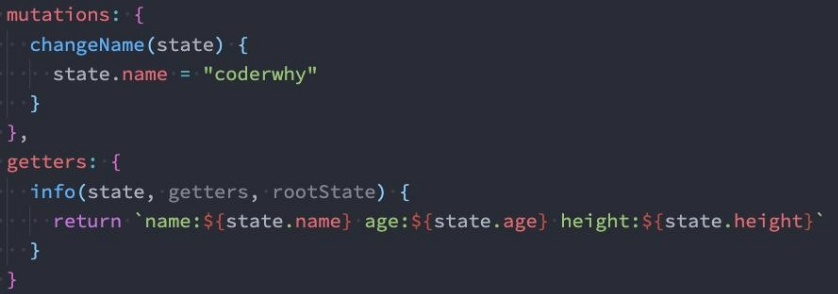
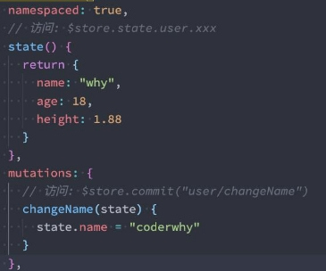
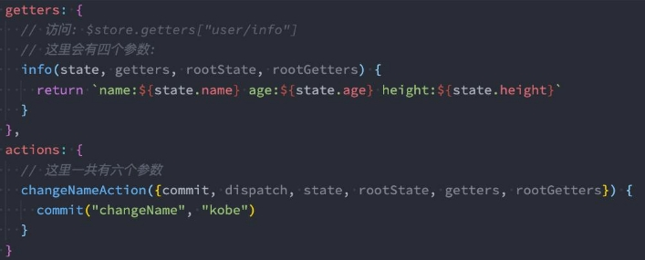

## 总结

### 2.1. 理解状态管理

### 2.2. Vuex基本使用

* 安装vuex
* 创建store
* app.use(store)
* tempate -> $store.state.counter

### 2.3. 核心概念一State

#### 2.3.1. 基本使用

#### 2.3.2. 映射使用

* options api
* composition api

### 2.4. 核心概念二getter

#### 2.4.1. 基本使用

* 直接使用
* 引入别的getters
* 返回函数, 接收参数

#### 2.4.2. 映射使用

- options api
- composition api

### 2.5. 核心概念三Mutations

#### 2.5.1. 重要原则

* 修改state, 必须使用mutation

#### 2.5.2. 基本使用

* 直接使用
* 传入参数

#### 2.5.3. 映射使用

#### 2.5.4. 重要原则

* 不要在mutation执行异步操作, 必须同步操作

### 2.6. 核心概念四Actions

#### 2.6.1. actions的基本使用

* 定义action
* dispatch派发action

#### 2.6.2. actions的辅助函数

#### 2.6.3. actions的异步操作

* home.vue -> home.js -> actions发送请求

#### 2.6.4. action结果返回Promise(了解)

### 2.7. Module的使用

#### 2.7.1. module的基本使用

* 抽取到对象:
  * state
  * mutations
  * getters
  * actions
* modules: { home: 对象 }
* state.home.xxx
* getters.xxx
* commit
* dispatch

#### 2.7.2. module的命名空间

* namespaced: true
* getters["home/xxx"]
* commit("home/xxx")

### 

## 认识应用状态管理

### 什么是状态管理

- **在开发中，我们会的应用程序需要处理各种各样的数据，这些数据需 要保存在我们应用程序中的某一个位置，对于这些数据的管理我们就 称之为是 状态管理。 **
- **在前面我们是如何管理自己的状态呢？** 
  - 在Vue开发中，我们使用组件化的开发方式； 
  - 而在组件中我们定义data或者在setup中返回使用的数据，这些数 据我们称之为state； 
  - 在模块template中我们可以使用这些数据，模块最终会被渲染成 DOM，我们称之为View； 
  - 在模块中我们会产生一些行为事件，处理这些行为事件时，有可能 会修改state，这些行为事件我们称之为actions； 


### 复杂的状态管理

- **JavaScript开发的应用程序，已经变得越来越复杂了：**
  - JavaScript需要管理的状态越来越多，越来越复杂；
  - 这些状态包括服务器返回的数据、缓存数据、用户操作产生的数据等等；
  - 也包括一些UI的状态，比如某些元素是否被选中，是否显示加载动效，当前分页；


- 当我们的应用遇到**多个组件共享状态**时，单向数据流的简洁性很容易被破坏：
  - 多个视图依赖于同一状态；
  - 来自不同视图的行为需要变更同一状态；


- **我们是否可以通过组件数据的传递来完成呢？**
  - 对于一些简单的状态，确实可以通过props的传递或者Provide的方式来共享状态；
  - 但是对于复杂的状态管理来说，显然单纯通过传递和共享的方式是不足以解决问题的，比如兄弟组件如何共享数据呢？


## Vuex的基本使用

### Vuex的状态管理

- **管理不断变化的state本身是非常困难的：**
  - 状态之间相互会存在依赖，一个状态的变化会引起另一个状态的变化，View页面也有可能会引起状态的变化；
  - 当应用程序复杂时，state在什么时候，因为什么原因而发生了变化，发生了怎么样的变化，会变得非常难以控制和追踪；

- **因此，我们是否可以考虑将组件的内部状态抽离出来，以一个全局单例的方式来管理呢？**
  - 在这种模式下，我们的组件树构成了一个巨大的 “试图View”；
  - 不管在树的哪个位置，任何组件都能获取状态或者触发行为；
  - 通过定义和隔离状态管理中的各个概念，并通过强制性的规则来维护视图和状态间的独立性，我们的代码边会变得更加结构 化和易于维护、跟踪；


- **这就是Vuex背后的基本思想，它借鉴了Flux、Redux、Elm（纯函数语言，redux有借鉴它的思想）；**
- 当然，目前Vue官方也在推荐使用Pinia进行状态管理，我们后续也会进行学习。


### Vuex的安装

- **依然我们要使用vuex，首先第一步需要安装vuex：**
- 我们这里使用的是vuex4.x；
  - `npm install vuex`


## 核心概念State

### 创建Store

- **每一个Vuex应用的核心就是store（仓库）：**
  - store本质上是一个容器，它包含着你的应用中大部分的状态（state）；

- **Vuex和单纯的全局对象有什么区别呢？**
  - 第一：Vuex的状态存储是响应式的
    - 当Vue组件从store中读取状态的时候，若store中的状态发生变化，那么相应的组件也会被更新；

  - 第二：你不能直接改变store中的状态
    - 改变store中的状态的唯一途径就显示**提交 (commit) mutation**；
    - 这样使得我们可以方便的跟踪每一个状态的变化，从而让我们能够通过一些工具帮助我们更好的管理应用的状态；

- **使用步骤：**
  - 创建Store对象；
  - 在app中通过插件安装；


### 组件中使用store

- **在组件中使用store，我们按照如下的方式：**

  - 在模板中使用；

  ```vue
     <h2>Home当前计数: {{ $store.state.counter }}</h2>
  ```

  - 在options api中使用，比如computed；

  ```js
    export default {
      computed: {
        storeCounter() {
          return this.$store.state.counter
        }
      }
    }
  ```

  - 在setup中使用；

  ```js
   import { toRefs } from 'vue'
    import { useStore } from 'vuex'
  
    const store = useStore()
    const { counter } = toRefs(store.state) //这里需要使用toRefs，转化为响应式的。
    
    function increment() {
      // store.state.counter++
      store.commit("increment")
    }
  ```

  

### 单一状态树

- **Vuex 使用单一状态树：**
  - 用一个对象就包含了全部的应用层级的状态；
  - 采用的是SSOT，Single Source of Truth，也可以翻译成单一数据源；

- **这也意味着，每个应用将仅仅包含一个 store 实例；**
  - 单状态树和模块化并不冲突，后面我们会讲到module的概念；

- **单一状态树的优势：**
  - 如果你的状态信息是保存到多个Store对象中的，那么之后的管理和维护等等都会变得特别困难；
  - 所以Vuex也使用了单一状态树来管理应用层级的全部状态；
  - 单一状态树能够让我们最直接的方式找到某个状态的片段；
  - 而且在之后的维护和调试过程中，也可以非常方便的管理和维护；


### 组件获取状态

- 在前面我们已经学习过如何在组件中获取状态了。
- 当然，如果觉得那种方式有点繁琐（表达式过长），我们可以使用计算属性：

```js
export default {
  computed: {
      storeCounter() {
        return this.$store.state.counter
      }
    }
}
```

- **但是，如果我们有很多个状态都需要获取话，可以使用mapState的辅助函数：**
  - mapState的方式一：对象类型；
  - mapState的方式二：数组类型；
  - 也可以使用展开运算符和来原有的computed混合在一起；


```vue
<template>
  <div class="app">
    <button @click="incrementLevel">修改level</button>
    <!-- 1.在模板中直接使用多个状态 -->
    <h2>name: {{ $store.state.name }}</h2>
    <h2>level: {{ $store.state.level }}</h2>
    <h2>avatar: {{ $store.state.avatarURL }}</h2>

    <!-- 2.计算属性(映射状态: 数组语法) -->
    <h2>name: {{ name }}</h2>
    <h2>level: {{ level }}</h2>

    <!-- 3.计算属性(映射状态: 对象语法) -->
    <h2>name: {{ sName }}</h2>
    <h2>level: {{ sLevel }}</h2>
  </div>
</template>

<script>
  import { mapState } from 'vuex'

  export default {
    computed: {
      fullname() {
        return "xxx"
      },
      ...mapState(["name", "level", "avatarURL"]),
      ...mapState({
        sName: state => state.name,
        sLevel: state => state.level
      })
    }
  }
</script>
```


#### 在setup中使用mapState

- **在setup中如果我们单个获取装是非常简单的：**
  - 通过useStore拿到store后去获取某个状态即可；
  - 但是如果我们需要使用 mapState 的功能呢？

- **默认情况下，Vuex并没有提供非常方便的使用mapState的方式，这里我们进行了一个函数的封装：**
- **或者使用toRefs**

```vue
<template>
  <div class="app">
    <button @click="incrementLevel">修改level</button>

    <!-- 4.setup计算属性(映射状态: 对象语法) -->
    <!-- <h2>name: {{ cName }}</h2>
    <h2>level: {{ cLevel }}</h2> -->
    
    <!-- 5.setup计算属性(映射状态: 对象语法) -->
    <h2>name: {{ name }}</h2>
    <h2>level: {{ level }}</h2>
  </div>
</template>

<script setup>
  import { computed, toRefs } from 'vue'
  import { mapState, useStore } from 'vuex'

  // 1.自己一步步写封装
  const { name, level } = mapState(["name", "level"]) //mapstate返回的是一个对象{name:f,level:f}，不能直接使用
  const store = useStore()
  const cName = computed(name.bind({ $store: store })) //name函数其实就是内部就是return this.$store.state，所以这里使用bind绑定一个{$store}
  const cLevel = computed(level.bind({ $store: store }))

  // 2.封装一个函数
   function useMyState(mapper) {
    const store = useStore()
    const stateFnsObj = mapState(mapper)

    const newState = {}
    Object.keys(stateFnsObj).forEach(key => {
      newState[key] = computed(stateFnsObj[key].bind({ $store: store }))
    })

    return newState
  }
  const { name, level } = useMyState(["name", "level"])

  // 3.直接对store.state进行解构(推荐)
  const store = useStore()
  const { name, level } = toRefs(store.state)

  function incrementLevel() {
    store.state.level++
  }

</script>
```


## **核心概念Getters**

### getters的基本使用

- 某些属性我们可能需要经过变化后来使用，这个时候可以使用getters：
- getters第二个参数：可以获取其他的getters
- getters中的函数本身，可以返回一个函数，那么在使用的地方相当于可以调用这个函数：

```js
{
   getters: {
    // 1.基本使用
    doubleCounter(state) {
      return state.counter * 2
    },
    totalAge(state) {
      return state.friends.reduce((preValue, item) => {
        return preValue + item.age
      }, 0)
    },
    // 2.在该getters属性中, 获取其他的getters
    message(state, getters) {
      return `name:${state.name} level:${state.level} friendTotalAge:${getters.totalAge}`
    },
    // 3.getters是可以返回一个函数的, 调用这个函数可以传入参数(了解)
    getFriendById(state) {
      return function(id) {
        const friend = state.friends.find(item => item.id === id)
        return friend
      }
    }
  }
}
```


### mapGetters的辅助函数

- **这里我们也可以使用mapGetters的辅助函数。**

```vue
<template>
  <div class="app">
    <h2>doubleCounter: {{ doubleCounter }}</h2>
    <h2>friendsTotalAge: {{ totalAge }}</h2>
    <!-- 根据id获取某一个朋友的信息 -->
    <h2>id-111的朋友信息: {{ getFriendById(111) }}</h2>
  </div>
</template>

<script>
  import { mapGetters } from 'vuex'

  export default {
    computed: {
      ...mapGetters(["doubleCounter", "totalAge"]),
      ...mapGetters(["getFriendById"])
    }
  }
</script>
```

- **在setup中使用**

```vue
<template>
  <div class="app">
    <h2>message: {{ message }}</h2>
  </div>
</template>


<script setup>

  import { computed, toRefs } from 'vue';
  import { mapGetters, useStore } from 'vuex'

  const store = useStore()

  // 1.使用mapGetters
  // const { message: messageFn } = mapGetters(["message"])
  // const message = computed(messageFn.bind({ $store: store }))

  // 2.直接解构, 并且包裹成ref
  // const { message } = toRefs(store.getters)

  // 3.针对某一个getters属性使用computed
  const message = computed(() => store.getters.message)

</script>
```


## 核心概念Mutations

### Mutation基本使用

- **更改 Vuex 的 store 中的状态的唯一方法是提交 mutation：**

```javascript
const store = createStore({
  mutations: {
    increment(state) {
      state.counter++
    },
    changeName(state, payload) {
      state.name = payload
    }
 } 
})
```


### Mutation携带数据

- **很多时候我们在提交mutation的时候，会携带一些数据，这个时候我们可以使用参数：**


- **payload为对象类型**


- **对象风格的提交方式**


### Mutation常量类型

- **定义常量：mutation-type.js**


- **定义mutation**


- **提交mutation**


### mapMutations辅助函数

- **我们也可以借助于辅助函数，帮助我们快速映射到对应的方法中：**


- **在setup中使用也是一样的：**

```vue
<template>
  <div class="app">
    <button @click="changeName('王小波')">修改name</button>
    <button @click="incrementLevel">递增level</button>
    <button @click="changeInfo({ name: '王二', level: 200 })">修改info</button>
    <h2>Store Name: {{ $store.state.name }}</h2>
    <h2>Store Level: {{ $store.state.level }}</h2>
  </div>
</template>


<script setup>

  import { mapMutations, useStore } from 'vuex'
  import { CHANGE_INFO } from "@/store/mutation_types"

  const store = useStore()

  // 1.手动的映射和绑定
  const mutations = mapMutations(["changeName", "incrementLevel", CHANGE_INFO])
  const newMutations = {}
  Object.keys(mutations).forEach(key => {
    newMutations[key] = mutations[key].bind({ $store: store })
  })
  const { changeName, incrementLevel, changeInfo } = newMutations

</script>
```


### mutation重要原则

- 一条重要的原则就是要记住 **mutation 必须是同步函数**
  - 这是因为devtool工具会记录mutation的日记；
  - 每一条mutation被记录，devtools都需要捕捉到前一状态和后一状态的快照；
  - 但是在mutation中执行异步操作，就无法追踪到数据的变化；

- **所以Vuex的重要原则中要求 mutation必须是同步函数；**
  - 但是如果我们希望在Vuex中发送网络请求的话需要如何操作呢？


## 核心概念Actions

### actions的基本使用

- **Action类似于mutation，不同在于： **
  - Action提交的是mutation，而不是直接变更状态； 
  - Action可以包含任意异步操作； 

- **这里有一个非常重要的参数context：**
  - context是一个和store实例均有相同方法和属性的context对象；
  - 所以我们可以从其中获取到commit方法来提交一个mutation，或者通过 context.state 和 context.getters 来获取 state 和 getters；

- **但是为什么它不是store对象呢？这个等到我们讲Modules时再具体来说；**


### actions的分发操作

- **如何使用action呢？进行action的分发：**
  - 分发使用的是 store 上的dispatch函数；


- **同样的，它也可以携带我们的参数：**


- **也可以以对象的形式进行分发：**


### actions的辅助函数

- **action也有对应的辅助函数：**

```vue
<template>
  <div class="home">
    <h2>当前计数: {{ $store.state.counter }}</h2>
    <button @click="incrementAction">发起action修改counter</button>
    <button @click="increment">递增counter</button>
    <h2>name: {{ $store.state.name }}</h2>
    <button @click="changeNameAction('bbbb')">发起action修改name</button>
  </div>
</template>

<script>
  import { mapActions } from 'vuex'

  export default {
    methods: {
      // counterBtnClick() {
      //   this.$store.dispatch("incrementAction")
      // },
      // nameBtnClick() {
      //   this.$store.dispatch("changeNameAction", "aaa")
      // }
      // ...mapActions(["incrementAction", "changeNameAction"])
    }
  }
</script>

<script setup>

  import { useStore, mapActions } from 'vuex'

  const store = useStore()

  // 1.在setup中使用mapActions辅助函数
  const actions = mapActions(["incrementAction", "changeNameAction"])
  const newActions = {}
  Object.keys(actions).forEach(key => {
    newActions[key] = actions[key].bind({ $store: store })
  })
  const { incrementAction, changeNameAction } = newActions

  // 2.使用默认的做法
  function increment() {
    store.dispatch("incrementAction")
  }

</script>
```

 

### actions的异步操作

- **Action 通常是异步的，那么如何知道 action 什么时候结束呢？**
  - 我们可以通过让action返回Promise，在Promise的then中来处理完成后的操作；


 

## 核心概念Modules

### module的基本使用

- **什么是Module？**
  - 由于使用单一状态树，应用的所有状态会集中到一个比较大的对象，当应用变得非常复杂时，store 对象就有可能变得相当臃 肿；
  - 为了解决以上问题，Vuex  允许我们将 store 分割成**模块（module）**；
  - 每个模块拥有自己的 state、mutation、action、getter、甚至是嵌套子模块；


 

### module的局部状态

- 对于模块内部的 mutation 和 getter，接收的第一个参数是**模块的局部状态对象**：




### module的命名空间

- 默认情况下，**模块内部的action，mutation，Getter 仍然是注册在全局的命名空间中的**：
  - 这样使得多个模块能够对同一个 action 或 mutation 作出响应；
  - Getter 同样也默认注册在全局命名空间；
- 如果我们希望模块具有更高的封装度和复用性，可以添加 **namespaced: true** 的方式使其成为带命名空间的模块：
- 当模块被注册后，它的所有 getter、action 及 mutation 都会自动根据模块注册的路径调整命名；
- 比如以下store

```js
const store = createStore({

    modules: {
      counterModule: {
          namespaced: true,
          state: () => ({
              count: 99
          }),
          mutations: {
              incrementCount(state) {
                  console.log(state)
                  state.count++
              }
          },
          getters: {
              doubleCount(state, getters, rootState) {
                  return state.count + rootState.rootCounter
              }
          },
          actions: {
              incrementCountAction(context) {
                  context.commit("incrementCount")
              }
          }
      }
    }
})
```


- 不加`namespaced:true`

```vue
<template>
  <div class="home">
    <h2>Home Page</h2>
    <!-- 1.使用state时, 是需要state.moduleName.xxx -->
    <h2>Counter模块的counter: {{ $store.state.counter.count }}</h2>
    <!-- 2.使用getters时, 是直接getters.xxx -->
    <h2>Counter模块的doubleCounter: {{ $store.getters.doubleCount }}</h2>

    <button @click="incrementCount">count模块+1</button>
  </div>
</template>

<script>
</script>

<script setup>

  import { useStore } from 'vuex'

  const store = useStore()
  // 派发事件时, 默认也是不需要跟模块名称
  // 提交mutation时, 默认也是不需要跟模块名称
 
  function incrementCount() {
    store.dispatch("incrementCountAction")
  }

</script>
```

- 加`namespaced:true`

```vue
<template>
  <div class="home">
    <h2>Home Page</h2>
    <!-- 1.使用state时, 是需要state.moduleName.xxx -->
    <h2>Counter模块的counter: {{ $store.state.counterModule.count }}</h2>
    <!-- 2.使用getters时, 使用getters['moduleName/xxxx'] -->
    <h2>Counter模块的doubleCounter: {{ $store.getters['counterModule/doubleCount'] }}</h2>

    <button @click="incrementCount">count模块+1</button>
  </div>
</template>

<script>
</script>

<script setup>

  import { useStore } from 'vuex'

  const store = useStore()
  // 派发事件时, 需要跟模块名称,'moduleName/xxxx'
  // 提交mutation时, 需要跟模块名称,'moduleName/xxxx'
 
  function incrementCount() {
    store.dispatch("counterModule/incrementCountAction")
  }


</script>

```

 

### module修改或派发根组件

- **如果我们希望在action中修改root中的state，那么有如下的方式：**


## 作业

### 三. 什么是状态管理？如何理解“状态管理”？

### 四. Vuex的基本使用步骤是什么？

### 五. 什么是单一状态树？Vuex如何通过单一状态树管理诸多状态的？(modules)

### 六. Vuex有哪些核心概念，整理这些核心概念分别的作用是什么？

### 七. Vuex是否可以用来管理组件的普通状态和代码逻辑？(思考)

### 二. Vuex中如何发送异步请求，以及组件如何知道异步请求的结果？

### 三. Vuex如何划分模块？什么是命名空间？
