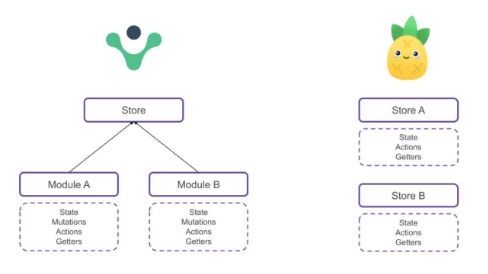
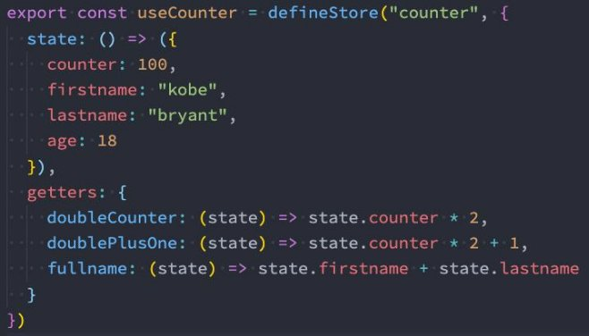
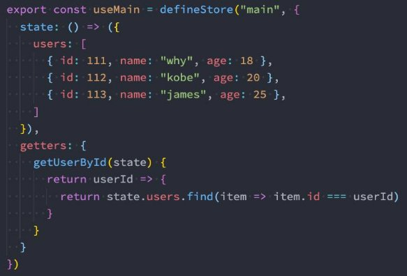
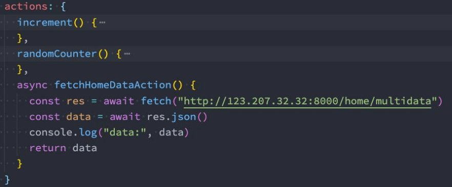

## 总结

### 2.1. Pinia介绍和Vuex的区别(面试)

### 2.2. Pinia的安装和基本使用

* createPinia
* app.use
* 定义store

### 2.3. Pinia核心state

* 使用和修改 store.xxx
* 了解:
  * store.$reset
  * store.$patch
  * store.$state = {}

### 2.4. Pinia核心getters

* 基本使用
* 引入其他的getters
* getters返回函数
* getters引入其他store数据

### 2.5. Pinia核心Actions

* 基本使用
* 传入参数
* 发送异步请求
* 返回Promise回调

## Pinia和Vuex的对比

**什么是Pinia呢？**

- **Pinia（发音为/piːnj**ʌ**/，如英语中的“peenya”）是最接近piña（西班牙语中的菠萝）的词；**
  - Pinia开始于大概2019年，最初是作为一个实验为Vue重新设计状态管理，让它用起来像组合式API（Composition API）。
  - 从那时到现在，最初的设计原则依然是相同的，并且目前同时兼容Vue2、Vue3，也并不要求你使用Composition API；
  - Pinia本质上依然是一个状态管理的库，用于跨组件、页面进行状态共享（这点和Vuex、Redux一样）；

### **Pinia和Vuex的区别**

- **那么我们不是已经有Vuex了吗？为什么还要用Pinia呢？**
  - Pinia 最初是为了探索 Vuex 的下一次迭代会是什么样子，结合了 Vuex 5 核心团队讨论中的许多想法；
  - 最终，团队意识到Pinia已经实现了Vuex5中大部分内容，所以最终决定用Pinia来替代Vuex；
  - **与 Vuex 相比，Pinia 提供了一个更简单的 API，具有更少的仪式，提供了 Composition-API 风格的 API；**
  - **最重要的是，在与 TypeScript 一起使用时具有可靠的类型推断支持；**

- **和Vuex相比，Pinia有很多的优势：**
  - **比如mutations 不再存在**： 
    - 他们经常被认为是 非常 冗长； 
    - 他们最初带来了 devtools 集成，但这不再是问题； 

  - **更友好的TypeScript支持，Vuex之前对TS的支持很不友好；** 
  - **不再有modules的嵌套结构：** 
    - 你可以灵活使用每一个store，它们是通过扁平化的方式来相互使用的； 

  - **也不再有命名空间的概念，不需要记住它们的复杂关系；** 

## **Pinia基本使用**

- **使用Pinia之前，我们需要先对其进行安装：**

- **创建一个pinia并且将其传递给应用程序：**

## Pinia核心概念Store

### **认识Store**

- **什么是Store？**
  - 一个 Store （如 Pinia）是一个实体，它会持有为绑定到你组件树的状态和业务逻辑，也就是保存了全局的状态；
  - 它有点像始终存在，并且每个人都可以读取和写入的组件；
  - 你可以在你的应用程序中定义任意数量的Store来管理你的状态；

- **Store有三个核心概念：**
  - state、getters、actions；
  - 等同于组件的data、computed、methods；
  - 一旦 store 被实例化，你就可以直接在 store 上访问 state、getters 和 actions 中定义的任何属性；

### **定义一个Store**

- **定义一个Store：**
  - 我们需要知道 Store 是使用 defineStore() 定义的，
  - 并且它需要一个唯一名称，作为第一个参数传递；

- **这个 *name*，也称为id*，是必要的，Pinia 使用它来将store 连接到 devtools。**
- **返回的函数统一使用useX作为命名方案，这是约定的规范；**

### **使用定义的Store**

- **Store在它被使用之前是不会创建的，我们可以通过调用use函数来使用Store：**

- **注意Store获取到后不能被解构，那么会失去响应式：**
  - 为了从 Store 中提取属性同时保持其响应式，您需要使用storeToRefs()。

## Pinia核心概念State

### **认识和定义State**

- **state 是 store 的核心部分，因为store是用来帮助我们管理状态的。**
  - 在 Pinia 中，状态被定义为返回初始状态的函数；

### **操作State**

- **读取和写入 state：**
  - 默认情况下，您可以通过 store 实例访问状态来直接读取和写入状态；

- **重置 State：**
  - 你可以通过调用 store 上的 $reset() 方法将状态 重置 到其初始值；

- **改变State：**
  - 除了直接用 store.counter++ 修改 store，你还可以调用 $patch 方法；
  - 它允许您使用部分“state”对象同时应用多个更改；

- **替换State：**
  - 您可以通过将其 $state 属性设置为新对象来替换 Store 的整个状态：

## Pinia核心概念Getters

### **认识和定义Getters**

- **Getters相当于Store的计算属性：**
  - 它们可以用 defineStore() 中的 getters 属性定义；
  - getters中可以定义接受一个state作为参数的函数；

### **访问Getters**

- **访问当前store的Getters：**

- **Getters中访问自己的其他Getters：**
  - 我们可以通过this来访问到当前store实例的所有其他属性;

- **访问其他store的Getters：**

- **Getters也可以返回一个函数，这样就可以接受参数：**

 

## Pinia核心概念Actions

### **认识和定义Actions**

- **Actions 相当于组件中的 methods。**
  - 可以使用 defineStore() 中的 actions 属性定义，并且它们非常适合定义业务逻辑；

 

- **和getters一样，在action中可以通过this访问整个store实例的所有操作；**

### **Actions执行异步操作**

- **并且Actions中是支持异步操作的，并且我们可以编写异步函数，在函数中使用await；**

## 作业

### 四. 什么是Pinia？和Vuex有什么区别？

### 五. Pinia中有哪些核心概念，如何使用这些核心概念？
