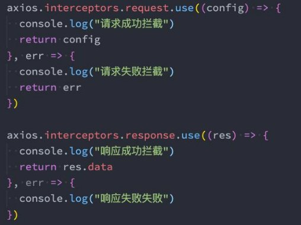
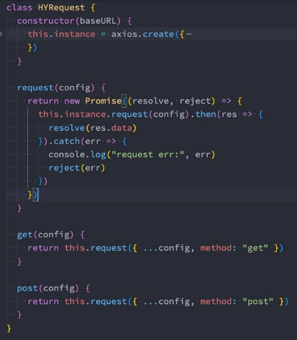

**网络请求库 – axios库 **

王红元 coderwhy

|
**目录 content**

|
1	 **认识Axios库**

2	 **axios发送请求**

3	 **axios创建实例**

4	 **axios的拦截器**

5	 **axios请求封装**
|
| :- | - |

**认识axios![ref1]**

- **为什么选择axios? 作者推荐和功能特点**

- **功能特点:**
- 在浏览器中发送 XMLHttpRequests 请求
- 在 node.js 中发送 http请求
- 支持 Promise API ◼ **补充: axios名称的由来? 个人理解**
- 拦截请求和响应 ➢ 没有具体的翻译.
- 转换请求和响应数据 ➢ axios: ajax i/o system.
- 等等

**axios请求方式![ref1]**

- **支持多种请求方式:**
- axios(config)
- axios.request(config)
- axios.get(url[, config])
- axios.delete(url[, config])
- axios.head(url[, config])
- axios.post(url[, data[, config]])
- axios.put(url[, data[, config]])
- axios.patch(url[, data[, config]])
- **有时候, 我们可能需求同时发送两个请求**
- 使用axios.all, 可以放入多个请求的数组.
- axios.all([]) 返回的结果是一个数组，使用 axios.spread 可将数组 [res1,res2] 展开为 res1, res2

**常见的配置选项![ref1]**

- 请求地址 ◼ 查询对象序列化函数
  - url: '/user', p paramsSerializer: function(params){ }
- 请求类型 ◼ request body
  - method: 'get', p data: { key: 'aa'},
- 请根路径 ◼ 超时设置
  - baseURL: 'http://www.mt.com/api', p timeout: 1000,
- 请求前的数据处理
  - transformRequest:[function(data){}],
- 请求后的数据处理
  - transformResponse: [function(data){}],
- 自定义的请求头
  - headers:{'x-Requested-With':'XMLHttpRequest'},
- URL查询对象
- params:{ id: 12 },

**axios的创建实例![ref1]**

- **为什么要创建axios的实例呢?**
- 当我们从axios模块中导入对象时, 使用的实例是默认的实例；
- 当给该实例设置一些默认配置时, 这些配置就被固定下来了.
- 但是后续开发中, 某些配置可能会不太一样；
- 比如某些请求需要使用特定的baseURL或者timeout等.
- 这个时候, 我们就可以创建新的实例, 并且传入属于该实例的配置信息.

**请求和响应拦截器![ref1]**

- **axios的也可以设置拦截器：拦截每次请求和响应**
- axios.interceptors.request.use(请求成功拦截, 请求失败拦截)
- axios.interceptors.response.use(响应成功拦截, 响应失败拦截)

**axios请求库封装（简洁版）![ref1]**

[ref1]: ./image/Aspose.Words.6d873ba3-7b47-4e0e-b174-42e129cafdba.011.png
