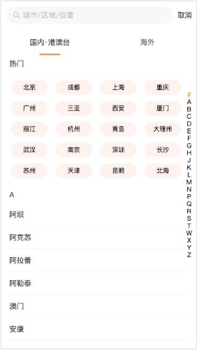
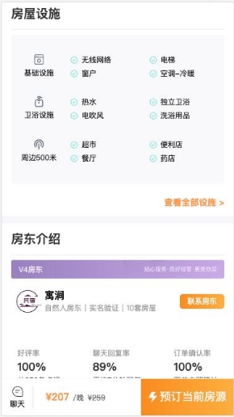
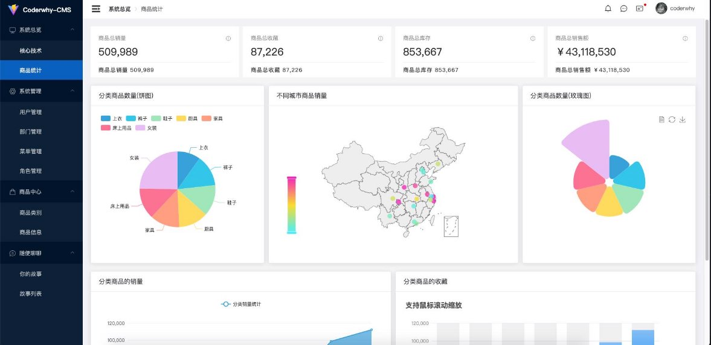
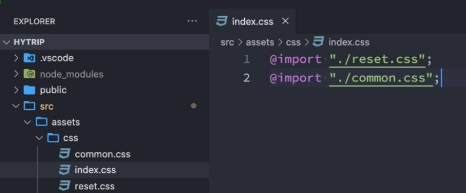
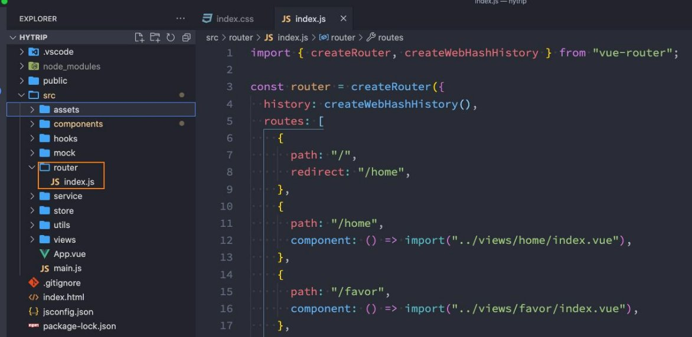
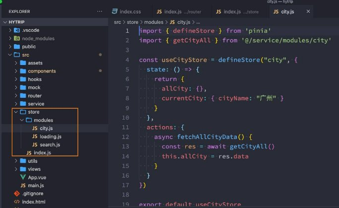

**项目介绍 – 优选项目**


**项目介绍 – 弘源旅途**

   

   


**项目介绍 – 后台管理系统**



**创建Vue项目**

- 方式一：Vue CLI
  - 基于webpack工具；
  - 命令：vue create
- 方式二：create-vue
  - 基于vite工具；
  - 命令：npm init vue@latest
- 项目配置:
  - 配置项目的icon
  - 配置项目的标题
  - 配置jsconfig.json


**项目目录结构划分**

- 对项目进行目录结构的划分:


**CSS样式的重置**

- 对默认CSS样式进行重置:
  - normalize.css
  - reset.css




**全家桶 – 路由配置**



**全家桶 – 状态管理**

- 状态管理的选择:
  - vuex: 目前依然使用较多的状态管理库;
  - pinia: 强烈推荐, 未来趋势的状态管理库;




## 作业

### 二. 如何去修改UI组件库的样式？有哪些方式，各有什么优劣？

### 三. 一个页面的数据请求和管理有哪些方式？各有什么特点

* 方式一：保存在页面中
* 方式二：保存在store中

### 二. 如何监听页面的滚动？上拉加载更多、显示搜索框

* 上拉加载更多很可能多个组件都需要用到  所以对其进行`hooks`的`useScroll`封装  用于方便使用
  * 获取客户端  `scrollTop  ``scrollHeight`的高度  定义`isReachBottom`控制网络请求的再次的触发
  * 当客户端的高度  `+`  上滑的高度  `>=`  内容滑块总高度时  就说明已经滚动到底部了  就可再次请求数据
  * 当然这里为了提升性能   可用节流函数
  * 事件需要在声明周期`onMounted`中进行(因为`setup`内部东西加载是处于(`beforeCreate和create声明周期之间`)  进行完成之后记得取消事件
  
  ```js
  import { onMounted, onUnmounted, ref } from "vue";
  import { throttle } from "lodash";
  
  export default function useScroll() {
    const isReachBottom = ref(false)
  
    const clientHeight = ref(0)
    const scrollTop = ref(0)
    const scrollHeight = ref(0)
   // 获取各种高度(客户端  上滑高度   滑块内容总高度)
    const scrollListenerHandler = throttle(() => {
      clientHeight.value = document.documentElement.clientHeight
      scrollTop.value = document.documentElement.scrollTop
      scrollHeight.value = document.documentElement.scrollHeight
  
      if (clientHeight.value + scrollTop.value >= scrollHeight.value) {
        // 滚动到底部触发
        // console.log('gundao dibu l')
        isReachBottom.value = true
      }
    }, 150)
    // 监听事件
    onMounted(() => {
      window.addEventListener('scroll', scrollListenerHandler)
    })
    //移除事件
    onUnmounted(() => {
      window.removeEventListener('scroll', scrollListenerHandler)
    })
  
    return { isReachBottom, clientHeight, scrollTop, scrollHeight }
  }
  ```
  

### 三. 如何监控整个应用进行网络请求，并且显示动画界面？

* 在对`axios`的封装中  利用拦截器(`interceptors`)的请求和响应阶段可以进行很好的控制

  * 对实例添加请求拦截和响应拦截
  * 当请求成功  就利用变量(`isLoading=true`)来实现动画的加载
  * 当请求响应成功  就把(`isLoading=false`)来结束动画的加载

  ```js
  const mainStore = useMainStore()
  
  class YORequest {
    constructor(baseURL, timeout=10000) {
      this.instance = axios.create({
        baseURL,
        timeout
      })
  
      this.instance.interceptors.request.use(config => {
        mainStore.isLoading = true
        return config
      }, err => {
        return err
      })
      this.instance.interceptors.response.use(res => {
        mainStore.isLoading = false
        return res
      }, err => {
        mainStore.isLoading = false
        return err
      })
    }
  }
  ```

  

### 四. 隐藏底部TabBar有什么方式？

- 定位设置`z-index`

  ```js
    .top {
      position: relative;
      z-index: 9;
    }
  
    // 布局滚动
    .content {
      height: calc(100vh - 98px);
      overflow-y: auto;
    }
  ```

- 给路由定义`meta`属性   通过这个属性决定跳转之后`TabBar`的显示问题

  ```js
        path: "/city",
        component: () => import("@/views/city/city.vue"),
        // meta: {
        //   hideTabBar: true
        // }
      }
        
        
        <tab-bar v-if="!route.meta.hideTabBar"/>
  ```

### 五. 页面跳转如何进行数据的传递？

* 使用动态路由 params 参数
* 使用路由的 query 查询字符串参数
* 使用Vuex 或者 Pinia
* 等等

### 二. 理解页面滚动和元素滚动之间的区别和实现

* 重构`useScroll`对页面滚动和元素滚动做出不同的反应
  * 如果是页面滚动  获取的是`document(文档)`客户端 高度(`clientHeight`)    文档上滑高度(`scrollTop`)    文档滑块内容总高度(`scrollHeight`)
  * 如果是元素滚动  获取的不能是文档类的高度   而是元素的客户端的高度(`clientHeight`)   元素上滑高度(`scrollTop`)   元素滑块内容总高度(`scrollHeight`)

```js
// elRef决定的 useScroll 用于页面滚动还是元素的滚动
export default function useScroll(elRef) {
  let el = window

  const isReachBottom = ref(false)

  const clientHeight = ref(0)
  const scrollTop = ref(0)
  const scrollHeight = ref(0)

  // 用上节流函数
  const scrollListenerHandler = throttle(() => {
    if (el === window) {
        
      clientHeight.value = document.documentElement.clientHeight
      scrollTop.value = document.documentElement.scrollTop
      scrollHeight.value = document.documentElement.scrollHeight
    } else {
      clientHeight.value = el.clientHeight
      scrollTop.value = el.scrollTop
      scrollHeight.value = el.scrollHeight
    }
    if (clientHeight.value + scrollTop.value >= scrollHeight.value) {
      console.log("滚动到底部了")
      isReachBottom.value = true
    }
  }, 150)
  
  onMounted(() => {
     // 判断是否传入的有元素  有就进入else  否则el = window
    if (elRef) el = elRef.value
    el.addEventListener("scroll", scrollListenerHandler)
  })
  
  onUnmounted(() => {
    el.removeEventListener("scroll", scrollListenerHandler)
  })

  return { isReachBottom, clientHeight, scrollTop, scrollHeight }
}

```
