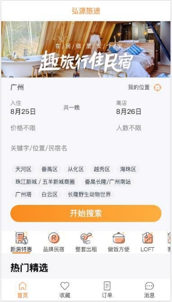

**Vue全家桶 - 项目实战 **

王红元 coderwhy

**项目介绍 – 优选项目![ref1]**

**项目介绍 – 弘源旅途![ref1]**

   

   

**项目介绍 – 后台管理系统![ref1]**

**创建Vue项目![ref1]**

- 方式一：Vue CLI
  - 基于webpack工具；
  - 命令：vue create
- 方式二：create-vue
  - 基于vite工具；
  - 命令：npm init vue@latest
- 项目配置:
- 配置项目的icon
- 配置项目的标题
- 配置jsconfig.json

**项目目录结构划分![ref1]**

- 对项目进行目录结构的划分:

**CSS样式的重置![ref1]**

- 对默认CSS样式进行重置:
- normalize.css
- reset.css

**全家桶 – 路由配置![ref1]**

**全家桶 – 状态管理![ref1]**

- 状态管理的选择:
- vuex: 目前依然使用较多的状态管理库;
- pinia: 强烈推荐, 未来趋势的状态管理库;

[ref1]: ./image/Aspose.Words.8b8911d3-bf6b-46cd-b661-41b95d7e2b85.005.png
