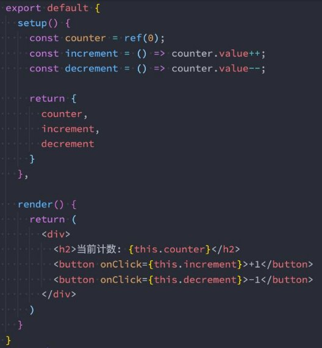

## 总结

### 3.1. 自定义指令

* 局部/全局
* 生命周期函数
* 参数-修饰符-值
* 案例练习:
  * 人民币符号
  * 时间格式化

### 3.2. 内置组件补充

* teleport
* suspense

### 3.3. 插件的安装

* 对象类型
  * install -> app
* 函数类型
  * app

### 1.1. render函数

* h函数

### 1.2. JSX语法


## **认识自定义指令**

- 在Vue的模板语法中我们学习过各种各样的指令：v-show、v-for、v-model等等，除了使用这些指令之外，**Vue也允许我们来 自定义自己的指令。**
  - 注意：在Vue中，代码的复用和抽象主要还是通过组件；
  - 通常在某些情况下，你需要对DOM元素进行底层操作，这个时候就会用到自定义指令；

- **自定义指令分为两种：**
  - 自定义局部指令：组件中通过 directives 选项，只能在当前组件中使用；
  - 自定义全局指令：app的 directive 方法，可以在任意组件中被使用；

- **比如我们来做一个非常简单的案例：当某个元素挂载完成后可以自定获取焦点**
  - 实现方式一：如果我们使用默认的实现方式；
  - 实现方式二：自定义一个 v-focus 的局部指令；
  - 实现方式三：自定义一个 v-focus 的全局指令；

**实现方式一：聚焦的默认实现**

```vue
<template>
  <div class="app">
     <input type="text" ref="inputRef"> 

  </div>
</template>

<script setup>
import { ref, onMounted } from 'vue';
// 1.方式一: 定义ref绑定到input中, 调用focus
const inputRef = ref()

  onMounted(() => {
    inputRef.value?.focus()
  })

</script>
```

**实现方式二：局部自定义指令**

- 实现方式二：自定义一个 v-focus 的局部指令
  - 这个自定义指令实现非常简单，我们只需要在组件选项中使用 directives 即可；
  - 它是一个对象，在对象中编写我们自定义指令的名称（注意：这里不需要加v-）；
  - 自定义指令有一个生命周期，是在组件挂载后调用的 mounted，我们可以在其中完成操作；

```vue
<template>
  <div class="app">
    <input type="text" v-focus>
  </div>
</template>

<script>
  export default {
    directives: {
      focus: {
        // 生命周期的函数(自定义指令)
        mounted(el) {
          // console.log("v-focus应用的元素被挂载了", el)
          el?.focus()
        }
      }
    }
  }

</script>

<script setup>

// 2.方式二: 自定义指令(局部指令)
 const vFocus = {
   // 生命周期的函数(自定义指令)
   mounted(el) {
     // console.log("v-focus应用的元素被挂载了", el)
     el?.focus()
   }
 }

</script>
```

**方式三：自定义全局指令**

- 自定义一个**全局的v-focus指令**可以让我们在任何地方直接使用

```js
export default function directiveFocus(app) {
  app.directive("focus", {
    // 生命周期的函数(自定义指令)
    mounted(el) {
      // console.log("v-focus应用的元素被挂载了", el)
      el?.focus()
    }
  })
}

```


### **指令的生命周期**

- **一个指令定义的对象，Vue提供了如下的几个钩子函数：**
  - created：在绑定元素的 attribute 或事件监听器被应用之前调用；
  - beforeMount：当指令第一次绑定到元素并且在挂载父组件之前调用；
  - mounted：在绑定元素的父组件被挂载后调用；
  - beforeUpdate：在更新包含组件的 VNode 之前调用；
  - updated：在包含组件的 VNode **及其子组件的 VNode** 更新后调用；
  - beforeUnmount：在卸载绑定元素的父组件之前调用；
  - unmounted：当指令与元素解除绑定且父组件已卸载时，只调用一次；

```vue
<template>
  <div class="app">
    <button @click="counter++">+1</button>
    <button @click="showTitle = false">隐藏</button>
    <h2 v-if="showTitle" class="title" v-why>当前计数: {{ counter }}</h2>
  </div>
</template>

<script setup>
import { ref } from 'vue';


const counter = ref(0)
const showTitle = ref(true)

const vWhy = {
  created() {
    console.log("created")
  },
  beforeMount() {
    console.log("beforeMount")
  },
  mounted() {
    console.log("mounted")
  },
  beforeUpdate() {
    console.log("beforeUpdate")
  },
  updated() {
    console.log("updated")
  },
  beforeUnmount() {
    console.log("beforeUnmount")
  },
  unmounted() {
    console.log("unmounted")
  }
}

</script>
```


### **指令的参数和修饰符**

- 如果我们指令需要**接受一些参数或者修饰符**应该如何操作呢？
  - info是参数的名称；
  - aaa-bbb是修饰符的名称；
  - 后面是传入的具体的值；


- 在我们的生命周期中，我们可以**通过 bindings 获取到对应的内容**：


### **自定义指令练习**

- **自定义指令案例：时间戳的显示需求：v-format-time**
  - 在开发中，大多数情况下从服务器获取到的都是时间戳；
  - 我们需要将时间戳转换成具体格式化的时间来展示；
    - 在Vue2中我们可以通过过滤器来完成；
    - 在Vue3中我们可以通过 计算属性（computed） 或者 自定义一个方法（methods） 来完成；
  - 其实我们还可以通过一个自定义的指令来完成；
    - 我们来实现一个可以自动对**时间格式化的指令**
    - 这里我封装了一个函数，在首页中我们只需要调用这个函数并且传入app即可；
  


- 代码见下页：

**时间格式化指令**

```js
import dayjs from 'dayjs'

export default function directiveFtime(app) {
  app.directive("ftime", {
    mounted(el, bindings) {
      // 1.获取时间, 并且转化成毫秒
      let timestamp = el.textContent
      if (timestamp.length === 10) {
        timestamp = timestamp * 1000
      }

      timestamp = Number(timestamp)

      // 2.获取传入的参数
      let value = bindings.value
      if (!value) {
        value = "YYYY-MM-DD HH:mm:ss"
      }

      // 3.对时间进行格式化
      const formatTime = dayjs(timestamp).format(value)
      el.textContent = formatTime
    }
  })
}
```

## **Vue内置组件Teleport**

- 在组件化开发中，我们**封装一个组件A**，在**另外一个组件B中使用**：
  - 那么组件A中template的元素，会被挂载到组件B中template的某个位置；
  - 最终我们的应用程序会形成**一颗DOM树结构**；

- 但是某些情况下，我们希望**组件不是挂载在这个组件树上**的，可能是**移动到Vue app之外的其他位置**： 
  - 比如移动到body元素上，或者我们有其他的div#app之外的元素
  - 这个时候我们就可以通过teleport来完成；


- **Teleport是什么呢？**

  - 它是一个Vue提供的内置组件，类似于react的Portals；
  - teleport翻译过来是心灵传输、远距离运输的意思；
  - 它有两个属性：

    - to：指定将其中的内容移动到的目标元素，可以使用选择器；

    - disabled：是否禁用 teleport 的功能；


**我们来看下面代码的效果：**


**和组件结合使用**

- 当然，**teleport也可以和组件结合一起来使用：**
- 我们可以在 teleport 中使用组件，并且也可以给他传入一些数据；


### **多个teleport**

- 如果我们将**多个teleport应用**到**同一个目标上（to的值相同）**，那么这些**目标会进行合并**：
- 实现效果如下：
- 


## **Vue内置组件Suspense**

- 注意：**目前（2021-06-08）Suspense显示的是一个实验性的特性，API随时可能会修改。**
- **Suspense是一个内置的全局组件，该组件有两个插槽：**
  - default：如果default可以显示，那么显示default的内容；
  - fallback：如果default无法显示，那么会显示fallback插槽的内容；


## **Vue中安装插件的方式**

- 通常我们**向Vue全局添加一些功能**时，会采用**插件的模式，它有两种编写方式**：
  - 对象类型：一个对象，但是必须包含一个install 的函数，该函数会在安装插件时执行；
  - 函数类型：一个function，这个函数会在 安装插件时自动执行；


- 插件可以**完成的功能没有限制**，比如下面的几种都是可以的：
  - 添加全局方法或者 property，通过把它们添加到 config.globalProperties 上实现；
  - 添加全局资源：指令/过滤器/过渡等；
  - 通过全局 mixin 来添加一些组件选项；
  - 一个库，提供自己的 API，同时提供上面提到的一个或多个功能；

**插件的编写方式**

```js
// 安装插件
// 方式一: 传入对象的情况
app.use({
  install: function(app) {
    console.log("传入对象的install被执行:", app)
  }
})


// 方式二: 传入函数的情况
app.use(function(app) {
  console.log("传入函数被执行:", app)
})

```


## Vue中渲染函数的使用

### **认识h函数**

- Vue推荐在绝大数情况下**使用模板**来创建你的HTML，然后一些特殊的场景，你真的需要**JavaScript的完全编程的能力**，这个时 候你可以使用 **渲染函数** ，它**比模板更接近编译器**；
- **前面我们讲解过VNode和VDOM的概念：**
  - Vue在生成真实的DOM之前，会将我们的节点转换成VNode，而VNode组合在一起形成一颗树结构，就是虚拟DOM （VDOM）；
  - 事实上，我们之前编写的 template 中的HTML 最终也是使用**渲染函数**生成对应的VNode；
  - 那么，如果你想充分的利用JavaScript的编程能力，我们可以自己来编写 createVNode 函数，生成对应的VNode；

- 那么我们应该怎么来做呢？**使用 h()函数：**
  - h() 函数是一个用于创建 vnode 的一个函数；
  - 其实更准备的命名是createVNode() 函数，但是为了简便在Vue将之简化为 h() 函数；


### **h()函数参数**

- **h()函数 如何使用呢？它接受三个参数：**
- 第一个参数
  - 

- 第二个参数
  - 

- 第三个参数
  - 


- **注意事项： **
  - 如果没有props，那么通常可以将children作为第二个参数传入；
  - 如果会产生歧义，可以将null作为第二个参数传入，将children作为第三个参数传入；

### **h函数的基本使用**

- **h函数可以在两个地方使用：**
  - render函数选项中；
  
  ```js
    import { h } from 'vue'
  
    export default {
      render() {
        return h("div", { className: "app" }, [
          h("h2", { className: "title" }, "我是标题"),
          h("p", { className: "content" }, "我是内容, 哈哈哈"),
        ])
      }
    }
  ```
  
  
  
  - setup函数选项中（setup本身需要是一个函数类型，函数再返回h函数创建的VNode）；

```js
import { h, ref } from 'vue'
import Home from "./Home.vue"
export default {
 	setup(){
    const counter = ref(0)
    const increment = () => {
      counter.value++
    }
    const decrement = () => {
      counter.value--
    }
    return () => h("div", { className: "app" }, [
      h("h2", null, `当前计数: ${counter.value}`),
      h("button", { onClick: increment }, "+1"),
      h("button", { onClick: decrement }, "-1"),
      h(Home)
    ])
  } 
}
```

- 在setup语法糖中，可以定义成一个变量，直接在template中使用

```vue
<template>
  <render/>
  <h2 class="">内容</h2>
</template>

<script setup>

import { ref, h } from 'vue';
import Home from './Home.vue'

const counter = ref(0)

const increment = () => {
  counter.value++
}
const decrement = () => {
  counter.value--
}

const render = () => h("div", { className: "app" }, [
  h("h2", null, `当前计数: ${counter.value}`),
  h("button", { onClick: increment }, "+1"),
  h("button", { onClick: decrement }, "-1"),
  h(Home)
])

</script>

```

**h函数计数器案例**

## **Vue中编写jsx的语法**

### **jsx的babel配置**

- 如果我们希望**在项目中使用jsx**，那么我们**需要添加对jsx的支持**：
  - jsx我们通常会通过Babel来进行转换（React编写的jsx就是通过babel转换的）；
  - 对于Vue来说，我们只需要在Babel中配置对应的插件即可；
- 安装**Babel支持Vue的jsx插件**：
  - `npm install @vue/babel-plugin-jsx -D `


- **如果是Vite环境，需要安装插件：**
  - `npm install @vitejs/plugin-vue-jsx -D`

- 在**babel.config.js配置文件**中配置插件：

 

**jsx计数器案例**



## 作业

### 二. 如何自定义指令，自定义指令的两种方式和生命周期？

### 三. Vue中如何安装插件，插件的使用过程是什么？

### 二. 什么是render函数、jsx语法是什么？(面试)
