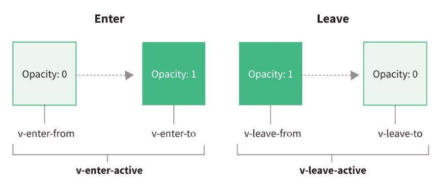

## 总结

### 2.1. 基本实现(原理)

* 在合适的时机自动添加/删除的class
* 动画还是要自己编写

### 2.2. 属性补充

* animation动画
* type
* duration
* mode

### 2.3. 动画组(列表执行)


## Vue的动画原理

### **认识动画**

- 在开发中，我们想要给一个组件的显示和消失添加某种过渡动画，可以很好的增加用户体验：

  - React框架本身并没有提供任何动画相关的API，所以在React中使用过渡动画我们需要使用一个第三方库 react-transition - group；
  - Vue中为我们提供一些内置组件和对应的API来完成动画，利用它们我们可以方便的实现过渡动画效果；

  - **如果我们希望给单元素或者组件实现过渡动画，可以使用 transition 内置组件来完成动画**；


## **Vue的transition动画**

- Vue **提供了 transition 的封装组件**，在下列情形中，可以给任何元素和组件添加进入/离开过渡：
  - 条件渲染 
    - 使用 v-if或使用v-show条件展示  

  - 动态组件 
    - 使用`<Component is='xxx' />`

  - 组件根节点 
    - 使用`<transition><Child></Child></transition>`
    - 这里的添加的动画类是会添加到组件的根元素。


```vue
<template>
  <div class="app">
    <div>
      <button @click="isShow = !isShow">切换</button>
    </div>

    <transition >
      <h2 v-if="isShow">哈哈哈哈</h2>
    </transition>
  </div>
</template>

<script setup>
import { ref } from 'vue';
const isShow = ref(false)

</script>

<style scoped>
  /*进入与离开是相反的，所以这里可以写在一起*/
.v-enter-from, /* 定义进入-开始的状态*/
.v-leave-to { /* 定义离开-结束的状态*/
  opacity: 0;
  transform: scale(0.6);
}
.v-enter-to,  /* 定义进入-结束的状态*/
.v-leave-from {  /* 定义离开-开始的状态*/
  opacity: 1;
  transform: scale(1);
}

.v-enter-active, /* 定义进入-过程的动画*/
.v-leave-active {/* 定义离开-过程的动画*/
  transition: all 2s ease;
}

</style>
```

**Transition组件的原理**

- 我们会发现，Vue自动给h2元素添加了动画，这是什么原因呢？
  - 当插入或删除包含在 transition 组件中的元素时，Vue  将会做以下处理：
    - 1.**自动嗅探目标元素是否应用了CSS过渡或者动画，如果有，那么在恰当的时机添加/删除 CSS类名**；
    - 2.**如果 transition 组件提供了JavaScript钩子函数，这些钩子函数将在恰当的时机被调用**；
    - 3.**如果没有找到JavaScript钩子并且也没有检测到CSS过渡/动画，DOM插入、删除操作将会立即执行；**

- 那么都会添加或者删除哪些class呢？

## **过渡动画class**

- 我们会发现上面提到了很多个class，事实上Vue就是帮助我们在这些class之间来回切换完成的动画：
- **v-enter-from**：定义进入过渡的开始状态。
  - 在元素被插入之前生效，在元素被插入之后的下一帧移除。
- **v-enter-active**：定义进入过渡生效时的状态。
  - 在整个进入过渡的阶段中应用，在元素被插入之前生效，在过渡/动画完成之后移除。这个类可以被用来定义进入过渡的过程时间，延迟和曲线 函数。


- **v-enter-to**：定义进入过渡的结束状态。
  - 在元素被插入之后下一帧生效 (与此同时 v-enter-from 被移除)，在过渡/动画完成之后移除。
- **v-leave-from**：定义离开过渡的开始状态。
  - 在离开过渡被触发时立刻生效，下一帧被移除。
- **v-leave-active**：定义离开过渡生效时的状态。
  - 在整个离开过渡的阶段中应用，在离开过渡被触发时立刻生效，在过渡/动画完成之后移除。这个类可以被用来定义离开过渡的过程时间，延迟 和曲线函数。

- **v-leave-to**：离开过渡的结束状态。
  - 在离开过渡被触发之后下一帧生效 (与此同时 v-leave-from 被删除)，在过渡/动画完成之后移除。


### **class添加的时机和命名规则**



- class的name命名规则如下：
  - **如果我们使用的是一个没有name的transition，那么所有的class是以 v- 作为默认前缀；**
  - **如果我们添加了一个name属性，比如 `<transtion name="why">`，那么所有的class会以 why- 开头；**


```vue
<template>
  <div class="app">
    <div>
      <button @click="isShow = !isShow">切换</button>
    </div>
    <transition name="why"><!--过渡类以why-开头-->
      <h2 v-if="isShow">哈哈哈哈</h2>
    </transition>
  </div>
</template>

<script setup>
import { ref } from 'vue';
const isShow = ref(false)

</script>

<style scoped>

.why-enter-from,
.why-leave-to {
  opacity: 0;
  transform: scale(0.6);
}

.why-enter-to,
.why-leave-from {
  opacity: 1;
  transform: scale(1);
}

.why-enter-active,
.why-leave-active {
  transition: all 2s ease;
}

</style>
```


## **过渡css动画**

- 前面我们是**通过transition来实现的动画效果**，另外我们也**可以通过animation来实现**。

```vue
<template>
  <div class="app">
    <div>
      <button @click="isShow = !isShow">切换</button>
    </div>

    <transition name="why">
      <h2 v-if="isShow">
        要是有些事我没说，地坛，你别以为是我忘了，我什么也没忘，但是有些事只适合收藏。不能说，也不能想，却又不能忘。它们不能变成语言，它们无法变成语言，一旦变成语言就不再是它们了。它们是一片朦胧的温馨与寂寥，是一片成熟的希望与绝望，它们的领地只有两处：心与坟墓。比如说邮票，有些是用于寄信的，有些仅仅是为了收藏。
      </h2>
    </transition>
  </div>
</template>

<script setup>
import { ref } from 'vue';

const isShow = ref(false)

</script>

<style scoped>
/*动画已经定义好了keyframes，所以这里只需在active中定义动画，不需要定义from和to*/
.why-enter-active {
  animation: whyAnim 2s ease;
}
/*离开动画和进入动画相反，这里直接使用reverse*/
.why-leave-active {
  animation: whyAnim 2s ease reverse;
}

@keyframes whyAnim {
  0% {
    transform: scale(0);
    opacity: 0;
  }

  50% {
    transform: scale(1.2);
    opacity: 0.5;
  }

  100% {
    transform: scale(1);
    opacity: 1;
  }
}


</style>

```

## transition的其他属性

### Transtion-type属性

- 这个一般用来**同时设置过渡和动画**时，才会使用。
- Vue为了**知道过渡的完成**，内部是**在监听 transitionend 或 animationend**，到底使用哪一个取决于元素应用的CSS规则：
  - 如果我们只是使用了其中的一个，那么Vue能自动识别类型并设置监听；


- **但是如果我们同时使用了过渡和动画呢？**
  - 并且在这个情况下可能某一个动画执行结束时，另外一个动画还没有结束；
  - 在这种情况下，我们可以设置 type 属性为 animation 或者 transition 来明确的告知Vue监听的类型；

- **注意：一般不进行设置，让vue自动识别**
- 比如以下：
- animation动画比transtion动画要长，所以默认为animation动画为主，等到animation动画结束之后才结束。

```vue
<template>
  <div class="app">
    <div>
      <button @click="isShow = !isShow">切换</button>
    </div>

    <transition name="why" >
      <h2 v-if="isShow">
        要是有些事我没说，地坛，你别以为是我忘了，我什么也没忘，但是有些事只适合收藏。不能说，也不能想，却又不能忘。它们不能变成语言，它们无法变成语言，一旦变成语言就不再是它们了。它们是一片朦胧的温馨与寂寥，是一片成熟的希望与绝望，它们的领地只有两处：心与坟墓。比如说邮票，有些是用于寄信的，有些仅仅是为了收藏。
      </h2>
    </transition>
  </div>
</template>

<script setup>
import { ref } from 'vue';

const isShow = ref(false)

</script>

<style scoped>

h2 {
  display: inline-block;
}

/* transition */
.why-enter-from,
.why-leave-to {
  opacity: 0;
}

.why-enter-to,
.why-leave-from {
  opacity: 1;
}

/*animation动画比transtion动画要长，所以默认为animation动画为主，等到animation动画结束之后才结束。*/
.why-enter-active {
  animation: whyAnim 10s ease;
  transition: opacity 1s ease;
}

.why-leave-active {
  animation: whyAnim 10s ease reverse;
  transition: opacity 1s ease;
}


@keyframes whyAnim {
  0% {
    transform: scale(0);
  }

  50% {
    transform: scale(1.2);
  }

  100% {
    transform: scale(1);
  }
}

</style>

```

- 添加type属性，手动设置为transition，所以以transition动画为主。transition结束之后，虽然animation动画没有执行完，也会立即结束。

```vue
<template>
  <div class="app">
    <div>
      <button @click="isShow = !isShow">切换</button>
    </div>
<!-以transition动画为主。transition结束之后，虽然animation动画没有执行完，也会立即结束。->
    <transition name="why" type="transition">
      <h2 v-if="isShow">
        要是有些事我没说，地坛，你别以为是我忘了，我什么也没忘，但是有些事只适合收藏。不能说，也不能想，却又不能忘。它们不能变成语言，它们无法变成语言，一旦变成语言就不再是它们了。它们是一片朦胧的温馨与寂寥，是一片成熟的希望与绝望，它们的领地只有两处：心与坟墓。比如说邮票，有些是用于寄信的，有些仅仅是为了收藏。
      </h2>
    </transition>
  </div>
</template>

<script setup>
import { ref } from 'vue';

const isShow = ref(false)

</script>

<style scoped>

h2 {
  display: inline-block;
}

/* transition */
.why-enter-from,
.why-leave-to {
  opacity: 0;
}

.why-enter-to,
.why-leave-from {
  opacity: 1;
}


.why-enter-active {
  animation: whyAnim 10s ease;
  transition: opacity 1s ease;
}

.why-leave-active {
  animation: whyAnim 10s ease reverse;
  transition: opacity 1s ease;
}


@keyframes whyAnim {
  0% {
    transform: scale(0);
  }

  50% {
    transform: scale(1.2);
  }

  100% {
    transform: scale(1);
  }
}

</style>


```

### Transition-duration

- 我们也可以显示的来**指定过渡的时间**，通过 **duration 属性**。
- 会覆盖掉CSS动画或过渡的时间。
- **duration可以设置两种类型的值：**
  - number类型：同时设置进入和离开的过渡时间；
  - object类型：分别设置进入和离开的过渡时间；


 

### **Transtion-mode**

- **我们来看当前的动画在两个元素之间切换的时候存在的问题：**


- 我们会发现 Hello World 和 你好啊，李银河是**同时存在**的：
  - 这**是因为默认情况下进入和离开动画是同时发生的**；
  - 如果确实我们希望达到这个的效果，那么是没有问题；
- 但是如果我们**不希望同时执行进入和离开动画**，那么我们需要设置transition的**mode(过渡模式)**：
  - **in-out: 新元素先进行过渡，完成之后当前元素过渡离开**；
  - **out-in: 当前元素先进行过渡，完成之后新元素过渡进入**；


```html
   <transition name="why" mode="out-in">
      <h2 v-if="isShow">哈哈哈</h2>
      <h2 v-else>呵呵呵</h2>
    </transition>
```

### Transtion-appear

- 默认情况下，**首次渲染的时候是没有动画的**，如果我们**希望给他添加上去动画，那么就可以增加另外一个属性appear**：


## **认识列表的过渡**

- 目前为止，过渡动画我们只要是**针对单个元素或者组件**的：
  - 要么是单个节点；
  - 要么是同一时间渲染多个节点中的一个；
- 那么如果希望渲染的是**一个列表**，并且**该列表中添加删除数据也希望有动画执行**呢？
  - 这个时候我们要使用 `<transition-group>` 组件来完成；
- **使用`<transition-group> `有如下的特点：**
  - **默认情况下，它不会渲染一个元素的包裹器，但是你可以指定一个元素并以 tag attribute 进行渲染；**
  - **mode属性-过渡模式不可用，因为我们不再相互切换特有的元素；**
  - **内部元素总是需要提供唯一的 key attribute 值；**
  - **CSS 过渡的类将会应用在内部的元素中，而不是这个组/容器本身；**


### **列表过渡的基本使用**

- **我们来做一个案例：**
  - 案例是一列数字，可以继续添加或者删除数字；
  - 在添加和删除数字的过程中，对添加的或者移除的数字添加动画；


```vue
<template>
  <div class="app">
    <button @click="addNumber">添加数字</button>
    <button @click="removeNumber">删除数字</button>

    <!--设置tag，则会以div元素包裹-->
    <transition-group tag="div" name="why">
      <template v-for="item in nums" :key="item"><!--必须设置key属性-->
        <!--动画类会直接添加到子元素上 -->
        <span>{{ item }}</span>
      </template>
    </transition-group>
  </div>
</template>

<script setup>
import { reactive, ref } from 'vue';

const nums = ref([0, 1, 2, 3, 4, 5, 6, 7, 8, 9])

const addNumber = () => {
  nums.value.splice(randomIndex(), 0, nums.value.length)
}

const removeNumber = () => {
  nums.value.splice(randomIndex(), 1)
}

const randomIndex = () => {
  return Math.floor(Math.random() * nums.value.length)
}

</script>

<style scoped>

span {
  margin-right: 10px;
  display: inline-block;
}

.why-enter-from,
.why-leave-to {
  opacity: 0;
  transform: translateY(30px);
}

.why-enter-to,
.why-leave-from {
  opacity: 1;
  transform: translateY(0);
}

.why-enter-active,
.why-leave-active {
  transition: all 2s ease;
}


</style>
```

### **列表过渡的移动动画**

- 在上面的案例中**虽然新增的或者删除的节点是有动画**的，但是**对于哪些其他需要移动的节点是没有动画**的：
  - 我们可以通过使用一个**新增的 v-move 的class**来完成动画；
    - 它会在元素改变位置的过程中应用；
    - 像之前的名字一样，我们可以通过name来自定义前缀；

  - 但是移除时，其他数字移动的动画是没有。
    - 那是因为虽然移除的元素在做动画，但是元素本身还是占空间的。
    - 这时可以给元素添加`position:absoulte`


```vue
<template>
  <div class="app">
    <button @click="addNumber">添加数字</button>
    <button @click="removeNumber">删除数字</button>

    <!--设置tag，则会以div元素包裹-->
    <transition-group tag="div" name="why">
      <template v-for="item in nums" :key="item"><!--必须设置key属性-->
        <!--动画类会直接添加到子元素上 -->
        <span>{{ item }}</span>
      </template>
    </transition-group>
  </div>
</template>

<script setup>
import { reactive, ref } from 'vue';

const nums = ref([0, 1, 2, 3, 4, 5, 6, 7, 8, 9])

const addNumber = () => {
  nums.value.splice(randomIndex(), 0, nums.value.length)
}

const removeNumber = () => {
  nums.value.splice(randomIndex(), 1)
}

const randomIndex = () => {
  return Math.floor(Math.random() * nums.value.length)
}

</script>

<style scoped>

span {
  margin-right: 10px;
  display: inline-block;
}

.why-enter-from,
.why-leave-to {
  opacity: 0;
  transform: translateY(30px);
}

.why-enter-to,
.why-leave-from {
  opacity: 1;
  transform: translateY(0);
}

.why-enter-active,
.why-leave-active {
  transition: all 2s ease;
  position:absolute;
}

.why-move{
  transition: all 2s ease;
}

</style>
```

## 作业

### 三. Vue中实现动画的组件有哪些？实现动画的本质是什么？

