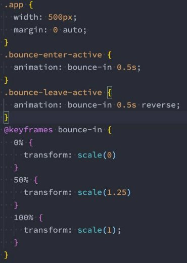

**Vue3 – 实现过渡动画 **

王红元 coderwhy

|**目录 content**|**1**|**认识Vue的动画原理**|
| :- | - | - |
||**2**|**动画中常见类的作用**|
||**3**|**animation动画实现**|
||**4**|**动画的常见属性设置**|
||**5**|**列表元素动画组实现**|
||**6**|**列表元素的移动动画**|

**认识动画![ref1]**

- 在开发中，我们想要给一个组件的**显示和消失添加某种过渡动画**，可以很好的**增加用户体验**：
- React框架本身并没有提供任何动画相关的API，所以在React中使用过渡动画我们需要使用一个第三方库 react-transition - group；
- Vue中为我们提供一些内置组件和对应的API来完成动画，利用它们我们可以方便的实现过渡动画效果；
- **我们来看一个案例：**
- Hello World的显示和隐藏；
- 通过下面的代码实现，是不会有任何动画效果的；

- 没有动画的情况下，**整个内容的显示和隐藏会非常的生硬**：
- 如果我们希望给单元素或者组件实现过渡动画，可以使用 transition 内置组件来完成动画；

**Vue的transition动画![ref1]**

- Vue **提供了 transition 的封装组件**，在下列情形中，可以给任何元素和组件添加进入/离开过渡：
- 条件渲染 (使用 v-if)条件展示 (使用 v-show) 
- 动态组件 
- 组件根节点 

**Transition组件的原理![ref1]**

- **我们会发现，Vue自动给h2元素添加了动画，这是什么原因呢？**
- **当插入或删除包含在 transition 组件中的元素时，Vue  将会做以下处理：**
- 1.自动嗅探目标元素是否应用了CSS过渡或者动画，如果有，那么在恰当的时机添加/删除 CSS类名；
- 2.如果 transition 组件提供了JavaScript钩子函数，这些钩子函数将在恰当的时机被调用；
- 3.如果没有找到JavaScript钩子并且也没有检测到CSS过渡/动画，DOM插入、删除操作将会立即执行；
- **那么都会添加或者删除哪些class呢？**

**过渡动画class![ref1]**

- **我们会发现上面提到了很多个class，事实上Vue就是帮助我们在这些**
- v-enter-from：定义进入过渡的开始状态。
- 在元素被插入之前生效，在元素被插入之后的下一帧移除。
- v-enter-active：定义进入过渡生效时的状态。

**class之间来回切换完成的动画：**

- 在整个进入过渡的阶段中应用，在元素被插入之前生效，在过渡/动画完成之后移除。这个类可以被用来定义进入过渡的过程时间，延迟和曲线 函数。
- v-enter-to：定义进入过渡的结束状态。
  - 在元素被插入之后下一帧生效 (与此同时 v-enter-from 被移除)，在过渡/动画完成之后移除。
- v-leave-from：定义离开过渡的开始状态。
  - 在离开过渡被触发时立刻生效，下一帧被移除。
- v-leave-active：定义离开过渡生效时的状态。
- 在整个离开过渡的阶段中应用，在离开过渡被触发时立刻生效，在过渡/动画完成之后移除。这个类可以被用来定义离开过渡的过程时间，延迟 和曲线函数。
- v-leave-to：离开过渡的结束状态。
- 在离开过渡被触发之后下一帧生效 (与此同时 v-leave-from 被删除)，在过渡/动画完成之后移除。

**class添加的时机和命名规则![ref1]**

- **class的name命名规则如下：**
- 如果我们使用的是一个没有name的transition，那么所有的class是以 v- 作为默认前缀；
- 如果我们添加了一个name属性，比如 <transtion name="why">，那么所有的class会以 why- 开头；

**过渡css动画![ref1]**

- 前面我们是**通过transition来实现的动画效果**，另外我们也**可以通过animation来实现**。

` `

**同时设置过渡和动画（一般不设置）![ref1]**

- Vue为了**知道过渡的完成**，内部是**在监听 transitionend 或 animationend**
- 如果我们只是使用了其中的一个，那么Vue能自动识别类型并设置监听；

，到底使用哪一个取决于元素应用的CSS规则：

- **但是如果我们同时使用了过渡和动画呢？**
- 并且在这个情况下可能某一个动画执行结束时，另外一个动画还没有结束；
- 在这种情况下，我们可以设置 type 属性为 animation 或者 transition 来明确的告知Vue监听的类型；

**显示的指定动画时间![ref1]**

- 我们也可以显示的来**指定过渡的时间**，通过 **duration 属性**。
- **duration可以设置两种类型的值：**
- number类型：同时设置进入和离开的过渡时间；
- object类型：分别设置进入和离开的过渡时间；

 

**过渡的模式mode![ref1]**

- **我们来看当前的动画在两个元素之间切换的时候存在的问题：**

- 我们会发现 Hello World 和 你好啊，李银河是**同时存在**的：
  - 这是因为默认情况下进入和离开动画是同时发生的；
  - 如果确实我们希望达到这个的效果，那么是没有问题；
- 但是如果我们**不希望同时执行进入和离开动画**，那么我们需要设置transition的**过渡模式**：
- in-out: 新元素先进行过渡，完成之后当前元素过渡离开；
- out-in: 当前元素先进行过渡，完成之后新元素过渡进入；

**动态组件的切换![ref1]**

- 上面的示例同样适用于我们的**动态组件**：

**appear初次渲染![ref1]**

- 默认情况下，**首次渲染的时候是没有动画的**，如果我们**希望给他添加上去动画，那么就可以增加另外一个属性appear**：

**认识列表的过渡![ref1]**

- 目前为止，过渡动画我们只要是**针对单个元素或者组件**的：
  - 要么是单个节点；
  - 要么是同一时间渲染多个节点中的一个；
- 那么如果希望渲染的是**一个列表**，并且**该列表中添加删除数据也希望有动画执行**呢？
  - 这个时候我们要使用 <transition-group> 组件来完成；
- **使用<transition-group> 有如下的特点：**
- 默认情况下，它不会渲染一个元素的包裹器，但是你可以指定一个元素并以 tag attribute 进行渲染；
- 过渡模式不可用，因为我们不再相互切换特有的元素；
- 内部元素总是需要提供唯一的 key attribute 值；
- CSS 过渡的类将会应用在内部的元素中，而不是这个组/容器本身；

**列表过渡的基本使用![ref1]**

- **我们来做一个案例：**
- 案例是一列数字，可以继续添加或者删除数字；
- 在添加和删除数字的过程中，对添加的或者移除的数字添加动画；

- 具体代码查看课堂演练

**列表过渡的移动动画![ref1]**

- 在上面的案例中**虽然新增的或者删除的节点是有动画**的，但是**对于哪些其他需要移动的节点是没有动画**的：
- 我们可以通过使用一个新增的 v-move 的class来完成动画；
- 它会在元素改变位置的过程中应用；
- 像之前的名字一样，我们可以通过name来自定义前缀；

[ref1]: ./image/Aspose.Words.adec32bb-bb31-4dd2-b063-582146ef95e7.011.png
