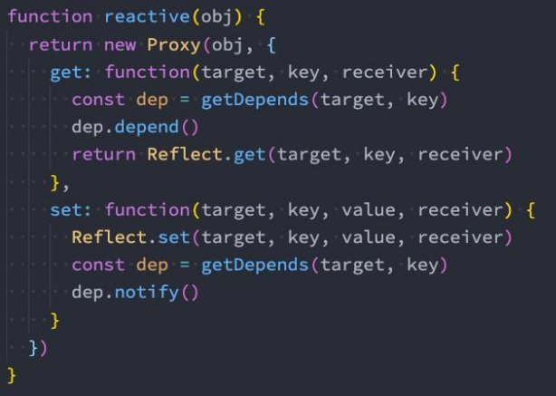

**vue2-vue3响应式原理 **

王红元 coderwhy

 

**什么是响应式？![ref1]**

- 我们先来看一下响应式意味着什么？我们来看一段代码： pm有一个初始化的值，有一段代码使用了这个值； p那么在m有一个新的值时，这段代码可以自动重新执行；

- 上面的这样一种可以自动响应数据变量的代码机制，我们就称之为是响应式的。 p那么我们再来看一下对象的响应式：

**响应式函数设计![ref1]**

- 首先，执行的代码中可能不止一行代码，所以我们可以将这些代码放到一个函数中： p那么我们的问题就变成了，当数据发生变化时，自动去执行某一个函数；

- 但是有一个问题：在开发中我们是有很多的函数的，我们如何区分一个函数需要响应式，还是不需要响应式呢？ p很明显，下面的函数中 foo 需要在obj的name发生变化时，重新执行，做出相应；

pbar函数是一个完全独立于obj的函数，它不需要执行任何响应式的操作；

` `

**响应式函数的实现watchFn![ref1]**

- 但是我们怎么区分呢？ p这个时候我们封装一个新的函数watchFn； p凡是传入到watchFn的函数，就是需要响应式的； p其他默认定义的函数都是不需要响应式的；

` `

**响应式依赖的收集![ref1]**

- 目前我们收集的依赖是放到一个数组中来保存的，但是这里会存在数据管理的问题：
  - 我们在实际开发中需要监听很多对象的响应式；
  - 这些对象需要监听的不只是一个属性，它们很多属性的变化，都会有对应的响应式函数；
  - 我们不可能在全局维护一大堆的数组来保存这些响应函数；
- 所以我们要设计一个类，这个类用于管理某一个对象的某一个属性的所有响应式函数：
- 相当于替代了原来的简单 reactiveFns 的数组；

 

**监听对象的变化![ref1]**

- 那么我们接下来就可以通过之前学习的方式来监听对象的变量： p方式一：通过 Object.defineProperty的方式（vue2采用的方式）； p方式二：通过new Proxy的方式（vue3采用的方式）；
- 我们这里先以Proxy的方式来监听：

**对象的依赖管理![ref1]**

- 我们目前是创建了一个Depend对象，用来管理对于name变化需要监听的响应函数： p但是实际开发中我们会有不同的对象，另外会有不同的属性需要管理； p我们如何可以使用一种数据结构来管理不同对象的不同依赖关系呢？
- 在前面我们刚刚学习过WeakMap，并且在学习WeakMap的时候我讲到了后面通过WeakMap如何管理这种响应 式的数据依赖：

**对象依赖管理的实现![ref1]**

- 我们可以写一个getDepend函数专门来管理这种依赖关系：

 

**正确的依赖收集![ref1]**

- 我们之前收集依赖的地方是在 watchFn 中： p但是这种收集依赖的方式我们根本不知道是哪一个key的哪一个depend需要收集依赖； p你只能针对一个单独的depend对象来添加你的依赖对象；

- 那么正确的应该是在哪里收集呢？应该在我们调用了 p因为如果一个函数中使用了某个对象的

Proxy的get捕获器时 key，那么它应该被收集依赖；

**对Depend重构![ref1]**

- 但是这里有两个问题：
  - 问题一：如果函数中有用到两次key，比如name，那么这个函数会被收集两次；
  - 问题二：我们并不希望将添加reactiveFn放到get中，以为它是属于Dep的行为；
- 所以我们需要对Depend类进行重构：
- 解决问题一的方法：不使用数组，而是使用Set；
- 解决问题二的方法：添加一个新的方法，用于收集依赖；

 

**创建响应式对象![ref1]**

- 我们目前的响应式是针对于obj一个对象的，我们可以创建出来一个函数，针对所有的对象都可以变成响应式对象：

 

**Vue2响应式原理![ref1]**

- 我们前面所实现的响应式的代码，其实就是Vue3中的响应 式原理： 

pVue3主要是通过Proxy来监听数据的变化以及收集相关 

的依赖的； 

pVue2中通过我们前面学习过的Object.defineProerty 

的方式来实现对象属性的监听； 

- 我们可以将reactive函数进行如下的重构： p在传入对象时，我们可以遍历所有的key，并且通过属 性存储描述符来监听属性的获取和修改； 

p在setter和getter方法中的逻辑和前面的Proxy是一致 

的； 

[ref1]: ./image/Aspose.Words.c31648da-9493-4911-8001-50b1c9918263.007.png
