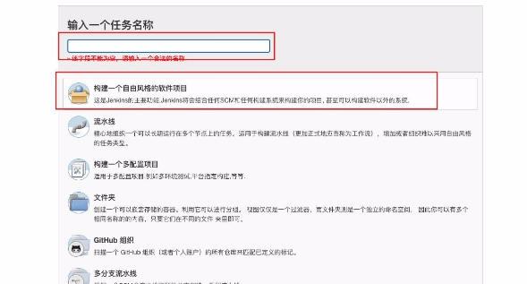

**项目打包和自动化部署**

**一. 项目部署和DevOps**

1. **传统的开发模式**

在传统的开发模式中，开发的整个过程是按部就班就行：

但是这种模式存在很大的弊端：

- 工作的不协调：开发人员在开发阶段，测试和运维人员其实是处于等待的状态。等到测试阶段，开 发人员等待测试反馈bug，也会处于等待状态。
  - 线上bug的隐患：项目准备交付时，突然出现了bug，所有人员需要加班、等待问题的处理；
2. **DevOps开发模式**

DevOps是Development和Operations两个词的结合，将开发和运维结合起来的模式：

3. **持续集成和持续交付**

伴随着DevOps一起出现的两个词就是持续集成和持续交付(部署)：

- CI是Continuous Integration（持续集成）；
  - CD是两种翻译：Continuous Delivery（持续交付）或Continuous Deployment（持续部署）；

持续集成CI：

持续交付和持续部署：

4. **自动化部署流程**

**二. 购买云服务器**

1. **注册阿里云的账号**

云服务器我们可以有很多的选择：阿里云、腾讯云、华为云。

- 目前在公司使用比较多的是阿里云；
  - 我自己之前也一直使用阿里云，也在使用腾讯云；
    - 之前华为云也有找我帮忙推广他们的活动；

但是在我们的课程中，我选择目前使用更加广泛的阿里云来讲解： 我们需要注册阿里云账号

- <https://aliyun.com/>
  - 注册即可，非常简单
2. **购买云服务器**

购买云服务器其实是购买一个实例。 1.来到控制台：

2\.创建实例，选择类型和配置

![ref1]image-20201204152133800 ![ref1]image-20201203103047329 3.配置网络安全组

4\.创建实例

**三. 搭建服务器环境**

1. **jenkins自动化部署**
1. **安装Java环境**

Jenkins本身是依赖Java的，所以我们需要先安装Java环境：

 这里我安装了Java1.8的环境

dnf search java-1.8

dnf install java-1.8.0-openjdk.x86\_64

2. **安装Jenkins**

因为Jenkins本身是没有在dnf的软件仓库包中的，所以我们需要连接Jenkins仓库：

- wget是Linux中下载文件的一个工具，-O表示输出到某个文件夹并且命名为什么文件；
  - rpm：全称为**The RPM Package Manage**，是Linux下一个软件包管理器；

wget –O /etc/yum.repos.d/jenkins.repo http://pkg.jenkins-ci.org/redhat- stable/jenkins.repo

- 导入GPG密钥以确保您的软件合法

rpm --import https://pkg.jenkins.io/redhat/jenkins.io.key

- 或者

rpm --import http://pkg.jenkins-ci.org/redhat/jenkins-ci.org.key

编辑一下文件/etc/yum.repos.d/jenkins.repo

 可以通过vim编辑

[jenkins]

name=Jenkins-stable baseurl=http://pkg.jenkins.io/redhat gpgcheck=1

安装Jenkins

dnf install jenkins # --nogpgcheck(可以不加) 启动Jenkins的服务：

systemctl start jenkins systemctl status jenkins systemctl enable jenkins

Jenkins默认使用8080端口提供服务，所以需要加入到安全组中：

3. **Jenkins用户**

我们后面会访问centos中的某些文件夹，默认Jenkins使用的用户是 jenkins ，可能会没有访问权限， 所以我们需要修改一下它的用户：

修改文件的路径： /etc/sysconfig/jenkins

之后需要重启一下Jenkins：

- 也可以将Jenkins添加到root组中

sudo usermod -a -G root jenkins

systemctl restart jenkins

4. **Jenkins配置**

打开浏览器，输入：<http://8.134.60.235:8080/>

 注意：你输入自己的IP地址

获取输入管理员密码：

 在下面的地址中 cat /var/lib/jenkins/secrets/initialAdminPassword

![ref1]image-20201203173047824

可以安装推荐的插件：

5. **Jenkins任务**

**新建任务：**

**配置项目和保留策略：**

**源码管理：**

**构建触发器：**

这里的触发器规则是这样的：

 定时字符串从左往右分别是：分 时 日 月 周

#每半小时构建一次OR每半小时检查一次远程代码分支，有更新则构建 H/30 \* \* \* \*

#每两小时构建一次OR每两小时检查一次远程代码分支，有更新则构建 H H/2 \* \* \*

#每天凌晨两点定时构建 H 2 \* \* \*

#每月15号执行构建 H H 15 \* \*

#工作日，上午9点整执行 H 9 \* \* 1-5

#每周1,3,5，从8:30开始，截止19:30，每4小时30分构建一次 H/30 8-20/4 \* \* 1,3,5

**构建环境：** 注意：我们需要搭建Node的环境

- 第一步：配置Node的环境；
  - 第二步：安装Node的插件；

第一步：配置Node的环境

第二步：安装Node的插件

 这里因为我已经安装过了，所以没有搜索到；

构建执行的任务：

- 查看Node的版本等是否有问题；
  - 执行 npm install 安装项目的依赖；
    - 移除原来mall\_cms文件的所有内容；
      - 将打包的dist文件夹内容移动到mall\_cms文件夹；

pwd node -v npm -v

npm install npm run build

pwd

echo '构建成功'

ls

- 删除/root/mall\_cms文件夹里所有的内容 rm -rf /root/mall\_cms/\* 

cp -rf ./dist/\* /root/mall\_cms/

2. **nginx安装和配置**
1. **安装nginx**

后续我们部署会使用nginx，所以需要先安装一下nginx：

dnf install nginx

启动nginx：

systemctl start nginx systemctl status nginx systemctl enable nginx

2. **配置nginx**

我们这里主要配置nginx的用户和默认访问目录：

/etc/nginx/nginx.conf

配置用户：

通过Linux命令创建文件夹和文件：

mkdir /root/mall\_cms cd /root/mall\_cms touch index.html

vi index.html

配置访问目录：

[ref1]: ./image/Aspose.Words.8b25626b-011f-4357-adb8-6eea7025492e.012.png
